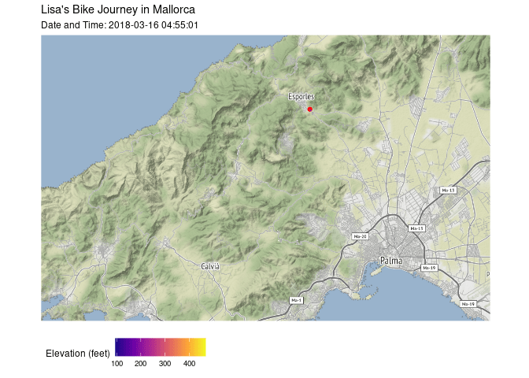

```r
library(tidyverse)     # for data cleaning and plotting
library(gardenR)       # for Lisa's garden data
library(lubridate)     # for date manipulation
library(openintro)     # for the abbr2state() function
library(palmerpenguins)# for Palmer penguin data
library(maps)          # for map data
library(ggmap)         # for mapping points on maps
library(gplots)        # for col2hex() function
library(RColorBrewer)  # for color palettes
library(sf)            # for working with spatial data
library(leaflet)       # for highly customizable mapping
library(ggthemes)      # for more themes (including theme_map())
library(plotly)        # for the ggplotly() - basic interactivity
library(gganimate)     # for adding animation layers to ggplots
library(transformr)    # for "tweening" (gganimate)
library(gifski)        # need the library for creating gifs but don't need to load each time
library(shiny)         # for creating interactive apps
theme_set(theme_minimal())
```


```r
# SNCF Train data
small_trains <- read_csv("https://raw.githubusercontent.com/rfordatascience/tidytuesday/master/data/2019/2019-02-26/small_trains.csv") 

# Lisa's garden data
data("garden_harvest")

# Lisa's Mallorca cycling data
mallorca_bike_day7 <- read_csv("https://www.dropbox.com/s/zc6jan4ltmjtvy0/mallorca_bike_day7.csv?dl=1") %>% 
  select(1:4, speed)

# Heather Lendway's Ironman 70.3 Pan Am championships Panama data
panama_swim <- read_csv("https://raw.githubusercontent.com/llendway/gps-data/master/data/panama_swim_20160131.csv")

panama_bike <- read_csv("https://raw.githubusercontent.com/llendway/gps-data/master/data/panama_bike_20160131.csv")

panama_run <- read_csv("https://raw.githubusercontent.com/llendway/gps-data/master/data/panama_run_20160131.csv")

#COVID-19 data from the New York Times
covid19 <- read_csv("https://raw.githubusercontent.com/nytimes/covid-19-data/master/us-states.csv")
```

## Put your homework on GitHub!

Go [here](https://github.com/llendway/github_for_collaboration/blob/master/github_for_collaboration.md) or to previous homework to remind yourself how to get set up. 

Once your repository is created, you should always open your **project** rather than just opening an .Rmd file. You can do that by either clicking on the .Rproj file in your repository folder on your computer. Or, by going to the upper right hand corner in R Studio and clicking the arrow next to where it says Project: (None). You should see your project come up in that list if you've used it recently. You could also go to File --> Open Project and navigate to your .Rproj file. 

## Instructions

* Put your name at the top of the document. 

* **For ALL graphs, you should include appropriate labels and alt text.** 

* Feel free to change the default theme, which I currently have set to `theme_minimal()`. 

* Use good coding practice. Read the short sections on good code with [pipes](https://style.tidyverse.org/pipes.html) and [ggplot2](https://style.tidyverse.org/ggplot2.html). **This is part of your grade!**

* **NEW!!** With animated graphs, add `eval=FALSE` to the code chunk that creates the animation and saves it using `anim_save()`. Add another code chunk to reread the gif back into the file. See the [tutorial](https://animation-and-interactivity-in-r.netlify.app/) for help. 

* When you are finished with ALL the exercises, uncomment the options at the top so your document looks nicer. Don't do it before then, or else you might miss some important warnings and messages.

## Warm-up exercises from tutorial

  1. Choose 2 graphs you have created for ANY assignment in this class and add interactivity using the `ggplotly()` function.
  

```r
lettuce_graph <- garden_harvest %>% 
  filter(vegetable == 'lettuce') %>% 
  group_by(variety) %>% 
  ggplot(aes(y = fct_rev(fct_infreq(variety)))) +
  geom_bar(fill = "darkgreen", 
           color = "grey1") +
  labs(x = "Number of Harvests", 
       y = "", 
       title = "Harvests by Lettuce Varieties")

ggplotly(lettuce_graph)
```

```{=html}
<div id="htmlwidget-2de353a3c86686c2e9ac" style="width:672px;height:480px;" class="plotly html-widget"></div>
<script type="application/json" data-for="htmlwidget-2de353a3c86686c2e9ac">{"x":{"data":[{"orientation":"v","width":[1,3,9,27,29],"base":[0.55,1.55,2.55,3.55,4.55],"x":[0.5,1.5,4.5,13.5,14.5],"y":[0.9,0.9,0.9,0.9,0.9],"text":["count:  1<br />fct_rev(fct_infreq(variety)): 0.9","count:  3<br />fct_rev(fct_infreq(variety)): 0.9","count:  9<br />fct_rev(fct_infreq(variety)): 0.9","count: 27<br />fct_rev(fct_infreq(variety)): 0.9","count: 29<br />fct_rev(fct_infreq(variety)): 0.9"],"type":"bar","marker":{"autocolorscale":false,"color":"rgba(0,100,0,1)","line":{"width":1.88976377952756,"color":"rgba(3,3,3,1)"}},"showlegend":false,"xaxis":"x","yaxis":"y","hoverinfo":"text","frame":null}],"layout":{"margin":{"t":43.7625570776256,"r":7.30593607305936,"b":40.1826484018265,"l":133.698630136986},"font":{"color":"rgba(0,0,0,1)","family":"","size":14.6118721461187},"title":{"text":"Harvests by Lettuce Varieties","font":{"color":"rgba(0,0,0,1)","family":"","size":17.5342465753425},"x":0,"xref":"paper"},"xaxis":{"domain":[0,1],"automargin":true,"type":"linear","autorange":false,"range":[-1.45,30.45],"tickmode":"array","ticktext":["0","10","20","30"],"tickvals":[0,10,20,30],"categoryorder":"array","categoryarray":["0","10","20","30"],"nticks":null,"ticks":"","tickcolor":null,"ticklen":3.65296803652968,"tickwidth":0,"showticklabels":true,"tickfont":{"color":"rgba(77,77,77,1)","family":"","size":11.689497716895},"tickangle":-0,"showline":false,"linecolor":null,"linewidth":0,"showgrid":true,"gridcolor":"rgba(235,235,235,1)","gridwidth":0.66417600664176,"zeroline":false,"anchor":"y","title":{"text":"Number of Harvests","font":{"color":"rgba(0,0,0,1)","family":"","size":14.6118721461187}},"hoverformat":".2f"},"yaxis":{"domain":[0,1],"automargin":true,"type":"linear","autorange":false,"range":[0.4,5.6],"tickmode":"array","ticktext":["mustard greens","reseed","Tatsoi","Farmer's Market Blend","Lettuce Mixture"],"tickvals":[1,2,3,4,5],"categoryorder":"array","categoryarray":["mustard greens","reseed","Tatsoi","Farmer's Market Blend","Lettuce Mixture"],"nticks":null,"ticks":"","tickcolor":null,"ticklen":3.65296803652968,"tickwidth":0,"showticklabels":true,"tickfont":{"color":"rgba(77,77,77,1)","family":"","size":11.689497716895},"tickangle":-0,"showline":false,"linecolor":null,"linewidth":0,"showgrid":true,"gridcolor":"rgba(235,235,235,1)","gridwidth":0.66417600664176,"zeroline":false,"anchor":"x","title":{"text":"","font":{"color":"rgba(0,0,0,1)","family":"","size":14.6118721461187}},"hoverformat":".2f"},"shapes":[{"type":"rect","fillcolor":null,"line":{"color":null,"width":0,"linetype":[]},"yref":"paper","xref":"paper","x0":0,"x1":1,"y0":0,"y1":1}],"showlegend":false,"legend":{"bgcolor":null,"bordercolor":null,"borderwidth":0,"font":{"color":"rgba(0,0,0,1)","family":"","size":11.689497716895}},"hovermode":"closest","barmode":"relative"},"config":{"doubleClick":"reset","showSendToCloud":false},"source":"A","attrs":{"7245248bf7e1":{"y":{},"type":"bar"}},"cur_data":"7245248bf7e1","visdat":{"7245248bf7e1":["function (y) ","x"]},"highlight":{"on":"plotly_click","persistent":false,"dynamic":false,"selectize":false,"opacityDim":0.2,"selected":{"opacity":1},"debounce":0},"shinyEvents":["plotly_hover","plotly_click","plotly_selected","plotly_relayout","plotly_brushed","plotly_brushing","plotly_clickannotation","plotly_doubleclick","plotly_deselect","plotly_afterplot","plotly_sunburstclick"],"base_url":"https://plot.ly"},"evals":[],"jsHooks":[]}</script>
```


```r
covid_midwest <- covid19 %>% 
  filter(state %in% c("Minnesota", 
                      "Wisconsin", 
                      "Iowa", 
                      "North Dakota", 
                      "South Dakota")) %>% 
  ggplot(aes(x = date, 
             y = cases, 
             color = state)) +
  geom_line() +
  labs(x = "Date",
       y = "Number of Cases",
       title = "Cummulative Cases by Midwest State Since 2020")

ggplotly(covid_midwest)
```

```{=html}
<div id="htmlwidget-fc7edcd56ac536705783" style="width:672px;height:480px;" class="plotly html-widget"></div>
<script type="application/json" data-for="htmlwidget-fc7edcd56ac536705783">{"x":{"data":[{"x":[18329,18330,18331,18332,18333,18334,18335,18336,18337,18338,18339,18340,18341,18342,18343,18344,18345,18346,18347,18348,18349,18350,18351,18352,18353,18354,18355,18356,18357,18358,18359,18360,18361,18362,18363,18364,18365,18366,18367,18368,18369,18370,18371,18372,18373,18374,18375,18376,18377,18378,18379,18380,18381,18382,18383,18384,18385,18386,18387,18388,18389,18390,18391,18392,18393,18394,18395,18396,18397,18398,18399,18400,18401,18402,18403,18404,18405,18406,18407,18408,18409,18410,18411,18412,18413,18414,18415,18416,18417,18418,18419,18420,18421,18422,18423,18424,18425,18426,18427,18428,18429,18430,18431,18432,18433,18434,18435,18436,18437,18438,18439,18440,18441,18442,18443,18444,18445,18446,18447,18448,18449,18450,18451,18452,18453,18454,18455,18456,18457,18458,18459,18460,18461,18462,18463,18464,18465,18466,18467,18468,18469,18470,18471,18472,18473,18474,18475,18476,18477,18478,18479,18480,18481,18482,18483,18484,18485,18486,18487,18488,18489,18490,18491,18492,18493,18494,18495,18496,18497,18498,18499,18500,18501,18502,18503,18504,18505,18506,18507,18508,18509,18510,18511,18512,18513,18514,18515,18516,18517,18518,18519,18520,18521,18522,18523,18524,18525,18526,18527,18528,18529,18530,18531,18532,18533,18534,18535,18536,18537,18538,18539,18540,18541,18542,18543,18544,18545,18546,18547,18548,18549,18550,18551,18552,18553,18554,18555,18556,18557,18558,18559,18560,18561,18562,18563,18564,18565,18566,18567,18568,18569,18570,18571,18572,18573,18574,18575,18576,18577,18578,18579,18580,18581,18582,18583,18584,18585,18586,18587,18588,18589,18590,18591,18592,18593,18594,18595,18596,18597,18598,18599,18600,18601,18602,18603,18604,18605,18606,18607,18608,18609,18610,18611,18612,18613,18614,18615,18616,18617,18618,18619,18620,18621,18622,18623,18624,18625,18626,18627,18628,18629,18630,18631,18632,18633,18634,18635,18636,18637,18638,18639,18640,18641,18642,18643,18644,18645,18646,18647,18648,18649,18650,18651,18652,18653,18654,18655,18656,18657,18658,18659,18660,18661,18662,18663,18664,18665,18666,18667,18668,18669,18670,18671,18672,18673,18674,18675,18676,18677,18678,18679,18680,18681,18682,18683,18684,18685,18686,18687,18688,18689,18690,18691,18692,18693,18694,18695,18696,18697,18698,18699,18700,18701,18702,18703,18704,18705,18706,18707,18708,18709,18710,18711,18712,18713,18714,18715,18716,18717,18718,18719,18720,18721,18722,18723,18724,18725,18726,18727,18728,18729,18730,18731,18732,18733,18734,18735,18736,18737,18738,18739,18740,18741,18742,18743,18744,18745,18746,18747,18748,18749,18750,18751,18752,18753,18754,18755,18756,18757,18758,18759,18760,18761,18762,18763,18764,18765,18766,18767,18768,18769,18770,18771,18772,18773,18774,18775,18776,18777,18778,18779,18780,18781,18782,18783,18784,18785,18786,18787,18788,18789,18790,18791,18792,18793,18794,18795,18796,18797,18798,18799,18800,18801,18802,18803,18804,18805,18806,18807,18808,18809,18810,18811,18812,18813,18814,18815,18816,18817,18818,18819,18820,18821,18822,18823,18824,18825,18826,18827,18828,18829,18830,18831,18832,18833,18834,18835,18836,18837,18838,18839,18840,18841,18842,18843,18844,18845,18846,18847,18848,18849,18850,18851,18852,18853,18854,18855,18856,18857,18858,18859,18860,18861,18862,18863,18864,18865,18866,18867,18868,18869,18870,18871,18872,18873,18874,18875,18876,18877,18878,18879,18880,18881,18882,18883,18884,18885,18886,18887,18888,18889,18890,18891,18892,18893,18894,18895,18896,18897,18898,18899,18900,18901,18902,18903,18904,18905,18906,18907,18908,18909,18910,18911,18912,18913,18914,18915,18916,18917,18918,18919,18920,18921,18922,18923,18924,18925,18926,18927,18928,18929,18930,18931,18932,18933,18934,18935,18936,18937,18938,18939,18940,18941,18942,18943,18944,18945,18946,18947,18948,18949,18950,18951,18952,18953,18954,18955,18956,18957,18958,18959,18960,18961,18962,18963,18964,18965,18966,18967,18968,18969,18970,18971,18972,18973,18974,18975,18976,18977,18978,18979,18980,18981,18982,18983,18984,18985,18986,18987,18988,18989,18990,18991,18992,18993,18994,18995,18996,18997,18998,18999,19000,19001,19002,19003,19004,19005,19006,19007,19008,19009,19010,19011,19012,19013,19014,19015,19016,19017,19018,19019,19020,19021,19022,19023,19024,19025,19026,19027,19028,19029,19030,19031,19032,19033,19034,19035,19036,19037,19038,19039,19040,19041,19042,19043,19044,19045,19046,19047,19048,19049,19050,19051,19052,19053,19054,19055,19056,19057,19058,19059,19060,19061,19062,19063,19064,19065,19066,19067,19068,19069,19070,19071,19072,19073,19074,19075,19076,19077,19078,19079,19080,19081],"y":[3,8,13,14,16,17,18,22,22,29,38,44,45,68,90,105,124,147,179,236,298,336,424,498,549,614,699,786,868,946,1048,1145,1270,1388,1510,1587,1710,1899,1995,2141,2332,2513,2915,3175,3641,3764,3939,4459,5109,5490,5868,6376,6843,7145,7883,8641,9169,9703,10111,10404,11059,11457,11671,11959,12373,12912,13289,13675,14049,14328,14651,14955,15296,15868,16170,16510,16898,17434,17628,17999,18446,18672,19019,19336,19621,19789,20017,20376,20943,21332,21527,21794,22111,22271,22733,23103,23455,23792,23959,24110,24263,24616,24959,25424,25552,26020,26217,26470,26897,27384,27828,28203,28520,28874,29152,29618,30259,30631,31167,31612,31764,32153,32716,33316,34232,34695,35410,35631,35942,36536,37414,37903,38314,38813,39343,39721,40208,40796,41434,41886,42357,42696,42928,43623,44285,44753,45293,45723,45905,46231,46836,47559,47920,48311,48919,49164,49521,49973,50678,51272,52065,52447,52829,53201,53541,54533,55331,55996,56441,56941,57606,58864,61484,62828,63836,64599,65252,65846,66463,67693,68757,69690,70210,70537,71018,71594,72548,73399,74204,74675,75069,75722,76680,77865,78839,79785,80410,81006,81674,82956,83993,85031,85908,86624,87256,88234,89248,90483,91483,92302,92744,93261,93909,95205,96749,98023,99099,99941,100451,101531,102905,104232,105746,106698,107334,108114,109210,110444,112242,113596,114952,116238,117198,118852,120911,123232,125973,128798,131097,132697,134576,137315,142795,146267,150639,155583,159910,163827,168457,173401,178890,183557,186314,189597,193196,197532,201572,205918,209203,211664,214792,217786,221288,223323,225065,227181,228690,230634,233062,236159,238722,241531,243385,244689,245985,246237,248782,251027,253612,255009,256249,256902,258253,260784,262210,264729,266959,267329,268736,270294,272112,273661,274266,274793,275299,276649,278310,280067,281712,282980,283895,284715,286356,288298,290776,293189,294762,296171,296682,297774,299254,301161,302559,303927,304748,305151,306082,307302,308787,310440,311695,312625,313140,313907,315002,316114,317124,317689,319110,319408,320187,321274,322308,323216,323797,324306,324590,325219,326150,327061,327432,328565,329039,329258,329726,330318,330906,331502,331747,332225,332640,333087,333962,334665,335222,335840,336270,336455,336890,337496,338009,338588,339121,339511,339672,340128,340891,341378,341837,342343,342705,342886,343303,343851,344268,344860,345304,345644,345785,346218,346985,347590,348492,349055,349554,349714,350219,350756,351402,352137,352714,353207,353362,353829,354557,354828,355454,356073,356509,357019,357197,357739,358395,358873,359260,359765,360013,360339,360782,361420,361891,362334,362732,362923,363158,363530,364033,364476,364841,365228,365519,365750,366126,366566,366946,367292,367563,367715,367909,368190,368567,368823,369055,369230,369368,369489,369690,369987,370195,370363,370517,370625,370721,370875,371036,371138,371256,371331,371384,371424,371473,371635,371761,371863,371956,372029,372064,372153,372248,372333,372442,372525,372577,372649,372752,372837,372909,372987,373049,373101,373140,373223,373314,373372,373450,373529,373583,373641,373735,373861,373960,374054,374120,374180,374207,374285,374381,374381,374381,374671,374671,374671,374948,375278,375321,375321,375726,375726,375726,376198,376673,376726,376726,377300,377300,377300,377886,378831,378916,378916,379797,379797,379797,381110,382401,382401,382401,383997,383997,383997,385556,387273,387273,387273,389223,389223,389223,390978,392970,392970,392970,395167,395167,395167,397522,400082,400082,400082,402725,402725,402725,404747,408390,408390,408390,411577,411577,411577,414784,417152,417152,417152,421168,421168,421168,425194,429078,429078,429078,434239,434239,434239,437872,441183,441183,441183,445668,445668,445668,449038,452057,452057,452057,455579,455579,455579,458908,461729,461729,461729,464797,464797,464797,467459,469875,469875,469875,472331,472331,472331,474216,476713,476713,476713,479153,479153,479153,481207,483736,483736,483736,486132,486132,486132,488885,491463,491463,491463,494407,494407,494407,497648,500474,500474,500474,503564,503564,503564,506538,509761,509761,509761,513637,513637,513637,516907,520318,520318,520318,520318,522858,522858,525458,530060,530060,530060,534623,534623,534623,538738,542433,542433,545804,546287,546287,546287,549642,553407,553407,553407,557029,557029,557029,560351,563955,563955,563955,563955,563955,567997,570470,575501,575501,575501,575501,575501,575501,587386,596296,596296,596296,608000,608000,608000,619061,631301,631301,631301,645410,645410,645410,657146,669705,669705,669705,682363,682363,682363,693914,703366,703366,703366,712288,712288,712288,719703,722589,724912,724912,729700,729700,729700,733153,735422,736703,736703,739566,739566,739566,741648,743285,743773,743773,745530,745530,745530,746825,747703,748057,748057,748849,748849,748849,754073,754511,755022,755022,755547,755547,755547,755968,756257,756359,756359,756778,756778,756778,757017,757265,757334,757334,757551,757551,757551,757807,757985,758064,758064,758294,758294,758294,758463,758463],"text":["date: 2020-03-08<br />cases:       3<br />state: Iowa","date: 2020-03-09<br />cases:       8<br />state: Iowa","date: 2020-03-10<br />cases:      13<br />state: Iowa","date: 2020-03-11<br />cases:      14<br />state: Iowa","date: 2020-03-12<br />cases:      16<br />state: Iowa","date: 2020-03-13<br />cases:      17<br />state: Iowa","date: 2020-03-14<br />cases:      18<br />state: Iowa","date: 2020-03-15<br />cases:      22<br />state: Iowa","date: 2020-03-16<br />cases:      22<br />state: Iowa","date: 2020-03-17<br />cases:      29<br />state: Iowa","date: 2020-03-18<br />cases:      38<br />state: Iowa","date: 2020-03-19<br />cases:      44<br />state: Iowa","date: 2020-03-20<br />cases:      45<br />state: Iowa","date: 2020-03-21<br />cases:      68<br />state: Iowa","date: 2020-03-22<br />cases:      90<br />state: Iowa","date: 2020-03-23<br />cases:     105<br />state: Iowa","date: 2020-03-24<br />cases:     124<br />state: Iowa","date: 2020-03-25<br />cases:     147<br />state: Iowa","date: 2020-03-26<br />cases:     179<br />state: Iowa","date: 2020-03-27<br />cases:     236<br />state: Iowa","date: 2020-03-28<br />cases:     298<br />state: Iowa","date: 2020-03-29<br />cases:     336<br />state: Iowa","date: 2020-03-30<br />cases:     424<br />state: Iowa","date: 2020-03-31<br />cases:     498<br />state: Iowa","date: 2020-04-01<br />cases:     549<br />state: Iowa","date: 2020-04-02<br />cases:     614<br />state: Iowa","date: 2020-04-03<br />cases:     699<br />state: Iowa","date: 2020-04-04<br />cases:     786<br />state: Iowa","date: 2020-04-05<br />cases:     868<br />state: Iowa","date: 2020-04-06<br />cases:     946<br />state: Iowa","date: 2020-04-07<br />cases:    1048<br />state: Iowa","date: 2020-04-08<br />cases:    1145<br />state: Iowa","date: 2020-04-09<br />cases:    1270<br />state: Iowa","date: 2020-04-10<br />cases:    1388<br />state: Iowa","date: 2020-04-11<br />cases:    1510<br />state: Iowa","date: 2020-04-12<br />cases:    1587<br />state: Iowa","date: 2020-04-13<br />cases:    1710<br />state: Iowa","date: 2020-04-14<br />cases:    1899<br />state: Iowa","date: 2020-04-15<br />cases:    1995<br />state: Iowa","date: 2020-04-16<br />cases:    2141<br />state: Iowa","date: 2020-04-17<br />cases:    2332<br />state: Iowa","date: 2020-04-18<br />cases:    2513<br />state: Iowa","date: 2020-04-19<br />cases:    2915<br />state: Iowa","date: 2020-04-20<br />cases:    3175<br />state: Iowa","date: 2020-04-21<br />cases:    3641<br />state: Iowa","date: 2020-04-22<br />cases:    3764<br />state: Iowa","date: 2020-04-23<br />cases:    3939<br />state: Iowa","date: 2020-04-24<br />cases:    4459<br />state: Iowa","date: 2020-04-25<br />cases:    5109<br />state: Iowa","date: 2020-04-26<br />cases:    5490<br />state: Iowa","date: 2020-04-27<br />cases:    5868<br />state: Iowa","date: 2020-04-28<br />cases:    6376<br />state: Iowa","date: 2020-04-29<br />cases:    6843<br />state: Iowa","date: 2020-04-30<br />cases:    7145<br />state: Iowa","date: 2020-05-01<br />cases:    7883<br />state: Iowa","date: 2020-05-02<br />cases:    8641<br />state: Iowa","date: 2020-05-03<br />cases:    9169<br />state: Iowa","date: 2020-05-04<br />cases:    9703<br />state: Iowa","date: 2020-05-05<br />cases:   10111<br />state: Iowa","date: 2020-05-06<br />cases:   10404<br />state: Iowa","date: 2020-05-07<br />cases:   11059<br />state: Iowa","date: 2020-05-08<br />cases:   11457<br />state: Iowa","date: 2020-05-09<br />cases:   11671<br />state: Iowa","date: 2020-05-10<br />cases:   11959<br />state: Iowa","date: 2020-05-11<br />cases:   12373<br />state: Iowa","date: 2020-05-12<br />cases:   12912<br />state: Iowa","date: 2020-05-13<br />cases:   13289<br />state: Iowa","date: 2020-05-14<br />cases:   13675<br />state: Iowa","date: 2020-05-15<br />cases:   14049<br />state: Iowa","date: 2020-05-16<br />cases:   14328<br />state: Iowa","date: 2020-05-17<br />cases:   14651<br />state: Iowa","date: 2020-05-18<br />cases:   14955<br />state: Iowa","date: 2020-05-19<br />cases:   15296<br />state: Iowa","date: 2020-05-20<br />cases:   15868<br />state: Iowa","date: 2020-05-21<br />cases:   16170<br />state: Iowa","date: 2020-05-22<br />cases:   16510<br />state: Iowa","date: 2020-05-23<br />cases:   16898<br />state: Iowa","date: 2020-05-24<br />cases:   17434<br />state: Iowa","date: 2020-05-25<br />cases:   17628<br />state: Iowa","date: 2020-05-26<br />cases:   17999<br />state: Iowa","date: 2020-05-27<br />cases:   18446<br />state: Iowa","date: 2020-05-28<br />cases:   18672<br />state: Iowa","date: 2020-05-29<br />cases:   19019<br />state: Iowa","date: 2020-05-30<br />cases:   19336<br />state: Iowa","date: 2020-05-31<br />cases:   19621<br />state: Iowa","date: 2020-06-01<br />cases:   19789<br />state: Iowa","date: 2020-06-02<br />cases:   20017<br />state: Iowa","date: 2020-06-03<br />cases:   20376<br />state: Iowa","date: 2020-06-04<br />cases:   20943<br />state: Iowa","date: 2020-06-05<br />cases:   21332<br />state: Iowa","date: 2020-06-06<br />cases:   21527<br />state: Iowa","date: 2020-06-07<br />cases:   21794<br />state: Iowa","date: 2020-06-08<br />cases:   22111<br />state: Iowa","date: 2020-06-09<br />cases:   22271<br />state: Iowa","date: 2020-06-10<br />cases:   22733<br />state: Iowa","date: 2020-06-11<br />cases:   23103<br />state: Iowa","date: 2020-06-12<br />cases:   23455<br />state: Iowa","date: 2020-06-13<br />cases:   23792<br />state: Iowa","date: 2020-06-14<br />cases:   23959<br />state: Iowa","date: 2020-06-15<br />cases:   24110<br />state: Iowa","date: 2020-06-16<br />cases:   24263<br />state: Iowa","date: 2020-06-17<br />cases:   24616<br />state: Iowa","date: 2020-06-18<br />cases:   24959<br />state: Iowa","date: 2020-06-19<br />cases:   25424<br />state: Iowa","date: 2020-06-20<br />cases:   25552<br />state: Iowa","date: 2020-06-21<br />cases:   26020<br />state: Iowa","date: 2020-06-22<br />cases:   26217<br />state: Iowa","date: 2020-06-23<br />cases:   26470<br />state: Iowa","date: 2020-06-24<br />cases:   26897<br />state: Iowa","date: 2020-06-25<br />cases:   27384<br />state: Iowa","date: 2020-06-26<br />cases:   27828<br />state: Iowa","date: 2020-06-27<br />cases:   28203<br />state: Iowa","date: 2020-06-28<br />cases:   28520<br />state: Iowa","date: 2020-06-29<br />cases:   28874<br />state: Iowa","date: 2020-06-30<br />cases:   29152<br />state: Iowa","date: 2020-07-01<br />cases:   29618<br />state: Iowa","date: 2020-07-02<br />cases:   30259<br />state: Iowa","date: 2020-07-03<br />cases:   30631<br />state: Iowa","date: 2020-07-04<br />cases:   31167<br />state: Iowa","date: 2020-07-05<br />cases:   31612<br />state: Iowa","date: 2020-07-06<br />cases:   31764<br />state: Iowa","date: 2020-07-07<br />cases:   32153<br />state: Iowa","date: 2020-07-08<br />cases:   32716<br />state: Iowa","date: 2020-07-09<br />cases:   33316<br />state: Iowa","date: 2020-07-10<br />cases:   34232<br />state: Iowa","date: 2020-07-11<br />cases:   34695<br />state: Iowa","date: 2020-07-12<br />cases:   35410<br />state: Iowa","date: 2020-07-13<br />cases:   35631<br />state: Iowa","date: 2020-07-14<br />cases:   35942<br />state: Iowa","date: 2020-07-15<br />cases:   36536<br />state: Iowa","date: 2020-07-16<br />cases:   37414<br />state: Iowa","date: 2020-07-17<br />cases:   37903<br />state: Iowa","date: 2020-07-18<br />cases:   38314<br />state: Iowa","date: 2020-07-19<br />cases:   38813<br />state: Iowa","date: 2020-07-20<br />cases:   39343<br />state: Iowa","date: 2020-07-21<br />cases:   39721<br />state: Iowa","date: 2020-07-22<br />cases:   40208<br />state: Iowa","date: 2020-07-23<br />cases:   40796<br />state: Iowa","date: 2020-07-24<br />cases:   41434<br />state: Iowa","date: 2020-07-25<br />cases:   41886<br />state: Iowa","date: 2020-07-26<br />cases:   42357<br />state: Iowa","date: 2020-07-27<br />cases:   42696<br />state: Iowa","date: 2020-07-28<br />cases:   42928<br />state: Iowa","date: 2020-07-29<br />cases:   43623<br />state: Iowa","date: 2020-07-30<br />cases:   44285<br />state: Iowa","date: 2020-07-31<br />cases:   44753<br />state: Iowa","date: 2020-08-01<br />cases:   45293<br />state: Iowa","date: 2020-08-02<br />cases:   45723<br />state: Iowa","date: 2020-08-03<br />cases:   45905<br />state: Iowa","date: 2020-08-04<br />cases:   46231<br />state: Iowa","date: 2020-08-05<br />cases:   46836<br />state: Iowa","date: 2020-08-06<br />cases:   47559<br />state: Iowa","date: 2020-08-07<br />cases:   47920<br />state: Iowa","date: 2020-08-08<br />cases:   48311<br />state: Iowa","date: 2020-08-09<br />cases:   48919<br />state: Iowa","date: 2020-08-10<br />cases:   49164<br />state: Iowa","date: 2020-08-11<br />cases:   49521<br />state: Iowa","date: 2020-08-12<br />cases:   49973<br />state: Iowa","date: 2020-08-13<br />cases:   50678<br />state: Iowa","date: 2020-08-14<br />cases:   51272<br />state: Iowa","date: 2020-08-15<br />cases:   52065<br />state: Iowa","date: 2020-08-16<br />cases:   52447<br />state: Iowa","date: 2020-08-17<br />cases:   52829<br />state: Iowa","date: 2020-08-18<br />cases:   53201<br />state: Iowa","date: 2020-08-19<br />cases:   53541<br />state: Iowa","date: 2020-08-20<br />cases:   54533<br />state: Iowa","date: 2020-08-21<br />cases:   55331<br />state: Iowa","date: 2020-08-22<br />cases:   55996<br />state: Iowa","date: 2020-08-23<br />cases:   56441<br />state: Iowa","date: 2020-08-24<br />cases:   56941<br />state: Iowa","date: 2020-08-25<br />cases:   57606<br />state: Iowa","date: 2020-08-26<br />cases:   58864<br />state: Iowa","date: 2020-08-27<br />cases:   61484<br />state: Iowa","date: 2020-08-28<br />cases:   62828<br />state: Iowa","date: 2020-08-29<br />cases:   63836<br />state: Iowa","date: 2020-08-30<br />cases:   64599<br />state: Iowa","date: 2020-08-31<br />cases:   65252<br />state: Iowa","date: 2020-09-01<br />cases:   65846<br />state: Iowa","date: 2020-09-02<br />cases:   66463<br />state: Iowa","date: 2020-09-03<br />cases:   67693<br />state: Iowa","date: 2020-09-04<br />cases:   68757<br />state: Iowa","date: 2020-09-05<br />cases:   69690<br />state: Iowa","date: 2020-09-06<br />cases:   70210<br />state: Iowa","date: 2020-09-07<br />cases:   70537<br />state: Iowa","date: 2020-09-08<br />cases:   71018<br />state: Iowa","date: 2020-09-09<br />cases:   71594<br />state: Iowa","date: 2020-09-10<br />cases:   72548<br />state: Iowa","date: 2020-09-11<br />cases:   73399<br />state: Iowa","date: 2020-09-12<br />cases:   74204<br />state: Iowa","date: 2020-09-13<br />cases:   74675<br />state: Iowa","date: 2020-09-14<br />cases:   75069<br />state: Iowa","date: 2020-09-15<br />cases:   75722<br />state: Iowa","date: 2020-09-16<br />cases:   76680<br />state: Iowa","date: 2020-09-17<br />cases:   77865<br />state: Iowa","date: 2020-09-18<br />cases:   78839<br />state: Iowa","date: 2020-09-19<br />cases:   79785<br />state: Iowa","date: 2020-09-20<br />cases:   80410<br />state: Iowa","date: 2020-09-21<br />cases:   81006<br />state: Iowa","date: 2020-09-22<br />cases:   81674<br />state: Iowa","date: 2020-09-23<br />cases:   82956<br />state: Iowa","date: 2020-09-24<br />cases:   83993<br />state: Iowa","date: 2020-09-25<br />cases:   85031<br />state: Iowa","date: 2020-09-26<br />cases:   85908<br />state: Iowa","date: 2020-09-27<br />cases:   86624<br />state: Iowa","date: 2020-09-28<br />cases:   87256<br />state: Iowa","date: 2020-09-29<br />cases:   88234<br />state: Iowa","date: 2020-09-30<br />cases:   89248<br />state: Iowa","date: 2020-10-01<br />cases:   90483<br />state: Iowa","date: 2020-10-02<br />cases:   91483<br />state: Iowa","date: 2020-10-03<br />cases:   92302<br />state: Iowa","date: 2020-10-04<br />cases:   92744<br />state: Iowa","date: 2020-10-05<br />cases:   93261<br />state: Iowa","date: 2020-10-06<br />cases:   93909<br />state: Iowa","date: 2020-10-07<br />cases:   95205<br />state: Iowa","date: 2020-10-08<br />cases:   96749<br />state: Iowa","date: 2020-10-09<br />cases:   98023<br />state: Iowa","date: 2020-10-10<br />cases:   99099<br />state: Iowa","date: 2020-10-11<br />cases:   99941<br />state: Iowa","date: 2020-10-12<br />cases:  100451<br />state: Iowa","date: 2020-10-13<br />cases:  101531<br />state: Iowa","date: 2020-10-14<br />cases:  102905<br />state: Iowa","date: 2020-10-15<br />cases:  104232<br />state: Iowa","date: 2020-10-16<br />cases:  105746<br />state: Iowa","date: 2020-10-17<br />cases:  106698<br />state: Iowa","date: 2020-10-18<br />cases:  107334<br />state: Iowa","date: 2020-10-19<br />cases:  108114<br />state: Iowa","date: 2020-10-20<br />cases:  109210<br />state: Iowa","date: 2020-10-21<br />cases:  110444<br />state: Iowa","date: 2020-10-22<br />cases:  112242<br />state: Iowa","date: 2020-10-23<br />cases:  113596<br />state: Iowa","date: 2020-10-24<br />cases:  114952<br />state: Iowa","date: 2020-10-25<br />cases:  116238<br />state: Iowa","date: 2020-10-26<br />cases:  117198<br />state: Iowa","date: 2020-10-27<br />cases:  118852<br />state: Iowa","date: 2020-10-28<br />cases:  120911<br />state: Iowa","date: 2020-10-29<br />cases:  123232<br />state: Iowa","date: 2020-10-30<br />cases:  125973<br />state: Iowa","date: 2020-10-31<br />cases:  128798<br />state: Iowa","date: 2020-11-01<br />cases:  131097<br />state: Iowa","date: 2020-11-02<br />cases:  132697<br />state: Iowa","date: 2020-11-03<br />cases:  134576<br />state: Iowa","date: 2020-11-04<br />cases:  137315<br />state: Iowa","date: 2020-11-05<br />cases:  142795<br />state: Iowa","date: 2020-11-06<br />cases:  146267<br />state: Iowa","date: 2020-11-07<br />cases:  150639<br />state: Iowa","date: 2020-11-08<br />cases:  155583<br />state: Iowa","date: 2020-11-09<br />cases:  159910<br />state: Iowa","date: 2020-11-10<br />cases:  163827<br />state: Iowa","date: 2020-11-11<br />cases:  168457<br />state: Iowa","date: 2020-11-12<br />cases:  173401<br />state: Iowa","date: 2020-11-13<br />cases:  178890<br />state: Iowa","date: 2020-11-14<br />cases:  183557<br />state: Iowa","date: 2020-11-15<br />cases:  186314<br />state: Iowa","date: 2020-11-16<br />cases:  189597<br />state: Iowa","date: 2020-11-17<br />cases:  193196<br />state: Iowa","date: 2020-11-18<br />cases:  197532<br />state: Iowa","date: 2020-11-19<br />cases:  201572<br />state: Iowa","date: 2020-11-20<br />cases:  205918<br />state: Iowa","date: 2020-11-21<br />cases:  209203<br />state: Iowa","date: 2020-11-22<br />cases:  211664<br />state: Iowa","date: 2020-11-23<br />cases:  214792<br />state: Iowa","date: 2020-11-24<br />cases:  217786<br />state: Iowa","date: 2020-11-25<br />cases:  221288<br />state: Iowa","date: 2020-11-26<br />cases:  223323<br />state: Iowa","date: 2020-11-27<br />cases:  225065<br />state: Iowa","date: 2020-11-28<br />cases:  227181<br />state: Iowa","date: 2020-11-29<br />cases:  228690<br />state: Iowa","date: 2020-11-30<br />cases:  230634<br />state: Iowa","date: 2020-12-01<br />cases:  233062<br />state: Iowa","date: 2020-12-02<br />cases:  236159<br />state: Iowa","date: 2020-12-03<br />cases:  238722<br />state: Iowa","date: 2020-12-04<br />cases:  241531<br />state: Iowa","date: 2020-12-05<br />cases:  243385<br />state: Iowa","date: 2020-12-06<br />cases:  244689<br />state: Iowa","date: 2020-12-07<br />cases:  245985<br />state: Iowa","date: 2020-12-08<br />cases:  246237<br />state: Iowa","date: 2020-12-09<br />cases:  248782<br />state: Iowa","date: 2020-12-10<br />cases:  251027<br />state: Iowa","date: 2020-12-11<br />cases:  253612<br />state: Iowa","date: 2020-12-12<br />cases:  255009<br />state: Iowa","date: 2020-12-13<br />cases:  256249<br />state: Iowa","date: 2020-12-14<br />cases:  256902<br />state: Iowa","date: 2020-12-15<br />cases:  258253<br />state: Iowa","date: 2020-12-16<br />cases:  260784<br />state: Iowa","date: 2020-12-17<br />cases:  262210<br />state: Iowa","date: 2020-12-18<br />cases:  264729<br />state: Iowa","date: 2020-12-19<br />cases:  266959<br />state: Iowa","date: 2020-12-20<br />cases:  267329<br />state: Iowa","date: 2020-12-21<br />cases:  268736<br />state: Iowa","date: 2020-12-22<br />cases:  270294<br />state: Iowa","date: 2020-12-23<br />cases:  272112<br />state: Iowa","date: 2020-12-24<br />cases:  273661<br />state: Iowa","date: 2020-12-25<br />cases:  274266<br />state: Iowa","date: 2020-12-26<br />cases:  274793<br />state: Iowa","date: 2020-12-27<br />cases:  275299<br />state: Iowa","date: 2020-12-28<br />cases:  276649<br />state: Iowa","date: 2020-12-29<br />cases:  278310<br />state: Iowa","date: 2020-12-30<br />cases:  280067<br />state: Iowa","date: 2020-12-31<br />cases:  281712<br />state: Iowa","date: 2021-01-01<br />cases:  282980<br />state: Iowa","date: 2021-01-02<br />cases:  283895<br />state: Iowa","date: 2021-01-03<br />cases:  284715<br />state: Iowa","date: 2021-01-04<br />cases:  286356<br />state: Iowa","date: 2021-01-05<br />cases:  288298<br />state: Iowa","date: 2021-01-06<br />cases:  290776<br />state: Iowa","date: 2021-01-07<br />cases:  293189<br />state: Iowa","date: 2021-01-08<br />cases:  294762<br />state: Iowa","date: 2021-01-09<br />cases:  296171<br />state: Iowa","date: 2021-01-10<br />cases:  296682<br />state: Iowa","date: 2021-01-11<br />cases:  297774<br />state: Iowa","date: 2021-01-12<br />cases:  299254<br />state: Iowa","date: 2021-01-13<br />cases:  301161<br />state: Iowa","date: 2021-01-14<br />cases:  302559<br />state: Iowa","date: 2021-01-15<br />cases:  303927<br />state: Iowa","date: 2021-01-16<br />cases:  304748<br />state: Iowa","date: 2021-01-17<br />cases:  305151<br />state: Iowa","date: 2021-01-18<br />cases:  306082<br />state: Iowa","date: 2021-01-19<br />cases:  307302<br />state: Iowa","date: 2021-01-20<br />cases:  308787<br />state: Iowa","date: 2021-01-21<br />cases:  310440<br />state: Iowa","date: 2021-01-22<br />cases:  311695<br />state: Iowa","date: 2021-01-23<br />cases:  312625<br />state: Iowa","date: 2021-01-24<br />cases:  313140<br />state: Iowa","date: 2021-01-25<br />cases:  313907<br />state: Iowa","date: 2021-01-26<br />cases:  315002<br />state: Iowa","date: 2021-01-27<br />cases:  316114<br />state: Iowa","date: 2021-01-28<br />cases:  317124<br />state: Iowa","date: 2021-01-29<br />cases:  317689<br />state: Iowa","date: 2021-01-30<br />cases:  319110<br />state: Iowa","date: 2021-01-31<br />cases:  319408<br />state: Iowa","date: 2021-02-01<br />cases:  320187<br />state: Iowa","date: 2021-02-02<br />cases:  321274<br />state: Iowa","date: 2021-02-03<br />cases:  322308<br />state: Iowa","date: 2021-02-04<br />cases:  323216<br />state: Iowa","date: 2021-02-05<br />cases:  323797<br />state: Iowa","date: 2021-02-06<br />cases:  324306<br />state: Iowa","date: 2021-02-07<br />cases:  324590<br />state: Iowa","date: 2021-02-08<br />cases:  325219<br />state: Iowa","date: 2021-02-09<br />cases:  326150<br />state: Iowa","date: 2021-02-10<br />cases:  327061<br />state: Iowa","date: 2021-02-11<br />cases:  327432<br />state: Iowa","date: 2021-02-12<br />cases:  328565<br />state: Iowa","date: 2021-02-13<br />cases:  329039<br />state: Iowa","date: 2021-02-14<br />cases:  329258<br />state: Iowa","date: 2021-02-15<br />cases:  329726<br />state: Iowa","date: 2021-02-16<br />cases:  330318<br />state: Iowa","date: 2021-02-17<br />cases:  330906<br />state: Iowa","date: 2021-02-18<br />cases:  331502<br />state: Iowa","date: 2021-02-19<br />cases:  331747<br />state: Iowa","date: 2021-02-20<br />cases:  332225<br />state: Iowa","date: 2021-02-21<br />cases:  332640<br />state: Iowa","date: 2021-02-22<br />cases:  333087<br />state: Iowa","date: 2021-02-23<br />cases:  333962<br />state: Iowa","date: 2021-02-24<br />cases:  334665<br />state: Iowa","date: 2021-02-25<br />cases:  335222<br />state: Iowa","date: 2021-02-26<br />cases:  335840<br />state: Iowa","date: 2021-02-27<br />cases:  336270<br />state: Iowa","date: 2021-02-28<br />cases:  336455<br />state: Iowa","date: 2021-03-01<br />cases:  336890<br />state: Iowa","date: 2021-03-02<br />cases:  337496<br />state: Iowa","date: 2021-03-03<br />cases:  338009<br />state: Iowa","date: 2021-03-04<br />cases:  338588<br />state: Iowa","date: 2021-03-05<br />cases:  339121<br />state: Iowa","date: 2021-03-06<br />cases:  339511<br />state: Iowa","date: 2021-03-07<br />cases:  339672<br />state: Iowa","date: 2021-03-08<br />cases:  340128<br />state: Iowa","date: 2021-03-09<br />cases:  340891<br />state: Iowa","date: 2021-03-10<br />cases:  341378<br />state: Iowa","date: 2021-03-11<br />cases:  341837<br />state: Iowa","date: 2021-03-12<br />cases:  342343<br />state: Iowa","date: 2021-03-13<br />cases:  342705<br />state: Iowa","date: 2021-03-14<br />cases:  342886<br />state: Iowa","date: 2021-03-15<br />cases:  343303<br />state: Iowa","date: 2021-03-16<br />cases:  343851<br />state: Iowa","date: 2021-03-17<br />cases:  344268<br />state: Iowa","date: 2021-03-18<br />cases:  344860<br />state: Iowa","date: 2021-03-19<br />cases:  345304<br />state: Iowa","date: 2021-03-20<br />cases:  345644<br />state: Iowa","date: 2021-03-21<br />cases:  345785<br />state: Iowa","date: 2021-03-22<br />cases:  346218<br />state: Iowa","date: 2021-03-23<br />cases:  346985<br />state: Iowa","date: 2021-03-24<br />cases:  347590<br />state: Iowa","date: 2021-03-25<br />cases:  348492<br />state: Iowa","date: 2021-03-26<br />cases:  349055<br />state: Iowa","date: 2021-03-27<br />cases:  349554<br />state: Iowa","date: 2021-03-28<br />cases:  349714<br />state: Iowa","date: 2021-03-29<br />cases:  350219<br />state: Iowa","date: 2021-03-30<br />cases:  350756<br />state: Iowa","date: 2021-03-31<br />cases:  351402<br />state: Iowa","date: 2021-04-01<br />cases:  352137<br />state: Iowa","date: 2021-04-02<br />cases:  352714<br />state: Iowa","date: 2021-04-03<br />cases:  353207<br />state: Iowa","date: 2021-04-04<br />cases:  353362<br />state: Iowa","date: 2021-04-05<br />cases:  353829<br />state: Iowa","date: 2021-04-06<br />cases:  354557<br />state: Iowa","date: 2021-04-07<br />cases:  354828<br />state: Iowa","date: 2021-04-08<br />cases:  355454<br />state: Iowa","date: 2021-04-09<br />cases:  356073<br />state: Iowa","date: 2021-04-10<br />cases:  356509<br />state: Iowa","date: 2021-04-11<br />cases:  357019<br />state: Iowa","date: 2021-04-12<br />cases:  357197<br />state: Iowa","date: 2021-04-13<br />cases:  357739<br />state: Iowa","date: 2021-04-14<br />cases:  358395<br />state: Iowa","date: 2021-04-15<br />cases:  358873<br />state: Iowa","date: 2021-04-16<br />cases:  359260<br />state: Iowa","date: 2021-04-17<br />cases:  359765<br />state: Iowa","date: 2021-04-18<br />cases:  360013<br />state: Iowa","date: 2021-04-19<br />cases:  360339<br />state: Iowa","date: 2021-04-20<br />cases:  360782<br />state: Iowa","date: 2021-04-21<br />cases:  361420<br />state: Iowa","date: 2021-04-22<br />cases:  361891<br />state: Iowa","date: 2021-04-23<br />cases:  362334<br />state: Iowa","date: 2021-04-24<br />cases:  362732<br />state: Iowa","date: 2021-04-25<br />cases:  362923<br />state: Iowa","date: 2021-04-26<br />cases:  363158<br />state: Iowa","date: 2021-04-27<br />cases:  363530<br />state: Iowa","date: 2021-04-28<br />cases:  364033<br />state: Iowa","date: 2021-04-29<br />cases:  364476<br />state: Iowa","date: 2021-04-30<br />cases:  364841<br />state: Iowa","date: 2021-05-01<br />cases:  365228<br />state: Iowa","date: 2021-05-02<br />cases:  365519<br />state: Iowa","date: 2021-05-03<br />cases:  365750<br />state: Iowa","date: 2021-05-04<br />cases:  366126<br />state: Iowa","date: 2021-05-05<br />cases:  366566<br />state: Iowa","date: 2021-05-06<br />cases:  366946<br />state: Iowa","date: 2021-05-07<br />cases:  367292<br />state: Iowa","date: 2021-05-08<br />cases:  367563<br />state: Iowa","date: 2021-05-09<br />cases:  367715<br />state: Iowa","date: 2021-05-10<br />cases:  367909<br />state: Iowa","date: 2021-05-11<br />cases:  368190<br />state: Iowa","date: 2021-05-12<br />cases:  368567<br />state: Iowa","date: 2021-05-13<br />cases:  368823<br />state: Iowa","date: 2021-05-14<br />cases:  369055<br />state: Iowa","date: 2021-05-15<br />cases:  369230<br />state: Iowa","date: 2021-05-16<br />cases:  369368<br />state: Iowa","date: 2021-05-17<br />cases:  369489<br />state: Iowa","date: 2021-05-18<br />cases:  369690<br />state: Iowa","date: 2021-05-19<br />cases:  369987<br />state: Iowa","date: 2021-05-20<br />cases:  370195<br />state: Iowa","date: 2021-05-21<br />cases:  370363<br />state: Iowa","date: 2021-05-22<br />cases:  370517<br />state: Iowa","date: 2021-05-23<br />cases:  370625<br />state: Iowa","date: 2021-05-24<br />cases:  370721<br />state: Iowa","date: 2021-05-25<br />cases:  370875<br />state: Iowa","date: 2021-05-26<br />cases:  371036<br />state: Iowa","date: 2021-05-27<br />cases:  371138<br />state: Iowa","date: 2021-05-28<br />cases:  371256<br />state: Iowa","date: 2021-05-29<br />cases:  371331<br />state: Iowa","date: 2021-05-30<br />cases:  371384<br />state: Iowa","date: 2021-05-31<br />cases:  371424<br />state: Iowa","date: 2021-06-01<br />cases:  371473<br />state: Iowa","date: 2021-06-02<br />cases:  371635<br />state: Iowa","date: 2021-06-03<br />cases:  371761<br />state: Iowa","date: 2021-06-04<br />cases:  371863<br />state: Iowa","date: 2021-06-05<br />cases:  371956<br />state: Iowa","date: 2021-06-06<br />cases:  372029<br />state: Iowa","date: 2021-06-07<br />cases:  372064<br />state: Iowa","date: 2021-06-08<br />cases:  372153<br />state: Iowa","date: 2021-06-09<br />cases:  372248<br />state: Iowa","date: 2021-06-10<br />cases:  372333<br />state: Iowa","date: 2021-06-11<br />cases:  372442<br />state: Iowa","date: 2021-06-12<br />cases:  372525<br />state: Iowa","date: 2021-06-13<br />cases:  372577<br />state: Iowa","date: 2021-06-14<br />cases:  372649<br />state: Iowa","date: 2021-06-15<br />cases:  372752<br />state: Iowa","date: 2021-06-16<br />cases:  372837<br />state: Iowa","date: 2021-06-17<br />cases:  372909<br />state: Iowa","date: 2021-06-18<br />cases:  372987<br />state: Iowa","date: 2021-06-19<br />cases:  373049<br />state: Iowa","date: 2021-06-20<br />cases:  373101<br />state: Iowa","date: 2021-06-21<br />cases:  373140<br />state: Iowa","date: 2021-06-22<br />cases:  373223<br />state: Iowa","date: 2021-06-23<br />cases:  373314<br />state: Iowa","date: 2021-06-24<br />cases:  373372<br />state: Iowa","date: 2021-06-25<br />cases:  373450<br />state: Iowa","date: 2021-06-26<br />cases:  373529<br />state: Iowa","date: 2021-06-27<br />cases:  373583<br />state: Iowa","date: 2021-06-28<br />cases:  373641<br />state: Iowa","date: 2021-06-29<br />cases:  373735<br />state: Iowa","date: 2021-06-30<br />cases:  373861<br />state: Iowa","date: 2021-07-01<br />cases:  373960<br />state: Iowa","date: 2021-07-02<br />cases:  374054<br />state: Iowa","date: 2021-07-03<br />cases:  374120<br />state: Iowa","date: 2021-07-04<br />cases:  374180<br />state: Iowa","date: 2021-07-05<br />cases:  374207<br />state: Iowa","date: 2021-07-06<br />cases:  374285<br />state: Iowa","date: 2021-07-07<br />cases:  374381<br />state: Iowa","date: 2021-07-08<br />cases:  374381<br />state: Iowa","date: 2021-07-09<br />cases:  374381<br />state: Iowa","date: 2021-07-10<br />cases:  374671<br />state: Iowa","date: 2021-07-11<br />cases:  374671<br />state: Iowa","date: 2021-07-12<br />cases:  374671<br />state: Iowa","date: 2021-07-13<br />cases:  374948<br />state: Iowa","date: 2021-07-14<br />cases:  375278<br />state: Iowa","date: 2021-07-15<br />cases:  375321<br />state: Iowa","date: 2021-07-16<br />cases:  375321<br />state: Iowa","date: 2021-07-17<br />cases:  375726<br />state: Iowa","date: 2021-07-18<br />cases:  375726<br />state: Iowa","date: 2021-07-19<br />cases:  375726<br />state: Iowa","date: 2021-07-20<br />cases:  376198<br />state: Iowa","date: 2021-07-21<br />cases:  376673<br />state: Iowa","date: 2021-07-22<br />cases:  376726<br />state: Iowa","date: 2021-07-23<br />cases:  376726<br />state: Iowa","date: 2021-07-24<br />cases:  377300<br />state: Iowa","date: 2021-07-25<br />cases:  377300<br />state: Iowa","date: 2021-07-26<br />cases:  377300<br />state: Iowa","date: 2021-07-27<br />cases:  377886<br />state: Iowa","date: 2021-07-28<br />cases:  378831<br />state: Iowa","date: 2021-07-29<br />cases:  378916<br />state: Iowa","date: 2021-07-30<br />cases:  378916<br />state: Iowa","date: 2021-07-31<br />cases:  379797<br />state: Iowa","date: 2021-08-01<br />cases:  379797<br />state: Iowa","date: 2021-08-02<br />cases:  379797<br />state: Iowa","date: 2021-08-03<br />cases:  381110<br />state: Iowa","date: 2021-08-04<br />cases:  382401<br />state: Iowa","date: 2021-08-05<br />cases:  382401<br />state: Iowa","date: 2021-08-06<br />cases:  382401<br />state: Iowa","date: 2021-08-07<br />cases:  383997<br />state: Iowa","date: 2021-08-08<br />cases:  383997<br />state: Iowa","date: 2021-08-09<br />cases:  383997<br />state: Iowa","date: 2021-08-10<br />cases:  385556<br />state: Iowa","date: 2021-08-11<br />cases:  387273<br />state: Iowa","date: 2021-08-12<br />cases:  387273<br />state: Iowa","date: 2021-08-13<br />cases:  387273<br />state: Iowa","date: 2021-08-14<br />cases:  389223<br />state: Iowa","date: 2021-08-15<br />cases:  389223<br />state: Iowa","date: 2021-08-16<br />cases:  389223<br />state: Iowa","date: 2021-08-17<br />cases:  390978<br />state: Iowa","date: 2021-08-18<br />cases:  392970<br />state: Iowa","date: 2021-08-19<br />cases:  392970<br />state: Iowa","date: 2021-08-20<br />cases:  392970<br />state: Iowa","date: 2021-08-21<br />cases:  395167<br />state: Iowa","date: 2021-08-22<br />cases:  395167<br />state: Iowa","date: 2021-08-23<br />cases:  395167<br />state: Iowa","date: 2021-08-24<br />cases:  397522<br />state: Iowa","date: 2021-08-25<br />cases:  400082<br />state: Iowa","date: 2021-08-26<br />cases:  400082<br />state: Iowa","date: 2021-08-27<br />cases:  400082<br />state: Iowa","date: 2021-08-28<br />cases:  402725<br />state: Iowa","date: 2021-08-29<br />cases:  402725<br />state: Iowa","date: 2021-08-30<br />cases:  402725<br />state: Iowa","date: 2021-08-31<br />cases:  404747<br />state: Iowa","date: 2021-09-01<br />cases:  408390<br />state: Iowa","date: 2021-09-02<br />cases:  408390<br />state: Iowa","date: 2021-09-03<br />cases:  408390<br />state: Iowa","date: 2021-09-04<br />cases:  411577<br />state: Iowa","date: 2021-09-05<br />cases:  411577<br />state: Iowa","date: 2021-09-06<br />cases:  411577<br />state: Iowa","date: 2021-09-07<br />cases:  414784<br />state: Iowa","date: 2021-09-08<br />cases:  417152<br />state: Iowa","date: 2021-09-09<br />cases:  417152<br />state: Iowa","date: 2021-09-10<br />cases:  417152<br />state: Iowa","date: 2021-09-11<br />cases:  421168<br />state: Iowa","date: 2021-09-12<br />cases:  421168<br />state: Iowa","date: 2021-09-13<br />cases:  421168<br />state: Iowa","date: 2021-09-14<br />cases:  425194<br />state: Iowa","date: 2021-09-15<br />cases:  429078<br />state: Iowa","date: 2021-09-16<br />cases:  429078<br />state: Iowa","date: 2021-09-17<br />cases:  429078<br />state: Iowa","date: 2021-09-18<br />cases:  434239<br />state: Iowa","date: 2021-09-19<br />cases:  434239<br />state: Iowa","date: 2021-09-20<br />cases:  434239<br />state: Iowa","date: 2021-09-21<br />cases:  437872<br />state: Iowa","date: 2021-09-22<br />cases:  441183<br />state: Iowa","date: 2021-09-23<br />cases:  441183<br />state: Iowa","date: 2021-09-24<br />cases:  441183<br />state: Iowa","date: 2021-09-25<br />cases:  445668<br />state: Iowa","date: 2021-09-26<br />cases:  445668<br />state: Iowa","date: 2021-09-27<br />cases:  445668<br />state: Iowa","date: 2021-09-28<br />cases:  449038<br />state: Iowa","date: 2021-09-29<br />cases:  452057<br />state: Iowa","date: 2021-09-30<br />cases:  452057<br />state: Iowa","date: 2021-10-01<br />cases:  452057<br />state: Iowa","date: 2021-10-02<br />cases:  455579<br />state: Iowa","date: 2021-10-03<br />cases:  455579<br />state: Iowa","date: 2021-10-04<br />cases:  455579<br />state: Iowa","date: 2021-10-05<br />cases:  458908<br />state: Iowa","date: 2021-10-06<br />cases:  461729<br />state: Iowa","date: 2021-10-07<br />cases:  461729<br />state: Iowa","date: 2021-10-08<br />cases:  461729<br />state: Iowa","date: 2021-10-09<br />cases:  464797<br />state: Iowa","date: 2021-10-10<br />cases:  464797<br />state: Iowa","date: 2021-10-11<br />cases:  464797<br />state: Iowa","date: 2021-10-12<br />cases:  467459<br />state: Iowa","date: 2021-10-13<br />cases:  469875<br />state: Iowa","date: 2021-10-14<br />cases:  469875<br />state: Iowa","date: 2021-10-15<br />cases:  469875<br />state: Iowa","date: 2021-10-16<br />cases:  472331<br />state: Iowa","date: 2021-10-17<br />cases:  472331<br />state: Iowa","date: 2021-10-18<br />cases:  472331<br />state: Iowa","date: 2021-10-19<br />cases:  474216<br />state: Iowa","date: 2021-10-20<br />cases:  476713<br />state: Iowa","date: 2021-10-21<br />cases:  476713<br />state: Iowa","date: 2021-10-22<br />cases:  476713<br />state: Iowa","date: 2021-10-23<br />cases:  479153<br />state: Iowa","date: 2021-10-24<br />cases:  479153<br />state: Iowa","date: 2021-10-25<br />cases:  479153<br />state: Iowa","date: 2021-10-26<br />cases:  481207<br />state: Iowa","date: 2021-10-27<br />cases:  483736<br />state: Iowa","date: 2021-10-28<br />cases:  483736<br />state: Iowa","date: 2021-10-29<br />cases:  483736<br />state: Iowa","date: 2021-10-30<br />cases:  486132<br />state: Iowa","date: 2021-10-31<br />cases:  486132<br />state: Iowa","date: 2021-11-01<br />cases:  486132<br />state: Iowa","date: 2021-11-02<br />cases:  488885<br />state: Iowa","date: 2021-11-03<br />cases:  491463<br />state: Iowa","date: 2021-11-04<br />cases:  491463<br />state: Iowa","date: 2021-11-05<br />cases:  491463<br />state: Iowa","date: 2021-11-06<br />cases:  494407<br />state: Iowa","date: 2021-11-07<br />cases:  494407<br />state: Iowa","date: 2021-11-08<br />cases:  494407<br />state: Iowa","date: 2021-11-09<br />cases:  497648<br />state: Iowa","date: 2021-11-10<br />cases:  500474<br />state: Iowa","date: 2021-11-11<br />cases:  500474<br />state: Iowa","date: 2021-11-12<br />cases:  500474<br />state: Iowa","date: 2021-11-13<br />cases:  503564<br />state: Iowa","date: 2021-11-14<br />cases:  503564<br />state: Iowa","date: 2021-11-15<br />cases:  503564<br />state: Iowa","date: 2021-11-16<br />cases:  506538<br />state: Iowa","date: 2021-11-17<br />cases:  509761<br />state: Iowa","date: 2021-11-18<br />cases:  509761<br />state: Iowa","date: 2021-11-19<br />cases:  509761<br />state: Iowa","date: 2021-11-20<br />cases:  513637<br />state: Iowa","date: 2021-11-21<br />cases:  513637<br />state: Iowa","date: 2021-11-22<br />cases:  513637<br />state: Iowa","date: 2021-11-23<br />cases:  516907<br />state: Iowa","date: 2021-11-24<br />cases:  520318<br />state: Iowa","date: 2021-11-25<br />cases:  520318<br />state: Iowa","date: 2021-11-26<br />cases:  520318<br />state: Iowa","date: 2021-11-27<br />cases:  520318<br />state: Iowa","date: 2021-11-28<br />cases:  522858<br />state: Iowa","date: 2021-11-29<br />cases:  522858<br />state: Iowa","date: 2021-11-30<br />cases:  525458<br />state: Iowa","date: 2021-12-01<br />cases:  530060<br />state: Iowa","date: 2021-12-02<br />cases:  530060<br />state: Iowa","date: 2021-12-03<br />cases:  530060<br />state: Iowa","date: 2021-12-04<br />cases:  534623<br />state: Iowa","date: 2021-12-05<br />cases:  534623<br />state: Iowa","date: 2021-12-06<br />cases:  534623<br />state: Iowa","date: 2021-12-07<br />cases:  538738<br />state: Iowa","date: 2021-12-08<br />cases:  542433<br />state: Iowa","date: 2021-12-09<br />cases:  542433<br />state: Iowa","date: 2021-12-10<br />cases:  545804<br />state: Iowa","date: 2021-12-11<br />cases:  546287<br />state: Iowa","date: 2021-12-12<br />cases:  546287<br />state: Iowa","date: 2021-12-13<br />cases:  546287<br />state: Iowa","date: 2021-12-14<br />cases:  549642<br />state: Iowa","date: 2021-12-15<br />cases:  553407<br />state: Iowa","date: 2021-12-16<br />cases:  553407<br />state: Iowa","date: 2021-12-17<br />cases:  553407<br />state: Iowa","date: 2021-12-18<br />cases:  557029<br />state: Iowa","date: 2021-12-19<br />cases:  557029<br />state: Iowa","date: 2021-12-20<br />cases:  557029<br />state: Iowa","date: 2021-12-21<br />cases:  560351<br />state: Iowa","date: 2021-12-22<br />cases:  563955<br />state: Iowa","date: 2021-12-23<br />cases:  563955<br />state: Iowa","date: 2021-12-24<br />cases:  563955<br />state: Iowa","date: 2021-12-25<br />cases:  563955<br />state: Iowa","date: 2021-12-26<br />cases:  563955<br />state: Iowa","date: 2021-12-27<br />cases:  567997<br />state: Iowa","date: 2021-12-28<br />cases:  570470<br />state: Iowa","date: 2021-12-29<br />cases:  575501<br />state: Iowa","date: 2021-12-30<br />cases:  575501<br />state: Iowa","date: 2021-12-31<br />cases:  575501<br />state: Iowa","date: 2022-01-01<br />cases:  575501<br />state: Iowa","date: 2022-01-02<br />cases:  575501<br />state: Iowa","date: 2022-01-03<br />cases:  575501<br />state: Iowa","date: 2022-01-04<br />cases:  587386<br />state: Iowa","date: 2022-01-05<br />cases:  596296<br />state: Iowa","date: 2022-01-06<br />cases:  596296<br />state: Iowa","date: 2022-01-07<br />cases:  596296<br />state: Iowa","date: 2022-01-08<br />cases:  608000<br />state: Iowa","date: 2022-01-09<br />cases:  608000<br />state: Iowa","date: 2022-01-10<br />cases:  608000<br />state: Iowa","date: 2022-01-11<br />cases:  619061<br />state: Iowa","date: 2022-01-12<br />cases:  631301<br />state: Iowa","date: 2022-01-13<br />cases:  631301<br />state: Iowa","date: 2022-01-14<br />cases:  631301<br />state: Iowa","date: 2022-01-15<br />cases:  645410<br />state: Iowa","date: 2022-01-16<br />cases:  645410<br />state: Iowa","date: 2022-01-17<br />cases:  645410<br />state: Iowa","date: 2022-01-18<br />cases:  657146<br />state: Iowa","date: 2022-01-19<br />cases:  669705<br />state: Iowa","date: 2022-01-20<br />cases:  669705<br />state: Iowa","date: 2022-01-21<br />cases:  669705<br />state: Iowa","date: 2022-01-22<br />cases:  682363<br />state: Iowa","date: 2022-01-23<br />cases:  682363<br />state: Iowa","date: 2022-01-24<br />cases:  682363<br />state: Iowa","date: 2022-01-25<br />cases:  693914<br />state: Iowa","date: 2022-01-26<br />cases:  703366<br />state: Iowa","date: 2022-01-27<br />cases:  703366<br />state: Iowa","date: 2022-01-28<br />cases:  703366<br />state: Iowa","date: 2022-01-29<br />cases:  712288<br />state: Iowa","date: 2022-01-30<br />cases:  712288<br />state: Iowa","date: 2022-01-31<br />cases:  712288<br />state: Iowa","date: 2022-02-01<br />cases:  719703<br />state: Iowa","date: 2022-02-02<br />cases:  722589<br />state: Iowa","date: 2022-02-03<br />cases:  724912<br />state: Iowa","date: 2022-02-04<br />cases:  724912<br />state: Iowa","date: 2022-02-05<br />cases:  729700<br />state: Iowa","date: 2022-02-06<br />cases:  729700<br />state: Iowa","date: 2022-02-07<br />cases:  729700<br />state: Iowa","date: 2022-02-08<br />cases:  733153<br />state: Iowa","date: 2022-02-09<br />cases:  735422<br />state: Iowa","date: 2022-02-10<br />cases:  736703<br />state: Iowa","date: 2022-02-11<br />cases:  736703<br />state: Iowa","date: 2022-02-12<br />cases:  739566<br />state: Iowa","date: 2022-02-13<br />cases:  739566<br />state: Iowa","date: 2022-02-14<br />cases:  739566<br />state: Iowa","date: 2022-02-15<br />cases:  741648<br />state: Iowa","date: 2022-02-16<br />cases:  743285<br />state: Iowa","date: 2022-02-17<br />cases:  743773<br />state: Iowa","date: 2022-02-18<br />cases:  743773<br />state: Iowa","date: 2022-02-19<br />cases:  745530<br />state: Iowa","date: 2022-02-20<br />cases:  745530<br />state: Iowa","date: 2022-02-21<br />cases:  745530<br />state: Iowa","date: 2022-02-22<br />cases:  746825<br />state: Iowa","date: 2022-02-23<br />cases:  747703<br />state: Iowa","date: 2022-02-24<br />cases:  748057<br />state: Iowa","date: 2022-02-25<br />cases:  748057<br />state: Iowa","date: 2022-02-26<br />cases:  748849<br />state: Iowa","date: 2022-02-27<br />cases:  748849<br />state: Iowa","date: 2022-02-28<br />cases:  748849<br />state: Iowa","date: 2022-03-01<br />cases:  754073<br />state: Iowa","date: 2022-03-02<br />cases:  754511<br />state: Iowa","date: 2022-03-03<br />cases:  755022<br />state: Iowa","date: 2022-03-04<br />cases:  755022<br />state: Iowa","date: 2022-03-05<br />cases:  755547<br />state: Iowa","date: 2022-03-06<br />cases:  755547<br />state: Iowa","date: 2022-03-07<br />cases:  755547<br />state: Iowa","date: 2022-03-08<br />cases:  755968<br />state: Iowa","date: 2022-03-09<br />cases:  756257<br />state: Iowa","date: 2022-03-10<br />cases:  756359<br />state: Iowa","date: 2022-03-11<br />cases:  756359<br />state: Iowa","date: 2022-03-12<br />cases:  756778<br />state: Iowa","date: 2022-03-13<br />cases:  756778<br />state: Iowa","date: 2022-03-14<br />cases:  756778<br />state: Iowa","date: 2022-03-15<br />cases:  757017<br />state: Iowa","date: 2022-03-16<br />cases:  757265<br />state: Iowa","date: 2022-03-17<br />cases:  757334<br />state: Iowa","date: 2022-03-18<br />cases:  757334<br />state: Iowa","date: 2022-03-19<br />cases:  757551<br />state: Iowa","date: 2022-03-20<br />cases:  757551<br />state: Iowa","date: 2022-03-21<br />cases:  757551<br />state: Iowa","date: 2022-03-22<br />cases:  757807<br />state: Iowa","date: 2022-03-23<br />cases:  757985<br />state: Iowa","date: 2022-03-24<br />cases:  758064<br />state: Iowa","date: 2022-03-25<br />cases:  758064<br />state: Iowa","date: 2022-03-26<br />cases:  758294<br />state: Iowa","date: 2022-03-27<br />cases:  758294<br />state: Iowa","date: 2022-03-28<br />cases:  758294<br />state: Iowa","date: 2022-03-29<br />cases:  758463<br />state: Iowa","date: 2022-03-30<br />cases:  758463<br />state: Iowa"],"type":"scatter","mode":"lines","line":{"width":1.88976377952756,"color":"rgba(248,118,109,1)","dash":"solid"},"hoveron":"points","name":"Iowa","legendgroup":"Iowa","showlegend":true,"xaxis":"x","yaxis":"y","hoverinfo":"text","frame":null},{"x":[18327,18328,18329,18330,18331,18332,18333,18334,18335,18336,18337,18338,18339,18340,18341,18342,18343,18344,18345,18346,18347,18348,18349,18350,18351,18352,18353,18354,18355,18356,18357,18358,18359,18360,18361,18362,18363,18364,18365,18366,18367,18368,18369,18370,18371,18372,18373,18374,18375,18376,18377,18378,18379,18380,18381,18382,18383,18384,18385,18386,18387,18388,18389,18390,18391,18392,18393,18394,18395,18396,18397,18398,18399,18400,18401,18402,18403,18404,18405,18406,18407,18408,18409,18410,18411,18412,18413,18414,18415,18416,18417,18418,18419,18420,18421,18422,18423,18424,18425,18426,18427,18428,18429,18430,18431,18432,18433,18434,18435,18436,18437,18438,18439,18440,18441,18442,18443,18444,18445,18446,18447,18448,18449,18450,18451,18452,18453,18454,18455,18456,18457,18458,18459,18460,18461,18462,18463,18464,18465,18466,18467,18468,18469,18470,18471,18472,18473,18474,18475,18476,18477,18478,18479,18480,18481,18482,18483,18484,18485,18486,18487,18488,18489,18490,18491,18492,18493,18494,18495,18496,18497,18498,18499,18500,18501,18502,18503,18504,18505,18506,18507,18508,18509,18510,18511,18512,18513,18514,18515,18516,18517,18518,18519,18520,18521,18522,18523,18524,18525,18526,18527,18528,18529,18530,18531,18532,18533,18534,18535,18536,18537,18538,18539,18540,18541,18542,18543,18544,18545,18546,18547,18548,18549,18550,18551,18552,18553,18554,18555,18556,18557,18558,18559,18560,18561,18562,18563,18564,18565,18566,18567,18568,18569,18570,18571,18572,18573,18574,18575,18576,18577,18578,18579,18580,18581,18582,18583,18584,18585,18586,18587,18588,18589,18590,18591,18592,18593,18594,18595,18596,18597,18598,18599,18600,18601,18602,18603,18604,18605,18606,18607,18608,18609,18610,18611,18612,18613,18614,18615,18616,18617,18618,18619,18620,18621,18622,18623,18624,18625,18626,18627,18628,18629,18630,18631,18632,18633,18634,18635,18636,18637,18638,18639,18640,18641,18642,18643,18644,18645,18646,18647,18648,18649,18650,18651,18652,18653,18654,18655,18656,18657,18658,18659,18660,18661,18662,18663,18664,18665,18666,18667,18668,18669,18670,18671,18672,18673,18674,18675,18676,18677,18678,18679,18680,18681,18682,18683,18684,18685,18686,18687,18688,18689,18690,18691,18692,18693,18694,18695,18696,18697,18698,18699,18700,18701,18702,18703,18704,18705,18706,18707,18708,18709,18710,18711,18712,18713,18714,18715,18716,18717,18718,18719,18720,18721,18722,18723,18724,18725,18726,18727,18728,18729,18730,18731,18732,18733,18734,18735,18736,18737,18738,18739,18740,18741,18742,18743,18744,18745,18746,18747,18748,18749,18750,18751,18752,18753,18754,18755,18756,18757,18758,18759,18760,18761,18762,18763,18764,18765,18766,18767,18768,18769,18770,18771,18772,18773,18774,18775,18776,18777,18778,18779,18780,18781,18782,18783,18784,18785,18786,18787,18788,18789,18790,18791,18792,18793,18794,18795,18796,18797,18798,18799,18800,18801,18802,18803,18804,18805,18806,18807,18808,18809,18810,18811,18812,18813,18814,18815,18816,18817,18818,18819,18820,18821,18822,18823,18824,18825,18826,18827,18828,18829,18830,18831,18832,18833,18834,18835,18836,18837,18838,18839,18840,18841,18842,18843,18844,18845,18846,18847,18848,18849,18850,18851,18852,18853,18854,18855,18856,18857,18858,18859,18860,18861,18862,18863,18864,18865,18866,18867,18868,18869,18870,18871,18872,18873,18874,18875,18876,18877,18878,18879,18880,18881,18882,18883,18884,18885,18886,18887,18888,18889,18890,18891,18892,18893,18894,18895,18896,18897,18898,18899,18900,18901,18902,18903,18904,18905,18906,18907,18908,18909,18910,18911,18912,18913,18914,18915,18916,18917,18918,18919,18920,18921,18922,18923,18924,18925,18926,18927,18928,18929,18930,18931,18932,18933,18934,18935,18936,18937,18938,18939,18940,18941,18942,18943,18944,18945,18946,18947,18948,18949,18950,18951,18952,18953,18954,18955,18956,18957,18958,18959,18960,18961,18962,18963,18964,18965,18966,18967,18968,18969,18970,18971,18972,18973,18974,18975,18976,18977,18978,18979,18980,18981,18982,18983,18984,18985,18986,18987,18988,18989,18990,18991,18992,18993,18994,18995,18996,18997,18998,18999,19000,19001,19002,19003,19004,19005,19006,19007,19008,19009,19010,19011,19012,19013,19014,19015,19016,19017,19018,19019,19020,19021,19022,19023,19024,19025,19026,19027,19028,19029,19030,19031,19032,19033,19034,19035,19036,19037,19038,19039,19040,19041,19042,19043,19044,19045,19046,19047,19048,19049,19050,19051,19052,19053,19054,19055,19056,19057,19058,19059,19060,19061,19062,19063,19064,19065,19066,19067,19068,19069,19070,19071,19072,19073,19074,19075,19076,19077,19078,19079,19080,19081],"y":[1,1,2,2,3,5,9,14,21,35,54,60,77,89,115,138,171,235,264,289,346,398,442,504,576,629,689,742,789,865,935,986,1069,1154,1242,1335,1427,1621,1650,1695,1809,1912,2071,2213,2356,2470,2567,2721,2942,3185,3446,3602,3816,4181,4644,5136,5730,6228,6663,7234,7851,8579,9364,10087,10789,11270,11798,12493,12916,13443,14240,14969,15677,16372,17038,17679,18209,19014,19854,20582,21324,21969,22474,22957,23541,24200,24860,25218,25518,25881,26284,26991,27512,27897,28235,28534,28900,29347,29826,30203,30502,30724,30913,31328,31707,32063,32499,32952,33259,33501,33798,34158,34651,35068,35584,35896,36338,36753,37247,37661,37661,38173,38606,39170,39627,40201,40805,41609,42319,42810,43208,43782,44387,45053,45510,46244,47147,47497,48001,48761,49528,50331,51193,51843,52321,52987,53732,54503,55228,55987,56600,57202,57820,58681,59226,60142,60939,61557,61880,62349,63039,63769,64459,65198,65762,66107,66664,67354,68179,68913,69630,70344,70753,71285,72439,73289,74306,75238,75913,76404,77137,78175,79018,79932,80639,81277,81660,81920,82301,82768,83640,84363,85001,85403,85865,86774,87859,88773,90069,90994,91474,92152,93064,94241,95711,96786,97690,98499,99187,100253,101419,102840,103879,104852,105793,106704,107975,109365,110881,112321,113492,114627,115996,117159,119449,121143,122865,124492,125584,126644,128205,129916,132175,133855,135425,137589,139497,142364,145519,148526,150726,153674,157150,160977,164919,170361,175008,180916,184842,189735,194626,201851,207395,216084,223637,231074,237005,242099,249962,256756,263008,270213,276556,282972,289362,289362,295060,304082,313028,318822,322371,327536,333685,339032,345340,350921,356211,359262,363778,367277,371027,375457,378882,381900,384223,386471,389230,391948,394694,397378,399370,401070,402578,404462,404462,406604,409120,410197,411169,413166,415361,415361,417891,420603,423747,425320,427655,429638,432012,434481,436640,437620,438935,440422,442003,443630,445115,446448,447417,448336,449560,450830,452336,453876,455057,455851,456558,457385,458701,459815,460887,461875,462596,463200,463834,465244,466292,467285,468186,468750,469322,469973,470871,471919,472859,473635,474237,474689,475447,476360,477355,478225,479104,479659,480159,480913,481899,483046,483858,484662,485298,485723,486502,487442,488238,489184,490079,490551,492176,493081,494174,495276,496463,497460,498286,498994,500030,501526,502961,504341,505292,506444,507299,508609,510476,512175,513911,515136,516686,517959,519607,521745,524281,526345,526345,527728,530740,532736,535260,537906,540355,542131,544124,545482,547179,549908,552195,554614,556459,557743,558928,560528,562498,564662,566765,568321,569518,570596,572103,574031,575905,577617,579328,580433,581428,582669,584320,585770,587052,587855,589045,589620,590529,591538,592843,593715,594520,595109,595625,596279,597145,597824,598420,598859,599327,599570,600002,600501,600860,601198,601477,601477,601610,601738,601974,602227,602521,602779,602973,603098,603237,603398,603559,603707,603853,603969,604059,604145,604277,604384,604499,604602,604701,604780,604851,604972,605064,605133,605230,605311,605390,605458,605541,605642,605753,605753,605753,605896,606127,606251,606390,606390,606390,606577,606963,607162,607371,607617,607617,607617,607877,608498,608771,609109,609480,609480,609480,609903,610932,611551,612094,612794,612794,612794,613418,615083,616016,616877,617881,617881,617881,618999,620684,622309,623620,624944,624944,624944,626403,629447,630605,631951,633649,633649,633649,635315,639152,640552,642381,644283,644283,644283,646187,650057,651481,653381,655511,655511,655511,655511,657585,663341,664552,666589,666589,666589,669269,673867,676598,679071,681706,681706,681706,684163,690484,692122,694413,697275,697275,697275,700059,706261,708323,711197,714893,714893,714893,718430,725564,729447,732114,735759,735759,735759,738956,746892,749268,752184,755525,755525,755525,758376,764039,765885,768236,770370,770370,770370,773351,779873,781672,784357,787674,787674,787674,798108,805139,808080,811778,815132,815132,815132,819363,826528,831793,836911,841749,841749,841749,847011,857915,861359,866179,871327,871327,871327,876041,887492,891223,891223,895353,895353,895353,899863,912494,916066,921373,927055,927055,927055,933149,945569,948614,952356,956903,956903,956903,960549,969574,971791,975571,979407,979407,979407,982788,990171,992975,996358,996358,996358,996358,1000495,1010359,1015569,1022352,1022352,1022352,1022352,1029126,1045310,1049450,1056376,1064205,1064205,1064205,1075168,1104634,1115338,1126837,1138386,1138386,1138386,1138386,1149028,1193644,1205069,1216874,1216874,1216874,1229584,1265075,1280640,1295267,1309815,1309815,1309815,1321903,1343240,1347150,1352598,1359208,1359208,1359208,1365034,1375429,1379252,1383715,1388561,1388561,1388561,1392891,1399324,1400784,1402609,1404832,1404832,1404832,1404832,1406824,1410753,1411773,1412677,1412677,1412677,1413756,1415832,1416371,1417205,1418001,1418001,1418001,1418884,1420339,1420910,1421512,1422069,1422069,1422069,1422544,1423015,1423893,1424317,1424823,1424823,1424823,1425242,1426266,1426546,1427007,1427490,1427490,1427490,1427954,1428924,1429271],"text":["date: 2020-03-06<br />cases:       1<br />state: Minnesota","date: 2020-03-07<br />cases:       1<br />state: Minnesota","date: 2020-03-08<br />cases:       2<br />state: Minnesota","date: 2020-03-09<br />cases:       2<br />state: Minnesota","date: 2020-03-10<br />cases:       3<br />state: Minnesota","date: 2020-03-11<br />cases:       5<br />state: Minnesota","date: 2020-03-12<br />cases:       9<br />state: Minnesota","date: 2020-03-13<br />cases:      14<br />state: Minnesota","date: 2020-03-14<br />cases:      21<br />state: Minnesota","date: 2020-03-15<br />cases:      35<br />state: Minnesota","date: 2020-03-16<br />cases:      54<br />state: Minnesota","date: 2020-03-17<br />cases:      60<br />state: Minnesota","date: 2020-03-18<br />cases:      77<br />state: Minnesota","date: 2020-03-19<br />cases:      89<br />state: Minnesota","date: 2020-03-20<br />cases:     115<br />state: Minnesota","date: 2020-03-21<br />cases:     138<br />state: Minnesota","date: 2020-03-22<br />cases:     171<br />state: Minnesota","date: 2020-03-23<br />cases:     235<br />state: Minnesota","date: 2020-03-24<br />cases:     264<br />state: Minnesota","date: 2020-03-25<br />cases:     289<br />state: Minnesota","date: 2020-03-26<br />cases:     346<br />state: Minnesota","date: 2020-03-27<br />cases:     398<br />state: Minnesota","date: 2020-03-28<br />cases:     442<br />state: Minnesota","date: 2020-03-29<br />cases:     504<br />state: Minnesota","date: 2020-03-30<br />cases:     576<br />state: Minnesota","date: 2020-03-31<br />cases:     629<br />state: Minnesota","date: 2020-04-01<br />cases:     689<br />state: Minnesota","date: 2020-04-02<br />cases:     742<br />state: Minnesota","date: 2020-04-03<br />cases:     789<br />state: Minnesota","date: 2020-04-04<br />cases:     865<br />state: Minnesota","date: 2020-04-05<br />cases:     935<br />state: Minnesota","date: 2020-04-06<br />cases:     986<br />state: Minnesota","date: 2020-04-07<br />cases:    1069<br />state: Minnesota","date: 2020-04-08<br />cases:    1154<br />state: Minnesota","date: 2020-04-09<br />cases:    1242<br />state: Minnesota","date: 2020-04-10<br />cases:    1335<br />state: Minnesota","date: 2020-04-11<br />cases:    1427<br />state: Minnesota","date: 2020-04-12<br />cases:    1621<br />state: Minnesota","date: 2020-04-13<br />cases:    1650<br />state: Minnesota","date: 2020-04-14<br />cases:    1695<br />state: Minnesota","date: 2020-04-15<br />cases:    1809<br />state: Minnesota","date: 2020-04-16<br />cases:    1912<br />state: Minnesota","date: 2020-04-17<br />cases:    2071<br />state: Minnesota","date: 2020-04-18<br />cases:    2213<br />state: Minnesota","date: 2020-04-19<br />cases:    2356<br />state: Minnesota","date: 2020-04-20<br />cases:    2470<br />state: Minnesota","date: 2020-04-21<br />cases:    2567<br />state: Minnesota","date: 2020-04-22<br />cases:    2721<br />state: Minnesota","date: 2020-04-23<br />cases:    2942<br />state: Minnesota","date: 2020-04-24<br />cases:    3185<br />state: Minnesota","date: 2020-04-25<br />cases:    3446<br />state: Minnesota","date: 2020-04-26<br />cases:    3602<br />state: Minnesota","date: 2020-04-27<br />cases:    3816<br />state: Minnesota","date: 2020-04-28<br />cases:    4181<br />state: Minnesota","date: 2020-04-29<br />cases:    4644<br />state: Minnesota","date: 2020-04-30<br />cases:    5136<br />state: Minnesota","date: 2020-05-01<br />cases:    5730<br />state: Minnesota","date: 2020-05-02<br />cases:    6228<br />state: Minnesota","date: 2020-05-03<br />cases:    6663<br />state: Minnesota","date: 2020-05-04<br />cases:    7234<br />state: Minnesota","date: 2020-05-05<br />cases:    7851<br />state: Minnesota","date: 2020-05-06<br />cases:    8579<br />state: Minnesota","date: 2020-05-07<br />cases:    9364<br />state: Minnesota","date: 2020-05-08<br />cases:   10087<br />state: Minnesota","date: 2020-05-09<br />cases:   10789<br />state: Minnesota","date: 2020-05-10<br />cases:   11270<br />state: Minnesota","date: 2020-05-11<br />cases:   11798<br />state: Minnesota","date: 2020-05-12<br />cases:   12493<br />state: Minnesota","date: 2020-05-13<br />cases:   12916<br />state: Minnesota","date: 2020-05-14<br />cases:   13443<br />state: Minnesota","date: 2020-05-15<br />cases:   14240<br />state: Minnesota","date: 2020-05-16<br />cases:   14969<br />state: Minnesota","date: 2020-05-17<br />cases:   15677<br />state: Minnesota","date: 2020-05-18<br />cases:   16372<br />state: Minnesota","date: 2020-05-19<br />cases:   17038<br />state: Minnesota","date: 2020-05-20<br />cases:   17679<br />state: Minnesota","date: 2020-05-21<br />cases:   18209<br />state: Minnesota","date: 2020-05-22<br />cases:   19014<br />state: Minnesota","date: 2020-05-23<br />cases:   19854<br />state: Minnesota","date: 2020-05-24<br />cases:   20582<br />state: Minnesota","date: 2020-05-25<br />cases:   21324<br />state: Minnesota","date: 2020-05-26<br />cases:   21969<br />state: Minnesota","date: 2020-05-27<br />cases:   22474<br />state: Minnesota","date: 2020-05-28<br />cases:   22957<br />state: Minnesota","date: 2020-05-29<br />cases:   23541<br />state: Minnesota","date: 2020-05-30<br />cases:   24200<br />state: Minnesota","date: 2020-05-31<br />cases:   24860<br />state: Minnesota","date: 2020-06-01<br />cases:   25218<br />state: Minnesota","date: 2020-06-02<br />cases:   25518<br />state: Minnesota","date: 2020-06-03<br />cases:   25881<br />state: Minnesota","date: 2020-06-04<br />cases:   26284<br />state: Minnesota","date: 2020-06-05<br />cases:   26991<br />state: Minnesota","date: 2020-06-06<br />cases:   27512<br />state: Minnesota","date: 2020-06-07<br />cases:   27897<br />state: Minnesota","date: 2020-06-08<br />cases:   28235<br />state: Minnesota","date: 2020-06-09<br />cases:   28534<br />state: Minnesota","date: 2020-06-10<br />cases:   28900<br />state: Minnesota","date: 2020-06-11<br />cases:   29347<br />state: Minnesota","date: 2020-06-12<br />cases:   29826<br />state: Minnesota","date: 2020-06-13<br />cases:   30203<br />state: Minnesota","date: 2020-06-14<br />cases:   30502<br />state: Minnesota","date: 2020-06-15<br />cases:   30724<br />state: Minnesota","date: 2020-06-16<br />cases:   30913<br />state: Minnesota","date: 2020-06-17<br />cases:   31328<br />state: Minnesota","date: 2020-06-18<br />cases:   31707<br />state: Minnesota","date: 2020-06-19<br />cases:   32063<br />state: Minnesota","date: 2020-06-20<br />cases:   32499<br />state: Minnesota","date: 2020-06-21<br />cases:   32952<br />state: Minnesota","date: 2020-06-22<br />cases:   33259<br />state: Minnesota","date: 2020-06-23<br />cases:   33501<br />state: Minnesota","date: 2020-06-24<br />cases:   33798<br />state: Minnesota","date: 2020-06-25<br />cases:   34158<br />state: Minnesota","date: 2020-06-26<br />cases:   34651<br />state: Minnesota","date: 2020-06-27<br />cases:   35068<br />state: Minnesota","date: 2020-06-28<br />cases:   35584<br />state: Minnesota","date: 2020-06-29<br />cases:   35896<br />state: Minnesota","date: 2020-06-30<br />cases:   36338<br />state: Minnesota","date: 2020-07-01<br />cases:   36753<br />state: Minnesota","date: 2020-07-02<br />cases:   37247<br />state: Minnesota","date: 2020-07-03<br />cases:   37661<br />state: Minnesota","date: 2020-07-04<br />cases:   37661<br />state: Minnesota","date: 2020-07-05<br />cases:   38173<br />state: Minnesota","date: 2020-07-06<br />cases:   38606<br />state: Minnesota","date: 2020-07-07<br />cases:   39170<br />state: Minnesota","date: 2020-07-08<br />cases:   39627<br />state: Minnesota","date: 2020-07-09<br />cases:   40201<br />state: Minnesota","date: 2020-07-10<br />cases:   40805<br />state: Minnesota","date: 2020-07-11<br />cases:   41609<br />state: Minnesota","date: 2020-07-12<br />cases:   42319<br />state: Minnesota","date: 2020-07-13<br />cases:   42810<br />state: Minnesota","date: 2020-07-14<br />cases:   43208<br />state: Minnesota","date: 2020-07-15<br />cases:   43782<br />state: Minnesota","date: 2020-07-16<br />cases:   44387<br />state: Minnesota","date: 2020-07-17<br />cases:   45053<br />state: Minnesota","date: 2020-07-18<br />cases:   45510<br />state: Minnesota","date: 2020-07-19<br />cases:   46244<br />state: Minnesota","date: 2020-07-20<br />cases:   47147<br />state: Minnesota","date: 2020-07-21<br />cases:   47497<br />state: Minnesota","date: 2020-07-22<br />cases:   48001<br />state: Minnesota","date: 2020-07-23<br />cases:   48761<br />state: Minnesota","date: 2020-07-24<br />cases:   49528<br />state: Minnesota","date: 2020-07-25<br />cases:   50331<br />state: Minnesota","date: 2020-07-26<br />cases:   51193<br />state: Minnesota","date: 2020-07-27<br />cases:   51843<br />state: Minnesota","date: 2020-07-28<br />cases:   52321<br />state: Minnesota","date: 2020-07-29<br />cases:   52987<br />state: Minnesota","date: 2020-07-30<br />cases:   53732<br />state: Minnesota","date: 2020-07-31<br />cases:   54503<br />state: Minnesota","date: 2020-08-01<br />cases:   55228<br />state: Minnesota","date: 2020-08-02<br />cases:   55987<br />state: Minnesota","date: 2020-08-03<br />cases:   56600<br />state: Minnesota","date: 2020-08-04<br />cases:   57202<br />state: Minnesota","date: 2020-08-05<br />cases:   57820<br />state: Minnesota","date: 2020-08-06<br />cases:   58681<br />state: Minnesota","date: 2020-08-07<br />cases:   59226<br />state: Minnesota","date: 2020-08-08<br />cases:   60142<br />state: Minnesota","date: 2020-08-09<br />cases:   60939<br />state: Minnesota","date: 2020-08-10<br />cases:   61557<br />state: Minnesota","date: 2020-08-11<br />cases:   61880<br />state: Minnesota","date: 2020-08-12<br />cases:   62349<br />state: Minnesota","date: 2020-08-13<br />cases:   63039<br />state: Minnesota","date: 2020-08-14<br />cases:   63769<br />state: Minnesota","date: 2020-08-15<br />cases:   64459<br />state: Minnesota","date: 2020-08-16<br />cases:   65198<br />state: Minnesota","date: 2020-08-17<br />cases:   65762<br />state: Minnesota","date: 2020-08-18<br />cases:   66107<br />state: Minnesota","date: 2020-08-19<br />cases:   66664<br />state: Minnesota","date: 2020-08-20<br />cases:   67354<br />state: Minnesota","date: 2020-08-21<br />cases:   68179<br />state: Minnesota","date: 2020-08-22<br />cases:   68913<br />state: Minnesota","date: 2020-08-23<br />cases:   69630<br />state: Minnesota","date: 2020-08-24<br />cases:   70344<br />state: Minnesota","date: 2020-08-25<br />cases:   70753<br />state: Minnesota","date: 2020-08-26<br />cases:   71285<br />state: Minnesota","date: 2020-08-27<br />cases:   72439<br />state: Minnesota","date: 2020-08-28<br />cases:   73289<br />state: Minnesota","date: 2020-08-29<br />cases:   74306<br />state: Minnesota","date: 2020-08-30<br />cases:   75238<br />state: Minnesota","date: 2020-08-31<br />cases:   75913<br />state: Minnesota","date: 2020-09-01<br />cases:   76404<br />state: Minnesota","date: 2020-09-02<br />cases:   77137<br />state: Minnesota","date: 2020-09-03<br />cases:   78175<br />state: Minnesota","date: 2020-09-04<br />cases:   79018<br />state: Minnesota","date: 2020-09-05<br />cases:   79932<br />state: Minnesota","date: 2020-09-06<br />cases:   80639<br />state: Minnesota","date: 2020-09-07<br />cases:   81277<br />state: Minnesota","date: 2020-09-08<br />cases:   81660<br />state: Minnesota","date: 2020-09-09<br />cases:   81920<br />state: Minnesota","date: 2020-09-10<br />cases:   82301<br />state: Minnesota","date: 2020-09-11<br />cases:   82768<br />state: Minnesota","date: 2020-09-12<br />cases:   83640<br />state: Minnesota","date: 2020-09-13<br />cases:   84363<br />state: Minnesota","date: 2020-09-14<br />cases:   85001<br />state: Minnesota","date: 2020-09-15<br />cases:   85403<br />state: Minnesota","date: 2020-09-16<br />cases:   85865<br />state: Minnesota","date: 2020-09-17<br />cases:   86774<br />state: Minnesota","date: 2020-09-18<br />cases:   87859<br />state: Minnesota","date: 2020-09-19<br />cases:   88773<br />state: Minnesota","date: 2020-09-20<br />cases:   90069<br />state: Minnesota","date: 2020-09-21<br />cases:   90994<br />state: Minnesota","date: 2020-09-22<br />cases:   91474<br />state: Minnesota","date: 2020-09-23<br />cases:   92152<br />state: Minnesota","date: 2020-09-24<br />cases:   93064<br />state: Minnesota","date: 2020-09-25<br />cases:   94241<br />state: Minnesota","date: 2020-09-26<br />cases:   95711<br />state: Minnesota","date: 2020-09-27<br />cases:   96786<br />state: Minnesota","date: 2020-09-28<br />cases:   97690<br />state: Minnesota","date: 2020-09-29<br />cases:   98499<br />state: Minnesota","date: 2020-09-30<br />cases:   99187<br />state: Minnesota","date: 2020-10-01<br />cases:  100253<br />state: Minnesota","date: 2020-10-02<br />cases:  101419<br />state: Minnesota","date: 2020-10-03<br />cases:  102840<br />state: Minnesota","date: 2020-10-04<br />cases:  103879<br />state: Minnesota","date: 2020-10-05<br />cases:  104852<br />state: Minnesota","date: 2020-10-06<br />cases:  105793<br />state: Minnesota","date: 2020-10-07<br />cases:  106704<br />state: Minnesota","date: 2020-10-08<br />cases:  107975<br />state: Minnesota","date: 2020-10-09<br />cases:  109365<br />state: Minnesota","date: 2020-10-10<br />cases:  110881<br />state: Minnesota","date: 2020-10-11<br />cases:  112321<br />state: Minnesota","date: 2020-10-12<br />cases:  113492<br />state: Minnesota","date: 2020-10-13<br />cases:  114627<br />state: Minnesota","date: 2020-10-14<br />cases:  115996<br />state: Minnesota","date: 2020-10-15<br />cases:  117159<br />state: Minnesota","date: 2020-10-16<br />cases:  119449<br />state: Minnesota","date: 2020-10-17<br />cases:  121143<br />state: Minnesota","date: 2020-10-18<br />cases:  122865<br />state: Minnesota","date: 2020-10-19<br />cases:  124492<br />state: Minnesota","date: 2020-10-20<br />cases:  125584<br />state: Minnesota","date: 2020-10-21<br />cases:  126644<br />state: Minnesota","date: 2020-10-22<br />cases:  128205<br />state: Minnesota","date: 2020-10-23<br />cases:  129916<br />state: Minnesota","date: 2020-10-24<br />cases:  132175<br />state: Minnesota","date: 2020-10-25<br />cases:  133855<br />state: Minnesota","date: 2020-10-26<br />cases:  135425<br />state: Minnesota","date: 2020-10-27<br />cases:  137589<br />state: Minnesota","date: 2020-10-28<br />cases:  139497<br />state: Minnesota","date: 2020-10-29<br />cases:  142364<br />state: Minnesota","date: 2020-10-30<br />cases:  145519<br />state: Minnesota","date: 2020-10-31<br />cases:  148526<br />state: Minnesota","date: 2020-11-01<br />cases:  150726<br />state: Minnesota","date: 2020-11-02<br />cases:  153674<br />state: Minnesota","date: 2020-11-03<br />cases:  157150<br />state: Minnesota","date: 2020-11-04<br />cases:  160977<br />state: Minnesota","date: 2020-11-05<br />cases:  164919<br />state: Minnesota","date: 2020-11-06<br />cases:  170361<br />state: Minnesota","date: 2020-11-07<br />cases:  175008<br />state: Minnesota","date: 2020-11-08<br />cases:  180916<br />state: Minnesota","date: 2020-11-09<br />cases:  184842<br />state: Minnesota","date: 2020-11-10<br />cases:  189735<br />state: Minnesota","date: 2020-11-11<br />cases:  194626<br />state: Minnesota","date: 2020-11-12<br />cases:  201851<br />state: Minnesota","date: 2020-11-13<br />cases:  207395<br />state: Minnesota","date: 2020-11-14<br />cases:  216084<br />state: Minnesota","date: 2020-11-15<br />cases:  223637<br />state: Minnesota","date: 2020-11-16<br />cases:  231074<br />state: Minnesota","date: 2020-11-17<br />cases:  237005<br />state: Minnesota","date: 2020-11-18<br />cases:  242099<br />state: Minnesota","date: 2020-11-19<br />cases:  249962<br />state: Minnesota","date: 2020-11-20<br />cases:  256756<br />state: Minnesota","date: 2020-11-21<br />cases:  263008<br />state: Minnesota","date: 2020-11-22<br />cases:  270213<br />state: Minnesota","date: 2020-11-23<br />cases:  276556<br />state: Minnesota","date: 2020-11-24<br />cases:  282972<br />state: Minnesota","date: 2020-11-25<br />cases:  289362<br />state: Minnesota","date: 2020-11-26<br />cases:  289362<br />state: Minnesota","date: 2020-11-27<br />cases:  295060<br />state: Minnesota","date: 2020-11-28<br />cases:  304082<br />state: Minnesota","date: 2020-11-29<br />cases:  313028<br />state: Minnesota","date: 2020-11-30<br />cases:  318822<br />state: Minnesota","date: 2020-12-01<br />cases:  322371<br />state: Minnesota","date: 2020-12-02<br />cases:  327536<br />state: Minnesota","date: 2020-12-03<br />cases:  333685<br />state: Minnesota","date: 2020-12-04<br />cases:  339032<br />state: Minnesota","date: 2020-12-05<br />cases:  345340<br />state: Minnesota","date: 2020-12-06<br />cases:  350921<br />state: Minnesota","date: 2020-12-07<br />cases:  356211<br />state: Minnesota","date: 2020-12-08<br />cases:  359262<br />state: Minnesota","date: 2020-12-09<br />cases:  363778<br />state: Minnesota","date: 2020-12-10<br />cases:  367277<br />state: Minnesota","date: 2020-12-11<br />cases:  371027<br />state: Minnesota","date: 2020-12-12<br />cases:  375457<br />state: Minnesota","date: 2020-12-13<br />cases:  378882<br />state: Minnesota","date: 2020-12-14<br />cases:  381900<br />state: Minnesota","date: 2020-12-15<br />cases:  384223<br />state: Minnesota","date: 2020-12-16<br />cases:  386471<br />state: Minnesota","date: 2020-12-17<br />cases:  389230<br />state: Minnesota","date: 2020-12-18<br />cases:  391948<br />state: Minnesota","date: 2020-12-19<br />cases:  394694<br />state: Minnesota","date: 2020-12-20<br />cases:  397378<br />state: Minnesota","date: 2020-12-21<br />cases:  399370<br />state: Minnesota","date: 2020-12-22<br />cases:  401070<br />state: Minnesota","date: 2020-12-23<br />cases:  402578<br />state: Minnesota","date: 2020-12-24<br />cases:  404462<br />state: Minnesota","date: 2020-12-25<br />cases:  404462<br />state: Minnesota","date: 2020-12-26<br />cases:  406604<br />state: Minnesota","date: 2020-12-27<br />cases:  409120<br />state: Minnesota","date: 2020-12-28<br />cases:  410197<br />state: Minnesota","date: 2020-12-29<br />cases:  411169<br />state: Minnesota","date: 2020-12-30<br />cases:  413166<br />state: Minnesota","date: 2020-12-31<br />cases:  415361<br />state: Minnesota","date: 2021-01-01<br />cases:  415361<br />state: Minnesota","date: 2021-01-02<br />cases:  417891<br />state: Minnesota","date: 2021-01-03<br />cases:  420603<br />state: Minnesota","date: 2021-01-04<br />cases:  423747<br />state: Minnesota","date: 2021-01-05<br />cases:  425320<br />state: Minnesota","date: 2021-01-06<br />cases:  427655<br />state: Minnesota","date: 2021-01-07<br />cases:  429638<br />state: Minnesota","date: 2021-01-08<br />cases:  432012<br />state: Minnesota","date: 2021-01-09<br />cases:  434481<br />state: Minnesota","date: 2021-01-10<br />cases:  436640<br />state: Minnesota","date: 2021-01-11<br />cases:  437620<br />state: Minnesota","date: 2021-01-12<br />cases:  438935<br />state: Minnesota","date: 2021-01-13<br />cases:  440422<br />state: Minnesota","date: 2021-01-14<br />cases:  442003<br />state: Minnesota","date: 2021-01-15<br />cases:  443630<br />state: Minnesota","date: 2021-01-16<br />cases:  445115<br />state: Minnesota","date: 2021-01-17<br />cases:  446448<br />state: Minnesota","date: 2021-01-18<br />cases:  447417<br />state: Minnesota","date: 2021-01-19<br />cases:  448336<br />state: Minnesota","date: 2021-01-20<br />cases:  449560<br />state: Minnesota","date: 2021-01-21<br />cases:  450830<br />state: Minnesota","date: 2021-01-22<br />cases:  452336<br />state: Minnesota","date: 2021-01-23<br />cases:  453876<br />state: Minnesota","date: 2021-01-24<br />cases:  455057<br />state: Minnesota","date: 2021-01-25<br />cases:  455851<br />state: Minnesota","date: 2021-01-26<br />cases:  456558<br />state: Minnesota","date: 2021-01-27<br />cases:  457385<br />state: Minnesota","date: 2021-01-28<br />cases:  458701<br />state: Minnesota","date: 2021-01-29<br />cases:  459815<br />state: Minnesota","date: 2021-01-30<br />cases:  460887<br />state: Minnesota","date: 2021-01-31<br />cases:  461875<br />state: Minnesota","date: 2021-02-01<br />cases:  462596<br />state: Minnesota","date: 2021-02-02<br />cases:  463200<br />state: Minnesota","date: 2021-02-03<br />cases:  463834<br />state: Minnesota","date: 2021-02-04<br />cases:  465244<br />state: Minnesota","date: 2021-02-05<br />cases:  466292<br />state: Minnesota","date: 2021-02-06<br />cases:  467285<br />state: Minnesota","date: 2021-02-07<br />cases:  468186<br />state: Minnesota","date: 2021-02-08<br />cases:  468750<br />state: Minnesota","date: 2021-02-09<br />cases:  469322<br />state: Minnesota","date: 2021-02-10<br />cases:  469973<br />state: Minnesota","date: 2021-02-11<br />cases:  470871<br />state: Minnesota","date: 2021-02-12<br />cases:  471919<br />state: Minnesota","date: 2021-02-13<br />cases:  472859<br />state: Minnesota","date: 2021-02-14<br />cases:  473635<br />state: Minnesota","date: 2021-02-15<br />cases:  474237<br />state: Minnesota","date: 2021-02-16<br />cases:  474689<br />state: Minnesota","date: 2021-02-17<br />cases:  475447<br />state: Minnesota","date: 2021-02-18<br />cases:  476360<br />state: Minnesota","date: 2021-02-19<br />cases:  477355<br />state: Minnesota","date: 2021-02-20<br />cases:  478225<br />state: Minnesota","date: 2021-02-21<br />cases:  479104<br />state: Minnesota","date: 2021-02-22<br />cases:  479659<br />state: Minnesota","date: 2021-02-23<br />cases:  480159<br />state: Minnesota","date: 2021-02-24<br />cases:  480913<br />state: Minnesota","date: 2021-02-25<br />cases:  481899<br />state: Minnesota","date: 2021-02-26<br />cases:  483046<br />state: Minnesota","date: 2021-02-27<br />cases:  483858<br />state: Minnesota","date: 2021-02-28<br />cases:  484662<br />state: Minnesota","date: 2021-03-01<br />cases:  485298<br />state: Minnesota","date: 2021-03-02<br />cases:  485723<br />state: Minnesota","date: 2021-03-03<br />cases:  486502<br />state: Minnesota","date: 2021-03-04<br />cases:  487442<br />state: Minnesota","date: 2021-03-05<br />cases:  488238<br />state: Minnesota","date: 2021-03-06<br />cases:  489184<br />state: Minnesota","date: 2021-03-07<br />cases:  490079<br />state: Minnesota","date: 2021-03-08<br />cases:  490551<br />state: Minnesota","date: 2021-03-09<br />cases:  492176<br />state: Minnesota","date: 2021-03-10<br />cases:  493081<br />state: Minnesota","date: 2021-03-11<br />cases:  494174<br />state: Minnesota","date: 2021-03-12<br />cases:  495276<br />state: Minnesota","date: 2021-03-13<br />cases:  496463<br />state: Minnesota","date: 2021-03-14<br />cases:  497460<br />state: Minnesota","date: 2021-03-15<br />cases:  498286<br />state: Minnesota","date: 2021-03-16<br />cases:  498994<br />state: Minnesota","date: 2021-03-17<br />cases:  500030<br />state: Minnesota","date: 2021-03-18<br />cases:  501526<br />state: Minnesota","date: 2021-03-19<br />cases:  502961<br />state: Minnesota","date: 2021-03-20<br />cases:  504341<br />state: Minnesota","date: 2021-03-21<br />cases:  505292<br />state: Minnesota","date: 2021-03-22<br />cases:  506444<br />state: Minnesota","date: 2021-03-23<br />cases:  507299<br />state: Minnesota","date: 2021-03-24<br />cases:  508609<br />state: Minnesota","date: 2021-03-25<br />cases:  510476<br />state: Minnesota","date: 2021-03-26<br />cases:  512175<br />state: Minnesota","date: 2021-03-27<br />cases:  513911<br />state: Minnesota","date: 2021-03-28<br />cases:  515136<br />state: Minnesota","date: 2021-03-29<br />cases:  516686<br />state: Minnesota","date: 2021-03-30<br />cases:  517959<br />state: Minnesota","date: 2021-03-31<br />cases:  519607<br />state: Minnesota","date: 2021-04-01<br />cases:  521745<br />state: Minnesota","date: 2021-04-02<br />cases:  524281<br />state: Minnesota","date: 2021-04-03<br />cases:  526345<br />state: Minnesota","date: 2021-04-04<br />cases:  526345<br />state: Minnesota","date: 2021-04-05<br />cases:  527728<br />state: Minnesota","date: 2021-04-06<br />cases:  530740<br />state: Minnesota","date: 2021-04-07<br />cases:  532736<br />state: Minnesota","date: 2021-04-08<br />cases:  535260<br />state: Minnesota","date: 2021-04-09<br />cases:  537906<br />state: Minnesota","date: 2021-04-10<br />cases:  540355<br />state: Minnesota","date: 2021-04-11<br />cases:  542131<br />state: Minnesota","date: 2021-04-12<br />cases:  544124<br />state: Minnesota","date: 2021-04-13<br />cases:  545482<br />state: Minnesota","date: 2021-04-14<br />cases:  547179<br />state: Minnesota","date: 2021-04-15<br />cases:  549908<br />state: Minnesota","date: 2021-04-16<br />cases:  552195<br />state: Minnesota","date: 2021-04-17<br />cases:  554614<br />state: Minnesota","date: 2021-04-18<br />cases:  556459<br />state: Minnesota","date: 2021-04-19<br />cases:  557743<br />state: Minnesota","date: 2021-04-20<br />cases:  558928<br />state: Minnesota","date: 2021-04-21<br />cases:  560528<br />state: Minnesota","date: 2021-04-22<br />cases:  562498<br />state: Minnesota","date: 2021-04-23<br />cases:  564662<br />state: Minnesota","date: 2021-04-24<br />cases:  566765<br />state: Minnesota","date: 2021-04-25<br />cases:  568321<br />state: Minnesota","date: 2021-04-26<br />cases:  569518<br />state: Minnesota","date: 2021-04-27<br />cases:  570596<br />state: Minnesota","date: 2021-04-28<br />cases:  572103<br />state: Minnesota","date: 2021-04-29<br />cases:  574031<br />state: Minnesota","date: 2021-04-30<br />cases:  575905<br />state: Minnesota","date: 2021-05-01<br />cases:  577617<br />state: Minnesota","date: 2021-05-02<br />cases:  579328<br />state: Minnesota","date: 2021-05-03<br />cases:  580433<br />state: Minnesota","date: 2021-05-04<br />cases:  581428<br />state: Minnesota","date: 2021-05-05<br />cases:  582669<br />state: Minnesota","date: 2021-05-06<br />cases:  584320<br />state: Minnesota","date: 2021-05-07<br />cases:  585770<br />state: Minnesota","date: 2021-05-08<br />cases:  587052<br />state: Minnesota","date: 2021-05-09<br />cases:  587855<br />state: Minnesota","date: 2021-05-10<br />cases:  589045<br />state: Minnesota","date: 2021-05-11<br />cases:  589620<br />state: Minnesota","date: 2021-05-12<br />cases:  590529<br />state: Minnesota","date: 2021-05-13<br />cases:  591538<br />state: Minnesota","date: 2021-05-14<br />cases:  592843<br />state: Minnesota","date: 2021-05-15<br />cases:  593715<br />state: Minnesota","date: 2021-05-16<br />cases:  594520<br />state: Minnesota","date: 2021-05-17<br />cases:  595109<br />state: Minnesota","date: 2021-05-18<br />cases:  595625<br />state: Minnesota","date: 2021-05-19<br />cases:  596279<br />state: Minnesota","date: 2021-05-20<br />cases:  597145<br />state: Minnesota","date: 2021-05-21<br />cases:  597824<br />state: Minnesota","date: 2021-05-22<br />cases:  598420<br />state: Minnesota","date: 2021-05-23<br />cases:  598859<br />state: Minnesota","date: 2021-05-24<br />cases:  599327<br />state: Minnesota","date: 2021-05-25<br />cases:  599570<br />state: Minnesota","date: 2021-05-26<br />cases:  600002<br />state: Minnesota","date: 2021-05-27<br />cases:  600501<br />state: Minnesota","date: 2021-05-28<br />cases:  600860<br />state: Minnesota","date: 2021-05-29<br />cases:  601198<br />state: Minnesota","date: 2021-05-30<br />cases:  601477<br />state: Minnesota","date: 2021-05-31<br />cases:  601477<br />state: Minnesota","date: 2021-06-01<br />cases:  601610<br />state: Minnesota","date: 2021-06-02<br />cases:  601738<br />state: Minnesota","date: 2021-06-03<br />cases:  601974<br />state: Minnesota","date: 2021-06-04<br />cases:  602227<br />state: Minnesota","date: 2021-06-05<br />cases:  602521<br />state: Minnesota","date: 2021-06-06<br />cases:  602779<br />state: Minnesota","date: 2021-06-07<br />cases:  602973<br />state: Minnesota","date: 2021-06-08<br />cases:  603098<br />state: Minnesota","date: 2021-06-09<br />cases:  603237<br />state: Minnesota","date: 2021-06-10<br />cases:  603398<br />state: Minnesota","date: 2021-06-11<br />cases:  603559<br />state: Minnesota","date: 2021-06-12<br />cases:  603707<br />state: Minnesota","date: 2021-06-13<br />cases:  603853<br />state: Minnesota","date: 2021-06-14<br />cases:  603969<br />state: Minnesota","date: 2021-06-15<br />cases:  604059<br />state: Minnesota","date: 2021-06-16<br />cases:  604145<br />state: Minnesota","date: 2021-06-17<br />cases:  604277<br />state: Minnesota","date: 2021-06-18<br />cases:  604384<br />state: Minnesota","date: 2021-06-19<br />cases:  604499<br />state: Minnesota","date: 2021-06-20<br />cases:  604602<br />state: Minnesota","date: 2021-06-21<br />cases:  604701<br />state: Minnesota","date: 2021-06-22<br />cases:  604780<br />state: Minnesota","date: 2021-06-23<br />cases:  604851<br />state: Minnesota","date: 2021-06-24<br />cases:  604972<br />state: Minnesota","date: 2021-06-25<br />cases:  605064<br />state: Minnesota","date: 2021-06-26<br />cases:  605133<br />state: Minnesota","date: 2021-06-27<br />cases:  605230<br />state: Minnesota","date: 2021-06-28<br />cases:  605311<br />state: Minnesota","date: 2021-06-29<br />cases:  605390<br />state: Minnesota","date: 2021-06-30<br />cases:  605458<br />state: Minnesota","date: 2021-07-01<br />cases:  605541<br />state: Minnesota","date: 2021-07-02<br />cases:  605642<br />state: Minnesota","date: 2021-07-03<br />cases:  605753<br />state: Minnesota","date: 2021-07-04<br />cases:  605753<br />state: Minnesota","date: 2021-07-05<br />cases:  605753<br />state: Minnesota","date: 2021-07-06<br />cases:  605896<br />state: Minnesota","date: 2021-07-07<br />cases:  606127<br />state: Minnesota","date: 2021-07-08<br />cases:  606251<br />state: Minnesota","date: 2021-07-09<br />cases:  606390<br />state: Minnesota","date: 2021-07-10<br />cases:  606390<br />state: Minnesota","date: 2021-07-11<br />cases:  606390<br />state: Minnesota","date: 2021-07-12<br />cases:  606577<br />state: Minnesota","date: 2021-07-13<br />cases:  606963<br />state: Minnesota","date: 2021-07-14<br />cases:  607162<br />state: Minnesota","date: 2021-07-15<br />cases:  607371<br />state: Minnesota","date: 2021-07-16<br />cases:  607617<br />state: Minnesota","date: 2021-07-17<br />cases:  607617<br />state: Minnesota","date: 2021-07-18<br />cases:  607617<br />state: Minnesota","date: 2021-07-19<br />cases:  607877<br />state: Minnesota","date: 2021-07-20<br />cases:  608498<br />state: Minnesota","date: 2021-07-21<br />cases:  608771<br />state: Minnesota","date: 2021-07-22<br />cases:  609109<br />state: Minnesota","date: 2021-07-23<br />cases:  609480<br />state: Minnesota","date: 2021-07-24<br />cases:  609480<br />state: Minnesota","date: 2021-07-25<br />cases:  609480<br />state: Minnesota","date: 2021-07-26<br />cases:  609903<br />state: Minnesota","date: 2021-07-27<br />cases:  610932<br />state: Minnesota","date: 2021-07-28<br />cases:  611551<br />state: Minnesota","date: 2021-07-29<br />cases:  612094<br />state: Minnesota","date: 2021-07-30<br />cases:  612794<br />state: Minnesota","date: 2021-07-31<br />cases:  612794<br />state: Minnesota","date: 2021-08-01<br />cases:  612794<br />state: Minnesota","date: 2021-08-02<br />cases:  613418<br />state: Minnesota","date: 2021-08-03<br />cases:  615083<br />state: Minnesota","date: 2021-08-04<br />cases:  616016<br />state: Minnesota","date: 2021-08-05<br />cases:  616877<br />state: Minnesota","date: 2021-08-06<br />cases:  617881<br />state: Minnesota","date: 2021-08-07<br />cases:  617881<br />state: Minnesota","date: 2021-08-08<br />cases:  617881<br />state: Minnesota","date: 2021-08-09<br />cases:  618999<br />state: Minnesota","date: 2021-08-10<br />cases:  620684<br />state: Minnesota","date: 2021-08-11<br />cases:  622309<br />state: Minnesota","date: 2021-08-12<br />cases:  623620<br />state: Minnesota","date: 2021-08-13<br />cases:  624944<br />state: Minnesota","date: 2021-08-14<br />cases:  624944<br />state: Minnesota","date: 2021-08-15<br />cases:  624944<br />state: Minnesota","date: 2021-08-16<br />cases:  626403<br />state: Minnesota","date: 2021-08-17<br />cases:  629447<br />state: Minnesota","date: 2021-08-18<br />cases:  630605<br />state: Minnesota","date: 2021-08-19<br />cases:  631951<br />state: Minnesota","date: 2021-08-20<br />cases:  633649<br />state: Minnesota","date: 2021-08-21<br />cases:  633649<br />state: Minnesota","date: 2021-08-22<br />cases:  633649<br />state: Minnesota","date: 2021-08-23<br />cases:  635315<br />state: Minnesota","date: 2021-08-24<br />cases:  639152<br />state: Minnesota","date: 2021-08-25<br />cases:  640552<br />state: Minnesota","date: 2021-08-26<br />cases:  642381<br />state: Minnesota","date: 2021-08-27<br />cases:  644283<br />state: Minnesota","date: 2021-08-28<br />cases:  644283<br />state: Minnesota","date: 2021-08-29<br />cases:  644283<br />state: Minnesota","date: 2021-08-30<br />cases:  646187<br />state: Minnesota","date: 2021-08-31<br />cases:  650057<br />state: Minnesota","date: 2021-09-01<br />cases:  651481<br />state: Minnesota","date: 2021-09-02<br />cases:  653381<br />state: Minnesota","date: 2021-09-03<br />cases:  655511<br />state: Minnesota","date: 2021-09-04<br />cases:  655511<br />state: Minnesota","date: 2021-09-05<br />cases:  655511<br />state: Minnesota","date: 2021-09-06<br />cases:  655511<br />state: Minnesota","date: 2021-09-07<br />cases:  657585<br />state: Minnesota","date: 2021-09-08<br />cases:  663341<br />state: Minnesota","date: 2021-09-09<br />cases:  664552<br />state: Minnesota","date: 2021-09-10<br />cases:  666589<br />state: Minnesota","date: 2021-09-11<br />cases:  666589<br />state: Minnesota","date: 2021-09-12<br />cases:  666589<br />state: Minnesota","date: 2021-09-13<br />cases:  669269<br />state: Minnesota","date: 2021-09-14<br />cases:  673867<br />state: Minnesota","date: 2021-09-15<br />cases:  676598<br />state: Minnesota","date: 2021-09-16<br />cases:  679071<br />state: Minnesota","date: 2021-09-17<br />cases:  681706<br />state: Minnesota","date: 2021-09-18<br />cases:  681706<br />state: Minnesota","date: 2021-09-19<br />cases:  681706<br />state: Minnesota","date: 2021-09-20<br />cases:  684163<br />state: Minnesota","date: 2021-09-21<br />cases:  690484<br />state: Minnesota","date: 2021-09-22<br />cases:  692122<br />state: Minnesota","date: 2021-09-23<br />cases:  694413<br />state: Minnesota","date: 2021-09-24<br />cases:  697275<br />state: Minnesota","date: 2021-09-25<br />cases:  697275<br />state: Minnesota","date: 2021-09-26<br />cases:  697275<br />state: Minnesota","date: 2021-09-27<br />cases:  700059<br />state: Minnesota","date: 2021-09-28<br />cases:  706261<br />state: Minnesota","date: 2021-09-29<br />cases:  708323<br />state: Minnesota","date: 2021-09-30<br />cases:  711197<br />state: Minnesota","date: 2021-10-01<br />cases:  714893<br />state: Minnesota","date: 2021-10-02<br />cases:  714893<br />state: Minnesota","date: 2021-10-03<br />cases:  714893<br />state: Minnesota","date: 2021-10-04<br />cases:  718430<br />state: Minnesota","date: 2021-10-05<br />cases:  725564<br />state: Minnesota","date: 2021-10-06<br />cases:  729447<br />state: Minnesota","date: 2021-10-07<br />cases:  732114<br />state: Minnesota","date: 2021-10-08<br />cases:  735759<br />state: Minnesota","date: 2021-10-09<br />cases:  735759<br />state: Minnesota","date: 2021-10-10<br />cases:  735759<br />state: Minnesota","date: 2021-10-11<br />cases:  738956<br />state: Minnesota","date: 2021-10-12<br />cases:  746892<br />state: Minnesota","date: 2021-10-13<br />cases:  749268<br />state: Minnesota","date: 2021-10-14<br />cases:  752184<br />state: Minnesota","date: 2021-10-15<br />cases:  755525<br />state: Minnesota","date: 2021-10-16<br />cases:  755525<br />state: Minnesota","date: 2021-10-17<br />cases:  755525<br />state: Minnesota","date: 2021-10-18<br />cases:  758376<br />state: Minnesota","date: 2021-10-19<br />cases:  764039<br />state: Minnesota","date: 2021-10-20<br />cases:  765885<br />state: Minnesota","date: 2021-10-21<br />cases:  768236<br />state: Minnesota","date: 2021-10-22<br />cases:  770370<br />state: Minnesota","date: 2021-10-23<br />cases:  770370<br />state: Minnesota","date: 2021-10-24<br />cases:  770370<br />state: Minnesota","date: 2021-10-25<br />cases:  773351<br />state: Minnesota","date: 2021-10-26<br />cases:  779873<br />state: Minnesota","date: 2021-10-27<br />cases:  781672<br />state: Minnesota","date: 2021-10-28<br />cases:  784357<br />state: Minnesota","date: 2021-10-29<br />cases:  787674<br />state: Minnesota","date: 2021-10-30<br />cases:  787674<br />state: Minnesota","date: 2021-10-31<br />cases:  787674<br />state: Minnesota","date: 2021-11-01<br />cases:  798108<br />state: Minnesota","date: 2021-11-02<br />cases:  805139<br />state: Minnesota","date: 2021-11-03<br />cases:  808080<br />state: Minnesota","date: 2021-11-04<br />cases:  811778<br />state: Minnesota","date: 2021-11-05<br />cases:  815132<br />state: Minnesota","date: 2021-11-06<br />cases:  815132<br />state: Minnesota","date: 2021-11-07<br />cases:  815132<br />state: Minnesota","date: 2021-11-08<br />cases:  819363<br />state: Minnesota","date: 2021-11-09<br />cases:  826528<br />state: Minnesota","date: 2021-11-10<br />cases:  831793<br />state: Minnesota","date: 2021-11-11<br />cases:  836911<br />state: Minnesota","date: 2021-11-12<br />cases:  841749<br />state: Minnesota","date: 2021-11-13<br />cases:  841749<br />state: Minnesota","date: 2021-11-14<br />cases:  841749<br />state: Minnesota","date: 2021-11-15<br />cases:  847011<br />state: Minnesota","date: 2021-11-16<br />cases:  857915<br />state: Minnesota","date: 2021-11-17<br />cases:  861359<br />state: Minnesota","date: 2021-11-18<br />cases:  866179<br />state: Minnesota","date: 2021-11-19<br />cases:  871327<br />state: Minnesota","date: 2021-11-20<br />cases:  871327<br />state: Minnesota","date: 2021-11-21<br />cases:  871327<br />state: Minnesota","date: 2021-11-22<br />cases:  876041<br />state: Minnesota","date: 2021-11-23<br />cases:  887492<br />state: Minnesota","date: 2021-11-24<br />cases:  891223<br />state: Minnesota","date: 2021-11-25<br />cases:  891223<br />state: Minnesota","date: 2021-11-26<br />cases:  895353<br />state: Minnesota","date: 2021-11-27<br />cases:  895353<br />state: Minnesota","date: 2021-11-28<br />cases:  895353<br />state: Minnesota","date: 2021-11-29<br />cases:  899863<br />state: Minnesota","date: 2021-11-30<br />cases:  912494<br />state: Minnesota","date: 2021-12-01<br />cases:  916066<br />state: Minnesota","date: 2021-12-02<br />cases:  921373<br />state: Minnesota","date: 2021-12-03<br />cases:  927055<br />state: Minnesota","date: 2021-12-04<br />cases:  927055<br />state: Minnesota","date: 2021-12-05<br />cases:  927055<br />state: Minnesota","date: 2021-12-06<br />cases:  933149<br />state: Minnesota","date: 2021-12-07<br />cases:  945569<br />state: Minnesota","date: 2021-12-08<br />cases:  948614<br />state: Minnesota","date: 2021-12-09<br />cases:  952356<br />state: Minnesota","date: 2021-12-10<br />cases:  956903<br />state: Minnesota","date: 2021-12-11<br />cases:  956903<br />state: Minnesota","date: 2021-12-12<br />cases:  956903<br />state: Minnesota","date: 2021-12-13<br />cases:  960549<br />state: Minnesota","date: 2021-12-14<br />cases:  969574<br />state: Minnesota","date: 2021-12-15<br />cases:  971791<br />state: Minnesota","date: 2021-12-16<br />cases:  975571<br />state: Minnesota","date: 2021-12-17<br />cases:  979407<br />state: Minnesota","date: 2021-12-18<br />cases:  979407<br />state: Minnesota","date: 2021-12-19<br />cases:  979407<br />state: Minnesota","date: 2021-12-20<br />cases:  982788<br />state: Minnesota","date: 2021-12-21<br />cases:  990171<br />state: Minnesota","date: 2021-12-22<br />cases:  992975<br />state: Minnesota","date: 2021-12-23<br />cases:  996358<br />state: Minnesota","date: 2021-12-24<br />cases:  996358<br />state: Minnesota","date: 2021-12-25<br />cases:  996358<br />state: Minnesota","date: 2021-12-26<br />cases:  996358<br />state: Minnesota","date: 2021-12-27<br />cases: 1000495<br />state: Minnesota","date: 2021-12-28<br />cases: 1010359<br />state: Minnesota","date: 2021-12-29<br />cases: 1015569<br />state: Minnesota","date: 2021-12-30<br />cases: 1022352<br />state: Minnesota","date: 2021-12-31<br />cases: 1022352<br />state: Minnesota","date: 2022-01-01<br />cases: 1022352<br />state: Minnesota","date: 2022-01-02<br />cases: 1022352<br />state: Minnesota","date: 2022-01-03<br />cases: 1029126<br />state: Minnesota","date: 2022-01-04<br />cases: 1045310<br />state: Minnesota","date: 2022-01-05<br />cases: 1049450<br />state: Minnesota","date: 2022-01-06<br />cases: 1056376<br />state: Minnesota","date: 2022-01-07<br />cases: 1064205<br />state: Minnesota","date: 2022-01-08<br />cases: 1064205<br />state: Minnesota","date: 2022-01-09<br />cases: 1064205<br />state: Minnesota","date: 2022-01-10<br />cases: 1075168<br />state: Minnesota","date: 2022-01-11<br />cases: 1104634<br />state: Minnesota","date: 2022-01-12<br />cases: 1115338<br />state: Minnesota","date: 2022-01-13<br />cases: 1126837<br />state: Minnesota","date: 2022-01-14<br />cases: 1138386<br />state: Minnesota","date: 2022-01-15<br />cases: 1138386<br />state: Minnesota","date: 2022-01-16<br />cases: 1138386<br />state: Minnesota","date: 2022-01-17<br />cases: 1138386<br />state: Minnesota","date: 2022-01-18<br />cases: 1149028<br />state: Minnesota","date: 2022-01-19<br />cases: 1193644<br />state: Minnesota","date: 2022-01-20<br />cases: 1205069<br />state: Minnesota","date: 2022-01-21<br />cases: 1216874<br />state: Minnesota","date: 2022-01-22<br />cases: 1216874<br />state: Minnesota","date: 2022-01-23<br />cases: 1216874<br />state: Minnesota","date: 2022-01-24<br />cases: 1229584<br />state: Minnesota","date: 2022-01-25<br />cases: 1265075<br />state: Minnesota","date: 2022-01-26<br />cases: 1280640<br />state: Minnesota","date: 2022-01-27<br />cases: 1295267<br />state: Minnesota","date: 2022-01-28<br />cases: 1309815<br />state: Minnesota","date: 2022-01-29<br />cases: 1309815<br />state: Minnesota","date: 2022-01-30<br />cases: 1309815<br />state: Minnesota","date: 2022-01-31<br />cases: 1321903<br />state: Minnesota","date: 2022-02-01<br />cases: 1343240<br />state: Minnesota","date: 2022-02-02<br />cases: 1347150<br />state: Minnesota","date: 2022-02-03<br />cases: 1352598<br />state: Minnesota","date: 2022-02-04<br />cases: 1359208<br />state: Minnesota","date: 2022-02-05<br />cases: 1359208<br />state: Minnesota","date: 2022-02-06<br />cases: 1359208<br />state: Minnesota","date: 2022-02-07<br />cases: 1365034<br />state: Minnesota","date: 2022-02-08<br />cases: 1375429<br />state: Minnesota","date: 2022-02-09<br />cases: 1379252<br />state: Minnesota","date: 2022-02-10<br />cases: 1383715<br />state: Minnesota","date: 2022-02-11<br />cases: 1388561<br />state: Minnesota","date: 2022-02-12<br />cases: 1388561<br />state: Minnesota","date: 2022-02-13<br />cases: 1388561<br />state: Minnesota","date: 2022-02-14<br />cases: 1392891<br />state: Minnesota","date: 2022-02-15<br />cases: 1399324<br />state: Minnesota","date: 2022-02-16<br />cases: 1400784<br />state: Minnesota","date: 2022-02-17<br />cases: 1402609<br />state: Minnesota","date: 2022-02-18<br />cases: 1404832<br />state: Minnesota","date: 2022-02-19<br />cases: 1404832<br />state: Minnesota","date: 2022-02-20<br />cases: 1404832<br />state: Minnesota","date: 2022-02-21<br />cases: 1404832<br />state: Minnesota","date: 2022-02-22<br />cases: 1406824<br />state: Minnesota","date: 2022-02-23<br />cases: 1410753<br />state: Minnesota","date: 2022-02-24<br />cases: 1411773<br />state: Minnesota","date: 2022-02-25<br />cases: 1412677<br />state: Minnesota","date: 2022-02-26<br />cases: 1412677<br />state: Minnesota","date: 2022-02-27<br />cases: 1412677<br />state: Minnesota","date: 2022-02-28<br />cases: 1413756<br />state: Minnesota","date: 2022-03-01<br />cases: 1415832<br />state: Minnesota","date: 2022-03-02<br />cases: 1416371<br />state: Minnesota","date: 2022-03-03<br />cases: 1417205<br />state: Minnesota","date: 2022-03-04<br />cases: 1418001<br />state: Minnesota","date: 2022-03-05<br />cases: 1418001<br />state: Minnesota","date: 2022-03-06<br />cases: 1418001<br />state: Minnesota","date: 2022-03-07<br />cases: 1418884<br />state: Minnesota","date: 2022-03-08<br />cases: 1420339<br />state: Minnesota","date: 2022-03-09<br />cases: 1420910<br />state: Minnesota","date: 2022-03-10<br />cases: 1421512<br />state: Minnesota","date: 2022-03-11<br />cases: 1422069<br />state: Minnesota","date: 2022-03-12<br />cases: 1422069<br />state: Minnesota","date: 2022-03-13<br />cases: 1422069<br />state: Minnesota","date: 2022-03-14<br />cases: 1422544<br />state: Minnesota","date: 2022-03-15<br />cases: 1423015<br />state: Minnesota","date: 2022-03-16<br />cases: 1423893<br />state: Minnesota","date: 2022-03-17<br />cases: 1424317<br />state: Minnesota","date: 2022-03-18<br />cases: 1424823<br />state: Minnesota","date: 2022-03-19<br />cases: 1424823<br />state: Minnesota","date: 2022-03-20<br />cases: 1424823<br />state: Minnesota","date: 2022-03-21<br />cases: 1425242<br />state: Minnesota","date: 2022-03-22<br />cases: 1426266<br />state: Minnesota","date: 2022-03-23<br />cases: 1426546<br />state: Minnesota","date: 2022-03-24<br />cases: 1427007<br />state: Minnesota","date: 2022-03-25<br />cases: 1427490<br />state: Minnesota","date: 2022-03-26<br />cases: 1427490<br />state: Minnesota","date: 2022-03-27<br />cases: 1427490<br />state: Minnesota","date: 2022-03-28<br />cases: 1427954<br />state: Minnesota","date: 2022-03-29<br />cases: 1428924<br />state: Minnesota","date: 2022-03-30<br />cases: 1429271<br />state: Minnesota"],"type":"scatter","mode":"lines","line":{"width":1.88976377952756,"color":"rgba(163,165,0,1)","dash":"solid"},"hoveron":"points","name":"Minnesota","legendgroup":"Minnesota","showlegend":true,"xaxis":"x","yaxis":"y","hoverinfo":"text","frame":null},{"x":[18332,18333,18334,18335,18336,18337,18338,18339,18340,18341,18342,18343,18344,18345,18346,18347,18348,18349,18350,18351,18352,18353,18354,18355,18356,18357,18358,18359,18360,18361,18362,18363,18364,18365,18366,18367,18368,18369,18370,18371,18372,18373,18374,18375,18376,18377,18378,18379,18380,18381,18382,18383,18384,18385,18386,18387,18388,18389,18390,18391,18392,18393,18394,18395,18396,18397,18398,18399,18400,18401,18402,18403,18404,18405,18406,18407,18408,18409,18410,18411,18412,18413,18414,18415,18416,18417,18418,18419,18420,18421,18422,18423,18424,18425,18426,18427,18428,18429,18430,18431,18432,18433,18434,18435,18436,18437,18438,18439,18440,18441,18442,18443,18444,18445,18446,18447,18448,18449,18450,18451,18452,18453,18454,18455,18456,18457,18458,18459,18460,18461,18462,18463,18464,18465,18466,18467,18468,18469,18470,18471,18472,18473,18474,18475,18476,18477,18478,18479,18480,18481,18482,18483,18484,18485,18486,18487,18488,18489,18490,18491,18492,18493,18494,18495,18496,18497,18498,18499,18500,18501,18502,18503,18504,18505,18506,18507,18508,18509,18510,18511,18512,18513,18514,18515,18516,18517,18518,18519,18520,18521,18522,18523,18524,18525,18526,18527,18528,18529,18530,18531,18532,18533,18534,18535,18536,18537,18538,18539,18540,18541,18542,18543,18544,18545,18546,18547,18548,18549,18550,18551,18552,18553,18554,18555,18556,18557,18558,18559,18560,18561,18562,18563,18564,18565,18566,18567,18568,18569,18570,18571,18572,18573,18574,18575,18576,18577,18578,18579,18580,18581,18582,18583,18584,18585,18586,18587,18588,18589,18590,18591,18592,18593,18594,18595,18596,18597,18598,18599,18600,18601,18602,18603,18604,18605,18606,18607,18608,18609,18610,18611,18612,18613,18614,18615,18616,18617,18618,18619,18620,18621,18622,18623,18624,18625,18626,18627,18628,18629,18630,18631,18632,18633,18634,18635,18636,18637,18638,18639,18640,18641,18642,18643,18644,18645,18646,18647,18648,18649,18650,18651,18652,18653,18654,18655,18656,18657,18658,18659,18660,18661,18662,18663,18664,18665,18666,18667,18668,18669,18670,18671,18672,18673,18674,18675,18676,18677,18678,18679,18680,18681,18682,18683,18684,18685,18686,18687,18688,18689,18690,18691,18692,18693,18694,18695,18696,18697,18698,18699,18700,18701,18702,18703,18704,18705,18706,18707,18708,18709,18710,18711,18712,18713,18714,18715,18716,18717,18718,18719,18720,18721,18722,18723,18724,18725,18726,18727,18728,18729,18730,18731,18732,18733,18734,18735,18736,18737,18738,18739,18740,18741,18742,18743,18744,18745,18746,18747,18748,18749,18750,18751,18752,18753,18754,18755,18756,18757,18758,18759,18760,18761,18762,18763,18764,18765,18766,18767,18768,18769,18770,18771,18772,18773,18774,18775,18776,18777,18778,18779,18780,18781,18782,18783,18784,18785,18786,18787,18788,18789,18790,18791,18792,18793,18794,18795,18796,18797,18798,18799,18800,18801,18802,18803,18804,18805,18806,18807,18808,18809,18810,18811,18812,18813,18814,18815,18816,18817,18818,18819,18820,18821,18822,18823,18824,18825,18826,18827,18828,18829,18830,18831,18832,18833,18834,18835,18836,18837,18838,18839,18840,18841,18842,18843,18844,18845,18846,18847,18848,18849,18850,18851,18852,18853,18854,18855,18856,18857,18858,18859,18860,18861,18862,18863,18864,18865,18866,18867,18868,18869,18870,18871,18872,18873,18874,18875,18876,18877,18878,18879,18880,18881,18882,18883,18884,18885,18886,18887,18888,18889,18890,18891,18892,18893,18894,18895,18896,18897,18898,18899,18900,18901,18902,18903,18904,18905,18906,18907,18908,18909,18910,18911,18912,18913,18914,18915,18916,18917,18918,18919,18920,18921,18922,18923,18924,18925,18926,18927,18928,18929,18930,18931,18932,18933,18934,18935,18936,18937,18938,18939,18940,18941,18942,18943,18944,18945,18946,18947,18948,18949,18950,18951,18952,18953,18954,18955,18956,18957,18958,18959,18960,18961,18962,18963,18964,18965,18966,18967,18968,18969,18970,18971,18972,18973,18974,18975,18976,18977,18978,18979,18980,18981,18982,18983,18984,18985,18986,18987,18988,18989,18990,18991,18992,18993,18994,18995,18996,18997,18998,18999,19000,19001,19002,19003,19004,19005,19006,19007,19008,19009,19010,19011,19012,19013,19014,19015,19016,19017,19018,19019,19020,19021,19022,19023,19024,19025,19026,19027,19028,19029,19030,19031,19032,19033,19034,19035,19036,19037,19038,19039,19040,19041,19042,19043,19044,19045,19046,19047,19048,19049,19050,19051,19052,19053,19054,19055,19056,19057,19058,19059,19060,19061,19062,19063,19064,19065,19066,19067,19068,19069,19070,19071,19072,19073,19074,19075,19076,19077,19078,19079,19080,19081],"y":[1,1,1,1,1,1,5,7,19,27,28,30,32,37,45,58,68,93,97,109,126,147,159,173,186,207,225,237,251,269,278,293,308,331,341,365,393,439,528,585,627,644,679,709,748,803,867,942,991,1033,1067,1107,1153,1191,1225,1266,1323,1371,1425,1464,1491,1518,1571,1647,1712,1761,1848,1900,1931,1994,2095,2229,2317,2365,2418,2457,2422,2442,2484,2523,2557,2580,2628,2649,2682,2709,2748,2819,2864,2883,2904,2944,2983,3019,3061,3083,3104,3127,3170,3199,3232,3257,3294,3319,3326,3370,3402,3430,3467,3504,3548,3585,3624,3666,3731,3788,3825,3858,3903,3975,4074,4158,4247,4338,4446,4497,4569,4672,4796,4911,5023,5130,5211,5371,5497,5618,5740,5880,5990,6145,6231,6305,6473,6606,6664,6789,6937,7061,7181,7331,7512,7600,7717,7889,7974,8175,8326,8448,8591,8651,8786,8972,9246,9478,9740,9880,10004,10233,10471,10804,11114,11488,11706,11820,12004,12271,12633,12977,13338,13635,13805,13876,14114,14446,14687,15154,15580,15834,16067,16336,16726,17233,17610,17961,18247,18511,18984,19454,19888,20383,20727,20986,21404,21849,22221,22697,23137,23553,23865,24368,24861,25388,26044,26632,27269,27742,28250,28952,29658,30522,31266,31983,32642,33671,34170,35057,35944,36879,37724,38246,39135,39912,41135,42488,43921,45048,46020,47192,48306,49842,51607,53209,54310,55463,56357,57378,59179,60608,62878,63802,64891,65973,67236,68618,70022,71546,72689,73403,74407,75484,76448,77238,77941,78664,79258,79661,80141,81111,81955,82510,82987,83348,85688,86149,86713,87220,87596,87877,88073,88401,88692,89069,89563,89794,90045,90127,90459,90729,90955,91229,91362,91472,91565,91836,92208,92502,92777,92898,93048,93247,93501,93839,94163,94446,94566,94724,94838,94976,95142,95385,95621,95736,95886,95956,96093,96244,96392,96592,96745,96842,96899,97031,97185,97330,97483,97587,97655,97708,97823,97961,98059,98120,98131,98180,98210,98205,98244,98383,98496,98581,98627,98673,98811,98931,99064,99183,99258,99307,99342,99446,99561,99651,99741,99810,99839,99882,99987,100097,100214,100308,100387,100421,100449,100544,100645,100757,100878,100973,101007,101032,101181,101315,101434,101545,101633,101682,101732,101896,102032,102230,102414,102568,102615,102671,102912,103123,103331,103492,103609,103670,103745,104005,104198,104395,104519,104732,104776,104839,105070,105246,105411,105588,105727,105785,105836,106073,106249,106416,106568,106687,106719,106840,107029,107185,107329,107504,107670,107739,107794,107943,108112,108249,108371,108469,108512,108556,108682,108793,108907,109003,109087,109134,109165,109265,109392,109470,109539,109607,109633,109663,109743,109810,109851,109900,109946,109966,109975,109993,110076,110129,110182,110209,110230,110246,110285,110329,110382,110417,110457,110463,110471,110504,110523,110551,110575,110590,110598,110602,110629,110645,110658,110675,110688,110694,110697,110711,110738,110749,110760,110765,110767,110776,110782,110810,110839,110852,110879,110888,110889,110930,110957,110989,111006,111031,111039,111050,111098,111124,111158,111201,111246,111258,111296,111362,111442,111517,111601,111675,111705,111730,111868,111964,112081,112200,112316,112367,112393,112591,112775,112925,113094,113256,113361,113435,113704,113956,114210,114512,114721,114837,114946,115343,115700,116054,116337,116698,116870,117009,117529,117987,118523,118963,119383,119588,119724,119995,120634,121249,121881,122383,122591,122768,123136,124079,124652,125142,125630,125829,126050,126675,127316,127945,128586,129223,129506,129724,130608,131433,132192,132842,133553,133819,134096,134955,135761,136467,137160,137712,137985,138215,138936,139597,140220,140780,141302,141518,141717,142441,143019,143555,144123,144594,144783,145038,145779,146423,147089,147607,148127,148430,148587,149243,149892,150503,151077,151680,151876,152036,152818,153461,154085,154487,154986,155190,155376,156150,156776,157418,157888,158375,158523,158744,159411,159880,160588,160762,161131,161340,161491,162332,163014,163603,164126,164577,164740,164850,165414,165884,166272,166641,167039,167188,167312,167861,168296,168711,169039,169204,169478,169588,170031,170414,170828,171237,171404,171473,171590,172011,172652,173424,174220,174671,174787,175145,176374,177857,179206,180691,181621,182583,183058,184658,187573,190189,192284,194523,195590,196344,199259,202379,205384,208047,210525,211087,211087,214506,216861,219007,221072,222695,223409,223767,225508,226745,228087,229271,230163,230166,230868,231841,232723,233538,234205,234675,234875,234998,235447,235873,236267,236553,236784,236897,236955,237139,237326,237599,237802,237935,238029,238053,238207,238354,238505,238625,238702,238753,238784,238863,238955,239043,239125,239189,239216,239230,239283,239339,239391,239442,239442,239442,239442,239442,239442,239442,239675,239675,239675,239675,239705,239746],"text":["date: 2020-03-11<br />cases:       1<br />state: North Dakota","date: 2020-03-12<br />cases:       1<br />state: North Dakota","date: 2020-03-13<br />cases:       1<br />state: North Dakota","date: 2020-03-14<br />cases:       1<br />state: North Dakota","date: 2020-03-15<br />cases:       1<br />state: North Dakota","date: 2020-03-16<br />cases:       1<br />state: North Dakota","date: 2020-03-17<br />cases:       5<br />state: North Dakota","date: 2020-03-18<br />cases:       7<br />state: North Dakota","date: 2020-03-19<br />cases:      19<br />state: North Dakota","date: 2020-03-20<br />cases:      27<br />state: North Dakota","date: 2020-03-21<br />cases:      28<br />state: North Dakota","date: 2020-03-22<br />cases:      30<br />state: North Dakota","date: 2020-03-23<br />cases:      32<br />state: North Dakota","date: 2020-03-24<br />cases:      37<br />state: North Dakota","date: 2020-03-25<br />cases:      45<br />state: North Dakota","date: 2020-03-26<br />cases:      58<br />state: North Dakota","date: 2020-03-27<br />cases:      68<br />state: North Dakota","date: 2020-03-28<br />cases:      93<br />state: North Dakota","date: 2020-03-29<br />cases:      97<br />state: North Dakota","date: 2020-03-30<br />cases:     109<br />state: North Dakota","date: 2020-03-31<br />cases:     126<br />state: North Dakota","date: 2020-04-01<br />cases:     147<br />state: North Dakota","date: 2020-04-02<br />cases:     159<br />state: North Dakota","date: 2020-04-03<br />cases:     173<br />state: North Dakota","date: 2020-04-04<br />cases:     186<br />state: North Dakota","date: 2020-04-05<br />cases:     207<br />state: North Dakota","date: 2020-04-06<br />cases:     225<br />state: North Dakota","date: 2020-04-07<br />cases:     237<br />state: North Dakota","date: 2020-04-08<br />cases:     251<br />state: North Dakota","date: 2020-04-09<br />cases:     269<br />state: North Dakota","date: 2020-04-10<br />cases:     278<br />state: North Dakota","date: 2020-04-11<br />cases:     293<br />state: North Dakota","date: 2020-04-12<br />cases:     308<br />state: North Dakota","date: 2020-04-13<br />cases:     331<br />state: North Dakota","date: 2020-04-14<br />cases:     341<br />state: North Dakota","date: 2020-04-15<br />cases:     365<br />state: North Dakota","date: 2020-04-16<br />cases:     393<br />state: North Dakota","date: 2020-04-17<br />cases:     439<br />state: North Dakota","date: 2020-04-18<br />cases:     528<br />state: North Dakota","date: 2020-04-19<br />cases:     585<br />state: North Dakota","date: 2020-04-20<br />cases:     627<br />state: North Dakota","date: 2020-04-21<br />cases:     644<br />state: North Dakota","date: 2020-04-22<br />cases:     679<br />state: North Dakota","date: 2020-04-23<br />cases:     709<br />state: North Dakota","date: 2020-04-24<br />cases:     748<br />state: North Dakota","date: 2020-04-25<br />cases:     803<br />state: North Dakota","date: 2020-04-26<br />cases:     867<br />state: North Dakota","date: 2020-04-27<br />cases:     942<br />state: North Dakota","date: 2020-04-28<br />cases:     991<br />state: North Dakota","date: 2020-04-29<br />cases:    1033<br />state: North Dakota","date: 2020-04-30<br />cases:    1067<br />state: North Dakota","date: 2020-05-01<br />cases:    1107<br />state: North Dakota","date: 2020-05-02<br />cases:    1153<br />state: North Dakota","date: 2020-05-03<br />cases:    1191<br />state: North Dakota","date: 2020-05-04<br />cases:    1225<br />state: North Dakota","date: 2020-05-05<br />cases:    1266<br />state: North Dakota","date: 2020-05-06<br />cases:    1323<br />state: North Dakota","date: 2020-05-07<br />cases:    1371<br />state: North Dakota","date: 2020-05-08<br />cases:    1425<br />state: North Dakota","date: 2020-05-09<br />cases:    1464<br />state: North Dakota","date: 2020-05-10<br />cases:    1491<br />state: North Dakota","date: 2020-05-11<br />cases:    1518<br />state: North Dakota","date: 2020-05-12<br />cases:    1571<br />state: North Dakota","date: 2020-05-13<br />cases:    1647<br />state: North Dakota","date: 2020-05-14<br />cases:    1712<br />state: North Dakota","date: 2020-05-15<br />cases:    1761<br />state: North Dakota","date: 2020-05-16<br />cases:    1848<br />state: North Dakota","date: 2020-05-17<br />cases:    1900<br />state: North Dakota","date: 2020-05-18<br />cases:    1931<br />state: North Dakota","date: 2020-05-19<br />cases:    1994<br />state: North Dakota","date: 2020-05-20<br />cases:    2095<br />state: North Dakota","date: 2020-05-21<br />cases:    2229<br />state: North Dakota","date: 2020-05-22<br />cases:    2317<br />state: North Dakota","date: 2020-05-23<br />cases:    2365<br />state: North Dakota","date: 2020-05-24<br />cases:    2418<br />state: North Dakota","date: 2020-05-25<br />cases:    2457<br />state: North Dakota","date: 2020-05-26<br />cases:    2422<br />state: North Dakota","date: 2020-05-27<br />cases:    2442<br />state: North Dakota","date: 2020-05-28<br />cases:    2484<br />state: North Dakota","date: 2020-05-29<br />cases:    2523<br />state: North Dakota","date: 2020-05-30<br />cases:    2557<br />state: North Dakota","date: 2020-05-31<br />cases:    2580<br />state: North Dakota","date: 2020-06-01<br />cases:    2628<br />state: North Dakota","date: 2020-06-02<br />cases:    2649<br />state: North Dakota","date: 2020-06-03<br />cases:    2682<br />state: North Dakota","date: 2020-06-04<br />cases:    2709<br />state: North Dakota","date: 2020-06-05<br />cases:    2748<br />state: North Dakota","date: 2020-06-06<br />cases:    2819<br />state: North Dakota","date: 2020-06-07<br />cases:    2864<br />state: North Dakota","date: 2020-06-08<br />cases:    2883<br />state: North Dakota","date: 2020-06-09<br />cases:    2904<br />state: North Dakota","date: 2020-06-10<br />cases:    2944<br />state: North Dakota","date: 2020-06-11<br />cases:    2983<br />state: North Dakota","date: 2020-06-12<br />cases:    3019<br />state: North Dakota","date: 2020-06-13<br />cases:    3061<br />state: North Dakota","date: 2020-06-14<br />cases:    3083<br />state: North Dakota","date: 2020-06-15<br />cases:    3104<br />state: North Dakota","date: 2020-06-16<br />cases:    3127<br />state: North Dakota","date: 2020-06-17<br />cases:    3170<br />state: North Dakota","date: 2020-06-18<br />cases:    3199<br />state: North Dakota","date: 2020-06-19<br />cases:    3232<br />state: North Dakota","date: 2020-06-20<br />cases:    3257<br />state: North Dakota","date: 2020-06-21<br />cases:    3294<br />state: North Dakota","date: 2020-06-22<br />cases:    3319<br />state: North Dakota","date: 2020-06-23<br />cases:    3326<br />state: North Dakota","date: 2020-06-24<br />cases:    3370<br />state: North Dakota","date: 2020-06-25<br />cases:    3402<br />state: North Dakota","date: 2020-06-26<br />cases:    3430<br />state: North Dakota","date: 2020-06-27<br />cases:    3467<br />state: North Dakota","date: 2020-06-28<br />cases:    3504<br />state: North Dakota","date: 2020-06-29<br />cases:    3548<br />state: North Dakota","date: 2020-06-30<br />cases:    3585<br />state: North Dakota","date: 2020-07-01<br />cases:    3624<br />state: North Dakota","date: 2020-07-02<br />cases:    3666<br />state: North Dakota","date: 2020-07-03<br />cases:    3731<br />state: North Dakota","date: 2020-07-04<br />cases:    3788<br />state: North Dakota","date: 2020-07-05<br />cases:    3825<br />state: North Dakota","date: 2020-07-06<br />cases:    3858<br />state: North Dakota","date: 2020-07-07<br />cases:    3903<br />state: North Dakota","date: 2020-07-08<br />cases:    3975<br />state: North Dakota","date: 2020-07-09<br />cases:    4074<br />state: North Dakota","date: 2020-07-10<br />cases:    4158<br />state: North Dakota","date: 2020-07-11<br />cases:    4247<br />state: North Dakota","date: 2020-07-12<br />cases:    4338<br />state: North Dakota","date: 2020-07-13<br />cases:    4446<br />state: North Dakota","date: 2020-07-14<br />cases:    4497<br />state: North Dakota","date: 2020-07-15<br />cases:    4569<br />state: North Dakota","date: 2020-07-16<br />cases:    4672<br />state: North Dakota","date: 2020-07-17<br />cases:    4796<br />state: North Dakota","date: 2020-07-18<br />cases:    4911<br />state: North Dakota","date: 2020-07-19<br />cases:    5023<br />state: North Dakota","date: 2020-07-20<br />cases:    5130<br />state: North Dakota","date: 2020-07-21<br />cases:    5211<br />state: North Dakota","date: 2020-07-22<br />cases:    5371<br />state: North Dakota","date: 2020-07-23<br />cases:    5497<br />state: North Dakota","date: 2020-07-24<br />cases:    5618<br />state: North Dakota","date: 2020-07-25<br />cases:    5740<br />state: North Dakota","date: 2020-07-26<br />cases:    5880<br />state: North Dakota","date: 2020-07-27<br />cases:    5990<br />state: North Dakota","date: 2020-07-28<br />cases:    6145<br />state: North Dakota","date: 2020-07-29<br />cases:    6231<br />state: North Dakota","date: 2020-07-30<br />cases:    6305<br />state: North Dakota","date: 2020-07-31<br />cases:    6473<br />state: North Dakota","date: 2020-08-01<br />cases:    6606<br />state: North Dakota","date: 2020-08-02<br />cases:    6664<br />state: North Dakota","date: 2020-08-03<br />cases:    6789<br />state: North Dakota","date: 2020-08-04<br />cases:    6937<br />state: North Dakota","date: 2020-08-05<br />cases:    7061<br />state: North Dakota","date: 2020-08-06<br />cases:    7181<br />state: North Dakota","date: 2020-08-07<br />cases:    7331<br />state: North Dakota","date: 2020-08-08<br />cases:    7512<br />state: North Dakota","date: 2020-08-09<br />cases:    7600<br />state: North Dakota","date: 2020-08-10<br />cases:    7717<br />state: North Dakota","date: 2020-08-11<br />cases:    7889<br />state: North Dakota","date: 2020-08-12<br />cases:    7974<br />state: North Dakota","date: 2020-08-13<br />cases:    8175<br />state: North Dakota","date: 2020-08-14<br />cases:    8326<br />state: North Dakota","date: 2020-08-15<br />cases:    8448<br />state: North Dakota","date: 2020-08-16<br />cases:    8591<br />state: North Dakota","date: 2020-08-17<br />cases:    8651<br />state: North Dakota","date: 2020-08-18<br />cases:    8786<br />state: North Dakota","date: 2020-08-19<br />cases:    8972<br />state: North Dakota","date: 2020-08-20<br />cases:    9246<br />state: North Dakota","date: 2020-08-21<br />cases:    9478<br />state: North Dakota","date: 2020-08-22<br />cases:    9740<br />state: North Dakota","date: 2020-08-23<br />cases:    9880<br />state: North Dakota","date: 2020-08-24<br />cases:   10004<br />state: North Dakota","date: 2020-08-25<br />cases:   10233<br />state: North Dakota","date: 2020-08-26<br />cases:   10471<br />state: North Dakota","date: 2020-08-27<br />cases:   10804<br />state: North Dakota","date: 2020-08-28<br />cases:   11114<br />state: North Dakota","date: 2020-08-29<br />cases:   11488<br />state: North Dakota","date: 2020-08-30<br />cases:   11706<br />state: North Dakota","date: 2020-08-31<br />cases:   11820<br />state: North Dakota","date: 2020-09-01<br />cases:   12004<br />state: North Dakota","date: 2020-09-02<br />cases:   12271<br />state: North Dakota","date: 2020-09-03<br />cases:   12633<br />state: North Dakota","date: 2020-09-04<br />cases:   12977<br />state: North Dakota","date: 2020-09-05<br />cases:   13338<br />state: North Dakota","date: 2020-09-06<br />cases:   13635<br />state: North Dakota","date: 2020-09-07<br />cases:   13805<br />state: North Dakota","date: 2020-09-08<br />cases:   13876<br />state: North Dakota","date: 2020-09-09<br />cases:   14114<br />state: North Dakota","date: 2020-09-10<br />cases:   14446<br />state: North Dakota","date: 2020-09-11<br />cases:   14687<br />state: North Dakota","date: 2020-09-12<br />cases:   15154<br />state: North Dakota","date: 2020-09-13<br />cases:   15580<br />state: North Dakota","date: 2020-09-14<br />cases:   15834<br />state: North Dakota","date: 2020-09-15<br />cases:   16067<br />state: North Dakota","date: 2020-09-16<br />cases:   16336<br />state: North Dakota","date: 2020-09-17<br />cases:   16726<br />state: North Dakota","date: 2020-09-18<br />cases:   17233<br />state: North Dakota","date: 2020-09-19<br />cases:   17610<br />state: North Dakota","date: 2020-09-20<br />cases:   17961<br />state: North Dakota","date: 2020-09-21<br />cases:   18247<br />state: North Dakota","date: 2020-09-22<br />cases:   18511<br />state: North Dakota","date: 2020-09-23<br />cases:   18984<br />state: North Dakota","date: 2020-09-24<br />cases:   19454<br />state: North Dakota","date: 2020-09-25<br />cases:   19888<br />state: North Dakota","date: 2020-09-26<br />cases:   20383<br />state: North Dakota","date: 2020-09-27<br />cases:   20727<br />state: North Dakota","date: 2020-09-28<br />cases:   20986<br />state: North Dakota","date: 2020-09-29<br />cases:   21404<br />state: North Dakota","date: 2020-09-30<br />cases:   21849<br />state: North Dakota","date: 2020-10-01<br />cases:   22221<br />state: North Dakota","date: 2020-10-02<br />cases:   22697<br />state: North Dakota","date: 2020-10-03<br />cases:   23137<br />state: North Dakota","date: 2020-10-04<br />cases:   23553<br />state: North Dakota","date: 2020-10-05<br />cases:   23865<br />state: North Dakota","date: 2020-10-06<br />cases:   24368<br />state: North Dakota","date: 2020-10-07<br />cases:   24861<br />state: North Dakota","date: 2020-10-08<br />cases:   25388<br />state: North Dakota","date: 2020-10-09<br />cases:   26044<br />state: North Dakota","date: 2020-10-10<br />cases:   26632<br />state: North Dakota","date: 2020-10-11<br />cases:   27269<br />state: North Dakota","date: 2020-10-12<br />cases:   27742<br />state: North Dakota","date: 2020-10-13<br />cases:   28250<br />state: North Dakota","date: 2020-10-14<br />cases:   28952<br />state: North Dakota","date: 2020-10-15<br />cases:   29658<br />state: North Dakota","date: 2020-10-16<br />cases:   30522<br />state: North Dakota","date: 2020-10-17<br />cases:   31266<br />state: North Dakota","date: 2020-10-18<br />cases:   31983<br />state: North Dakota","date: 2020-10-19<br />cases:   32642<br />state: North Dakota","date: 2020-10-20<br />cases:   33671<br />state: North Dakota","date: 2020-10-21<br />cases:   34170<br />state: North Dakota","date: 2020-10-22<br />cases:   35057<br />state: North Dakota","date: 2020-10-23<br />cases:   35944<br />state: North Dakota","date: 2020-10-24<br />cases:   36879<br />state: North Dakota","date: 2020-10-25<br />cases:   37724<br />state: North Dakota","date: 2020-10-26<br />cases:   38246<br />state: North Dakota","date: 2020-10-27<br />cases:   39135<br />state: North Dakota","date: 2020-10-28<br />cases:   39912<br />state: North Dakota","date: 2020-10-29<br />cases:   41135<br />state: North Dakota","date: 2020-10-30<br />cases:   42488<br />state: North Dakota","date: 2020-10-31<br />cases:   43921<br />state: North Dakota","date: 2020-11-01<br />cases:   45048<br />state: North Dakota","date: 2020-11-02<br />cases:   46020<br />state: North Dakota","date: 2020-11-03<br />cases:   47192<br />state: North Dakota","date: 2020-11-04<br />cases:   48306<br />state: North Dakota","date: 2020-11-05<br />cases:   49842<br />state: North Dakota","date: 2020-11-06<br />cases:   51607<br />state: North Dakota","date: 2020-11-07<br />cases:   53209<br />state: North Dakota","date: 2020-11-08<br />cases:   54310<br />state: North Dakota","date: 2020-11-09<br />cases:   55463<br />state: North Dakota","date: 2020-11-10<br />cases:   56357<br />state: North Dakota","date: 2020-11-11<br />cases:   57378<br />state: North Dakota","date: 2020-11-12<br />cases:   59179<br />state: North Dakota","date: 2020-11-13<br />cases:   60608<br />state: North Dakota","date: 2020-11-14<br />cases:   62878<br />state: North Dakota","date: 2020-11-15<br />cases:   63802<br />state: North Dakota","date: 2020-11-16<br />cases:   64891<br />state: North Dakota","date: 2020-11-17<br />cases:   65973<br />state: North Dakota","date: 2020-11-18<br />cases:   67236<br />state: North Dakota","date: 2020-11-19<br />cases:   68618<br />state: North Dakota","date: 2020-11-20<br />cases:   70022<br />state: North Dakota","date: 2020-11-21<br />cases:   71546<br />state: North Dakota","date: 2020-11-22<br />cases:   72689<br />state: North Dakota","date: 2020-11-23<br />cases:   73403<br />state: North Dakota","date: 2020-11-24<br />cases:   74407<br />state: North Dakota","date: 2020-11-25<br />cases:   75484<br />state: North Dakota","date: 2020-11-26<br />cases:   76448<br />state: North Dakota","date: 2020-11-27<br />cases:   77238<br />state: North Dakota","date: 2020-11-28<br />cases:   77941<br />state: North Dakota","date: 2020-11-29<br />cases:   78664<br />state: North Dakota","date: 2020-11-30<br />cases:   79258<br />state: North Dakota","date: 2020-12-01<br />cases:   79661<br />state: North Dakota","date: 2020-12-02<br />cases:   80141<br />state: North Dakota","date: 2020-12-03<br />cases:   81111<br />state: North Dakota","date: 2020-12-04<br />cases:   81955<br />state: North Dakota","date: 2020-12-05<br />cases:   82510<br />state: North Dakota","date: 2020-12-06<br />cases:   82987<br />state: North Dakota","date: 2020-12-07<br />cases:   83348<br />state: North Dakota","date: 2020-12-08<br />cases:   85688<br />state: North Dakota","date: 2020-12-09<br />cases:   86149<br />state: North Dakota","date: 2020-12-10<br />cases:   86713<br />state: North Dakota","date: 2020-12-11<br />cases:   87220<br />state: North Dakota","date: 2020-12-12<br />cases:   87596<br />state: North Dakota","date: 2020-12-13<br />cases:   87877<br />state: North Dakota","date: 2020-12-14<br />cases:   88073<br />state: North Dakota","date: 2020-12-15<br />cases:   88401<br />state: North Dakota","date: 2020-12-16<br />cases:   88692<br />state: North Dakota","date: 2020-12-17<br />cases:   89069<br />state: North Dakota","date: 2020-12-18<br />cases:   89563<br />state: North Dakota","date: 2020-12-19<br />cases:   89794<br />state: North Dakota","date: 2020-12-20<br />cases:   90045<br />state: North Dakota","date: 2020-12-21<br />cases:   90127<br />state: North Dakota","date: 2020-12-22<br />cases:   90459<br />state: North Dakota","date: 2020-12-23<br />cases:   90729<br />state: North Dakota","date: 2020-12-24<br />cases:   90955<br />state: North Dakota","date: 2020-12-25<br />cases:   91229<br />state: North Dakota","date: 2020-12-26<br />cases:   91362<br />state: North Dakota","date: 2020-12-27<br />cases:   91472<br />state: North Dakota","date: 2020-12-28<br />cases:   91565<br />state: North Dakota","date: 2020-12-29<br />cases:   91836<br />state: North Dakota","date: 2020-12-30<br />cases:   92208<br />state: North Dakota","date: 2020-12-31<br />cases:   92502<br />state: North Dakota","date: 2021-01-01<br />cases:   92777<br />state: North Dakota","date: 2021-01-02<br />cases:   92898<br />state: North Dakota","date: 2021-01-03<br />cases:   93048<br />state: North Dakota","date: 2021-01-04<br />cases:   93247<br />state: North Dakota","date: 2021-01-05<br />cases:   93501<br />state: North Dakota","date: 2021-01-06<br />cases:   93839<br />state: North Dakota","date: 2021-01-07<br />cases:   94163<br />state: North Dakota","date: 2021-01-08<br />cases:   94446<br />state: North Dakota","date: 2021-01-09<br />cases:   94566<br />state: North Dakota","date: 2021-01-10<br />cases:   94724<br />state: North Dakota","date: 2021-01-11<br />cases:   94838<br />state: North Dakota","date: 2021-01-12<br />cases:   94976<br />state: North Dakota","date: 2021-01-13<br />cases:   95142<br />state: North Dakota","date: 2021-01-14<br />cases:   95385<br />state: North Dakota","date: 2021-01-15<br />cases:   95621<br />state: North Dakota","date: 2021-01-16<br />cases:   95736<br />state: North Dakota","date: 2021-01-17<br />cases:   95886<br />state: North Dakota","date: 2021-01-18<br />cases:   95956<br />state: North Dakota","date: 2021-01-19<br />cases:   96093<br />state: North Dakota","date: 2021-01-20<br />cases:   96244<br />state: North Dakota","date: 2021-01-21<br />cases:   96392<br />state: North Dakota","date: 2021-01-22<br />cases:   96592<br />state: North Dakota","date: 2021-01-23<br />cases:   96745<br />state: North Dakota","date: 2021-01-24<br />cases:   96842<br />state: North Dakota","date: 2021-01-25<br />cases:   96899<br />state: North Dakota","date: 2021-01-26<br />cases:   97031<br />state: North Dakota","date: 2021-01-27<br />cases:   97185<br />state: North Dakota","date: 2021-01-28<br />cases:   97330<br />state: North Dakota","date: 2021-01-29<br />cases:   97483<br />state: North Dakota","date: 2021-01-30<br />cases:   97587<br />state: North Dakota","date: 2021-01-31<br />cases:   97655<br />state: North Dakota","date: 2021-02-01<br />cases:   97708<br />state: North Dakota","date: 2021-02-02<br />cases:   97823<br />state: North Dakota","date: 2021-02-03<br />cases:   97961<br />state: North Dakota","date: 2021-02-04<br />cases:   98059<br />state: North Dakota","date: 2021-02-05<br />cases:   98120<br />state: North Dakota","date: 2021-02-06<br />cases:   98131<br />state: North Dakota","date: 2021-02-07<br />cases:   98180<br />state: North Dakota","date: 2021-02-08<br />cases:   98210<br />state: North Dakota","date: 2021-02-09<br />cases:   98205<br />state: North Dakota","date: 2021-02-10<br />cases:   98244<br />state: North Dakota","date: 2021-02-11<br />cases:   98383<br />state: North Dakota","date: 2021-02-12<br />cases:   98496<br />state: North Dakota","date: 2021-02-13<br />cases:   98581<br />state: North Dakota","date: 2021-02-14<br />cases:   98627<br />state: North Dakota","date: 2021-02-15<br />cases:   98673<br />state: North Dakota","date: 2021-02-16<br />cases:   98811<br />state: North Dakota","date: 2021-02-17<br />cases:   98931<br />state: North Dakota","date: 2021-02-18<br />cases:   99064<br />state: North Dakota","date: 2021-02-19<br />cases:   99183<br />state: North Dakota","date: 2021-02-20<br />cases:   99258<br />state: North Dakota","date: 2021-02-21<br />cases:   99307<br />state: North Dakota","date: 2021-02-22<br />cases:   99342<br />state: North Dakota","date: 2021-02-23<br />cases:   99446<br />state: North Dakota","date: 2021-02-24<br />cases:   99561<br />state: North Dakota","date: 2021-02-25<br />cases:   99651<br />state: North Dakota","date: 2021-02-26<br />cases:   99741<br />state: North Dakota","date: 2021-02-27<br />cases:   99810<br />state: North Dakota","date: 2021-02-28<br />cases:   99839<br />state: North Dakota","date: 2021-03-01<br />cases:   99882<br />state: North Dakota","date: 2021-03-02<br />cases:   99987<br />state: North Dakota","date: 2021-03-03<br />cases:  100097<br />state: North Dakota","date: 2021-03-04<br />cases:  100214<br />state: North Dakota","date: 2021-03-05<br />cases:  100308<br />state: North Dakota","date: 2021-03-06<br />cases:  100387<br />state: North Dakota","date: 2021-03-07<br />cases:  100421<br />state: North Dakota","date: 2021-03-08<br />cases:  100449<br />state: North Dakota","date: 2021-03-09<br />cases:  100544<br />state: North Dakota","date: 2021-03-10<br />cases:  100645<br />state: North Dakota","date: 2021-03-11<br />cases:  100757<br />state: North Dakota","date: 2021-03-12<br />cases:  100878<br />state: North Dakota","date: 2021-03-13<br />cases:  100973<br />state: North Dakota","date: 2021-03-14<br />cases:  101007<br />state: North Dakota","date: 2021-03-15<br />cases:  101032<br />state: North Dakota","date: 2021-03-16<br />cases:  101181<br />state: North Dakota","date: 2021-03-17<br />cases:  101315<br />state: North Dakota","date: 2021-03-18<br />cases:  101434<br />state: North Dakota","date: 2021-03-19<br />cases:  101545<br />state: North Dakota","date: 2021-03-20<br />cases:  101633<br />state: North Dakota","date: 2021-03-21<br />cases:  101682<br />state: North Dakota","date: 2021-03-22<br />cases:  101732<br />state: North Dakota","date: 2021-03-23<br />cases:  101896<br />state: North Dakota","date: 2021-03-24<br />cases:  102032<br />state: North Dakota","date: 2021-03-25<br />cases:  102230<br />state: North Dakota","date: 2021-03-26<br />cases:  102414<br />state: North Dakota","date: 2021-03-27<br />cases:  102568<br />state: North Dakota","date: 2021-03-28<br />cases:  102615<br />state: North Dakota","date: 2021-03-29<br />cases:  102671<br />state: North Dakota","date: 2021-03-30<br />cases:  102912<br />state: North Dakota","date: 2021-03-31<br />cases:  103123<br />state: North Dakota","date: 2021-04-01<br />cases:  103331<br />state: North Dakota","date: 2021-04-02<br />cases:  103492<br />state: North Dakota","date: 2021-04-03<br />cases:  103609<br />state: North Dakota","date: 2021-04-04<br />cases:  103670<br />state: North Dakota","date: 2021-04-05<br />cases:  103745<br />state: North Dakota","date: 2021-04-06<br />cases:  104005<br />state: North Dakota","date: 2021-04-07<br />cases:  104198<br />state: North Dakota","date: 2021-04-08<br />cases:  104395<br />state: North Dakota","date: 2021-04-09<br />cases:  104519<br />state: North Dakota","date: 2021-04-10<br />cases:  104732<br />state: North Dakota","date: 2021-04-11<br />cases:  104776<br />state: North Dakota","date: 2021-04-12<br />cases:  104839<br />state: North Dakota","date: 2021-04-13<br />cases:  105070<br />state: North Dakota","date: 2021-04-14<br />cases:  105246<br />state: North Dakota","date: 2021-04-15<br />cases:  105411<br />state: North Dakota","date: 2021-04-16<br />cases:  105588<br />state: North Dakota","date: 2021-04-17<br />cases:  105727<br />state: North Dakota","date: 2021-04-18<br />cases:  105785<br />state: North Dakota","date: 2021-04-19<br />cases:  105836<br />state: North Dakota","date: 2021-04-20<br />cases:  106073<br />state: North Dakota","date: 2021-04-21<br />cases:  106249<br />state: North Dakota","date: 2021-04-22<br />cases:  106416<br />state: North Dakota","date: 2021-04-23<br />cases:  106568<br />state: North Dakota","date: 2021-04-24<br />cases:  106687<br />state: North Dakota","date: 2021-04-25<br />cases:  106719<br />state: North Dakota","date: 2021-04-26<br />cases:  106840<br />state: North Dakota","date: 2021-04-27<br />cases:  107029<br />state: North Dakota","date: 2021-04-28<br />cases:  107185<br />state: North Dakota","date: 2021-04-29<br />cases:  107329<br />state: North Dakota","date: 2021-04-30<br />cases:  107504<br />state: North Dakota","date: 2021-05-01<br />cases:  107670<br />state: North Dakota","date: 2021-05-02<br />cases:  107739<br />state: North Dakota","date: 2021-05-03<br />cases:  107794<br />state: North Dakota","date: 2021-05-04<br />cases:  107943<br />state: North Dakota","date: 2021-05-05<br />cases:  108112<br />state: North Dakota","date: 2021-05-06<br />cases:  108249<br />state: North Dakota","date: 2021-05-07<br />cases:  108371<br />state: North Dakota","date: 2021-05-08<br />cases:  108469<br />state: North Dakota","date: 2021-05-09<br />cases:  108512<br />state: North Dakota","date: 2021-05-10<br />cases:  108556<br />state: North Dakota","date: 2021-05-11<br />cases:  108682<br />state: North Dakota","date: 2021-05-12<br />cases:  108793<br />state: North Dakota","date: 2021-05-13<br />cases:  108907<br />state: North Dakota","date: 2021-05-14<br />cases:  109003<br />state: North Dakota","date: 2021-05-15<br />cases:  109087<br />state: North Dakota","date: 2021-05-16<br />cases:  109134<br />state: North Dakota","date: 2021-05-17<br />cases:  109165<br />state: North Dakota","date: 2021-05-18<br />cases:  109265<br />state: North Dakota","date: 2021-05-19<br />cases:  109392<br />state: North Dakota","date: 2021-05-20<br />cases:  109470<br />state: North Dakota","date: 2021-05-21<br />cases:  109539<br />state: North Dakota","date: 2021-05-22<br />cases:  109607<br />state: North Dakota","date: 2021-05-23<br />cases:  109633<br />state: North Dakota","date: 2021-05-24<br />cases:  109663<br />state: North Dakota","date: 2021-05-25<br />cases:  109743<br />state: North Dakota","date: 2021-05-26<br />cases:  109810<br />state: North Dakota","date: 2021-05-27<br />cases:  109851<br />state: North Dakota","date: 2021-05-28<br />cases:  109900<br />state: North Dakota","date: 2021-05-29<br />cases:  109946<br />state: North Dakota","date: 2021-05-30<br />cases:  109966<br />state: North Dakota","date: 2021-05-31<br />cases:  109975<br />state: North Dakota","date: 2021-06-01<br />cases:  109993<br />state: North Dakota","date: 2021-06-02<br />cases:  110076<br />state: North Dakota","date: 2021-06-03<br />cases:  110129<br />state: North Dakota","date: 2021-06-04<br />cases:  110182<br />state: North Dakota","date: 2021-06-05<br />cases:  110209<br />state: North Dakota","date: 2021-06-06<br />cases:  110230<br />state: North Dakota","date: 2021-06-07<br />cases:  110246<br />state: North Dakota","date: 2021-06-08<br />cases:  110285<br />state: North Dakota","date: 2021-06-09<br />cases:  110329<br />state: North Dakota","date: 2021-06-10<br />cases:  110382<br />state: North Dakota","date: 2021-06-11<br />cases:  110417<br />state: North Dakota","date: 2021-06-12<br />cases:  110457<br />state: North Dakota","date: 2021-06-13<br />cases:  110463<br />state: North Dakota","date: 2021-06-14<br />cases:  110471<br />state: North Dakota","date: 2021-06-15<br />cases:  110504<br />state: North Dakota","date: 2021-06-16<br />cases:  110523<br />state: North Dakota","date: 2021-06-17<br />cases:  110551<br />state: North Dakota","date: 2021-06-18<br />cases:  110575<br />state: North Dakota","date: 2021-06-19<br />cases:  110590<br />state: North Dakota","date: 2021-06-20<br />cases:  110598<br />state: North Dakota","date: 2021-06-21<br />cases:  110602<br />state: North Dakota","date: 2021-06-22<br />cases:  110629<br />state: North Dakota","date: 2021-06-23<br />cases:  110645<br />state: North Dakota","date: 2021-06-24<br />cases:  110658<br />state: North Dakota","date: 2021-06-25<br />cases:  110675<br />state: North Dakota","date: 2021-06-26<br />cases:  110688<br />state: North Dakota","date: 2021-06-27<br />cases:  110694<br />state: North Dakota","date: 2021-06-28<br />cases:  110697<br />state: North Dakota","date: 2021-06-29<br />cases:  110711<br />state: North Dakota","date: 2021-06-30<br />cases:  110738<br />state: North Dakota","date: 2021-07-01<br />cases:  110749<br />state: North Dakota","date: 2021-07-02<br />cases:  110760<br />state: North Dakota","date: 2021-07-03<br />cases:  110765<br />state: North Dakota","date: 2021-07-04<br />cases:  110767<br />state: North Dakota","date: 2021-07-05<br />cases:  110776<br />state: North Dakota","date: 2021-07-06<br />cases:  110782<br />state: North Dakota","date: 2021-07-07<br />cases:  110810<br />state: North Dakota","date: 2021-07-08<br />cases:  110839<br />state: North Dakota","date: 2021-07-09<br />cases:  110852<br />state: North Dakota","date: 2021-07-10<br />cases:  110879<br />state: North Dakota","date: 2021-07-11<br />cases:  110888<br />state: North Dakota","date: 2021-07-12<br />cases:  110889<br />state: North Dakota","date: 2021-07-13<br />cases:  110930<br />state: North Dakota","date: 2021-07-14<br />cases:  110957<br />state: North Dakota","date: 2021-07-15<br />cases:  110989<br />state: North Dakota","date: 2021-07-16<br />cases:  111006<br />state: North Dakota","date: 2021-07-17<br />cases:  111031<br />state: North Dakota","date: 2021-07-18<br />cases:  111039<br />state: North Dakota","date: 2021-07-19<br />cases:  111050<br />state: North Dakota","date: 2021-07-20<br />cases:  111098<br />state: North Dakota","date: 2021-07-21<br />cases:  111124<br />state: North Dakota","date: 2021-07-22<br />cases:  111158<br />state: North Dakota","date: 2021-07-23<br />cases:  111201<br />state: North Dakota","date: 2021-07-24<br />cases:  111246<br />state: North Dakota","date: 2021-07-25<br />cases:  111258<br />state: North Dakota","date: 2021-07-26<br />cases:  111296<br />state: North Dakota","date: 2021-07-27<br />cases:  111362<br />state: North Dakota","date: 2021-07-28<br />cases:  111442<br />state: North Dakota","date: 2021-07-29<br />cases:  111517<br />state: North Dakota","date: 2021-07-30<br />cases:  111601<br />state: North Dakota","date: 2021-07-31<br />cases:  111675<br />state: North Dakota","date: 2021-08-01<br />cases:  111705<br />state: North Dakota","date: 2021-08-02<br />cases:  111730<br />state: North Dakota","date: 2021-08-03<br />cases:  111868<br />state: North Dakota","date: 2021-08-04<br />cases:  111964<br />state: North Dakota","date: 2021-08-05<br />cases:  112081<br />state: North Dakota","date: 2021-08-06<br />cases:  112200<br />state: North Dakota","date: 2021-08-07<br />cases:  112316<br />state: North Dakota","date: 2021-08-08<br />cases:  112367<br />state: North Dakota","date: 2021-08-09<br />cases:  112393<br />state: North Dakota","date: 2021-08-10<br />cases:  112591<br />state: North Dakota","date: 2021-08-11<br />cases:  112775<br />state: North Dakota","date: 2021-08-12<br />cases:  112925<br />state: North Dakota","date: 2021-08-13<br />cases:  113094<br />state: North Dakota","date: 2021-08-14<br />cases:  113256<br />state: North Dakota","date: 2021-08-15<br />cases:  113361<br />state: North Dakota","date: 2021-08-16<br />cases:  113435<br />state: North Dakota","date: 2021-08-17<br />cases:  113704<br />state: North Dakota","date: 2021-08-18<br />cases:  113956<br />state: North Dakota","date: 2021-08-19<br />cases:  114210<br />state: North Dakota","date: 2021-08-20<br />cases:  114512<br />state: North Dakota","date: 2021-08-21<br />cases:  114721<br />state: North Dakota","date: 2021-08-22<br />cases:  114837<br />state: North Dakota","date: 2021-08-23<br />cases:  114946<br />state: North Dakota","date: 2021-08-24<br />cases:  115343<br />state: North Dakota","date: 2021-08-25<br />cases:  115700<br />state: North Dakota","date: 2021-08-26<br />cases:  116054<br />state: North Dakota","date: 2021-08-27<br />cases:  116337<br />state: North Dakota","date: 2021-08-28<br />cases:  116698<br />state: North Dakota","date: 2021-08-29<br />cases:  116870<br />state: North Dakota","date: 2021-08-30<br />cases:  117009<br />state: North Dakota","date: 2021-08-31<br />cases:  117529<br />state: North Dakota","date: 2021-09-01<br />cases:  117987<br />state: North Dakota","date: 2021-09-02<br />cases:  118523<br />state: North Dakota","date: 2021-09-03<br />cases:  118963<br />state: North Dakota","date: 2021-09-04<br />cases:  119383<br />state: North Dakota","date: 2021-09-05<br />cases:  119588<br />state: North Dakota","date: 2021-09-06<br />cases:  119724<br />state: North Dakota","date: 2021-09-07<br />cases:  119995<br />state: North Dakota","date: 2021-09-08<br />cases:  120634<br />state: North Dakota","date: 2021-09-09<br />cases:  121249<br />state: North Dakota","date: 2021-09-10<br />cases:  121881<br />state: North Dakota","date: 2021-09-11<br />cases:  122383<br />state: North Dakota","date: 2021-09-12<br />cases:  122591<br />state: North Dakota","date: 2021-09-13<br />cases:  122768<br />state: North Dakota","date: 2021-09-14<br />cases:  123136<br />state: North Dakota","date: 2021-09-15<br />cases:  124079<br />state: North Dakota","date: 2021-09-16<br />cases:  124652<br />state: North Dakota","date: 2021-09-17<br />cases:  125142<br />state: North Dakota","date: 2021-09-18<br />cases:  125630<br />state: North Dakota","date: 2021-09-19<br />cases:  125829<br />state: North Dakota","date: 2021-09-20<br />cases:  126050<br />state: North Dakota","date: 2021-09-21<br />cases:  126675<br />state: North Dakota","date: 2021-09-22<br />cases:  127316<br />state: North Dakota","date: 2021-09-23<br />cases:  127945<br />state: North Dakota","date: 2021-09-24<br />cases:  128586<br />state: North Dakota","date: 2021-09-25<br />cases:  129223<br />state: North Dakota","date: 2021-09-26<br />cases:  129506<br />state: North Dakota","date: 2021-09-27<br />cases:  129724<br />state: North Dakota","date: 2021-09-28<br />cases:  130608<br />state: North Dakota","date: 2021-09-29<br />cases:  131433<br />state: North Dakota","date: 2021-09-30<br />cases:  132192<br />state: North Dakota","date: 2021-10-01<br />cases:  132842<br />state: North Dakota","date: 2021-10-02<br />cases:  133553<br />state: North Dakota","date: 2021-10-03<br />cases:  133819<br />state: North Dakota","date: 2021-10-04<br />cases:  134096<br />state: North Dakota","date: 2021-10-05<br />cases:  134955<br />state: North Dakota","date: 2021-10-06<br />cases:  135761<br />state: North Dakota","date: 2021-10-07<br />cases:  136467<br />state: North Dakota","date: 2021-10-08<br />cases:  137160<br />state: North Dakota","date: 2021-10-09<br />cases:  137712<br />state: North Dakota","date: 2021-10-10<br />cases:  137985<br />state: North Dakota","date: 2021-10-11<br />cases:  138215<br />state: North Dakota","date: 2021-10-12<br />cases:  138936<br />state: North Dakota","date: 2021-10-13<br />cases:  139597<br />state: North Dakota","date: 2021-10-14<br />cases:  140220<br />state: North Dakota","date: 2021-10-15<br />cases:  140780<br />state: North Dakota","date: 2021-10-16<br />cases:  141302<br />state: North Dakota","date: 2021-10-17<br />cases:  141518<br />state: North Dakota","date: 2021-10-18<br />cases:  141717<br />state: North Dakota","date: 2021-10-19<br />cases:  142441<br />state: North Dakota","date: 2021-10-20<br />cases:  143019<br />state: North Dakota","date: 2021-10-21<br />cases:  143555<br />state: North Dakota","date: 2021-10-22<br />cases:  144123<br />state: North Dakota","date: 2021-10-23<br />cases:  144594<br />state: North Dakota","date: 2021-10-24<br />cases:  144783<br />state: North Dakota","date: 2021-10-25<br />cases:  145038<br />state: North Dakota","date: 2021-10-26<br />cases:  145779<br />state: North Dakota","date: 2021-10-27<br />cases:  146423<br />state: North Dakota","date: 2021-10-28<br />cases:  147089<br />state: North Dakota","date: 2021-10-29<br />cases:  147607<br />state: North Dakota","date: 2021-10-30<br />cases:  148127<br />state: North Dakota","date: 2021-10-31<br />cases:  148430<br />state: North Dakota","date: 2021-11-01<br />cases:  148587<br />state: North Dakota","date: 2021-11-02<br />cases:  149243<br />state: North Dakota","date: 2021-11-03<br />cases:  149892<br />state: North Dakota","date: 2021-11-04<br />cases:  150503<br />state: North Dakota","date: 2021-11-05<br />cases:  151077<br />state: North Dakota","date: 2021-11-06<br />cases:  151680<br />state: North Dakota","date: 2021-11-07<br />cases:  151876<br />state: North Dakota","date: 2021-11-08<br />cases:  152036<br />state: North Dakota","date: 2021-11-09<br />cases:  152818<br />state: North Dakota","date: 2021-11-10<br />cases:  153461<br />state: North Dakota","date: 2021-11-11<br />cases:  154085<br />state: North Dakota","date: 2021-11-12<br />cases:  154487<br />state: North Dakota","date: 2021-11-13<br />cases:  154986<br />state: North Dakota","date: 2021-11-14<br />cases:  155190<br />state: North Dakota","date: 2021-11-15<br />cases:  155376<br />state: North Dakota","date: 2021-11-16<br />cases:  156150<br />state: North Dakota","date: 2021-11-17<br />cases:  156776<br />state: North Dakota","date: 2021-11-18<br />cases:  157418<br />state: North Dakota","date: 2021-11-19<br />cases:  157888<br />state: North Dakota","date: 2021-11-20<br />cases:  158375<br />state: North Dakota","date: 2021-11-21<br />cases:  158523<br />state: North Dakota","date: 2021-11-22<br />cases:  158744<br />state: North Dakota","date: 2021-11-23<br />cases:  159411<br />state: North Dakota","date: 2021-11-24<br />cases:  159880<br />state: North Dakota","date: 2021-11-25<br />cases:  160588<br />state: North Dakota","date: 2021-11-26<br />cases:  160762<br />state: North Dakota","date: 2021-11-27<br />cases:  161131<br />state: North Dakota","date: 2021-11-28<br />cases:  161340<br />state: North Dakota","date: 2021-11-29<br />cases:  161491<br />state: North Dakota","date: 2021-11-30<br />cases:  162332<br />state: North Dakota","date: 2021-12-01<br />cases:  163014<br />state: North Dakota","date: 2021-12-02<br />cases:  163603<br />state: North Dakota","date: 2021-12-03<br />cases:  164126<br />state: North Dakota","date: 2021-12-04<br />cases:  164577<br />state: North Dakota","date: 2021-12-05<br />cases:  164740<br />state: North Dakota","date: 2021-12-06<br />cases:  164850<br />state: North Dakota","date: 2021-12-07<br />cases:  165414<br />state: North Dakota","date: 2021-12-08<br />cases:  165884<br />state: North Dakota","date: 2021-12-09<br />cases:  166272<br />state: North Dakota","date: 2021-12-10<br />cases:  166641<br />state: North Dakota","date: 2021-12-11<br />cases:  167039<br />state: North Dakota","date: 2021-12-12<br />cases:  167188<br />state: North Dakota","date: 2021-12-13<br />cases:  167312<br />state: North Dakota","date: 2021-12-14<br />cases:  167861<br />state: North Dakota","date: 2021-12-15<br />cases:  168296<br />state: North Dakota","date: 2021-12-16<br />cases:  168711<br />state: North Dakota","date: 2021-12-17<br />cases:  169039<br />state: North Dakota","date: 2021-12-18<br />cases:  169204<br />state: North Dakota","date: 2021-12-19<br />cases:  169478<br />state: North Dakota","date: 2021-12-20<br />cases:  169588<br />state: North Dakota","date: 2021-12-21<br />cases:  170031<br />state: North Dakota","date: 2021-12-22<br />cases:  170414<br />state: North Dakota","date: 2021-12-23<br />cases:  170828<br />state: North Dakota","date: 2021-12-24<br />cases:  171237<br />state: North Dakota","date: 2021-12-25<br />cases:  171404<br />state: North Dakota","date: 2021-12-26<br />cases:  171473<br />state: North Dakota","date: 2021-12-27<br />cases:  171590<br />state: North Dakota","date: 2021-12-28<br />cases:  172011<br />state: North Dakota","date: 2021-12-29<br />cases:  172652<br />state: North Dakota","date: 2021-12-30<br />cases:  173424<br />state: North Dakota","date: 2021-12-31<br />cases:  174220<br />state: North Dakota","date: 2022-01-01<br />cases:  174671<br />state: North Dakota","date: 2022-01-02<br />cases:  174787<br />state: North Dakota","date: 2022-01-03<br />cases:  175145<br />state: North Dakota","date: 2022-01-04<br />cases:  176374<br />state: North Dakota","date: 2022-01-05<br />cases:  177857<br />state: North Dakota","date: 2022-01-06<br />cases:  179206<br />state: North Dakota","date: 2022-01-07<br />cases:  180691<br />state: North Dakota","date: 2022-01-08<br />cases:  181621<br />state: North Dakota","date: 2022-01-09<br />cases:  182583<br />state: North Dakota","date: 2022-01-10<br />cases:  183058<br />state: North Dakota","date: 2022-01-11<br />cases:  184658<br />state: North Dakota","date: 2022-01-12<br />cases:  187573<br />state: North Dakota","date: 2022-01-13<br />cases:  190189<br />state: North Dakota","date: 2022-01-14<br />cases:  192284<br />state: North Dakota","date: 2022-01-15<br />cases:  194523<br />state: North Dakota","date: 2022-01-16<br />cases:  195590<br />state: North Dakota","date: 2022-01-17<br />cases:  196344<br />state: North Dakota","date: 2022-01-18<br />cases:  199259<br />state: North Dakota","date: 2022-01-19<br />cases:  202379<br />state: North Dakota","date: 2022-01-20<br />cases:  205384<br />state: North Dakota","date: 2022-01-21<br />cases:  208047<br />state: North Dakota","date: 2022-01-22<br />cases:  210525<br />state: North Dakota","date: 2022-01-23<br />cases:  211087<br />state: North Dakota","date: 2022-01-24<br />cases:  211087<br />state: North Dakota","date: 2022-01-25<br />cases:  214506<br />state: North Dakota","date: 2022-01-26<br />cases:  216861<br />state: North Dakota","date: 2022-01-27<br />cases:  219007<br />state: North Dakota","date: 2022-01-28<br />cases:  221072<br />state: North Dakota","date: 2022-01-29<br />cases:  222695<br />state: North Dakota","date: 2022-01-30<br />cases:  223409<br />state: North Dakota","date: 2022-01-31<br />cases:  223767<br />state: North Dakota","date: 2022-02-01<br />cases:  225508<br />state: North Dakota","date: 2022-02-02<br />cases:  226745<br />state: North Dakota","date: 2022-02-03<br />cases:  228087<br />state: North Dakota","date: 2022-02-04<br />cases:  229271<br />state: North Dakota","date: 2022-02-05<br />cases:  230163<br />state: North Dakota","date: 2022-02-06<br />cases:  230166<br />state: North Dakota","date: 2022-02-07<br />cases:  230868<br />state: North Dakota","date: 2022-02-08<br />cases:  231841<br />state: North Dakota","date: 2022-02-09<br />cases:  232723<br />state: North Dakota","date: 2022-02-10<br />cases:  233538<br />state: North Dakota","date: 2022-02-11<br />cases:  234205<br />state: North Dakota","date: 2022-02-12<br />cases:  234675<br />state: North Dakota","date: 2022-02-13<br />cases:  234875<br />state: North Dakota","date: 2022-02-14<br />cases:  234998<br />state: North Dakota","date: 2022-02-15<br />cases:  235447<br />state: North Dakota","date: 2022-02-16<br />cases:  235873<br />state: North Dakota","date: 2022-02-17<br />cases:  236267<br />state: North Dakota","date: 2022-02-18<br />cases:  236553<br />state: North Dakota","date: 2022-02-19<br />cases:  236784<br />state: North Dakota","date: 2022-02-20<br />cases:  236897<br />state: North Dakota","date: 2022-02-21<br />cases:  236955<br />state: North Dakota","date: 2022-02-22<br />cases:  237139<br />state: North Dakota","date: 2022-02-23<br />cases:  237326<br />state: North Dakota","date: 2022-02-24<br />cases:  237599<br />state: North Dakota","date: 2022-02-25<br />cases:  237802<br />state: North Dakota","date: 2022-02-26<br />cases:  237935<br />state: North Dakota","date: 2022-02-27<br />cases:  238029<br />state: North Dakota","date: 2022-02-28<br />cases:  238053<br />state: North Dakota","date: 2022-03-01<br />cases:  238207<br />state: North Dakota","date: 2022-03-02<br />cases:  238354<br />state: North Dakota","date: 2022-03-03<br />cases:  238505<br />state: North Dakota","date: 2022-03-04<br />cases:  238625<br />state: North Dakota","date: 2022-03-05<br />cases:  238702<br />state: North Dakota","date: 2022-03-06<br />cases:  238753<br />state: North Dakota","date: 2022-03-07<br />cases:  238784<br />state: North Dakota","date: 2022-03-08<br />cases:  238863<br />state: North Dakota","date: 2022-03-09<br />cases:  238955<br />state: North Dakota","date: 2022-03-10<br />cases:  239043<br />state: North Dakota","date: 2022-03-11<br />cases:  239125<br />state: North Dakota","date: 2022-03-12<br />cases:  239189<br />state: North Dakota","date: 2022-03-13<br />cases:  239216<br />state: North Dakota","date: 2022-03-14<br />cases:  239230<br />state: North Dakota","date: 2022-03-15<br />cases:  239283<br />state: North Dakota","date: 2022-03-16<br />cases:  239339<br />state: North Dakota","date: 2022-03-17<br />cases:  239391<br />state: North Dakota","date: 2022-03-18<br />cases:  239442<br />state: North Dakota","date: 2022-03-19<br />cases:  239442<br />state: North Dakota","date: 2022-03-20<br />cases:  239442<br />state: North Dakota","date: 2022-03-21<br />cases:  239442<br />state: North Dakota","date: 2022-03-22<br />cases:  239442<br />state: North Dakota","date: 2022-03-23<br />cases:  239442<br />state: North Dakota","date: 2022-03-24<br />cases:  239442<br />state: North Dakota","date: 2022-03-25<br />cases:  239675<br />state: North Dakota","date: 2022-03-26<br />cases:  239675<br />state: North Dakota","date: 2022-03-27<br />cases:  239675<br />state: North Dakota","date: 2022-03-28<br />cases:  239675<br />state: North Dakota","date: 2022-03-29<br />cases:  239705<br />state: North Dakota","date: 2022-03-30<br />cases:  239746<br />state: North Dakota"],"type":"scatter","mode":"lines","line":{"width":1.88976377952756,"color":"rgba(0,191,125,1)","dash":"solid"},"hoveron":"points","name":"North Dakota","legendgroup":"North Dakota","showlegend":true,"xaxis":"x","yaxis":"y","hoverinfo":"text","frame":null},{"x":[18331,18332,18333,18334,18335,18336,18337,18338,18339,18340,18341,18342,18343,18344,18345,18346,18347,18348,18349,18350,18351,18352,18353,18354,18355,18356,18357,18358,18359,18360,18361,18362,18363,18364,18365,18366,18367,18368,18369,18370,18371,18372,18373,18374,18375,18376,18377,18378,18379,18380,18381,18382,18383,18384,18385,18386,18387,18388,18389,18390,18391,18392,18393,18394,18395,18396,18397,18398,18399,18400,18401,18402,18403,18404,18405,18406,18407,18408,18409,18410,18411,18412,18413,18414,18415,18416,18417,18418,18419,18420,18421,18422,18423,18424,18425,18426,18427,18428,18429,18430,18431,18432,18433,18434,18435,18436,18437,18438,18439,18440,18441,18442,18443,18444,18445,18446,18447,18448,18449,18450,18451,18452,18453,18454,18455,18456,18457,18458,18459,18460,18461,18462,18463,18464,18465,18466,18467,18468,18469,18470,18471,18472,18473,18474,18475,18476,18477,18478,18479,18480,18481,18482,18483,18484,18485,18486,18487,18488,18489,18490,18491,18492,18493,18494,18495,18496,18497,18498,18499,18500,18501,18502,18503,18504,18505,18506,18507,18508,18509,18510,18511,18512,18513,18514,18515,18516,18517,18518,18519,18520,18521,18522,18523,18524,18525,18526,18527,18528,18529,18530,18531,18532,18533,18534,18535,18536,18537,18538,18539,18540,18541,18542,18543,18544,18545,18546,18547,18548,18549,18550,18551,18552,18553,18554,18555,18556,18557,18558,18559,18560,18561,18562,18563,18564,18565,18566,18567,18568,18569,18570,18571,18572,18573,18574,18575,18576,18577,18578,18579,18580,18581,18582,18583,18584,18585,18586,18587,18588,18589,18590,18591,18592,18593,18594,18595,18596,18597,18598,18599,18600,18601,18602,18603,18604,18605,18606,18607,18608,18609,18610,18611,18612,18613,18614,18615,18616,18617,18618,18619,18620,18621,18622,18623,18624,18625,18626,18627,18628,18629,18630,18631,18632,18633,18634,18635,18636,18637,18638,18639,18640,18641,18642,18643,18644,18645,18646,18647,18648,18649,18650,18651,18652,18653,18654,18655,18656,18657,18658,18659,18660,18661,18662,18663,18664,18665,18666,18667,18668,18669,18670,18671,18672,18673,18674,18675,18676,18677,18678,18679,18680,18681,18682,18683,18684,18685,18686,18687,18688,18689,18690,18691,18692,18693,18694,18695,18696,18697,18698,18699,18700,18701,18702,18703,18704,18705,18706,18707,18708,18709,18710,18711,18712,18713,18714,18715,18716,18717,18718,18719,18720,18721,18722,18723,18724,18725,18726,18727,18728,18729,18730,18731,18732,18733,18734,18735,18736,18737,18738,18739,18740,18741,18742,18743,18744,18745,18746,18747,18748,18749,18750,18751,18752,18753,18754,18755,18756,18757,18758,18759,18760,18761,18762,18763,18764,18765,18766,18767,18768,18769,18770,18771,18772,18773,18774,18775,18776,18777,18778,18779,18780,18781,18782,18783,18784,18785,18786,18787,18788,18789,18790,18791,18792,18793,18794,18795,18796,18797,18798,18799,18800,18801,18802,18803,18804,18805,18806,18807,18808,18809,18810,18811,18812,18813,18814,18815,18816,18817,18818,18819,18820,18821,18822,18823,18824,18825,18826,18827,18828,18829,18830,18831,18832,18833,18834,18835,18836,18837,18838,18839,18840,18841,18842,18843,18844,18845,18846,18847,18848,18849,18850,18851,18852,18853,18854,18855,18856,18857,18858,18859,18860,18861,18862,18863,18864,18865,18866,18867,18868,18869,18870,18871,18872,18873,18874,18875,18876,18877,18878,18879,18880,18881,18882,18883,18884,18885,18886,18887,18888,18889,18890,18891,18892,18893,18894,18895,18896,18897,18898,18899,18900,18901,18902,18903,18904,18905,18906,18907,18908,18909,18910,18911,18912,18913,18914,18915,18916,18917,18918,18919,18920,18921,18922,18923,18924,18925,18926,18927,18928,18929,18930,18931,18932,18933,18934,18935,18936,18937,18938,18939,18940,18941,18942,18943,18944,18945,18946,18947,18948,18949,18950,18951,18952,18953,18954,18955,18956,18957,18958,18959,18960,18961,18962,18963,18964,18965,18966,18967,18968,18969,18970,18971,18972,18973,18974,18975,18976,18977,18978,18979,18980,18981,18982,18983,18984,18985,18986,18987,18988,18989,18990,18991,18992,18993,18994,18995,18996,18997,18998,18999,19000,19001,19002,19003,19004,19005,19006,19007,19008,19009,19010,19011,19012,19013,19014,19015,19016,19017,19018,19019,19020,19021,19022,19023,19024,19025,19026,19027,19028,19029,19030,19031,19032,19033,19034,19035,19036,19037,19038,19039,19040,19041,19042,19043,19044,19045,19046,19047,19048,19049,19050,19051,19052,19053,19054,19055,19056,19057,19058,19059,19060,19061,19062,19063,19064,19065,19066,19067,19068,19069,19070,19071,19072,19073,19074,19075,19076,19077,19078,19079,19080,19081],"y":[5,8,8,9,9,9,10,11,11,14,14,14,21,28,30,41,46,58,68,90,100,107,129,165,187,212,240,288,320,393,447,536,626,729,867,987,1168,1311,1411,1541,1635,1685,1755,1858,1956,2040,2147,2213,2246,2314,2375,2450,2525,2587,2630,2667,2720,2779,2905,3144,3393,3517,3614,3663,3732,3792,3887,3959,3987,4027,4085,4177,4177,4356,4468,4563,4586,4653,4710,4793,4866,4960,4993,5034,5066,5161,5247,5277,5367,5438,5471,5523,5604,5665,5742,5833,5898,5928,5966,6050,6109,6158,6225,6297,6326,6353,6419,6479,6535,6626,6681,6716,6764,6826,6893,6978,7028,7063,7105,7163,7242,7336,7401,7454,7499,7524,7572,7652,7694,7789,7862,7906,7943,8019,8077,8143,8200,8305,8395,8444,8492,8641,8685,8764,8867,8955,9020,9079,9168,9273,9371,9477,9605,9663,9713,9815,9897,10024,10118,10274,10360,10443,10566,10691,10884,11135,11276,11425,11559,11851,12194,12517,12942,13322,13509,13749,14003,14337,14596,14889,15109,15300,15403,15571,15834,16117,16437,16638,16801,16994,17291,17686,18075,18444,18696,18869,19189,19634,20097,20554,21133,21541,21738,21997,22389,23136,23522,23986,24418,24598,24876,25906,26441,27215,27947,28564,28925,29339,30215,31012,31805,32611,33269,33836,34457,35044,36017,37202,38141,39203,39741,40730,42000,43000,44559,45992,47324,47850,48854,49791,51151,52639,53976,55404,56311,57334,58696,60716,62327,64182,65381,66278,67284,68671,69742,71070,72214,73065,73848,74859,76142,76142,78280,79099,79900,80464,80912,82203,83348,84398,85304,85991,86500,87038,88023,88727,89672,90407,91038,91354,91699,92604,93197,93772,94336,94727,95074,95509,96040,96546,96546,96963,97390,97658,98158,98720,99164,99164,99829,100532,100643,101076,101684,102132,102580,102901,103318,103499,103743,104195,104512,104937,105278,105544,105659,105786,106063,106400,106716,106963,107148,107180,107380,107608,107795,107955,108070,108250,108315,108431,108639,108813,108944,109132,109229,109283,109405,109580,109859,110068,110205,110315,110376,110593,110685,110871,111018,111165,111304,111334,111546,111808,111964,112107,112293,112427,112470,112652,112833,113065,113229,113378,113589,113596,113753,113962,114163,114347,114493,114623,114649,114791,114966,115203,115518,115723,115867,115972,116100,116370,116624,116833,117081,117244,117336,117495,117759,117989,118186,118361,118361,118517,118680,118975,119197,119467,119705,119705,119892,120154,120379,120613,120856,121056,121056,121189,121360,121517,121651,121850,121986,121986,122080,122228,122398,122532,122660,122660,122660,122745,122974,123073,123157,123233,123233,123233,123310,123435,123518,123599,123644,123644,123644,123686,123784,123822,123877,123911,123911,123911,123942,124023,124071,124105,124162,124162,124162,124191,124191,124227,124242,124261,124261,124261,124273,124302,124314,124335,124343,124343,124356,124356,124377,124382,124393,124393,124393,124393,124411,124446,124468,124478,124492,124492,124492,124512,124521,124536,124561,124582,124582,124582,124582,124582,124641,124641,124641,124641,124641,124641,124641,124750,124750,124750,124750,124750,124750,124750,124948,124948,124948,124948,124948,124948,124948,125216,125216,125216,125216,125216,125216,125216,125592,125592,125592,125592,125592,125592,125592,126454,126607,126746,126746,126746,126925,127320,127696,127991,128295,128295,128295,128626,129411,129866,130337,130776,130776,130776,131239,132259,132837,133372,133855,133855,133855,133855,134308,135538,136157,136772,136772,136772,137300,138292,138860,139412,139956,139956,139956,140402,141141,141745,142330,142800,142800,142800,143183,143995,144546,145018,145474,145474,145474,145839,146594,146995,147469,147820,147820,147820,147820,148249,149337,149678,149996,149996,149996,150350,151088,151554,151971,152308,152308,152308,152603,153321,153774,154086,154482,154482,154482,154885,155603,156123,156564,156995,156995,156995,157396,158267,158822,158822,159343,159343,159343,160088,160992,161474,161960,162375,162375,162375,162790,163721,164292,164292,164292,164292,164292,164867,166208,167144,167759,168271,168271,168271,168763,169789,170416,170800,171248,171248,171248,171583,172300,172744,173257,173655,173655,173655,174021,174783,175249,175677,175677,175677,175677,176186,177451,178395,179204,179204,179204,179204,179983,183030,185284,187467,189411,189411,189411,191094,195204,197912,200496,203137,203137,203137,203137,205402,211885,214473,216656,216656,216656,218543,221372,222880,224238,225383,225383,225383,226413,228169,228938,229671,230240,230240,230240,230834,231379,232046,232400,232725,232725,232725,233008,233441,233692,234084,234961,234961,234961,234961,235116,235541,235654,235787,235787,235787,235882,236056,236132,236221,236276,236276,236276,236351,236432,236503,236552,236602,236602,236602,236648,236715,236750,236797,236845,236845,236845,236845,236845,236955,236955,236955,236955,236955,236955,236955,237109],"text":["date: 2020-03-10<br />cases:       5<br />state: South Dakota","date: 2020-03-11<br />cases:       8<br />state: South Dakota","date: 2020-03-12<br />cases:       8<br />state: South Dakota","date: 2020-03-13<br />cases:       9<br />state: South Dakota","date: 2020-03-14<br />cases:       9<br />state: South Dakota","date: 2020-03-15<br />cases:       9<br />state: South Dakota","date: 2020-03-16<br />cases:      10<br />state: South Dakota","date: 2020-03-17<br />cases:      11<br />state: South Dakota","date: 2020-03-18<br />cases:      11<br />state: South Dakota","date: 2020-03-19<br />cases:      14<br />state: South Dakota","date: 2020-03-20<br />cases:      14<br />state: South Dakota","date: 2020-03-21<br />cases:      14<br />state: South Dakota","date: 2020-03-22<br />cases:      21<br />state: South Dakota","date: 2020-03-23<br />cases:      28<br />state: South Dakota","date: 2020-03-24<br />cases:      30<br />state: South Dakota","date: 2020-03-25<br />cases:      41<br />state: South Dakota","date: 2020-03-26<br />cases:      46<br />state: South Dakota","date: 2020-03-27<br />cases:      58<br />state: South Dakota","date: 2020-03-28<br />cases:      68<br />state: South Dakota","date: 2020-03-29<br />cases:      90<br />state: South Dakota","date: 2020-03-30<br />cases:     100<br />state: South Dakota","date: 2020-03-31<br />cases:     107<br />state: South Dakota","date: 2020-04-01<br />cases:     129<br />state: South Dakota","date: 2020-04-02<br />cases:     165<br />state: South Dakota","date: 2020-04-03<br />cases:     187<br />state: South Dakota","date: 2020-04-04<br />cases:     212<br />state: South Dakota","date: 2020-04-05<br />cases:     240<br />state: South Dakota","date: 2020-04-06<br />cases:     288<br />state: South Dakota","date: 2020-04-07<br />cases:     320<br />state: South Dakota","date: 2020-04-08<br />cases:     393<br />state: South Dakota","date: 2020-04-09<br />cases:     447<br />state: South Dakota","date: 2020-04-10<br />cases:     536<br />state: South Dakota","date: 2020-04-11<br />cases:     626<br />state: South Dakota","date: 2020-04-12<br />cases:     729<br />state: South Dakota","date: 2020-04-13<br />cases:     867<br />state: South Dakota","date: 2020-04-14<br />cases:     987<br />state: South Dakota","date: 2020-04-15<br />cases:    1168<br />state: South Dakota","date: 2020-04-16<br />cases:    1311<br />state: South Dakota","date: 2020-04-17<br />cases:    1411<br />state: South Dakota","date: 2020-04-18<br />cases:    1541<br />state: South Dakota","date: 2020-04-19<br />cases:    1635<br />state: South Dakota","date: 2020-04-20<br />cases:    1685<br />state: South Dakota","date: 2020-04-21<br />cases:    1755<br />state: South Dakota","date: 2020-04-22<br />cases:    1858<br />state: South Dakota","date: 2020-04-23<br />cases:    1956<br />state: South Dakota","date: 2020-04-24<br />cases:    2040<br />state: South Dakota","date: 2020-04-25<br />cases:    2147<br />state: South Dakota","date: 2020-04-26<br />cases:    2213<br />state: South Dakota","date: 2020-04-27<br />cases:    2246<br />state: South Dakota","date: 2020-04-28<br />cases:    2314<br />state: South Dakota","date: 2020-04-29<br />cases:    2375<br />state: South Dakota","date: 2020-04-30<br />cases:    2450<br />state: South Dakota","date: 2020-05-01<br />cases:    2525<br />state: South Dakota","date: 2020-05-02<br />cases:    2587<br />state: South Dakota","date: 2020-05-03<br />cases:    2630<br />state: South Dakota","date: 2020-05-04<br />cases:    2667<br />state: South Dakota","date: 2020-05-05<br />cases:    2720<br />state: South Dakota","date: 2020-05-06<br />cases:    2779<br />state: South Dakota","date: 2020-05-07<br />cases:    2905<br />state: South Dakota","date: 2020-05-08<br />cases:    3144<br />state: South Dakota","date: 2020-05-09<br />cases:    3393<br />state: South Dakota","date: 2020-05-10<br />cases:    3517<br />state: South Dakota","date: 2020-05-11<br />cases:    3614<br />state: South Dakota","date: 2020-05-12<br />cases:    3663<br />state: South Dakota","date: 2020-05-13<br />cases:    3732<br />state: South Dakota","date: 2020-05-14<br />cases:    3792<br />state: South Dakota","date: 2020-05-15<br />cases:    3887<br />state: South Dakota","date: 2020-05-16<br />cases:    3959<br />state: South Dakota","date: 2020-05-17<br />cases:    3987<br />state: South Dakota","date: 2020-05-18<br />cases:    4027<br />state: South Dakota","date: 2020-05-19<br />cases:    4085<br />state: South Dakota","date: 2020-05-20<br />cases:    4177<br />state: South Dakota","date: 2020-05-21<br />cases:    4177<br />state: South Dakota","date: 2020-05-22<br />cases:    4356<br />state: South Dakota","date: 2020-05-23<br />cases:    4468<br />state: South Dakota","date: 2020-05-24<br />cases:    4563<br />state: South Dakota","date: 2020-05-25<br />cases:    4586<br />state: South Dakota","date: 2020-05-26<br />cases:    4653<br />state: South Dakota","date: 2020-05-27<br />cases:    4710<br />state: South Dakota","date: 2020-05-28<br />cases:    4793<br />state: South Dakota","date: 2020-05-29<br />cases:    4866<br />state: South Dakota","date: 2020-05-30<br />cases:    4960<br />state: South Dakota","date: 2020-05-31<br />cases:    4993<br />state: South Dakota","date: 2020-06-01<br />cases:    5034<br />state: South Dakota","date: 2020-06-02<br />cases:    5066<br />state: South Dakota","date: 2020-06-03<br />cases:    5161<br />state: South Dakota","date: 2020-06-04<br />cases:    5247<br />state: South Dakota","date: 2020-06-05<br />cases:    5277<br />state: South Dakota","date: 2020-06-06<br />cases:    5367<br />state: South Dakota","date: 2020-06-07<br />cases:    5438<br />state: South Dakota","date: 2020-06-08<br />cases:    5471<br />state: South Dakota","date: 2020-06-09<br />cases:    5523<br />state: South Dakota","date: 2020-06-10<br />cases:    5604<br />state: South Dakota","date: 2020-06-11<br />cases:    5665<br />state: South Dakota","date: 2020-06-12<br />cases:    5742<br />state: South Dakota","date: 2020-06-13<br />cases:    5833<br />state: South Dakota","date: 2020-06-14<br />cases:    5898<br />state: South Dakota","date: 2020-06-15<br />cases:    5928<br />state: South Dakota","date: 2020-06-16<br />cases:    5966<br />state: South Dakota","date: 2020-06-17<br />cases:    6050<br />state: South Dakota","date: 2020-06-18<br />cases:    6109<br />state: South Dakota","date: 2020-06-19<br />cases:    6158<br />state: South Dakota","date: 2020-06-20<br />cases:    6225<br />state: South Dakota","date: 2020-06-21<br />cases:    6297<br />state: South Dakota","date: 2020-06-22<br />cases:    6326<br />state: South Dakota","date: 2020-06-23<br />cases:    6353<br />state: South Dakota","date: 2020-06-24<br />cases:    6419<br />state: South Dakota","date: 2020-06-25<br />cases:    6479<br />state: South Dakota","date: 2020-06-26<br />cases:    6535<br />state: South Dakota","date: 2020-06-27<br />cases:    6626<br />state: South Dakota","date: 2020-06-28<br />cases:    6681<br />state: South Dakota","date: 2020-06-29<br />cases:    6716<br />state: South Dakota","date: 2020-06-30<br />cases:    6764<br />state: South Dakota","date: 2020-07-01<br />cases:    6826<br />state: South Dakota","date: 2020-07-02<br />cases:    6893<br />state: South Dakota","date: 2020-07-03<br />cases:    6978<br />state: South Dakota","date: 2020-07-04<br />cases:    7028<br />state: South Dakota","date: 2020-07-05<br />cases:    7063<br />state: South Dakota","date: 2020-07-06<br />cases:    7105<br />state: South Dakota","date: 2020-07-07<br />cases:    7163<br />state: South Dakota","date: 2020-07-08<br />cases:    7242<br />state: South Dakota","date: 2020-07-09<br />cases:    7336<br />state: South Dakota","date: 2020-07-10<br />cases:    7401<br />state: South Dakota","date: 2020-07-11<br />cases:    7454<br />state: South Dakota","date: 2020-07-12<br />cases:    7499<br />state: South Dakota","date: 2020-07-13<br />cases:    7524<br />state: South Dakota","date: 2020-07-14<br />cases:    7572<br />state: South Dakota","date: 2020-07-15<br />cases:    7652<br />state: South Dakota","date: 2020-07-16<br />cases:    7694<br />state: South Dakota","date: 2020-07-17<br />cases:    7789<br />state: South Dakota","date: 2020-07-18<br />cases:    7862<br />state: South Dakota","date: 2020-07-19<br />cases:    7906<br />state: South Dakota","date: 2020-07-20<br />cases:    7943<br />state: South Dakota","date: 2020-07-21<br />cases:    8019<br />state: South Dakota","date: 2020-07-22<br />cases:    8077<br />state: South Dakota","date: 2020-07-23<br />cases:    8143<br />state: South Dakota","date: 2020-07-24<br />cases:    8200<br />state: South Dakota","date: 2020-07-25<br />cases:    8305<br />state: South Dakota","date: 2020-07-26<br />cases:    8395<br />state: South Dakota","date: 2020-07-27<br />cases:    8444<br />state: South Dakota","date: 2020-07-28<br />cases:    8492<br />state: South Dakota","date: 2020-07-29<br />cases:    8641<br />state: South Dakota","date: 2020-07-30<br />cases:    8685<br />state: South Dakota","date: 2020-07-31<br />cases:    8764<br />state: South Dakota","date: 2020-08-01<br />cases:    8867<br />state: South Dakota","date: 2020-08-02<br />cases:    8955<br />state: South Dakota","date: 2020-08-03<br />cases:    9020<br />state: South Dakota","date: 2020-08-04<br />cases:    9079<br />state: South Dakota","date: 2020-08-05<br />cases:    9168<br />state: South Dakota","date: 2020-08-06<br />cases:    9273<br />state: South Dakota","date: 2020-08-07<br />cases:    9371<br />state: South Dakota","date: 2020-08-08<br />cases:    9477<br />state: South Dakota","date: 2020-08-09<br />cases:    9605<br />state: South Dakota","date: 2020-08-10<br />cases:    9663<br />state: South Dakota","date: 2020-08-11<br />cases:    9713<br />state: South Dakota","date: 2020-08-12<br />cases:    9815<br />state: South Dakota","date: 2020-08-13<br />cases:    9897<br />state: South Dakota","date: 2020-08-14<br />cases:   10024<br />state: South Dakota","date: 2020-08-15<br />cases:   10118<br />state: South Dakota","date: 2020-08-16<br />cases:   10274<br />state: South Dakota","date: 2020-08-17<br />cases:   10360<br />state: South Dakota","date: 2020-08-18<br />cases:   10443<br />state: South Dakota","date: 2020-08-19<br />cases:   10566<br />state: South Dakota","date: 2020-08-20<br />cases:   10691<br />state: South Dakota","date: 2020-08-21<br />cases:   10884<br />state: South Dakota","date: 2020-08-22<br />cases:   11135<br />state: South Dakota","date: 2020-08-23<br />cases:   11276<br />state: South Dakota","date: 2020-08-24<br />cases:   11425<br />state: South Dakota","date: 2020-08-25<br />cases:   11559<br />state: South Dakota","date: 2020-08-26<br />cases:   11851<br />state: South Dakota","date: 2020-08-27<br />cases:   12194<br />state: South Dakota","date: 2020-08-28<br />cases:   12517<br />state: South Dakota","date: 2020-08-29<br />cases:   12942<br />state: South Dakota","date: 2020-08-30<br />cases:   13322<br />state: South Dakota","date: 2020-08-31<br />cases:   13509<br />state: South Dakota","date: 2020-09-01<br />cases:   13749<br />state: South Dakota","date: 2020-09-02<br />cases:   14003<br />state: South Dakota","date: 2020-09-03<br />cases:   14337<br />state: South Dakota","date: 2020-09-04<br />cases:   14596<br />state: South Dakota","date: 2020-09-05<br />cases:   14889<br />state: South Dakota","date: 2020-09-06<br />cases:   15109<br />state: South Dakota","date: 2020-09-07<br />cases:   15300<br />state: South Dakota","date: 2020-09-08<br />cases:   15403<br />state: South Dakota","date: 2020-09-09<br />cases:   15571<br />state: South Dakota","date: 2020-09-10<br />cases:   15834<br />state: South Dakota","date: 2020-09-11<br />cases:   16117<br />state: South Dakota","date: 2020-09-12<br />cases:   16437<br />state: South Dakota","date: 2020-09-13<br />cases:   16638<br />state: South Dakota","date: 2020-09-14<br />cases:   16801<br />state: South Dakota","date: 2020-09-15<br />cases:   16994<br />state: South Dakota","date: 2020-09-16<br />cases:   17291<br />state: South Dakota","date: 2020-09-17<br />cases:   17686<br />state: South Dakota","date: 2020-09-18<br />cases:   18075<br />state: South Dakota","date: 2020-09-19<br />cases:   18444<br />state: South Dakota","date: 2020-09-20<br />cases:   18696<br />state: South Dakota","date: 2020-09-21<br />cases:   18869<br />state: South Dakota","date: 2020-09-22<br />cases:   19189<br />state: South Dakota","date: 2020-09-23<br />cases:   19634<br />state: South Dakota","date: 2020-09-24<br />cases:   20097<br />state: South Dakota","date: 2020-09-25<br />cases:   20554<br />state: South Dakota","date: 2020-09-26<br />cases:   21133<br />state: South Dakota","date: 2020-09-27<br />cases:   21541<br />state: South Dakota","date: 2020-09-28<br />cases:   21738<br />state: South Dakota","date: 2020-09-29<br />cases:   21997<br />state: South Dakota","date: 2020-09-30<br />cases:   22389<br />state: South Dakota","date: 2020-10-01<br />cases:   23136<br />state: South Dakota","date: 2020-10-02<br />cases:   23522<br />state: South Dakota","date: 2020-10-03<br />cases:   23986<br />state: South Dakota","date: 2020-10-04<br />cases:   24418<br />state: South Dakota","date: 2020-10-05<br />cases:   24598<br />state: South Dakota","date: 2020-10-06<br />cases:   24876<br />state: South Dakota","date: 2020-10-07<br />cases:   25906<br />state: South Dakota","date: 2020-10-08<br />cases:   26441<br />state: South Dakota","date: 2020-10-09<br />cases:   27215<br />state: South Dakota","date: 2020-10-10<br />cases:   27947<br />state: South Dakota","date: 2020-10-11<br />cases:   28564<br />state: South Dakota","date: 2020-10-12<br />cases:   28925<br />state: South Dakota","date: 2020-10-13<br />cases:   29339<br />state: South Dakota","date: 2020-10-14<br />cases:   30215<br />state: South Dakota","date: 2020-10-15<br />cases:   31012<br />state: South Dakota","date: 2020-10-16<br />cases:   31805<br />state: South Dakota","date: 2020-10-17<br />cases:   32611<br />state: South Dakota","date: 2020-10-18<br />cases:   33269<br />state: South Dakota","date: 2020-10-19<br />cases:   33836<br />state: South Dakota","date: 2020-10-20<br />cases:   34457<br />state: South Dakota","date: 2020-10-21<br />cases:   35044<br />state: South Dakota","date: 2020-10-22<br />cases:   36017<br />state: South Dakota","date: 2020-10-23<br />cases:   37202<br />state: South Dakota","date: 2020-10-24<br />cases:   38141<br />state: South Dakota","date: 2020-10-25<br />cases:   39203<br />state: South Dakota","date: 2020-10-26<br />cases:   39741<br />state: South Dakota","date: 2020-10-27<br />cases:   40730<br />state: South Dakota","date: 2020-10-28<br />cases:   42000<br />state: South Dakota","date: 2020-10-29<br />cases:   43000<br />state: South Dakota","date: 2020-10-30<br />cases:   44559<br />state: South Dakota","date: 2020-10-31<br />cases:   45992<br />state: South Dakota","date: 2020-11-01<br />cases:   47324<br />state: South Dakota","date: 2020-11-02<br />cases:   47850<br />state: South Dakota","date: 2020-11-03<br />cases:   48854<br />state: South Dakota","date: 2020-11-04<br />cases:   49791<br />state: South Dakota","date: 2020-11-05<br />cases:   51151<br />state: South Dakota","date: 2020-11-06<br />cases:   52639<br />state: South Dakota","date: 2020-11-07<br />cases:   53976<br />state: South Dakota","date: 2020-11-08<br />cases:   55404<br />state: South Dakota","date: 2020-11-09<br />cases:   56311<br />state: South Dakota","date: 2020-11-10<br />cases:   57334<br />state: South Dakota","date: 2020-11-11<br />cases:   58696<br />state: South Dakota","date: 2020-11-12<br />cases:   60716<br />state: South Dakota","date: 2020-11-13<br />cases:   62327<br />state: South Dakota","date: 2020-11-14<br />cases:   64182<br />state: South Dakota","date: 2020-11-15<br />cases:   65381<br />state: South Dakota","date: 2020-11-16<br />cases:   66278<br />state: South Dakota","date: 2020-11-17<br />cases:   67284<br />state: South Dakota","date: 2020-11-18<br />cases:   68671<br />state: South Dakota","date: 2020-11-19<br />cases:   69742<br />state: South Dakota","date: 2020-11-20<br />cases:   71070<br />state: South Dakota","date: 2020-11-21<br />cases:   72214<br />state: South Dakota","date: 2020-11-22<br />cases:   73065<br />state: South Dakota","date: 2020-11-23<br />cases:   73848<br />state: South Dakota","date: 2020-11-24<br />cases:   74859<br />state: South Dakota","date: 2020-11-25<br />cases:   76142<br />state: South Dakota","date: 2020-11-26<br />cases:   76142<br />state: South Dakota","date: 2020-11-27<br />cases:   78280<br />state: South Dakota","date: 2020-11-28<br />cases:   79099<br />state: South Dakota","date: 2020-11-29<br />cases:   79900<br />state: South Dakota","date: 2020-11-30<br />cases:   80464<br />state: South Dakota","date: 2020-12-01<br />cases:   80912<br />state: South Dakota","date: 2020-12-02<br />cases:   82203<br />state: South Dakota","date: 2020-12-03<br />cases:   83348<br />state: South Dakota","date: 2020-12-04<br />cases:   84398<br />state: South Dakota","date: 2020-12-05<br />cases:   85304<br />state: South Dakota","date: 2020-12-06<br />cases:   85991<br />state: South Dakota","date: 2020-12-07<br />cases:   86500<br />state: South Dakota","date: 2020-12-08<br />cases:   87038<br />state: South Dakota","date: 2020-12-09<br />cases:   88023<br />state: South Dakota","date: 2020-12-10<br />cases:   88727<br />state: South Dakota","date: 2020-12-11<br />cases:   89672<br />state: South Dakota","date: 2020-12-12<br />cases:   90407<br />state: South Dakota","date: 2020-12-13<br />cases:   91038<br />state: South Dakota","date: 2020-12-14<br />cases:   91354<br />state: South Dakota","date: 2020-12-15<br />cases:   91699<br />state: South Dakota","date: 2020-12-16<br />cases:   92604<br />state: South Dakota","date: 2020-12-17<br />cases:   93197<br />state: South Dakota","date: 2020-12-18<br />cases:   93772<br />state: South Dakota","date: 2020-12-19<br />cases:   94336<br />state: South Dakota","date: 2020-12-20<br />cases:   94727<br />state: South Dakota","date: 2020-12-21<br />cases:   95074<br />state: South Dakota","date: 2020-12-22<br />cases:   95509<br />state: South Dakota","date: 2020-12-23<br />cases:   96040<br />state: South Dakota","date: 2020-12-24<br />cases:   96546<br />state: South Dakota","date: 2020-12-25<br />cases:   96546<br />state: South Dakota","date: 2020-12-26<br />cases:   96963<br />state: South Dakota","date: 2020-12-27<br />cases:   97390<br />state: South Dakota","date: 2020-12-28<br />cases:   97658<br />state: South Dakota","date: 2020-12-29<br />cases:   98158<br />state: South Dakota","date: 2020-12-30<br />cases:   98720<br />state: South Dakota","date: 2020-12-31<br />cases:   99164<br />state: South Dakota","date: 2021-01-01<br />cases:   99164<br />state: South Dakota","date: 2021-01-02<br />cases:   99829<br />state: South Dakota","date: 2021-01-03<br />cases:  100532<br />state: South Dakota","date: 2021-01-04<br />cases:  100643<br />state: South Dakota","date: 2021-01-05<br />cases:  101076<br />state: South Dakota","date: 2021-01-06<br />cases:  101684<br />state: South Dakota","date: 2021-01-07<br />cases:  102132<br />state: South Dakota","date: 2021-01-08<br />cases:  102580<br />state: South Dakota","date: 2021-01-09<br />cases:  102901<br />state: South Dakota","date: 2021-01-10<br />cases:  103318<br />state: South Dakota","date: 2021-01-11<br />cases:  103499<br />state: South Dakota","date: 2021-01-12<br />cases:  103743<br />state: South Dakota","date: 2021-01-13<br />cases:  104195<br />state: South Dakota","date: 2021-01-14<br />cases:  104512<br />state: South Dakota","date: 2021-01-15<br />cases:  104937<br />state: South Dakota","date: 2021-01-16<br />cases:  105278<br />state: South Dakota","date: 2021-01-17<br />cases:  105544<br />state: South Dakota","date: 2021-01-18<br />cases:  105659<br />state: South Dakota","date: 2021-01-19<br />cases:  105786<br />state: South Dakota","date: 2021-01-20<br />cases:  106063<br />state: South Dakota","date: 2021-01-21<br />cases:  106400<br />state: South Dakota","date: 2021-01-22<br />cases:  106716<br />state: South Dakota","date: 2021-01-23<br />cases:  106963<br />state: South Dakota","date: 2021-01-24<br />cases:  107148<br />state: South Dakota","date: 2021-01-25<br />cases:  107180<br />state: South Dakota","date: 2021-01-26<br />cases:  107380<br />state: South Dakota","date: 2021-01-27<br />cases:  107608<br />state: South Dakota","date: 2021-01-28<br />cases:  107795<br />state: South Dakota","date: 2021-01-29<br />cases:  107955<br />state: South Dakota","date: 2021-01-30<br />cases:  108070<br />state: South Dakota","date: 2021-01-31<br />cases:  108250<br />state: South Dakota","date: 2021-02-01<br />cases:  108315<br />state: South Dakota","date: 2021-02-02<br />cases:  108431<br />state: South Dakota","date: 2021-02-03<br />cases:  108639<br />state: South Dakota","date: 2021-02-04<br />cases:  108813<br />state: South Dakota","date: 2021-02-05<br />cases:  108944<br />state: South Dakota","date: 2021-02-06<br />cases:  109132<br />state: South Dakota","date: 2021-02-07<br />cases:  109229<br />state: South Dakota","date: 2021-02-08<br />cases:  109283<br />state: South Dakota","date: 2021-02-09<br />cases:  109405<br />state: South Dakota","date: 2021-02-10<br />cases:  109580<br />state: South Dakota","date: 2021-02-11<br />cases:  109859<br />state: South Dakota","date: 2021-02-12<br />cases:  110068<br />state: South Dakota","date: 2021-02-13<br />cases:  110205<br />state: South Dakota","date: 2021-02-14<br />cases:  110315<br />state: South Dakota","date: 2021-02-15<br />cases:  110376<br />state: South Dakota","date: 2021-02-16<br />cases:  110593<br />state: South Dakota","date: 2021-02-17<br />cases:  110685<br />state: South Dakota","date: 2021-02-18<br />cases:  110871<br />state: South Dakota","date: 2021-02-19<br />cases:  111018<br />state: South Dakota","date: 2021-02-20<br />cases:  111165<br />state: South Dakota","date: 2021-02-21<br />cases:  111304<br />state: South Dakota","date: 2021-02-22<br />cases:  111334<br />state: South Dakota","date: 2021-02-23<br />cases:  111546<br />state: South Dakota","date: 2021-02-24<br />cases:  111808<br />state: South Dakota","date: 2021-02-25<br />cases:  111964<br />state: South Dakota","date: 2021-02-26<br />cases:  112107<br />state: South Dakota","date: 2021-02-27<br />cases:  112293<br />state: South Dakota","date: 2021-02-28<br />cases:  112427<br />state: South Dakota","date: 2021-03-01<br />cases:  112470<br />state: South Dakota","date: 2021-03-02<br />cases:  112652<br />state: South Dakota","date: 2021-03-03<br />cases:  112833<br />state: South Dakota","date: 2021-03-04<br />cases:  113065<br />state: South Dakota","date: 2021-03-05<br />cases:  113229<br />state: South Dakota","date: 2021-03-06<br />cases:  113378<br />state: South Dakota","date: 2021-03-07<br />cases:  113589<br />state: South Dakota","date: 2021-03-08<br />cases:  113596<br />state: South Dakota","date: 2021-03-09<br />cases:  113753<br />state: South Dakota","date: 2021-03-10<br />cases:  113962<br />state: South Dakota","date: 2021-03-11<br />cases:  114163<br />state: South Dakota","date: 2021-03-12<br />cases:  114347<br />state: South Dakota","date: 2021-03-13<br />cases:  114493<br />state: South Dakota","date: 2021-03-14<br />cases:  114623<br />state: South Dakota","date: 2021-03-15<br />cases:  114649<br />state: South Dakota","date: 2021-03-16<br />cases:  114791<br />state: South Dakota","date: 2021-03-17<br />cases:  114966<br />state: South Dakota","date: 2021-03-18<br />cases:  115203<br />state: South Dakota","date: 2021-03-19<br />cases:  115518<br />state: South Dakota","date: 2021-03-20<br />cases:  115723<br />state: South Dakota","date: 2021-03-21<br />cases:  115867<br />state: South Dakota","date: 2021-03-22<br />cases:  115972<br />state: South Dakota","date: 2021-03-23<br />cases:  116100<br />state: South Dakota","date: 2021-03-24<br />cases:  116370<br />state: South Dakota","date: 2021-03-25<br />cases:  116624<br />state: South Dakota","date: 2021-03-26<br />cases:  116833<br />state: South Dakota","date: 2021-03-27<br />cases:  117081<br />state: South Dakota","date: 2021-03-28<br />cases:  117244<br />state: South Dakota","date: 2021-03-29<br />cases:  117336<br />state: South Dakota","date: 2021-03-30<br />cases:  117495<br />state: South Dakota","date: 2021-03-31<br />cases:  117759<br />state: South Dakota","date: 2021-04-01<br />cases:  117989<br />state: South Dakota","date: 2021-04-02<br />cases:  118186<br />state: South Dakota","date: 2021-04-03<br />cases:  118361<br />state: South Dakota","date: 2021-04-04<br />cases:  118361<br />state: South Dakota","date: 2021-04-05<br />cases:  118517<br />state: South Dakota","date: 2021-04-06<br />cases:  118680<br />state: South Dakota","date: 2021-04-07<br />cases:  118975<br />state: South Dakota","date: 2021-04-08<br />cases:  119197<br />state: South Dakota","date: 2021-04-09<br />cases:  119467<br />state: South Dakota","date: 2021-04-10<br />cases:  119705<br />state: South Dakota","date: 2021-04-11<br />cases:  119705<br />state: South Dakota","date: 2021-04-12<br />cases:  119892<br />state: South Dakota","date: 2021-04-13<br />cases:  120154<br />state: South Dakota","date: 2021-04-14<br />cases:  120379<br />state: South Dakota","date: 2021-04-15<br />cases:  120613<br />state: South Dakota","date: 2021-04-16<br />cases:  120856<br />state: South Dakota","date: 2021-04-17<br />cases:  121056<br />state: South Dakota","date: 2021-04-18<br />cases:  121056<br />state: South Dakota","date: 2021-04-19<br />cases:  121189<br />state: South Dakota","date: 2021-04-20<br />cases:  121360<br />state: South Dakota","date: 2021-04-21<br />cases:  121517<br />state: South Dakota","date: 2021-04-22<br />cases:  121651<br />state: South Dakota","date: 2021-04-23<br />cases:  121850<br />state: South Dakota","date: 2021-04-24<br />cases:  121986<br />state: South Dakota","date: 2021-04-25<br />cases:  121986<br />state: South Dakota","date: 2021-04-26<br />cases:  122080<br />state: South Dakota","date: 2021-04-27<br />cases:  122228<br />state: South Dakota","date: 2021-04-28<br />cases:  122398<br />state: South Dakota","date: 2021-04-29<br />cases:  122532<br />state: South Dakota","date: 2021-04-30<br />cases:  122660<br />state: South Dakota","date: 2021-05-01<br />cases:  122660<br />state: South Dakota","date: 2021-05-02<br />cases:  122660<br />state: South Dakota","date: 2021-05-03<br />cases:  122745<br />state: South Dakota","date: 2021-05-04<br />cases:  122974<br />state: South Dakota","date: 2021-05-05<br />cases:  123073<br />state: South Dakota","date: 2021-05-06<br />cases:  123157<br />state: South Dakota","date: 2021-05-07<br />cases:  123233<br />state: South Dakota","date: 2021-05-08<br />cases:  123233<br />state: South Dakota","date: 2021-05-09<br />cases:  123233<br />state: South Dakota","date: 2021-05-10<br />cases:  123310<br />state: South Dakota","date: 2021-05-11<br />cases:  123435<br />state: South Dakota","date: 2021-05-12<br />cases:  123518<br />state: South Dakota","date: 2021-05-13<br />cases:  123599<br />state: South Dakota","date: 2021-05-14<br />cases:  123644<br />state: South Dakota","date: 2021-05-15<br />cases:  123644<br />state: South Dakota","date: 2021-05-16<br />cases:  123644<br />state: South Dakota","date: 2021-05-17<br />cases:  123686<br />state: South Dakota","date: 2021-05-18<br />cases:  123784<br />state: South Dakota","date: 2021-05-19<br />cases:  123822<br />state: South Dakota","date: 2021-05-20<br />cases:  123877<br />state: South Dakota","date: 2021-05-21<br />cases:  123911<br />state: South Dakota","date: 2021-05-22<br />cases:  123911<br />state: South Dakota","date: 2021-05-23<br />cases:  123911<br />state: South Dakota","date: 2021-05-24<br />cases:  123942<br />state: South Dakota","date: 2021-05-25<br />cases:  124023<br />state: South Dakota","date: 2021-05-26<br />cases:  124071<br />state: South Dakota","date: 2021-05-27<br />cases:  124105<br />state: South Dakota","date: 2021-05-28<br />cases:  124162<br />state: South Dakota","date: 2021-05-29<br />cases:  124162<br />state: South Dakota","date: 2021-05-30<br />cases:  124162<br />state: South Dakota","date: 2021-05-31<br />cases:  124191<br />state: South Dakota","date: 2021-06-01<br />cases:  124191<br />state: South Dakota","date: 2021-06-02<br />cases:  124227<br />state: South Dakota","date: 2021-06-03<br />cases:  124242<br />state: South Dakota","date: 2021-06-04<br />cases:  124261<br />state: South Dakota","date: 2021-06-05<br />cases:  124261<br />state: South Dakota","date: 2021-06-06<br />cases:  124261<br />state: South Dakota","date: 2021-06-07<br />cases:  124273<br />state: South Dakota","date: 2021-06-08<br />cases:  124302<br />state: South Dakota","date: 2021-06-09<br />cases:  124314<br />state: South Dakota","date: 2021-06-10<br />cases:  124335<br />state: South Dakota","date: 2021-06-11<br />cases:  124343<br />state: South Dakota","date: 2021-06-12<br />cases:  124343<br />state: South Dakota","date: 2021-06-13<br />cases:  124356<br />state: South Dakota","date: 2021-06-14<br />cases:  124356<br />state: South Dakota","date: 2021-06-15<br />cases:  124377<br />state: South Dakota","date: 2021-06-16<br />cases:  124382<br />state: South Dakota","date: 2021-06-17<br />cases:  124393<br />state: South Dakota","date: 2021-06-18<br />cases:  124393<br />state: South Dakota","date: 2021-06-19<br />cases:  124393<br />state: South Dakota","date: 2021-06-20<br />cases:  124393<br />state: South Dakota","date: 2021-06-21<br />cases:  124411<br />state: South Dakota","date: 2021-06-22<br />cases:  124446<br />state: South Dakota","date: 2021-06-23<br />cases:  124468<br />state: South Dakota","date: 2021-06-24<br />cases:  124478<br />state: South Dakota","date: 2021-06-25<br />cases:  124492<br />state: South Dakota","date: 2021-06-26<br />cases:  124492<br />state: South Dakota","date: 2021-06-27<br />cases:  124492<br />state: South Dakota","date: 2021-06-28<br />cases:  124512<br />state: South Dakota","date: 2021-06-29<br />cases:  124521<br />state: South Dakota","date: 2021-06-30<br />cases:  124536<br />state: South Dakota","date: 2021-07-01<br />cases:  124561<br />state: South Dakota","date: 2021-07-02<br />cases:  124582<br />state: South Dakota","date: 2021-07-03<br />cases:  124582<br />state: South Dakota","date: 2021-07-04<br />cases:  124582<br />state: South Dakota","date: 2021-07-05<br />cases:  124582<br />state: South Dakota","date: 2021-07-06<br />cases:  124582<br />state: South Dakota","date: 2021-07-07<br />cases:  124641<br />state: South Dakota","date: 2021-07-08<br />cases:  124641<br />state: South Dakota","date: 2021-07-09<br />cases:  124641<br />state: South Dakota","date: 2021-07-10<br />cases:  124641<br />state: South Dakota","date: 2021-07-11<br />cases:  124641<br />state: South Dakota","date: 2021-07-12<br />cases:  124641<br />state: South Dakota","date: 2021-07-13<br />cases:  124641<br />state: South Dakota","date: 2021-07-14<br />cases:  124750<br />state: South Dakota","date: 2021-07-15<br />cases:  124750<br />state: South Dakota","date: 2021-07-16<br />cases:  124750<br />state: South Dakota","date: 2021-07-17<br />cases:  124750<br />state: South Dakota","date: 2021-07-18<br />cases:  124750<br />state: South Dakota","date: 2021-07-19<br />cases:  124750<br />state: South Dakota","date: 2021-07-20<br />cases:  124750<br />state: South Dakota","date: 2021-07-21<br />cases:  124948<br />state: South Dakota","date: 2021-07-22<br />cases:  124948<br />state: South Dakota","date: 2021-07-23<br />cases:  124948<br />state: South Dakota","date: 2021-07-24<br />cases:  124948<br />state: South Dakota","date: 2021-07-25<br />cases:  124948<br />state: South Dakota","date: 2021-07-26<br />cases:  124948<br />state: South Dakota","date: 2021-07-27<br />cases:  124948<br />state: South Dakota","date: 2021-07-28<br />cases:  125216<br />state: South Dakota","date: 2021-07-29<br />cases:  125216<br />state: South Dakota","date: 2021-07-30<br />cases:  125216<br />state: South Dakota","date: 2021-07-31<br />cases:  125216<br />state: South Dakota","date: 2021-08-01<br />cases:  125216<br />state: South Dakota","date: 2021-08-02<br />cases:  125216<br />state: South Dakota","date: 2021-08-03<br />cases:  125216<br />state: South Dakota","date: 2021-08-04<br />cases:  125592<br />state: South Dakota","date: 2021-08-05<br />cases:  125592<br />state: South Dakota","date: 2021-08-06<br />cases:  125592<br />state: South Dakota","date: 2021-08-07<br />cases:  125592<br />state: South Dakota","date: 2021-08-08<br />cases:  125592<br />state: South Dakota","date: 2021-08-09<br />cases:  125592<br />state: South Dakota","date: 2021-08-10<br />cases:  125592<br />state: South Dakota","date: 2021-08-11<br />cases:  126454<br />state: South Dakota","date: 2021-08-12<br />cases:  126607<br />state: South Dakota","date: 2021-08-13<br />cases:  126746<br />state: South Dakota","date: 2021-08-14<br />cases:  126746<br />state: South Dakota","date: 2021-08-15<br />cases:  126746<br />state: South Dakota","date: 2021-08-16<br />cases:  126925<br />state: South Dakota","date: 2021-08-17<br />cases:  127320<br />state: South Dakota","date: 2021-08-18<br />cases:  127696<br />state: South Dakota","date: 2021-08-19<br />cases:  127991<br />state: South Dakota","date: 2021-08-20<br />cases:  128295<br />state: South Dakota","date: 2021-08-21<br />cases:  128295<br />state: South Dakota","date: 2021-08-22<br />cases:  128295<br />state: South Dakota","date: 2021-08-23<br />cases:  128626<br />state: South Dakota","date: 2021-08-24<br />cases:  129411<br />state: South Dakota","date: 2021-08-25<br />cases:  129866<br />state: South Dakota","date: 2021-08-26<br />cases:  130337<br />state: South Dakota","date: 2021-08-27<br />cases:  130776<br />state: South Dakota","date: 2021-08-28<br />cases:  130776<br />state: South Dakota","date: 2021-08-29<br />cases:  130776<br />state: South Dakota","date: 2021-08-30<br />cases:  131239<br />state: South Dakota","date: 2021-08-31<br />cases:  132259<br />state: South Dakota","date: 2021-09-01<br />cases:  132837<br />state: South Dakota","date: 2021-09-02<br />cases:  133372<br />state: South Dakota","date: 2021-09-03<br />cases:  133855<br />state: South Dakota","date: 2021-09-04<br />cases:  133855<br />state: South Dakota","date: 2021-09-05<br />cases:  133855<br />state: South Dakota","date: 2021-09-06<br />cases:  133855<br />state: South Dakota","date: 2021-09-07<br />cases:  134308<br />state: South Dakota","date: 2021-09-08<br />cases:  135538<br />state: South Dakota","date: 2021-09-09<br />cases:  136157<br />state: South Dakota","date: 2021-09-10<br />cases:  136772<br />state: South Dakota","date: 2021-09-11<br />cases:  136772<br />state: South Dakota","date: 2021-09-12<br />cases:  136772<br />state: South Dakota","date: 2021-09-13<br />cases:  137300<br />state: South Dakota","date: 2021-09-14<br />cases:  138292<br />state: South Dakota","date: 2021-09-15<br />cases:  138860<br />state: South Dakota","date: 2021-09-16<br />cases:  139412<br />state: South Dakota","date: 2021-09-17<br />cases:  139956<br />state: South Dakota","date: 2021-09-18<br />cases:  139956<br />state: South Dakota","date: 2021-09-19<br />cases:  139956<br />state: South Dakota","date: 2021-09-20<br />cases:  140402<br />state: South Dakota","date: 2021-09-21<br />cases:  141141<br />state: South Dakota","date: 2021-09-22<br />cases:  141745<br />state: South Dakota","date: 2021-09-23<br />cases:  142330<br />state: South Dakota","date: 2021-09-24<br />cases:  142800<br />state: South Dakota","date: 2021-09-25<br />cases:  142800<br />state: South Dakota","date: 2021-09-26<br />cases:  142800<br />state: South Dakota","date: 2021-09-27<br />cases:  143183<br />state: South Dakota","date: 2021-09-28<br />cases:  143995<br />state: South Dakota","date: 2021-09-29<br />cases:  144546<br />state: South Dakota","date: 2021-09-30<br />cases:  145018<br />state: South Dakota","date: 2021-10-01<br />cases:  145474<br />state: South Dakota","date: 2021-10-02<br />cases:  145474<br />state: South Dakota","date: 2021-10-03<br />cases:  145474<br />state: South Dakota","date: 2021-10-04<br />cases:  145839<br />state: South Dakota","date: 2021-10-05<br />cases:  146594<br />state: South Dakota","date: 2021-10-06<br />cases:  146995<br />state: South Dakota","date: 2021-10-07<br />cases:  147469<br />state: South Dakota","date: 2021-10-08<br />cases:  147820<br />state: South Dakota","date: 2021-10-09<br />cases:  147820<br />state: South Dakota","date: 2021-10-10<br />cases:  147820<br />state: South Dakota","date: 2021-10-11<br />cases:  147820<br />state: South Dakota","date: 2021-10-12<br />cases:  148249<br />state: South Dakota","date: 2021-10-13<br />cases:  149337<br />state: South Dakota","date: 2021-10-14<br />cases:  149678<br />state: South Dakota","date: 2021-10-15<br />cases:  149996<br />state: South Dakota","date: 2021-10-16<br />cases:  149996<br />state: South Dakota","date: 2021-10-17<br />cases:  149996<br />state: South Dakota","date: 2021-10-18<br />cases:  150350<br />state: South Dakota","date: 2021-10-19<br />cases:  151088<br />state: South Dakota","date: 2021-10-20<br />cases:  151554<br />state: South Dakota","date: 2021-10-21<br />cases:  151971<br />state: South Dakota","date: 2021-10-22<br />cases:  152308<br />state: South Dakota","date: 2021-10-23<br />cases:  152308<br />state: South Dakota","date: 2021-10-24<br />cases:  152308<br />state: South Dakota","date: 2021-10-25<br />cases:  152603<br />state: South Dakota","date: 2021-10-26<br />cases:  153321<br />state: South Dakota","date: 2021-10-27<br />cases:  153774<br />state: South Dakota","date: 2021-10-28<br />cases:  154086<br />state: South Dakota","date: 2021-10-29<br />cases:  154482<br />state: South Dakota","date: 2021-10-30<br />cases:  154482<br />state: South Dakota","date: 2021-10-31<br />cases:  154482<br />state: South Dakota","date: 2021-11-01<br />cases:  154885<br />state: South Dakota","date: 2021-11-02<br />cases:  155603<br />state: South Dakota","date: 2021-11-03<br />cases:  156123<br />state: South Dakota","date: 2021-11-04<br />cases:  156564<br />state: South Dakota","date: 2021-11-05<br />cases:  156995<br />state: South Dakota","date: 2021-11-06<br />cases:  156995<br />state: South Dakota","date: 2021-11-07<br />cases:  156995<br />state: South Dakota","date: 2021-11-08<br />cases:  157396<br />state: South Dakota","date: 2021-11-09<br />cases:  158267<br />state: South Dakota","date: 2021-11-10<br />cases:  158822<br />state: South Dakota","date: 2021-11-11<br />cases:  158822<br />state: South Dakota","date: 2021-11-12<br />cases:  159343<br />state: South Dakota","date: 2021-11-13<br />cases:  159343<br />state: South Dakota","date: 2021-11-14<br />cases:  159343<br />state: South Dakota","date: 2021-11-15<br />cases:  160088<br />state: South Dakota","date: 2021-11-16<br />cases:  160992<br />state: South Dakota","date: 2021-11-17<br />cases:  161474<br />state: South Dakota","date: 2021-11-18<br />cases:  161960<br />state: South Dakota","date: 2021-11-19<br />cases:  162375<br />state: South Dakota","date: 2021-11-20<br />cases:  162375<br />state: South Dakota","date: 2021-11-21<br />cases:  162375<br />state: South Dakota","date: 2021-11-22<br />cases:  162790<br />state: South Dakota","date: 2021-11-23<br />cases:  163721<br />state: South Dakota","date: 2021-11-24<br />cases:  164292<br />state: South Dakota","date: 2021-11-25<br />cases:  164292<br />state: South Dakota","date: 2021-11-26<br />cases:  164292<br />state: South Dakota","date: 2021-11-27<br />cases:  164292<br />state: South Dakota","date: 2021-11-28<br />cases:  164292<br />state: South Dakota","date: 2021-11-29<br />cases:  164867<br />state: South Dakota","date: 2021-11-30<br />cases:  166208<br />state: South Dakota","date: 2021-12-01<br />cases:  167144<br />state: South Dakota","date: 2021-12-02<br />cases:  167759<br />state: South Dakota","date: 2021-12-03<br />cases:  168271<br />state: South Dakota","date: 2021-12-04<br />cases:  168271<br />state: South Dakota","date: 2021-12-05<br />cases:  168271<br />state: South Dakota","date: 2021-12-06<br />cases:  168763<br />state: South Dakota","date: 2021-12-07<br />cases:  169789<br />state: South Dakota","date: 2021-12-08<br />cases:  170416<br />state: South Dakota","date: 2021-12-09<br />cases:  170800<br />state: South Dakota","date: 2021-12-10<br />cases:  171248<br />state: South Dakota","date: 2021-12-11<br />cases:  171248<br />state: South Dakota","date: 2021-12-12<br />cases:  171248<br />state: South Dakota","date: 2021-12-13<br />cases:  171583<br />state: South Dakota","date: 2021-12-14<br />cases:  172300<br />state: South Dakota","date: 2021-12-15<br />cases:  172744<br />state: South Dakota","date: 2021-12-16<br />cases:  173257<br />state: South Dakota","date: 2021-12-17<br />cases:  173655<br />state: South Dakota","date: 2021-12-18<br />cases:  173655<br />state: South Dakota","date: 2021-12-19<br />cases:  173655<br />state: South Dakota","date: 2021-12-20<br />cases:  174021<br />state: South Dakota","date: 2021-12-21<br />cases:  174783<br />state: South Dakota","date: 2021-12-22<br />cases:  175249<br />state: South Dakota","date: 2021-12-23<br />cases:  175677<br />state: South Dakota","date: 2021-12-24<br />cases:  175677<br />state: South Dakota","date: 2021-12-25<br />cases:  175677<br />state: South Dakota","date: 2021-12-26<br />cases:  175677<br />state: South Dakota","date: 2021-12-27<br />cases:  176186<br />state: South Dakota","date: 2021-12-28<br />cases:  177451<br />state: South Dakota","date: 2021-12-29<br />cases:  178395<br />state: South Dakota","date: 2021-12-30<br />cases:  179204<br />state: South Dakota","date: 2021-12-31<br />cases:  179204<br />state: South Dakota","date: 2022-01-01<br />cases:  179204<br />state: South Dakota","date: 2022-01-02<br />cases:  179204<br />state: South Dakota","date: 2022-01-03<br />cases:  179983<br />state: South Dakota","date: 2022-01-04<br />cases:  183030<br />state: South Dakota","date: 2022-01-05<br />cases:  185284<br />state: South Dakota","date: 2022-01-06<br />cases:  187467<br />state: South Dakota","date: 2022-01-07<br />cases:  189411<br />state: South Dakota","date: 2022-01-08<br />cases:  189411<br />state: South Dakota","date: 2022-01-09<br />cases:  189411<br />state: South Dakota","date: 2022-01-10<br />cases:  191094<br />state: South Dakota","date: 2022-01-11<br />cases:  195204<br />state: South Dakota","date: 2022-01-12<br />cases:  197912<br />state: South Dakota","date: 2022-01-13<br />cases:  200496<br />state: South Dakota","date: 2022-01-14<br />cases:  203137<br />state: South Dakota","date: 2022-01-15<br />cases:  203137<br />state: South Dakota","date: 2022-01-16<br />cases:  203137<br />state: South Dakota","date: 2022-01-17<br />cases:  203137<br />state: South Dakota","date: 2022-01-18<br />cases:  205402<br />state: South Dakota","date: 2022-01-19<br />cases:  211885<br />state: South Dakota","date: 2022-01-20<br />cases:  214473<br />state: South Dakota","date: 2022-01-21<br />cases:  216656<br />state: South Dakota","date: 2022-01-22<br />cases:  216656<br />state: South Dakota","date: 2022-01-23<br />cases:  216656<br />state: South Dakota","date: 2022-01-24<br />cases:  218543<br />state: South Dakota","date: 2022-01-25<br />cases:  221372<br />state: South Dakota","date: 2022-01-26<br />cases:  222880<br />state: South Dakota","date: 2022-01-27<br />cases:  224238<br />state: South Dakota","date: 2022-01-28<br />cases:  225383<br />state: South Dakota","date: 2022-01-29<br />cases:  225383<br />state: South Dakota","date: 2022-01-30<br />cases:  225383<br />state: South Dakota","date: 2022-01-31<br />cases:  226413<br />state: South Dakota","date: 2022-02-01<br />cases:  228169<br />state: South Dakota","date: 2022-02-02<br />cases:  228938<br />state: South Dakota","date: 2022-02-03<br />cases:  229671<br />state: South Dakota","date: 2022-02-04<br />cases:  230240<br />state: South Dakota","date: 2022-02-05<br />cases:  230240<br />state: South Dakota","date: 2022-02-06<br />cases:  230240<br />state: South Dakota","date: 2022-02-07<br />cases:  230834<br />state: South Dakota","date: 2022-02-08<br />cases:  231379<br />state: South Dakota","date: 2022-02-09<br />cases:  232046<br />state: South Dakota","date: 2022-02-10<br />cases:  232400<br />state: South Dakota","date: 2022-02-11<br />cases:  232725<br />state: South Dakota","date: 2022-02-12<br />cases:  232725<br />state: South Dakota","date: 2022-02-13<br />cases:  232725<br />state: South Dakota","date: 2022-02-14<br />cases:  233008<br />state: South Dakota","date: 2022-02-15<br />cases:  233441<br />state: South Dakota","date: 2022-02-16<br />cases:  233692<br />state: South Dakota","date: 2022-02-17<br />cases:  234084<br />state: South Dakota","date: 2022-02-18<br />cases:  234961<br />state: South Dakota","date: 2022-02-19<br />cases:  234961<br />state: South Dakota","date: 2022-02-20<br />cases:  234961<br />state: South Dakota","date: 2022-02-21<br />cases:  234961<br />state: South Dakota","date: 2022-02-22<br />cases:  235116<br />state: South Dakota","date: 2022-02-23<br />cases:  235541<br />state: South Dakota","date: 2022-02-24<br />cases:  235654<br />state: South Dakota","date: 2022-02-25<br />cases:  235787<br />state: South Dakota","date: 2022-02-26<br />cases:  235787<br />state: South Dakota","date: 2022-02-27<br />cases:  235787<br />state: South Dakota","date: 2022-02-28<br />cases:  235882<br />state: South Dakota","date: 2022-03-01<br />cases:  236056<br />state: South Dakota","date: 2022-03-02<br />cases:  236132<br />state: South Dakota","date: 2022-03-03<br />cases:  236221<br />state: South Dakota","date: 2022-03-04<br />cases:  236276<br />state: South Dakota","date: 2022-03-05<br />cases:  236276<br />state: South Dakota","date: 2022-03-06<br />cases:  236276<br />state: South Dakota","date: 2022-03-07<br />cases:  236351<br />state: South Dakota","date: 2022-03-08<br />cases:  236432<br />state: South Dakota","date: 2022-03-09<br />cases:  236503<br />state: South Dakota","date: 2022-03-10<br />cases:  236552<br />state: South Dakota","date: 2022-03-11<br />cases:  236602<br />state: South Dakota","date: 2022-03-12<br />cases:  236602<br />state: South Dakota","date: 2022-03-13<br />cases:  236602<br />state: South Dakota","date: 2022-03-14<br />cases:  236648<br />state: South Dakota","date: 2022-03-15<br />cases:  236715<br />state: South Dakota","date: 2022-03-16<br />cases:  236750<br />state: South Dakota","date: 2022-03-17<br />cases:  236797<br />state: South Dakota","date: 2022-03-18<br />cases:  236845<br />state: South Dakota","date: 2022-03-19<br />cases:  236845<br />state: South Dakota","date: 2022-03-20<br />cases:  236845<br />state: South Dakota","date: 2022-03-21<br />cases:  236845<br />state: South Dakota","date: 2022-03-22<br />cases:  236845<br />state: South Dakota","date: 2022-03-23<br />cases:  236955<br />state: South Dakota","date: 2022-03-24<br />cases:  236955<br />state: South Dakota","date: 2022-03-25<br />cases:  236955<br />state: South Dakota","date: 2022-03-26<br />cases:  236955<br />state: South Dakota","date: 2022-03-27<br />cases:  236955<br />state: South Dakota","date: 2022-03-28<br />cases:  236955<br />state: South Dakota","date: 2022-03-29<br />cases:  236955<br />state: South Dakota","date: 2022-03-30<br />cases:  237109<br />state: South Dakota"],"type":"scatter","mode":"lines","line":{"width":1.88976377952756,"color":"rgba(0,176,246,1)","dash":"solid"},"hoveron":"points","name":"South Dakota","legendgroup":"South Dakota","showlegend":true,"xaxis":"x","yaxis":"y","hoverinfo":"text","frame":null},{"x":[18297,18298,18299,18300,18301,18302,18303,18304,18305,18306,18307,18308,18309,18310,18311,18312,18313,18314,18315,18316,18317,18318,18319,18320,18321,18322,18323,18324,18325,18326,18327,18328,18329,18330,18331,18332,18333,18334,18335,18336,18337,18338,18339,18340,18341,18342,18343,18344,18345,18346,18347,18348,18349,18350,18351,18352,18353,18354,18355,18356,18357,18358,18359,18360,18361,18362,18363,18364,18365,18366,18367,18368,18369,18370,18371,18372,18373,18374,18375,18376,18377,18378,18379,18380,18381,18382,18383,18384,18385,18386,18387,18388,18389,18390,18391,18392,18393,18394,18395,18396,18397,18398,18399,18400,18401,18402,18403,18404,18405,18406,18407,18408,18409,18410,18411,18412,18413,18414,18415,18416,18417,18418,18419,18420,18421,18422,18423,18424,18425,18426,18427,18428,18429,18430,18431,18432,18433,18434,18435,18436,18437,18438,18439,18440,18441,18442,18443,18444,18445,18446,18447,18448,18449,18450,18451,18452,18453,18454,18455,18456,18457,18458,18459,18460,18461,18462,18463,18464,18465,18466,18467,18468,18469,18470,18471,18472,18473,18474,18475,18476,18477,18478,18479,18480,18481,18482,18483,18484,18485,18486,18487,18488,18489,18490,18491,18492,18493,18494,18495,18496,18497,18498,18499,18500,18501,18502,18503,18504,18505,18506,18507,18508,18509,18510,18511,18512,18513,18514,18515,18516,18517,18518,18519,18520,18521,18522,18523,18524,18525,18526,18527,18528,18529,18530,18531,18532,18533,18534,18535,18536,18537,18538,18539,18540,18541,18542,18543,18544,18545,18546,18547,18548,18549,18550,18551,18552,18553,18554,18555,18556,18557,18558,18559,18560,18561,18562,18563,18564,18565,18566,18567,18568,18569,18570,18571,18572,18573,18574,18575,18576,18577,18578,18579,18580,18581,18582,18583,18584,18585,18586,18587,18588,18589,18590,18591,18592,18593,18594,18595,18596,18597,18598,18599,18600,18601,18602,18603,18604,18605,18606,18607,18608,18609,18610,18611,18612,18613,18614,18615,18616,18617,18618,18619,18620,18621,18622,18623,18624,18625,18626,18627,18628,18629,18630,18631,18632,18633,18634,18635,18636,18637,18638,18639,18640,18641,18642,18643,18644,18645,18646,18647,18648,18649,18650,18651,18652,18653,18654,18655,18656,18657,18658,18659,18660,18661,18662,18663,18664,18665,18666,18667,18668,18669,18670,18671,18672,18673,18674,18675,18676,18677,18678,18679,18680,18681,18682,18683,18684,18685,18686,18687,18688,18689,18690,18691,18692,18693,18694,18695,18696,18697,18698,18699,18700,18701,18702,18703,18704,18705,18706,18707,18708,18709,18710,18711,18712,18713,18714,18715,18716,18717,18718,18719,18720,18721,18722,18723,18724,18725,18726,18727,18728,18729,18730,18731,18732,18733,18734,18735,18736,18737,18738,18739,18740,18741,18742,18743,18744,18745,18746,18747,18748,18749,18750,18751,18752,18753,18754,18755,18756,18757,18758,18759,18760,18761,18762,18763,18764,18765,18766,18767,18768,18769,18770,18771,18772,18773,18774,18775,18776,18777,18778,18779,18780,18781,18782,18783,18784,18785,18786,18787,18788,18789,18790,18791,18792,18793,18794,18795,18796,18797,18798,18799,18800,18801,18802,18803,18804,18805,18806,18807,18808,18809,18810,18811,18812,18813,18814,18815,18816,18817,18818,18819,18820,18821,18822,18823,18824,18825,18826,18827,18828,18829,18830,18831,18832,18833,18834,18835,18836,18837,18838,18839,18840,18841,18842,18843,18844,18845,18846,18847,18848,18849,18850,18851,18852,18853,18854,18855,18856,18857,18858,18859,18860,18861,18862,18863,18864,18865,18866,18867,18868,18869,18870,18871,18872,18873,18874,18875,18876,18877,18878,18879,18880,18881,18882,18883,18884,18885,18886,18887,18888,18889,18890,18891,18892,18893,18894,18895,18896,18897,18898,18899,18900,18901,18902,18903,18904,18905,18906,18907,18908,18909,18910,18911,18912,18913,18914,18915,18916,18917,18918,18919,18920,18921,18922,18923,18924,18925,18926,18927,18928,18929,18930,18931,18932,18933,18934,18935,18936,18937,18938,18939,18940,18941,18942,18943,18944,18945,18946,18947,18948,18949,18950,18951,18952,18953,18954,18955,18956,18957,18958,18959,18960,18961,18962,18963,18964,18965,18966,18967,18968,18969,18970,18971,18972,18973,18974,18975,18976,18977,18978,18979,18980,18981,18982,18983,18984,18985,18986,18987,18988,18989,18990,18991,18992,18993,18994,18995,18996,18997,18998,18999,19000,19001,19002,19003,19004,19005,19006,19007,19008,19009,19010,19011,19012,19013,19014,19015,19016,19017,19018,19019,19020,19021,19022,19023,19024,19025,19026,19027,19028,19029,19030,19031,19032,19033,19034,19035,19036,19037,19038,19039,19040,19041,19042,19043,19044,19045,19046,19047,19048,19049,19050,19051,19052,19053,19054,19055,19056,19057,19058,19059,19060,19061,19062,19063,19064,19065,19066,19067,19068,19069,19070,19071,19072,19073,19074,19075,19076,19077,19078,19079,19080,19081],"y":[1,1,1,1,1,1,1,1,1,1,1,1,1,1,1,1,1,1,1,1,1,1,1,1,1,1,1,1,1,1,1,1,1,2,3,6,8,19,27,33,47,72,106,155,216,281,382,418,481,623,754,930,1042,1120,1269,1351,1552,1730,1916,2112,2267,2440,2578,2756,2885,3068,3213,3341,3428,3555,3721,3875,4045,4199,4346,4564,4691,4915,5125,5431,5762,5986,6164,6389,6621,6973,7439,7785,8089,8362,8696,9052,9369,9750,10099,10379,10581,10781,11071,11449,12037,12551,12754,12912,13200,13779,14172,14768,15196,15573,15857,16141,16786,17476,18050,18515,18684,18825,19223,19896,20359,20723,20997,21246,21463,21738,24091,24411,24733,25026,25307,25530,25829,26167,26611,26913,27314,27598,27849,28187,28652,29204,29718,30235,30716,31103,31723,32307,32876,33565,34243,34750,35318,35834,36526,37358,38414,39095,39901,40603,41516,42409,43361,44243,45118,45953,46754,47893,48777,49751,50895,51735,52685,53323,54114,55119,56111,57020,58064,58990,59471,60263,61247,62139,63256,64231,64835,65427,66146,66705,67781,68761,69560,70246,70796,71517,72204,73067,73895,74740,75205,75755,76453,77220,78136,78984,79767,80311,80733,81688,82261,83119,84519,85517,86406,86981,87730,88643,90232,91672,93102,94723,95564,97002,98501,100619,103211,105609,107343,108656,110393,112276,114743,117355,120249,122498,124320,126744,129172,132176,134996,138018,139941,141780,143886,146376,149613,152831,155752,158426,160655,164137,167441,171480,175652,175652,175652,183177,187898,192225,195853,200479,205139,208917,212116,217447,221578,226712,232092,237870,241423,244974,251227,257365,263640,270074,277568,281910,286446,293862,301349,309605,318023,323604,329924,334640,342155,350665,358113,365190,372219,376238,379693,386441,392443,398104,399557,404999,409054,411730,416365,420930,426534,432217,437918,441067,443415,448009,452180,456889,461367,465991,468956,471285,475340,478162,482443,486364,490679,492724,494353,497380,500443,503706,505345,506022,508580,510137,513056,516226,520438,522523,523652,526245,527871,531890,535999,540508,544618,548134,550260,551942,555249,558020,561160,563866,566275,568166,569335,571268,573119,575688,577991,580003,581377,582477,584041,585600,587580,589384,590997,592140,592921,594217,595756,597475,598902,600016,600782,601391,602256,603257,604683,605785,606651,607213,607639,608420,609192,610056,610974,611789,612240,612713,613427,614271,615233,616029,616899,617380,617700,618310,619089,619942,620663,621277,621654,621842,622444,623150,623801,624508,625045,625556,625888,626537,627266,627949,628634,629167,629606,629994,630040,631508,632331,633154,633846,634317,634662,635523,636250,637117,637988,638777,639414,639765,640913,641851,642966,644160,645081,645693,646176,647301,648304,649388,650291,651136,651739,652158,653091,653853,654681,655560,656203,656668,657144,658084,658908,659812,660662,661414,661890,662281,663105,663880,664673,665422,666042,666381,666613,667187,667850,668421,669018,669636,669636,670017,670575,671089,671658,672122,672476,672632,672801,673236,673601,673951,674216,674216,674216,674630,674693,674952,675152,675363,675363,675363,675661,675863,675993,676178,676288,676288,676288,676489,676619,676655,676763,676885,676885,676885,677030,677143,677256,677398,677464,677464,677464,677608,677743,677833,677952,678067,678067,678067,678215,678260,678436,678671,678815,678815,678815,679156,679392,679601,679816,680034,680034,680034,680456,680955,681368,681774,682276,682276,682276,683235,684331,685214,686225,687382,687382,687382,689457,691068,692401,694145,695436,695436,695436,697954,699764,701288,702949,705031,705031,705031,707479,709504,711171,712967,714792,714792,714792,718074,720674,722604,724931,727515,727515,727515,731529,734157,736432,739150,741412,741412,741412,745837,746781,749241,751408,754164,754164,754164,758055,760485,764556,768535,772089,772089,772089,779921,784048,787194,790787,793981,793981,793981,800621,804300,807624,810382,814364,814364,814364,820876,825699,828403,831712,835193,835193,835193,840904,844320,847180,850140,850140,850140,855353,858183,860213,862645,865319,867697,867697,867697,872164,875162,877415,880005,882618,882618,882618,887361,890760,893124,896589,899804,899804,899804,905333,909381,913386,917691,921389,921389,921389,928390,933155,937369,941776,945854,945854,945854,953476,958496,963456,967662,968415,968415,968415,974996,980861,986229,992516,997712,997712,997712,997712,998047,1012360,1017528,1024195,1024195,1024195,1033629,1038692,1043817,1049488,1054307,1054307,1054307,1061673,1066771,1072497,1078621,1083571,1083571,1083571,1089123,1096118,1103932,1112659,1120669,1120669,1120669,1132362,1142291,1156051,1170736,1186069,1186069,1186069,1219471,1234510,1252891,1270126,1297618,1297618,1297618,1380805,1400573,1415127,1433460,1446213,1446213,1446213,1470418,1477557,1486162,1495474,1503538,1503538,1503538,1516634,1520874,1526321,1531529,1535483,1535483,1535483,1542757,1545293,1548408,1551347,1553717,1553717,1553717,1557854,1559468,1561249,1563071,1564600,1564600,1564600,1567002,1567927,1568999,1569908,1570683,1570683,1570683,1572199,1572917,1573692,1574274,1574810,1574810,1574810,1575947,1576360,1576930,1577393,1577890,1577890,1577890,1578585,1579111,1579613,1580136,1580539,1580539,1580539,1581356,1581742,1582174,1582616,1583046,1583046,1583046,1583922,1584392,1584962],"text":["date: 2020-02-05<br />cases:       1<br />state: Wisconsin","date: 2020-02-06<br />cases:       1<br />state: Wisconsin","date: 2020-02-07<br />cases:       1<br />state: Wisconsin","date: 2020-02-08<br />cases:       1<br />state: Wisconsin","date: 2020-02-09<br />cases:       1<br />state: Wisconsin","date: 2020-02-10<br />cases:       1<br />state: Wisconsin","date: 2020-02-11<br />cases:       1<br />state: Wisconsin","date: 2020-02-12<br />cases:       1<br />state: Wisconsin","date: 2020-02-13<br />cases:       1<br />state: Wisconsin","date: 2020-02-14<br />cases:       1<br />state: Wisconsin","date: 2020-02-15<br />cases:       1<br />state: Wisconsin","date: 2020-02-16<br />cases:       1<br />state: Wisconsin","date: 2020-02-17<br />cases:       1<br />state: Wisconsin","date: 2020-02-18<br />cases:       1<br />state: Wisconsin","date: 2020-02-19<br />cases:       1<br />state: Wisconsin","date: 2020-02-20<br />cases:       1<br />state: Wisconsin","date: 2020-02-21<br />cases:       1<br />state: Wisconsin","date: 2020-02-22<br />cases:       1<br />state: Wisconsin","date: 2020-02-23<br />cases:       1<br />state: Wisconsin","date: 2020-02-24<br />cases:       1<br />state: Wisconsin","date: 2020-02-25<br />cases:       1<br />state: Wisconsin","date: 2020-02-26<br />cases:       1<br />state: Wisconsin","date: 2020-02-27<br />cases:       1<br />state: Wisconsin","date: 2020-02-28<br />cases:       1<br />state: Wisconsin","date: 2020-02-29<br />cases:       1<br />state: Wisconsin","date: 2020-03-01<br />cases:       1<br />state: Wisconsin","date: 2020-03-02<br />cases:       1<br />state: Wisconsin","date: 2020-03-03<br />cases:       1<br />state: Wisconsin","date: 2020-03-04<br />cases:       1<br />state: Wisconsin","date: 2020-03-05<br />cases:       1<br />state: Wisconsin","date: 2020-03-06<br />cases:       1<br />state: Wisconsin","date: 2020-03-07<br />cases:       1<br />state: Wisconsin","date: 2020-03-08<br />cases:       1<br />state: Wisconsin","date: 2020-03-09<br />cases:       2<br />state: Wisconsin","date: 2020-03-10<br />cases:       3<br />state: Wisconsin","date: 2020-03-11<br />cases:       6<br />state: Wisconsin","date: 2020-03-12<br />cases:       8<br />state: Wisconsin","date: 2020-03-13<br />cases:      19<br />state: Wisconsin","date: 2020-03-14<br />cases:      27<br />state: Wisconsin","date: 2020-03-15<br />cases:      33<br />state: Wisconsin","date: 2020-03-16<br />cases:      47<br />state: Wisconsin","date: 2020-03-17<br />cases:      72<br />state: Wisconsin","date: 2020-03-18<br />cases:     106<br />state: Wisconsin","date: 2020-03-19<br />cases:     155<br />state: Wisconsin","date: 2020-03-20<br />cases:     216<br />state: Wisconsin","date: 2020-03-21<br />cases:     281<br />state: Wisconsin","date: 2020-03-22<br />cases:     382<br />state: Wisconsin","date: 2020-03-23<br />cases:     418<br />state: Wisconsin","date: 2020-03-24<br />cases:     481<br />state: Wisconsin","date: 2020-03-25<br />cases:     623<br />state: Wisconsin","date: 2020-03-26<br />cases:     754<br />state: Wisconsin","date: 2020-03-27<br />cases:     930<br />state: Wisconsin","date: 2020-03-28<br />cases:    1042<br />state: Wisconsin","date: 2020-03-29<br />cases:    1120<br />state: Wisconsin","date: 2020-03-30<br />cases:    1269<br />state: Wisconsin","date: 2020-03-31<br />cases:    1351<br />state: Wisconsin","date: 2020-04-01<br />cases:    1552<br />state: Wisconsin","date: 2020-04-02<br />cases:    1730<br />state: Wisconsin","date: 2020-04-03<br />cases:    1916<br />state: Wisconsin","date: 2020-04-04<br />cases:    2112<br />state: Wisconsin","date: 2020-04-05<br />cases:    2267<br />state: Wisconsin","date: 2020-04-06<br />cases:    2440<br />state: Wisconsin","date: 2020-04-07<br />cases:    2578<br />state: Wisconsin","date: 2020-04-08<br />cases:    2756<br />state: Wisconsin","date: 2020-04-09<br />cases:    2885<br />state: Wisconsin","date: 2020-04-10<br />cases:    3068<br />state: Wisconsin","date: 2020-04-11<br />cases:    3213<br />state: Wisconsin","date: 2020-04-12<br />cases:    3341<br />state: Wisconsin","date: 2020-04-13<br />cases:    3428<br />state: Wisconsin","date: 2020-04-14<br />cases:    3555<br />state: Wisconsin","date: 2020-04-15<br />cases:    3721<br />state: Wisconsin","date: 2020-04-16<br />cases:    3875<br />state: Wisconsin","date: 2020-04-17<br />cases:    4045<br />state: Wisconsin","date: 2020-04-18<br />cases:    4199<br />state: Wisconsin","date: 2020-04-19<br />cases:    4346<br />state: Wisconsin","date: 2020-04-20<br />cases:    4564<br />state: Wisconsin","date: 2020-04-21<br />cases:    4691<br />state: Wisconsin","date: 2020-04-22<br />cases:    4915<br />state: Wisconsin","date: 2020-04-23<br />cases:    5125<br />state: Wisconsin","date: 2020-04-24<br />cases:    5431<br />state: Wisconsin","date: 2020-04-25<br />cases:    5762<br />state: Wisconsin","date: 2020-04-26<br />cases:    5986<br />state: Wisconsin","date: 2020-04-27<br />cases:    6164<br />state: Wisconsin","date: 2020-04-28<br />cases:    6389<br />state: Wisconsin","date: 2020-04-29<br />cases:    6621<br />state: Wisconsin","date: 2020-04-30<br />cases:    6973<br />state: Wisconsin","date: 2020-05-01<br />cases:    7439<br />state: Wisconsin","date: 2020-05-02<br />cases:    7785<br />state: Wisconsin","date: 2020-05-03<br />cases:    8089<br />state: Wisconsin","date: 2020-05-04<br />cases:    8362<br />state: Wisconsin","date: 2020-05-05<br />cases:    8696<br />state: Wisconsin","date: 2020-05-06<br />cases:    9052<br />state: Wisconsin","date: 2020-05-07<br />cases:    9369<br />state: Wisconsin","date: 2020-05-08<br />cases:    9750<br />state: Wisconsin","date: 2020-05-09<br />cases:   10099<br />state: Wisconsin","date: 2020-05-10<br />cases:   10379<br />state: Wisconsin","date: 2020-05-11<br />cases:   10581<br />state: Wisconsin","date: 2020-05-12<br />cases:   10781<br />state: Wisconsin","date: 2020-05-13<br />cases:   11071<br />state: Wisconsin","date: 2020-05-14<br />cases:   11449<br />state: Wisconsin","date: 2020-05-15<br />cases:   12037<br />state: Wisconsin","date: 2020-05-16<br />cases:   12551<br />state: Wisconsin","date: 2020-05-17<br />cases:   12754<br />state: Wisconsin","date: 2020-05-18<br />cases:   12912<br />state: Wisconsin","date: 2020-05-19<br />cases:   13200<br />state: Wisconsin","date: 2020-05-20<br />cases:   13779<br />state: Wisconsin","date: 2020-05-21<br />cases:   14172<br />state: Wisconsin","date: 2020-05-22<br />cases:   14768<br />state: Wisconsin","date: 2020-05-23<br />cases:   15196<br />state: Wisconsin","date: 2020-05-24<br />cases:   15573<br />state: Wisconsin","date: 2020-05-25<br />cases:   15857<br />state: Wisconsin","date: 2020-05-26<br />cases:   16141<br />state: Wisconsin","date: 2020-05-27<br />cases:   16786<br />state: Wisconsin","date: 2020-05-28<br />cases:   17476<br />state: Wisconsin","date: 2020-05-29<br />cases:   18050<br />state: Wisconsin","date: 2020-05-30<br />cases:   18515<br />state: Wisconsin","date: 2020-05-31<br />cases:   18684<br />state: Wisconsin","date: 2020-06-01<br />cases:   18825<br />state: Wisconsin","date: 2020-06-02<br />cases:   19223<br />state: Wisconsin","date: 2020-06-03<br />cases:   19896<br />state: Wisconsin","date: 2020-06-04<br />cases:   20359<br />state: Wisconsin","date: 2020-06-05<br />cases:   20723<br />state: Wisconsin","date: 2020-06-06<br />cases:   20997<br />state: Wisconsin","date: 2020-06-07<br />cases:   21246<br />state: Wisconsin","date: 2020-06-08<br />cases:   21463<br />state: Wisconsin","date: 2020-06-09<br />cases:   21738<br />state: Wisconsin","date: 2020-06-10<br />cases:   24091<br />state: Wisconsin","date: 2020-06-11<br />cases:   24411<br />state: Wisconsin","date: 2020-06-12<br />cases:   24733<br />state: Wisconsin","date: 2020-06-13<br />cases:   25026<br />state: Wisconsin","date: 2020-06-14<br />cases:   25307<br />state: Wisconsin","date: 2020-06-15<br />cases:   25530<br />state: Wisconsin","date: 2020-06-16<br />cases:   25829<br />state: Wisconsin","date: 2020-06-17<br />cases:   26167<br />state: Wisconsin","date: 2020-06-18<br />cases:   26611<br />state: Wisconsin","date: 2020-06-19<br />cases:   26913<br />state: Wisconsin","date: 2020-06-20<br />cases:   27314<br />state: Wisconsin","date: 2020-06-21<br />cases:   27598<br />state: Wisconsin","date: 2020-06-22<br />cases:   27849<br />state: Wisconsin","date: 2020-06-23<br />cases:   28187<br />state: Wisconsin","date: 2020-06-24<br />cases:   28652<br />state: Wisconsin","date: 2020-06-25<br />cases:   29204<br />state: Wisconsin","date: 2020-06-26<br />cases:   29718<br />state: Wisconsin","date: 2020-06-27<br />cases:   30235<br />state: Wisconsin","date: 2020-06-28<br />cases:   30716<br />state: Wisconsin","date: 2020-06-29<br />cases:   31103<br />state: Wisconsin","date: 2020-06-30<br />cases:   31723<br />state: Wisconsin","date: 2020-07-01<br />cases:   32307<br />state: Wisconsin","date: 2020-07-02<br />cases:   32876<br />state: Wisconsin","date: 2020-07-03<br />cases:   33565<br />state: Wisconsin","date: 2020-07-04<br />cases:   34243<br />state: Wisconsin","date: 2020-07-05<br />cases:   34750<br />state: Wisconsin","date: 2020-07-06<br />cases:   35318<br />state: Wisconsin","date: 2020-07-07<br />cases:   35834<br />state: Wisconsin","date: 2020-07-08<br />cases:   36526<br />state: Wisconsin","date: 2020-07-09<br />cases:   37358<br />state: Wisconsin","date: 2020-07-10<br />cases:   38414<br />state: Wisconsin","date: 2020-07-11<br />cases:   39095<br />state: Wisconsin","date: 2020-07-12<br />cases:   39901<br />state: Wisconsin","date: 2020-07-13<br />cases:   40603<br />state: Wisconsin","date: 2020-07-14<br />cases:   41516<br />state: Wisconsin","date: 2020-07-15<br />cases:   42409<br />state: Wisconsin","date: 2020-07-16<br />cases:   43361<br />state: Wisconsin","date: 2020-07-17<br />cases:   44243<br />state: Wisconsin","date: 2020-07-18<br />cases:   45118<br />state: Wisconsin","date: 2020-07-19<br />cases:   45953<br />state: Wisconsin","date: 2020-07-20<br />cases:   46754<br />state: Wisconsin","date: 2020-07-21<br />cases:   47893<br />state: Wisconsin","date: 2020-07-22<br />cases:   48777<br />state: Wisconsin","date: 2020-07-23<br />cases:   49751<br />state: Wisconsin","date: 2020-07-24<br />cases:   50895<br />state: Wisconsin","date: 2020-07-25<br />cases:   51735<br />state: Wisconsin","date: 2020-07-26<br />cases:   52685<br />state: Wisconsin","date: 2020-07-27<br />cases:   53323<br />state: Wisconsin","date: 2020-07-28<br />cases:   54114<br />state: Wisconsin","date: 2020-07-29<br />cases:   55119<br />state: Wisconsin","date: 2020-07-30<br />cases:   56111<br />state: Wisconsin","date: 2020-07-31<br />cases:   57020<br />state: Wisconsin","date: 2020-08-01<br />cases:   58064<br />state: Wisconsin","date: 2020-08-02<br />cases:   58990<br />state: Wisconsin","date: 2020-08-03<br />cases:   59471<br />state: Wisconsin","date: 2020-08-04<br />cases:   60263<br />state: Wisconsin","date: 2020-08-05<br />cases:   61247<br />state: Wisconsin","date: 2020-08-06<br />cases:   62139<br />state: Wisconsin","date: 2020-08-07<br />cases:   63256<br />state: Wisconsin","date: 2020-08-08<br />cases:   64231<br />state: Wisconsin","date: 2020-08-09<br />cases:   64835<br />state: Wisconsin","date: 2020-08-10<br />cases:   65427<br />state: Wisconsin","date: 2020-08-11<br />cases:   66146<br />state: Wisconsin","date: 2020-08-12<br />cases:   66705<br />state: Wisconsin","date: 2020-08-13<br />cases:   67781<br />state: Wisconsin","date: 2020-08-14<br />cases:   68761<br />state: Wisconsin","date: 2020-08-15<br />cases:   69560<br />state: Wisconsin","date: 2020-08-16<br />cases:   70246<br />state: Wisconsin","date: 2020-08-17<br />cases:   70796<br />state: Wisconsin","date: 2020-08-18<br />cases:   71517<br />state: Wisconsin","date: 2020-08-19<br />cases:   72204<br />state: Wisconsin","date: 2020-08-20<br />cases:   73067<br />state: Wisconsin","date: 2020-08-21<br />cases:   73895<br />state: Wisconsin","date: 2020-08-22<br />cases:   74740<br />state: Wisconsin","date: 2020-08-23<br />cases:   75205<br />state: Wisconsin","date: 2020-08-24<br />cases:   75755<br />state: Wisconsin","date: 2020-08-25<br />cases:   76453<br />state: Wisconsin","date: 2020-08-26<br />cases:   77220<br />state: Wisconsin","date: 2020-08-27<br />cases:   78136<br />state: Wisconsin","date: 2020-08-28<br />cases:   78984<br />state: Wisconsin","date: 2020-08-29<br />cases:   79767<br />state: Wisconsin","date: 2020-08-30<br />cases:   80311<br />state: Wisconsin","date: 2020-08-31<br />cases:   80733<br />state: Wisconsin","date: 2020-09-01<br />cases:   81688<br />state: Wisconsin","date: 2020-09-02<br />cases:   82261<br />state: Wisconsin","date: 2020-09-03<br />cases:   83119<br />state: Wisconsin","date: 2020-09-04<br />cases:   84519<br />state: Wisconsin","date: 2020-09-05<br />cases:   85517<br />state: Wisconsin","date: 2020-09-06<br />cases:   86406<br />state: Wisconsin","date: 2020-09-07<br />cases:   86981<br />state: Wisconsin","date: 2020-09-08<br />cases:   87730<br />state: Wisconsin","date: 2020-09-09<br />cases:   88643<br />state: Wisconsin","date: 2020-09-10<br />cases:   90232<br />state: Wisconsin","date: 2020-09-11<br />cases:   91672<br />state: Wisconsin","date: 2020-09-12<br />cases:   93102<br />state: Wisconsin","date: 2020-09-13<br />cases:   94723<br />state: Wisconsin","date: 2020-09-14<br />cases:   95564<br />state: Wisconsin","date: 2020-09-15<br />cases:   97002<br />state: Wisconsin","date: 2020-09-16<br />cases:   98501<br />state: Wisconsin","date: 2020-09-17<br />cases:  100619<br />state: Wisconsin","date: 2020-09-18<br />cases:  103211<br />state: Wisconsin","date: 2020-09-19<br />cases:  105609<br />state: Wisconsin","date: 2020-09-20<br />cases:  107343<br />state: Wisconsin","date: 2020-09-21<br />cases:  108656<br />state: Wisconsin","date: 2020-09-22<br />cases:  110393<br />state: Wisconsin","date: 2020-09-23<br />cases:  112276<br />state: Wisconsin","date: 2020-09-24<br />cases:  114743<br />state: Wisconsin","date: 2020-09-25<br />cases:  117355<br />state: Wisconsin","date: 2020-09-26<br />cases:  120249<br />state: Wisconsin","date: 2020-09-27<br />cases:  122498<br />state: Wisconsin","date: 2020-09-28<br />cases:  124320<br />state: Wisconsin","date: 2020-09-29<br />cases:  126744<br />state: Wisconsin","date: 2020-09-30<br />cases:  129172<br />state: Wisconsin","date: 2020-10-01<br />cases:  132176<br />state: Wisconsin","date: 2020-10-02<br />cases:  134996<br />state: Wisconsin","date: 2020-10-03<br />cases:  138018<br />state: Wisconsin","date: 2020-10-04<br />cases:  139941<br />state: Wisconsin","date: 2020-10-05<br />cases:  141780<br />state: Wisconsin","date: 2020-10-06<br />cases:  143886<br />state: Wisconsin","date: 2020-10-07<br />cases:  146376<br />state: Wisconsin","date: 2020-10-08<br />cases:  149613<br />state: Wisconsin","date: 2020-10-09<br />cases:  152831<br />state: Wisconsin","date: 2020-10-10<br />cases:  155752<br />state: Wisconsin","date: 2020-10-11<br />cases:  158426<br />state: Wisconsin","date: 2020-10-12<br />cases:  160655<br />state: Wisconsin","date: 2020-10-13<br />cases:  164137<br />state: Wisconsin","date: 2020-10-14<br />cases:  167441<br />state: Wisconsin","date: 2020-10-15<br />cases:  171480<br />state: Wisconsin","date: 2020-10-16<br />cases:  175652<br />state: Wisconsin","date: 2020-10-17<br />cases:  175652<br />state: Wisconsin","date: 2020-10-18<br />cases:  175652<br />state: Wisconsin","date: 2020-10-19<br />cases:  183177<br />state: Wisconsin","date: 2020-10-20<br />cases:  187898<br />state: Wisconsin","date: 2020-10-21<br />cases:  192225<br />state: Wisconsin","date: 2020-10-22<br />cases:  195853<br />state: Wisconsin","date: 2020-10-23<br />cases:  200479<br />state: Wisconsin","date: 2020-10-24<br />cases:  205139<br />state: Wisconsin","date: 2020-10-25<br />cases:  208917<br />state: Wisconsin","date: 2020-10-26<br />cases:  212116<br />state: Wisconsin","date: 2020-10-27<br />cases:  217447<br />state: Wisconsin","date: 2020-10-28<br />cases:  221578<br />state: Wisconsin","date: 2020-10-29<br />cases:  226712<br />state: Wisconsin","date: 2020-10-30<br />cases:  232092<br />state: Wisconsin","date: 2020-10-31<br />cases:  237870<br />state: Wisconsin","date: 2020-11-01<br />cases:  241423<br />state: Wisconsin","date: 2020-11-02<br />cases:  244974<br />state: Wisconsin","date: 2020-11-03<br />cases:  251227<br />state: Wisconsin","date: 2020-11-04<br />cases:  257365<br />state: Wisconsin","date: 2020-11-05<br />cases:  263640<br />state: Wisconsin","date: 2020-11-06<br />cases:  270074<br />state: Wisconsin","date: 2020-11-07<br />cases:  277568<br />state: Wisconsin","date: 2020-11-08<br />cases:  281910<br />state: Wisconsin","date: 2020-11-09<br />cases:  286446<br />state: Wisconsin","date: 2020-11-10<br />cases:  293862<br />state: Wisconsin","date: 2020-11-11<br />cases:  301349<br />state: Wisconsin","date: 2020-11-12<br />cases:  309605<br />state: Wisconsin","date: 2020-11-13<br />cases:  318023<br />state: Wisconsin","date: 2020-11-14<br />cases:  323604<br />state: Wisconsin","date: 2020-11-15<br />cases:  329924<br />state: Wisconsin","date: 2020-11-16<br />cases:  334640<br />state: Wisconsin","date: 2020-11-17<br />cases:  342155<br />state: Wisconsin","date: 2020-11-18<br />cases:  350665<br />state: Wisconsin","date: 2020-11-19<br />cases:  358113<br />state: Wisconsin","date: 2020-11-20<br />cases:  365190<br />state: Wisconsin","date: 2020-11-21<br />cases:  372219<br />state: Wisconsin","date: 2020-11-22<br />cases:  376238<br />state: Wisconsin","date: 2020-11-23<br />cases:  379693<br />state: Wisconsin","date: 2020-11-24<br />cases:  386441<br />state: Wisconsin","date: 2020-11-25<br />cases:  392443<br />state: Wisconsin","date: 2020-11-26<br />cases:  398104<br />state: Wisconsin","date: 2020-11-27<br />cases:  399557<br />state: Wisconsin","date: 2020-11-28<br />cases:  404999<br />state: Wisconsin","date: 2020-11-29<br />cases:  409054<br />state: Wisconsin","date: 2020-11-30<br />cases:  411730<br />state: Wisconsin","date: 2020-12-01<br />cases:  416365<br />state: Wisconsin","date: 2020-12-02<br />cases:  420930<br />state: Wisconsin","date: 2020-12-03<br />cases:  426534<br />state: Wisconsin","date: 2020-12-04<br />cases:  432217<br />state: Wisconsin","date: 2020-12-05<br />cases:  437918<br />state: Wisconsin","date: 2020-12-06<br />cases:  441067<br />state: Wisconsin","date: 2020-12-07<br />cases:  443415<br />state: Wisconsin","date: 2020-12-08<br />cases:  448009<br />state: Wisconsin","date: 2020-12-09<br />cases:  452180<br />state: Wisconsin","date: 2020-12-10<br />cases:  456889<br />state: Wisconsin","date: 2020-12-11<br />cases:  461367<br />state: Wisconsin","date: 2020-12-12<br />cases:  465991<br />state: Wisconsin","date: 2020-12-13<br />cases:  468956<br />state: Wisconsin","date: 2020-12-14<br />cases:  471285<br />state: Wisconsin","date: 2020-12-15<br />cases:  475340<br />state: Wisconsin","date: 2020-12-16<br />cases:  478162<br />state: Wisconsin","date: 2020-12-17<br />cases:  482443<br />state: Wisconsin","date: 2020-12-18<br />cases:  486364<br />state: Wisconsin","date: 2020-12-19<br />cases:  490679<br />state: Wisconsin","date: 2020-12-20<br />cases:  492724<br />state: Wisconsin","date: 2020-12-21<br />cases:  494353<br />state: Wisconsin","date: 2020-12-22<br />cases:  497380<br />state: Wisconsin","date: 2020-12-23<br />cases:  500443<br />state: Wisconsin","date: 2020-12-24<br />cases:  503706<br />state: Wisconsin","date: 2020-12-25<br />cases:  505345<br />state: Wisconsin","date: 2020-12-26<br />cases:  506022<br />state: Wisconsin","date: 2020-12-27<br />cases:  508580<br />state: Wisconsin","date: 2020-12-28<br />cases:  510137<br />state: Wisconsin","date: 2020-12-29<br />cases:  513056<br />state: Wisconsin","date: 2020-12-30<br />cases:  516226<br />state: Wisconsin","date: 2020-12-31<br />cases:  520438<br />state: Wisconsin","date: 2021-01-01<br />cases:  522523<br />state: Wisconsin","date: 2021-01-02<br />cases:  523652<br />state: Wisconsin","date: 2021-01-03<br />cases:  526245<br />state: Wisconsin","date: 2021-01-04<br />cases:  527871<br />state: Wisconsin","date: 2021-01-05<br />cases:  531890<br />state: Wisconsin","date: 2021-01-06<br />cases:  535999<br />state: Wisconsin","date: 2021-01-07<br />cases:  540508<br />state: Wisconsin","date: 2021-01-08<br />cases:  544618<br />state: Wisconsin","date: 2021-01-09<br />cases:  548134<br />state: Wisconsin","date: 2021-01-10<br />cases:  550260<br />state: Wisconsin","date: 2021-01-11<br />cases:  551942<br />state: Wisconsin","date: 2021-01-12<br />cases:  555249<br />state: Wisconsin","date: 2021-01-13<br />cases:  558020<br />state: Wisconsin","date: 2021-01-14<br />cases:  561160<br />state: Wisconsin","date: 2021-01-15<br />cases:  563866<br />state: Wisconsin","date: 2021-01-16<br />cases:  566275<br />state: Wisconsin","date: 2021-01-17<br />cases:  568166<br />state: Wisconsin","date: 2021-01-18<br />cases:  569335<br />state: Wisconsin","date: 2021-01-19<br />cases:  571268<br />state: Wisconsin","date: 2021-01-20<br />cases:  573119<br />state: Wisconsin","date: 2021-01-21<br />cases:  575688<br />state: Wisconsin","date: 2021-01-22<br />cases:  577991<br />state: Wisconsin","date: 2021-01-23<br />cases:  580003<br />state: Wisconsin","date: 2021-01-24<br />cases:  581377<br />state: Wisconsin","date: 2021-01-25<br />cases:  582477<br />state: Wisconsin","date: 2021-01-26<br />cases:  584041<br />state: Wisconsin","date: 2021-01-27<br />cases:  585600<br />state: Wisconsin","date: 2021-01-28<br />cases:  587580<br />state: Wisconsin","date: 2021-01-29<br />cases:  589384<br />state: Wisconsin","date: 2021-01-30<br />cases:  590997<br />state: Wisconsin","date: 2021-01-31<br />cases:  592140<br />state: Wisconsin","date: 2021-02-01<br />cases:  592921<br />state: Wisconsin","date: 2021-02-02<br />cases:  594217<br />state: Wisconsin","date: 2021-02-03<br />cases:  595756<br />state: Wisconsin","date: 2021-02-04<br />cases:  597475<br />state: Wisconsin","date: 2021-02-05<br />cases:  598902<br />state: Wisconsin","date: 2021-02-06<br />cases:  600016<br />state: Wisconsin","date: 2021-02-07<br />cases:  600782<br />state: Wisconsin","date: 2021-02-08<br />cases:  601391<br />state: Wisconsin","date: 2021-02-09<br />cases:  602256<br />state: Wisconsin","date: 2021-02-10<br />cases:  603257<br />state: Wisconsin","date: 2021-02-11<br />cases:  604683<br />state: Wisconsin","date: 2021-02-12<br />cases:  605785<br />state: Wisconsin","date: 2021-02-13<br />cases:  606651<br />state: Wisconsin","date: 2021-02-14<br />cases:  607213<br />state: Wisconsin","date: 2021-02-15<br />cases:  607639<br />state: Wisconsin","date: 2021-02-16<br />cases:  608420<br />state: Wisconsin","date: 2021-02-17<br />cases:  609192<br />state: Wisconsin","date: 2021-02-18<br />cases:  610056<br />state: Wisconsin","date: 2021-02-19<br />cases:  610974<br />state: Wisconsin","date: 2021-02-20<br />cases:  611789<br />state: Wisconsin","date: 2021-02-21<br />cases:  612240<br />state: Wisconsin","date: 2021-02-22<br />cases:  612713<br />state: Wisconsin","date: 2021-02-23<br />cases:  613427<br />state: Wisconsin","date: 2021-02-24<br />cases:  614271<br />state: Wisconsin","date: 2021-02-25<br />cases:  615233<br />state: Wisconsin","date: 2021-02-26<br />cases:  616029<br />state: Wisconsin","date: 2021-02-27<br />cases:  616899<br />state: Wisconsin","date: 2021-02-28<br />cases:  617380<br />state: Wisconsin","date: 2021-03-01<br />cases:  617700<br />state: Wisconsin","date: 2021-03-02<br />cases:  618310<br />state: Wisconsin","date: 2021-03-03<br />cases:  619089<br />state: Wisconsin","date: 2021-03-04<br />cases:  619942<br />state: Wisconsin","date: 2021-03-05<br />cases:  620663<br />state: Wisconsin","date: 2021-03-06<br />cases:  621277<br />state: Wisconsin","date: 2021-03-07<br />cases:  621654<br />state: Wisconsin","date: 2021-03-08<br />cases:  621842<br />state: Wisconsin","date: 2021-03-09<br />cases:  622444<br />state: Wisconsin","date: 2021-03-10<br />cases:  623150<br />state: Wisconsin","date: 2021-03-11<br />cases:  623801<br />state: Wisconsin","date: 2021-03-12<br />cases:  624508<br />state: Wisconsin","date: 2021-03-13<br />cases:  625045<br />state: Wisconsin","date: 2021-03-14<br />cases:  625556<br />state: Wisconsin","date: 2021-03-15<br />cases:  625888<br />state: Wisconsin","date: 2021-03-16<br />cases:  626537<br />state: Wisconsin","date: 2021-03-17<br />cases:  627266<br />state: Wisconsin","date: 2021-03-18<br />cases:  627949<br />state: Wisconsin","date: 2021-03-19<br />cases:  628634<br />state: Wisconsin","date: 2021-03-20<br />cases:  629167<br />state: Wisconsin","date: 2021-03-21<br />cases:  629606<br />state: Wisconsin","date: 2021-03-22<br />cases:  629994<br />state: Wisconsin","date: 2021-03-23<br />cases:  630040<br />state: Wisconsin","date: 2021-03-24<br />cases:  631508<br />state: Wisconsin","date: 2021-03-25<br />cases:  632331<br />state: Wisconsin","date: 2021-03-26<br />cases:  633154<br />state: Wisconsin","date: 2021-03-27<br />cases:  633846<br />state: Wisconsin","date: 2021-03-28<br />cases:  634317<br />state: Wisconsin","date: 2021-03-29<br />cases:  634662<br />state: Wisconsin","date: 2021-03-30<br />cases:  635523<br />state: Wisconsin","date: 2021-03-31<br />cases:  636250<br />state: Wisconsin","date: 2021-04-01<br />cases:  637117<br />state: Wisconsin","date: 2021-04-02<br />cases:  637988<br />state: Wisconsin","date: 2021-04-03<br />cases:  638777<br />state: Wisconsin","date: 2021-04-04<br />cases:  639414<br />state: Wisconsin","date: 2021-04-05<br />cases:  639765<br />state: Wisconsin","date: 2021-04-06<br />cases:  640913<br />state: Wisconsin","date: 2021-04-07<br />cases:  641851<br />state: Wisconsin","date: 2021-04-08<br />cases:  642966<br />state: Wisconsin","date: 2021-04-09<br />cases:  644160<br />state: Wisconsin","date: 2021-04-10<br />cases:  645081<br />state: Wisconsin","date: 2021-04-11<br />cases:  645693<br />state: Wisconsin","date: 2021-04-12<br />cases:  646176<br />state: Wisconsin","date: 2021-04-13<br />cases:  647301<br />state: Wisconsin","date: 2021-04-14<br />cases:  648304<br />state: Wisconsin","date: 2021-04-15<br />cases:  649388<br />state: Wisconsin","date: 2021-04-16<br />cases:  650291<br />state: Wisconsin","date: 2021-04-17<br />cases:  651136<br />state: Wisconsin","date: 2021-04-18<br />cases:  651739<br />state: Wisconsin","date: 2021-04-19<br />cases:  652158<br />state: Wisconsin","date: 2021-04-20<br />cases:  653091<br />state: Wisconsin","date: 2021-04-21<br />cases:  653853<br />state: Wisconsin","date: 2021-04-22<br />cases:  654681<br />state: Wisconsin","date: 2021-04-23<br />cases:  655560<br />state: Wisconsin","date: 2021-04-24<br />cases:  656203<br />state: Wisconsin","date: 2021-04-25<br />cases:  656668<br />state: Wisconsin","date: 2021-04-26<br />cases:  657144<br />state: Wisconsin","date: 2021-04-27<br />cases:  658084<br />state: Wisconsin","date: 2021-04-28<br />cases:  658908<br />state: Wisconsin","date: 2021-04-29<br />cases:  659812<br />state: Wisconsin","date: 2021-04-30<br />cases:  660662<br />state: Wisconsin","date: 2021-05-01<br />cases:  661414<br />state: Wisconsin","date: 2021-05-02<br />cases:  661890<br />state: Wisconsin","date: 2021-05-03<br />cases:  662281<br />state: Wisconsin","date: 2021-05-04<br />cases:  663105<br />state: Wisconsin","date: 2021-05-05<br />cases:  663880<br />state: Wisconsin","date: 2021-05-06<br />cases:  664673<br />state: Wisconsin","date: 2021-05-07<br />cases:  665422<br />state: Wisconsin","date: 2021-05-08<br />cases:  666042<br />state: Wisconsin","date: 2021-05-09<br />cases:  666381<br />state: Wisconsin","date: 2021-05-10<br />cases:  666613<br />state: Wisconsin","date: 2021-05-11<br />cases:  667187<br />state: Wisconsin","date: 2021-05-12<br />cases:  667850<br />state: Wisconsin","date: 2021-05-13<br />cases:  668421<br />state: Wisconsin","date: 2021-05-14<br />cases:  669018<br />state: Wisconsin","date: 2021-05-15<br />cases:  669636<br />state: Wisconsin","date: 2021-05-16<br />cases:  669636<br />state: Wisconsin","date: 2021-05-17<br />cases:  670017<br />state: Wisconsin","date: 2021-05-18<br />cases:  670575<br />state: Wisconsin","date: 2021-05-19<br />cases:  671089<br />state: Wisconsin","date: 2021-05-20<br />cases:  671658<br />state: Wisconsin","date: 2021-05-21<br />cases:  672122<br />state: Wisconsin","date: 2021-05-22<br />cases:  672476<br />state: Wisconsin","date: 2021-05-23<br />cases:  672632<br />state: Wisconsin","date: 2021-05-24<br />cases:  672801<br />state: Wisconsin","date: 2021-05-25<br />cases:  673236<br />state: Wisconsin","date: 2021-05-26<br />cases:  673601<br />state: Wisconsin","date: 2021-05-27<br />cases:  673951<br />state: Wisconsin","date: 2021-05-28<br />cases:  674216<br />state: Wisconsin","date: 2021-05-29<br />cases:  674216<br />state: Wisconsin","date: 2021-05-30<br />cases:  674216<br />state: Wisconsin","date: 2021-05-31<br />cases:  674630<br />state: Wisconsin","date: 2021-06-01<br />cases:  674693<br />state: Wisconsin","date: 2021-06-02<br />cases:  674952<br />state: Wisconsin","date: 2021-06-03<br />cases:  675152<br />state: Wisconsin","date: 2021-06-04<br />cases:  675363<br />state: Wisconsin","date: 2021-06-05<br />cases:  675363<br />state: Wisconsin","date: 2021-06-06<br />cases:  675363<br />state: Wisconsin","date: 2021-06-07<br />cases:  675661<br />state: Wisconsin","date: 2021-06-08<br />cases:  675863<br />state: Wisconsin","date: 2021-06-09<br />cases:  675993<br />state: Wisconsin","date: 2021-06-10<br />cases:  676178<br />state: Wisconsin","date: 2021-06-11<br />cases:  676288<br />state: Wisconsin","date: 2021-06-12<br />cases:  676288<br />state: Wisconsin","date: 2021-06-13<br />cases:  676288<br />state: Wisconsin","date: 2021-06-14<br />cases:  676489<br />state: Wisconsin","date: 2021-06-15<br />cases:  676619<br />state: Wisconsin","date: 2021-06-16<br />cases:  676655<br />state: Wisconsin","date: 2021-06-17<br />cases:  676763<br />state: Wisconsin","date: 2021-06-18<br />cases:  676885<br />state: Wisconsin","date: 2021-06-19<br />cases:  676885<br />state: Wisconsin","date: 2021-06-20<br />cases:  676885<br />state: Wisconsin","date: 2021-06-21<br />cases:  677030<br />state: Wisconsin","date: 2021-06-22<br />cases:  677143<br />state: Wisconsin","date: 2021-06-23<br />cases:  677256<br />state: Wisconsin","date: 2021-06-24<br />cases:  677398<br />state: Wisconsin","date: 2021-06-25<br />cases:  677464<br />state: Wisconsin","date: 2021-06-26<br />cases:  677464<br />state: Wisconsin","date: 2021-06-27<br />cases:  677464<br />state: Wisconsin","date: 2021-06-28<br />cases:  677608<br />state: Wisconsin","date: 2021-06-29<br />cases:  677743<br />state: Wisconsin","date: 2021-06-30<br />cases:  677833<br />state: Wisconsin","date: 2021-07-01<br />cases:  677952<br />state: Wisconsin","date: 2021-07-02<br />cases:  678067<br />state: Wisconsin","date: 2021-07-03<br />cases:  678067<br />state: Wisconsin","date: 2021-07-04<br />cases:  678067<br />state: Wisconsin","date: 2021-07-05<br />cases:  678215<br />state: Wisconsin","date: 2021-07-06<br />cases:  678260<br />state: Wisconsin","date: 2021-07-07<br />cases:  678436<br />state: Wisconsin","date: 2021-07-08<br />cases:  678671<br />state: Wisconsin","date: 2021-07-09<br />cases:  678815<br />state: Wisconsin","date: 2021-07-10<br />cases:  678815<br />state: Wisconsin","date: 2021-07-11<br />cases:  678815<br />state: Wisconsin","date: 2021-07-12<br />cases:  679156<br />state: Wisconsin","date: 2021-07-13<br />cases:  679392<br />state: Wisconsin","date: 2021-07-14<br />cases:  679601<br />state: Wisconsin","date: 2021-07-15<br />cases:  679816<br />state: Wisconsin","date: 2021-07-16<br />cases:  680034<br />state: Wisconsin","date: 2021-07-17<br />cases:  680034<br />state: Wisconsin","date: 2021-07-18<br />cases:  680034<br />state: Wisconsin","date: 2021-07-19<br />cases:  680456<br />state: Wisconsin","date: 2021-07-20<br />cases:  680955<br />state: Wisconsin","date: 2021-07-21<br />cases:  681368<br />state: Wisconsin","date: 2021-07-22<br />cases:  681774<br />state: Wisconsin","date: 2021-07-23<br />cases:  682276<br />state: Wisconsin","date: 2021-07-24<br />cases:  682276<br />state: Wisconsin","date: 2021-07-25<br />cases:  682276<br />state: Wisconsin","date: 2021-07-26<br />cases:  683235<br />state: Wisconsin","date: 2021-07-27<br />cases:  684331<br />state: Wisconsin","date: 2021-07-28<br />cases:  685214<br />state: Wisconsin","date: 2021-07-29<br />cases:  686225<br />state: Wisconsin","date: 2021-07-30<br />cases:  687382<br />state: Wisconsin","date: 2021-07-31<br />cases:  687382<br />state: Wisconsin","date: 2021-08-01<br />cases:  687382<br />state: Wisconsin","date: 2021-08-02<br />cases:  689457<br />state: Wisconsin","date: 2021-08-03<br />cases:  691068<br />state: Wisconsin","date: 2021-08-04<br />cases:  692401<br />state: Wisconsin","date: 2021-08-05<br />cases:  694145<br />state: Wisconsin","date: 2021-08-06<br />cases:  695436<br />state: Wisconsin","date: 2021-08-07<br />cases:  695436<br />state: Wisconsin","date: 2021-08-08<br />cases:  695436<br />state: Wisconsin","date: 2021-08-09<br />cases:  697954<br />state: Wisconsin","date: 2021-08-10<br />cases:  699764<br />state: Wisconsin","date: 2021-08-11<br />cases:  701288<br />state: Wisconsin","date: 2021-08-12<br />cases:  702949<br />state: Wisconsin","date: 2021-08-13<br />cases:  705031<br />state: Wisconsin","date: 2021-08-14<br />cases:  705031<br />state: Wisconsin","date: 2021-08-15<br />cases:  705031<br />state: Wisconsin","date: 2021-08-16<br />cases:  707479<br />state: Wisconsin","date: 2021-08-17<br />cases:  709504<br />state: Wisconsin","date: 2021-08-18<br />cases:  711171<br />state: Wisconsin","date: 2021-08-19<br />cases:  712967<br />state: Wisconsin","date: 2021-08-20<br />cases:  714792<br />state: Wisconsin","date: 2021-08-21<br />cases:  714792<br />state: Wisconsin","date: 2021-08-22<br />cases:  714792<br />state: Wisconsin","date: 2021-08-23<br />cases:  718074<br />state: Wisconsin","date: 2021-08-24<br />cases:  720674<br />state: Wisconsin","date: 2021-08-25<br />cases:  722604<br />state: Wisconsin","date: 2021-08-26<br />cases:  724931<br />state: Wisconsin","date: 2021-08-27<br />cases:  727515<br />state: Wisconsin","date: 2021-08-28<br />cases:  727515<br />state: Wisconsin","date: 2021-08-29<br />cases:  727515<br />state: Wisconsin","date: 2021-08-30<br />cases:  731529<br />state: Wisconsin","date: 2021-08-31<br />cases:  734157<br />state: Wisconsin","date: 2021-09-01<br />cases:  736432<br />state: Wisconsin","date: 2021-09-02<br />cases:  739150<br />state: Wisconsin","date: 2021-09-03<br />cases:  741412<br />state: Wisconsin","date: 2021-09-04<br />cases:  741412<br />state: Wisconsin","date: 2021-09-05<br />cases:  741412<br />state: Wisconsin","date: 2021-09-06<br />cases:  745837<br />state: Wisconsin","date: 2021-09-07<br />cases:  746781<br />state: Wisconsin","date: 2021-09-08<br />cases:  749241<br />state: Wisconsin","date: 2021-09-09<br />cases:  751408<br />state: Wisconsin","date: 2021-09-10<br />cases:  754164<br />state: Wisconsin","date: 2021-09-11<br />cases:  754164<br />state: Wisconsin","date: 2021-09-12<br />cases:  754164<br />state: Wisconsin","date: 2021-09-13<br />cases:  758055<br />state: Wisconsin","date: 2021-09-14<br />cases:  760485<br />state: Wisconsin","date: 2021-09-15<br />cases:  764556<br />state: Wisconsin","date: 2021-09-16<br />cases:  768535<br />state: Wisconsin","date: 2021-09-17<br />cases:  772089<br />state: Wisconsin","date: 2021-09-18<br />cases:  772089<br />state: Wisconsin","date: 2021-09-19<br />cases:  772089<br />state: Wisconsin","date: 2021-09-20<br />cases:  779921<br />state: Wisconsin","date: 2021-09-21<br />cases:  784048<br />state: Wisconsin","date: 2021-09-22<br />cases:  787194<br />state: Wisconsin","date: 2021-09-23<br />cases:  790787<br />state: Wisconsin","date: 2021-09-24<br />cases:  793981<br />state: Wisconsin","date: 2021-09-25<br />cases:  793981<br />state: Wisconsin","date: 2021-09-26<br />cases:  793981<br />state: Wisconsin","date: 2021-09-27<br />cases:  800621<br />state: Wisconsin","date: 2021-09-28<br />cases:  804300<br />state: Wisconsin","date: 2021-09-29<br />cases:  807624<br />state: Wisconsin","date: 2021-09-30<br />cases:  810382<br />state: Wisconsin","date: 2021-10-01<br />cases:  814364<br />state: Wisconsin","date: 2021-10-02<br />cases:  814364<br />state: Wisconsin","date: 2021-10-03<br />cases:  814364<br />state: Wisconsin","date: 2021-10-04<br />cases:  820876<br />state: Wisconsin","date: 2021-10-05<br />cases:  825699<br />state: Wisconsin","date: 2021-10-06<br />cases:  828403<br />state: Wisconsin","date: 2021-10-07<br />cases:  831712<br />state: Wisconsin","date: 2021-10-08<br />cases:  835193<br />state: Wisconsin","date: 2021-10-09<br />cases:  835193<br />state: Wisconsin","date: 2021-10-10<br />cases:  835193<br />state: Wisconsin","date: 2021-10-11<br />cases:  840904<br />state: Wisconsin","date: 2021-10-12<br />cases:  844320<br />state: Wisconsin","date: 2021-10-13<br />cases:  847180<br />state: Wisconsin","date: 2021-10-14<br />cases:  850140<br />state: Wisconsin","date: 2021-10-15<br />cases:  850140<br />state: Wisconsin","date: 2021-10-16<br />cases:  850140<br />state: Wisconsin","date: 2021-10-17<br />cases:  855353<br />state: Wisconsin","date: 2021-10-18<br />cases:  858183<br />state: Wisconsin","date: 2021-10-19<br />cases:  860213<br />state: Wisconsin","date: 2021-10-20<br />cases:  862645<br />state: Wisconsin","date: 2021-10-21<br />cases:  865319<br />state: Wisconsin","date: 2021-10-22<br />cases:  867697<br />state: Wisconsin","date: 2021-10-23<br />cases:  867697<br />state: Wisconsin","date: 2021-10-24<br />cases:  867697<br />state: Wisconsin","date: 2021-10-25<br />cases:  872164<br />state: Wisconsin","date: 2021-10-26<br />cases:  875162<br />state: Wisconsin","date: 2021-10-27<br />cases:  877415<br />state: Wisconsin","date: 2021-10-28<br />cases:  880005<br />state: Wisconsin","date: 2021-10-29<br />cases:  882618<br />state: Wisconsin","date: 2021-10-30<br />cases:  882618<br />state: Wisconsin","date: 2021-10-31<br />cases:  882618<br />state: Wisconsin","date: 2021-11-01<br />cases:  887361<br />state: Wisconsin","date: 2021-11-02<br />cases:  890760<br />state: Wisconsin","date: 2021-11-03<br />cases:  893124<br />state: Wisconsin","date: 2021-11-04<br />cases:  896589<br />state: Wisconsin","date: 2021-11-05<br />cases:  899804<br />state: Wisconsin","date: 2021-11-06<br />cases:  899804<br />state: Wisconsin","date: 2021-11-07<br />cases:  899804<br />state: Wisconsin","date: 2021-11-08<br />cases:  905333<br />state: Wisconsin","date: 2021-11-09<br />cases:  909381<br />state: Wisconsin","date: 2021-11-10<br />cases:  913386<br />state: Wisconsin","date: 2021-11-11<br />cases:  917691<br />state: Wisconsin","date: 2021-11-12<br />cases:  921389<br />state: Wisconsin","date: 2021-11-13<br />cases:  921389<br />state: Wisconsin","date: 2021-11-14<br />cases:  921389<br />state: Wisconsin","date: 2021-11-15<br />cases:  928390<br />state: Wisconsin","date: 2021-11-16<br />cases:  933155<br />state: Wisconsin","date: 2021-11-17<br />cases:  937369<br />state: Wisconsin","date: 2021-11-18<br />cases:  941776<br />state: Wisconsin","date: 2021-11-19<br />cases:  945854<br />state: Wisconsin","date: 2021-11-20<br />cases:  945854<br />state: Wisconsin","date: 2021-11-21<br />cases:  945854<br />state: Wisconsin","date: 2021-11-22<br />cases:  953476<br />state: Wisconsin","date: 2021-11-23<br />cases:  958496<br />state: Wisconsin","date: 2021-11-24<br />cases:  963456<br />state: Wisconsin","date: 2021-11-25<br />cases:  967662<br />state: Wisconsin","date: 2021-11-26<br />cases:  968415<br />state: Wisconsin","date: 2021-11-27<br />cases:  968415<br />state: Wisconsin","date: 2021-11-28<br />cases:  968415<br />state: Wisconsin","date: 2021-11-29<br />cases:  974996<br />state: Wisconsin","date: 2021-11-30<br />cases:  980861<br />state: Wisconsin","date: 2021-12-01<br />cases:  986229<br />state: Wisconsin","date: 2021-12-02<br />cases:  992516<br />state: Wisconsin","date: 2021-12-03<br />cases:  997712<br />state: Wisconsin","date: 2021-12-04<br />cases:  997712<br />state: Wisconsin","date: 2021-12-05<br />cases:  997712<br />state: Wisconsin","date: 2021-12-06<br />cases:  997712<br />state: Wisconsin","date: 2021-12-07<br />cases:  998047<br />state: Wisconsin","date: 2021-12-08<br />cases: 1012360<br />state: Wisconsin","date: 2021-12-09<br />cases: 1017528<br />state: Wisconsin","date: 2021-12-10<br />cases: 1024195<br />state: Wisconsin","date: 2021-12-11<br />cases: 1024195<br />state: Wisconsin","date: 2021-12-12<br />cases: 1024195<br />state: Wisconsin","date: 2021-12-13<br />cases: 1033629<br />state: Wisconsin","date: 2021-12-14<br />cases: 1038692<br />state: Wisconsin","date: 2021-12-15<br />cases: 1043817<br />state: Wisconsin","date: 2021-12-16<br />cases: 1049488<br />state: Wisconsin","date: 2021-12-17<br />cases: 1054307<br />state: Wisconsin","date: 2021-12-18<br />cases: 1054307<br />state: Wisconsin","date: 2021-12-19<br />cases: 1054307<br />state: Wisconsin","date: 2021-12-20<br />cases: 1061673<br />state: Wisconsin","date: 2021-12-21<br />cases: 1066771<br />state: Wisconsin","date: 2021-12-22<br />cases: 1072497<br />state: Wisconsin","date: 2021-12-23<br />cases: 1078621<br />state: Wisconsin","date: 2021-12-24<br />cases: 1083571<br />state: Wisconsin","date: 2021-12-25<br />cases: 1083571<br />state: Wisconsin","date: 2021-12-26<br />cases: 1083571<br />state: Wisconsin","date: 2021-12-27<br />cases: 1089123<br />state: Wisconsin","date: 2021-12-28<br />cases: 1096118<br />state: Wisconsin","date: 2021-12-29<br />cases: 1103932<br />state: Wisconsin","date: 2021-12-30<br />cases: 1112659<br />state: Wisconsin","date: 2021-12-31<br />cases: 1120669<br />state: Wisconsin","date: 2022-01-01<br />cases: 1120669<br />state: Wisconsin","date: 2022-01-02<br />cases: 1120669<br />state: Wisconsin","date: 2022-01-03<br />cases: 1132362<br />state: Wisconsin","date: 2022-01-04<br />cases: 1142291<br />state: Wisconsin","date: 2022-01-05<br />cases: 1156051<br />state: Wisconsin","date: 2022-01-06<br />cases: 1170736<br />state: Wisconsin","date: 2022-01-07<br />cases: 1186069<br />state: Wisconsin","date: 2022-01-08<br />cases: 1186069<br />state: Wisconsin","date: 2022-01-09<br />cases: 1186069<br />state: Wisconsin","date: 2022-01-10<br />cases: 1219471<br />state: Wisconsin","date: 2022-01-11<br />cases: 1234510<br />state: Wisconsin","date: 2022-01-12<br />cases: 1252891<br />state: Wisconsin","date: 2022-01-13<br />cases: 1270126<br />state: Wisconsin","date: 2022-01-14<br />cases: 1297618<br />state: Wisconsin","date: 2022-01-15<br />cases: 1297618<br />state: Wisconsin","date: 2022-01-16<br />cases: 1297618<br />state: Wisconsin","date: 2022-01-17<br />cases: 1380805<br />state: Wisconsin","date: 2022-01-18<br />cases: 1400573<br />state: Wisconsin","date: 2022-01-19<br />cases: 1415127<br />state: Wisconsin","date: 2022-01-20<br />cases: 1433460<br />state: Wisconsin","date: 2022-01-21<br />cases: 1446213<br />state: Wisconsin","date: 2022-01-22<br />cases: 1446213<br />state: Wisconsin","date: 2022-01-23<br />cases: 1446213<br />state: Wisconsin","date: 2022-01-24<br />cases: 1470418<br />state: Wisconsin","date: 2022-01-25<br />cases: 1477557<br />state: Wisconsin","date: 2022-01-26<br />cases: 1486162<br />state: Wisconsin","date: 2022-01-27<br />cases: 1495474<br />state: Wisconsin","date: 2022-01-28<br />cases: 1503538<br />state: Wisconsin","date: 2022-01-29<br />cases: 1503538<br />state: Wisconsin","date: 2022-01-30<br />cases: 1503538<br />state: Wisconsin","date: 2022-01-31<br />cases: 1516634<br />state: Wisconsin","date: 2022-02-01<br />cases: 1520874<br />state: Wisconsin","date: 2022-02-02<br />cases: 1526321<br />state: Wisconsin","date: 2022-02-03<br />cases: 1531529<br />state: Wisconsin","date: 2022-02-04<br />cases: 1535483<br />state: Wisconsin","date: 2022-02-05<br />cases: 1535483<br />state: Wisconsin","date: 2022-02-06<br />cases: 1535483<br />state: Wisconsin","date: 2022-02-07<br />cases: 1542757<br />state: Wisconsin","date: 2022-02-08<br />cases: 1545293<br />state: Wisconsin","date: 2022-02-09<br />cases: 1548408<br />state: Wisconsin","date: 2022-02-10<br />cases: 1551347<br />state: Wisconsin","date: 2022-02-11<br />cases: 1553717<br />state: Wisconsin","date: 2022-02-12<br />cases: 1553717<br />state: Wisconsin","date: 2022-02-13<br />cases: 1553717<br />state: Wisconsin","date: 2022-02-14<br />cases: 1557854<br />state: Wisconsin","date: 2022-02-15<br />cases: 1559468<br />state: Wisconsin","date: 2022-02-16<br />cases: 1561249<br />state: Wisconsin","date: 2022-02-17<br />cases: 1563071<br />state: Wisconsin","date: 2022-02-18<br />cases: 1564600<br />state: Wisconsin","date: 2022-02-19<br />cases: 1564600<br />state: Wisconsin","date: 2022-02-20<br />cases: 1564600<br />state: Wisconsin","date: 2022-02-21<br />cases: 1567002<br />state: Wisconsin","date: 2022-02-22<br />cases: 1567927<br />state: Wisconsin","date: 2022-02-23<br />cases: 1568999<br />state: Wisconsin","date: 2022-02-24<br />cases: 1569908<br />state: Wisconsin","date: 2022-02-25<br />cases: 1570683<br />state: Wisconsin","date: 2022-02-26<br />cases: 1570683<br />state: Wisconsin","date: 2022-02-27<br />cases: 1570683<br />state: Wisconsin","date: 2022-02-28<br />cases: 1572199<br />state: Wisconsin","date: 2022-03-01<br />cases: 1572917<br />state: Wisconsin","date: 2022-03-02<br />cases: 1573692<br />state: Wisconsin","date: 2022-03-03<br />cases: 1574274<br />state: Wisconsin","date: 2022-03-04<br />cases: 1574810<br />state: Wisconsin","date: 2022-03-05<br />cases: 1574810<br />state: Wisconsin","date: 2022-03-06<br />cases: 1574810<br />state: Wisconsin","date: 2022-03-07<br />cases: 1575947<br />state: Wisconsin","date: 2022-03-08<br />cases: 1576360<br />state: Wisconsin","date: 2022-03-09<br />cases: 1576930<br />state: Wisconsin","date: 2022-03-10<br />cases: 1577393<br />state: Wisconsin","date: 2022-03-11<br />cases: 1577890<br />state: Wisconsin","date: 2022-03-12<br />cases: 1577890<br />state: Wisconsin","date: 2022-03-13<br />cases: 1577890<br />state: Wisconsin","date: 2022-03-14<br />cases: 1578585<br />state: Wisconsin","date: 2022-03-15<br />cases: 1579111<br />state: Wisconsin","date: 2022-03-16<br />cases: 1579613<br />state: Wisconsin","date: 2022-03-17<br />cases: 1580136<br />state: Wisconsin","date: 2022-03-18<br />cases: 1580539<br />state: Wisconsin","date: 2022-03-19<br />cases: 1580539<br />state: Wisconsin","date: 2022-03-20<br />cases: 1580539<br />state: Wisconsin","date: 2022-03-21<br />cases: 1581356<br />state: Wisconsin","date: 2022-03-22<br />cases: 1581742<br />state: Wisconsin","date: 2022-03-23<br />cases: 1582174<br />state: Wisconsin","date: 2022-03-24<br />cases: 1582616<br />state: Wisconsin","date: 2022-03-25<br />cases: 1583046<br />state: Wisconsin","date: 2022-03-26<br />cases: 1583046<br />state: Wisconsin","date: 2022-03-27<br />cases: 1583046<br />state: Wisconsin","date: 2022-03-28<br />cases: 1583922<br />state: Wisconsin","date: 2022-03-29<br />cases: 1584392<br />state: Wisconsin","date: 2022-03-30<br />cases: 1584962<br />state: Wisconsin"],"type":"scatter","mode":"lines","line":{"width":1.88976377952756,"color":"rgba(231,107,243,1)","dash":"solid"},"hoveron":"points","name":"Wisconsin","legendgroup":"Wisconsin","showlegend":true,"xaxis":"x","yaxis":"y","hoverinfo":"text","frame":null}],"layout":{"margin":{"t":43.7625570776256,"r":7.30593607305936,"b":40.1826484018265,"l":66.4840182648402},"font":{"color":"rgba(0,0,0,1)","family":"","size":14.6118721461187},"title":{"text":"Cummulative Cases by Midwest State Since 2020","font":{"color":"rgba(0,0,0,1)","family":"","size":17.5342465753425},"x":0,"xref":"paper"},"xaxis":{"domain":[0,1],"automargin":true,"type":"linear","autorange":false,"range":[18257.8,19120.2],"tickmode":"array","ticktext":["2020-01","2020-07","2021-01","2021-07","2022-01"],"tickvals":[18262,18444,18628,18809,18993],"categoryorder":"array","categoryarray":["2020-01","2020-07","2021-01","2021-07","2022-01"],"nticks":null,"ticks":"","tickcolor":null,"ticklen":3.65296803652968,"tickwidth":0,"showticklabels":true,"tickfont":{"color":"rgba(77,77,77,1)","family":"","size":11.689497716895},"tickangle":-0,"showline":false,"linecolor":null,"linewidth":0,"showgrid":true,"gridcolor":"rgba(235,235,235,1)","gridwidth":0.66417600664176,"zeroline":false,"anchor":"y","title":{"text":"Date","font":{"color":"rgba(0,0,0,1)","family":"","size":14.6118721461187}},"hoverformat":".2f"},"yaxis":{"domain":[0,1],"automargin":true,"type":"linear","autorange":false,"range":[-79247.05,1664210.05],"tickmode":"array","ticktext":["0","500000","1000000","1500000"],"tickvals":[0,500000,1000000,1500000],"categoryorder":"array","categoryarray":["0","500000","1000000","1500000"],"nticks":null,"ticks":"","tickcolor":null,"ticklen":3.65296803652968,"tickwidth":0,"showticklabels":true,"tickfont":{"color":"rgba(77,77,77,1)","family":"","size":11.689497716895},"tickangle":-0,"showline":false,"linecolor":null,"linewidth":0,"showgrid":true,"gridcolor":"rgba(235,235,235,1)","gridwidth":0.66417600664176,"zeroline":false,"anchor":"x","title":{"text":"Number of Cases","font":{"color":"rgba(0,0,0,1)","family":"","size":14.6118721461187}},"hoverformat":".2f"},"shapes":[{"type":"rect","fillcolor":null,"line":{"color":null,"width":0,"linetype":[]},"yref":"paper","xref":"paper","x0":0,"x1":1,"y0":0,"y1":1}],"showlegend":true,"legend":{"bgcolor":null,"bordercolor":null,"borderwidth":0,"font":{"color":"rgba(0,0,0,1)","family":"","size":11.689497716895},"y":0.93503937007874},"annotations":[{"text":"state","x":1.02,"y":1,"showarrow":false,"ax":0,"ay":0,"font":{"color":"rgba(0,0,0,1)","family":"","size":14.6118721461187},"xref":"paper","yref":"paper","textangle":-0,"xanchor":"left","yanchor":"bottom","legendTitle":true}],"hovermode":"closest","barmode":"relative"},"config":{"doubleClick":"reset","showSendToCloud":false},"source":"A","attrs":{"72458d4b6a0":{"x":{},"y":{},"colour":{},"type":"scatter"}},"cur_data":"72458d4b6a0","visdat":{"72458d4b6a0":["function (y) ","x"]},"highlight":{"on":"plotly_click","persistent":false,"dynamic":false,"selectize":false,"opacityDim":0.2,"selected":{"opacity":1},"debounce":0},"shinyEvents":["plotly_hover","plotly_click","plotly_selected","plotly_relayout","plotly_brushed","plotly_brushing","plotly_clickannotation","plotly_doubleclick","plotly_deselect","plotly_afterplot","plotly_sunburstclick"],"base_url":"https://plot.ly"},"evals":[],"jsHooks":[]}</script>
```

  
  2. Use animation to tell an interesting story with the `small_trains` dataset that contains data from the SNCF (National Society of French Railways). These are Tidy Tuesday data! Read more about it [here](https://github.com/rfordatascience/tidytuesday/tree/master/data/2019/2019-02-26).


```r
small_trains_animation <- small_trains %>%
  filter(year == "2018") %>% 
  group_by(departure_station, month) %>% 
  summarize(sum_trips = sum(total_num_trips)) %>% 
  ungroup() %>% 
  complete(departure_station) %>%
  group_by(departure_station) %>% 
  mutate(cum_trips = cumsum(sum_trips)) %>% 
  top_n(n = 10, wt = cum_trips) %>% 
  arrange(month, cum_trips) %>% 
  mutate(rank = 1:n()) %>% 
  ggplot(aes(x = cum_trips,
             y = departure_station)) +
  geom_col() +
  labs(title = "Total Departures From Each Station In 2018",
       subtitle = "Month: {frame_time}",
       x = "Total Trips",
       y = "") +
  scale_x_continuous(labels = function(x) format(x, scientific = FALSE)) +
  transition_time(month)

animate(small_trains_animation, nframes = 200, duration = 20)
```


```r
anim_save("small_trains_animation.gif")
```

```r

```

## Garden data

  3. In this exercise, you will create a stacked area plot that reveals itself over time (see the `geom_area()` examples [here](https://ggplot2.tidyverse.org/reference/position_stack.html)). You will look at cumulative harvest of tomato varieties over time. I have filtered the data to the tomatoes and find the *daily* harvest in pounds for each variety. The `complete()` function creates a row for all unique `date`/`variety` combinations. If a variety is not harvested on one of the harvest dates in the dataset, it is filled with a value of 0. 
  You should do the following:
  * For each variety, find the cumulative harvest in pounds.  
  * Use the data you just made to create a static cumulative harvest area plot, with the areas filled with different colors for each variety and arranged (HINT: `fct_reorder()`) from most to least harvested weights (most on the bottom).  
  * Add animation to reveal the plot over date. Instead of having a legend, place the variety names directly on the graph (refer back to the tutorial for how to do this).


```r
garden_harvest_2 <- garden_harvest %>% 
  filter(vegetable == "tomatoes") %>% 
  group_by(date, variety) %>% 
  summarize(daily_harvest_lb = sum(weight)*0.00220462) %>% 
  ungroup() %>% 
  complete(variety, 
           date, 
           fill = list(daily_harvest_lb = 0)) %>% 
  group_by(variety) %>% 
  mutate(cum_harvest_lb = cumsum(daily_harvest_lb))

#Static Plot
garden_harvest_2 %>% 
  ggplot(aes(x = date, 
             y = cum_harvest_lb,
             fill = fct_reorder(variety, cum_harvest_lb,
                                .fun = max))) +
  geom_area() + 
  scale_fill_viridis_d(option = 'mako', labels = c("grape" = "Grape", "volunteers" = "Volunteers")) +
  labs(x = "Date",
       y = "Daily Harvest (lbs)",
       fill = "Variety",
       title = "Harvests For Each Tomato Variety by Date",
       caption = "Data from Lisa Lendway's Garden")
```


```r
#Animation Plot
garden_harvest_animation <- garden_harvest_2 %>% 
  ggplot(aes(x = date, 
             y = cum_harvest_lb,
             fill = fct_reorder(variety, cum_harvest_lb,
                                .fun = max))) +
  geom_area() + 
  scale_fill_viridis_d(option = 'mako', labels = c("grape" = "Grape", "volunteers" = "Volunteers")) +
  labs(x = "Date",
       y = "Daily Harvest (lbs)",
       fill = "Variety",
       title = "Harvests For Each Tomato Variety by Date",
       subtitle = "Date: {frame_along}",
       caption = "Data from Lisa Lendway's Garden") +
  transition_reveal(date) +
  geom_text(aes(label = variety,
                position = "stack",
                check_overlap = TRUE)) +
  theme(legend.position = "none",
        legend.title = element_blank())

animate(garden_harvest_animation, nframes = 200, duration = 20)
```


```r
anim_save("garden_harvest_animation.gif")
```


```r
knitr::include_graphics("garden_harvest_animation.gif")
```

## Maps, animation, and movement!

  4. Map Lisa's `mallorca_bike_day7` bike ride using animation! 
  Requirements:
  * Plot on a map using `ggmap`.  
  * Show "current" location with a red point. 
  * Show path up until the current point.  
  * Color the path according to elevation.  
  * Show the time in the subtitle.  
  * CHALLENGE: use the `ggimage` package and `geom_image` to add a bike image instead of a red point. You can use [this](https://raw.githubusercontent.com/llendway/animation_and_interactivity/master/bike.png) image. See [here](https://goodekat.github.io/presentations/2019-isugg-gganimate-spooky/slides.html#35) for an example. 
  * Add something of your own! And comment on if you prefer this to the static map and why or why not.
  

```r
mallorca_map <- get_stamenmap(
  bbox = c(left = 2.3716,
           bottom = 39.5317,
           right = 2.7287,
           top = 39.7067),
  maptype = "terrain",
  zoom = 12)

mallorca_bike_day7 %>% 
  mutate(time2 = lubridate::hms(time))
```

<div data-pagedtable="false">
  <script data-pagedtable-source type="application/json">
{"columns":[{"label":["lon"],"name":[1],"type":["dbl"],"align":["right"]},{"label":["lat"],"name":[2],"type":["dbl"],"align":["right"]},{"label":["ele"],"name":[3],"type":["dbl"],"align":["right"]},{"label":["time"],"name":[4],"type":["dttm"],"align":["right"]},{"label":["speed"],"name":[5],"type":["dbl"],"align":["right"]},{"label":["time2"],"name":[6],"type":["Period"],"align":["right"]}],"data":[{"1":"2.586255","2":"39.66033","3":"162.6","4":"2018-03-16 09:55:01","5":"NA","6":"<NA>"},{"1":"2.585888","2":"39.66079","3":"163.4","4":"2018-03-16 09:55:12","5":"19.64963592","6":"<NA>"},{"1":"2.585465","2":"39.66122","3":"163.4","4":"2018-03-16 09:55:22","5":"21.64165919","6":"<NA>"},{"1":"2.585315","2":"39.66133","3":"163.6","4":"2018-03-16 09:55:25","5":"21.47928094","6":"<NA>"},{"1":"2.584744","2":"39.66168","3":"164.0","4":"2018-03-16 09:55:36","5":"20.38021062","6":"<NA>"},{"1":"2.584616","2":"39.66177","3":"164.2","4":"2018-03-16 09:55:39","5":"18.62152494","6":"<NA>"},{"1":"2.584314","2":"39.66190","3":"164.4","4":"2018-03-16 09:55:44","5":"21.10936259","6":"<NA>"},{"1":"2.583670","2":"39.66207","3":"165.0","4":"2018-03-16 09:55:53","5":"23.37385595","6":"<NA>"},{"1":"2.583461","2":"39.66214","3":"165.2","4":"2018-03-16 09:55:56","5":"23.44794081","6":"<NA>"},{"1":"2.583143","2":"39.66230","3":"165.6","4":"2018-03-16 09:56:01","5":"23.37564448","6":"<NA>"},{"1":"2.582550","2":"39.66258","3":"165.8","4":"2018-03-16 09:56:10","5":"23.81932896","6":"<NA>"},{"1":"2.582303","2":"39.66269","3":"166.0","4":"2018-03-16 09:56:14","5":"22.37909663","6":"<NA>"},{"1":"2.581785","2":"39.66309","3":"166.2","4":"2018-03-16 09:56:24","5":"22.49083542","6":"<NA>"},{"1":"2.581514","2":"39.66334","3":"167.2","4":"2018-03-16 09:56:30","5":"21.99408891","6":"<NA>"},{"1":"2.581444","2":"39.66343","3":"167.2","4":"2018-03-16 09:56:32","5":"20.81960725","6":"<NA>"},{"1":"2.581289","2":"39.66361","3":"167.8","4":"2018-03-16 09:56:36","5":"21.74730597","6":"<NA>"},{"1":"2.581162","2":"39.66375","3":"168.0","4":"2018-03-16 09:56:39","5":"22.19047667","6":"<NA>"},{"1":"2.581121","2":"39.66379","3":"168.4","4":"2018-03-16 09:56:40","5":"22.50147079","6":"<NA>"},{"1":"2.581029","2":"39.66389","3":"168.6","4":"2018-03-16 09:56:42","5":"23.54083054","6":"<NA>"},{"1":"2.580868","2":"39.66409","3":"169.0","4":"2018-03-16 09:56:46","5":"24.10060427","6":"<NA>"},{"1":"2.580452","2":"39.66458","3":"169.8","4":"2018-03-16 09:56:56","5":"23.41932225","6":"<NA>"},{"1":"2.580278","2":"39.66476","3":"170.8","4":"2018-03-16 09:57:00","5":"22.09153636","6":"<NA>"},{"1":"2.579831","2":"39.66518","3":"171.6","4":"2018-03-16 09:57:10","5":"21.73820828","6":"<NA>"},{"1":"2.579759","2":"39.66527","3":"171.8","4":"2018-03-16 09:57:12","5":"22.04956728","6":"<NA>"},{"1":"2.579681","2":"39.66536","3":"171.8","4":"2018-03-16 09:57:14","5":"21.91608854","6":"<NA>"},{"1":"2.579382","2":"39.66577","3":"173.2","4":"2018-03-16 09:57:23","5":"20.82903551","6":"<NA>"},{"1":"2.579294","2":"39.66591","3":"173.6","4":"2018-03-16 09:57:26","5":"20.89842153","6":"<NA>"},{"1":"2.579226","2":"39.66611","3":"174.2","4":"2018-03-16 09:57:30","5":"20.05299823","6":"<NA>"},{"1":"2.579145","2":"39.66641","3":"175.2","4":"2018-03-16 09:57:36","5":"21.00209816","6":"<NA>"},{"1":"2.579121","2":"39.66646","3":"175.4","4":"2018-03-16 09:57:37","5":"20.01514108","6":"<NA>"},{"1":"2.578919","2":"39.66684","3":"176.4","4":"2018-03-16 09:57:45","5":"20.41437627","6":"<NA>"},{"1":"2.578723","2":"39.66714","3":"177.6","4":"2018-03-16 09:57:52","5":"19.53130047","6":"<NA>"},{"1":"2.578666","2":"39.66722","3":"178.0","4":"2018-03-16 09:57:54","5":"17.62058141","6":"<NA>"},{"1":"2.578576","2":"39.66735","3":"178.6","4":"2018-03-16 09:57:58","5":"14.63185238","6":"<NA>"},{"1":"2.578508","2":"39.66743","3":"179.0","4":"2018-03-16 09:58:03","5":"7.53865466","6":"<NA>"},{"1":"2.578516","2":"39.66738","3":"181.8","4":"2018-03-16 10:03:09","5":"0.06072231","6":"<NA>"},{"1":"2.578488","2":"39.66749","3":"181.4","4":"2018-03-16 10:03:14","5":"8.85155137","6":"<NA>"},{"1":"2.578144","2":"39.66796","3":"181.8","4":"2018-03-16 10:03:30","5":"13.61737494","6":"<NA>"},{"1":"2.577901","2":"39.66831","3":"182.8","4":"2018-03-16 10:03:40","5":"15.60521687","6":"<NA>"},{"1":"2.577766","2":"39.66855","3":"184.0","4":"2018-03-16 10:03:47","5":"15.31450426","6":"<NA>"},{"1":"2.577701","2":"39.66866","3":"185.2","4":"2018-03-16 10:03:51","5":"12.13809508","6":"<NA>"},{"1":"2.577600","2":"39.66884","3":"186.0","4":"2018-03-16 10:03:56","5":"15.82535738","6":"<NA>"},{"1":"2.577479","2":"39.66900","3":"186.4","4":"2018-03-16 10:04:00","5":"18.38776386","6":"<NA>"},{"1":"2.577275","2":"39.66932","3":"187.0","4":"2018-03-16 10:04:07","5":"20.25518857","6":"<NA>"},{"1":"2.577147","2":"39.66962","3":"187.4","4":"2018-03-16 10:04:14","5":"18.29809135","6":"<NA>"},{"1":"2.577125","2":"39.66967","3":"187.6","4":"2018-03-16 10:04:15","5":"18.70034428","6":"<NA>"},{"1":"2.576989","2":"39.66977","3":"187.8","4":"2018-03-16 10:04:18","5":"19.61064647","6":"<NA>"},{"1":"2.576414","2":"39.67015","3":"188.2","4":"2018-03-16 10:04:30","5":"19.44638855","6":"<NA>"},{"1":"2.576178","2":"39.67031","3":"188.8","4":"2018-03-16 10:04:35","5":"19.43771584","6":"<NA>"},{"1":"2.576066","2":"39.67037","3":"189.2","4":"2018-03-16 10:04:37","5":"21.09463374","6":"<NA>"},{"1":"2.575799","2":"39.67045","3":"189.6","4":"2018-03-16 10:04:41","5":"22.30058701","6":"<NA>"},{"1":"2.575511","2":"39.67051","3":"190.0","4":"2018-03-16 10:04:45","5":"22.92601549","6":"<NA>"},{"1":"2.574854","2":"39.67063","3":"190.6","4":"2018-03-16 10:04:54","5":"23.11117730","6":"<NA>"},{"1":"2.574459","2":"39.67075","3":"190.8","4":"2018-03-16 10:05:00","5":"22.01697724","6":"<NA>"},{"1":"2.574301","2":"39.67094","3":"191.0","4":"2018-03-16 10:05:04","5":"21.79861802","6":"<NA>"},{"1":"2.574270","2":"39.67098","3":"191.0","4":"2018-03-16 10:05:05","5":"22.00854349","6":"<NA>"},{"1":"2.574087","2":"39.67139","3":"192.0","4":"2018-03-16 10:05:13","5":"21.67740878","6":"<NA>"},{"1":"2.574074","2":"39.67145","3":"192.2","4":"2018-03-16 10:05:14","5":"21.15587190","6":"<NA>"},{"1":"2.573943","2":"39.67176","3":"193.0","4":"2018-03-16 10:05:21","5":"18.72587403","6":"<NA>"},{"1":"2.573901","2":"39.67178","3":"193.4","4":"2018-03-16 10:05:22","5":"16.58069074","6":"<NA>"},{"1":"2.573679","2":"39.67180","3":"194.6","4":"2018-03-16 10:05:26","5":"17.22733157","6":"<NA>"},{"1":"2.573558","2":"39.67177","3":"195.0","4":"2018-03-16 10:05:28","5":"19.74373998","6":"<NA>"},{"1":"2.573262","2":"39.67168","3":"195.8","4":"2018-03-16 10:05:33","5":"19.58136828","6":"<NA>"},{"1":"2.572988","2":"39.67159","3":"196.8","4":"2018-03-16 10:05:38","5":"18.14589080","6":"<NA>"},{"1":"2.572748","2":"39.67152","3":"198.2","4":"2018-03-16 10:05:43","5":"15.92815021","6":"<NA>"},{"1":"2.572540","2":"39.67146","3":"199.4","4":"2018-03-16 10:05:47","5":"17.25109222","6":"<NA>"},{"1":"2.572376","2":"39.67140","3":"200.4","4":"2018-03-16 10:05:50","5":"18.41008833","6":"<NA>"},{"1":"2.572110","2":"39.67129","3":"201.4","4":"2018-03-16 10:05:55","5":"18.60928689","6":"<NA>"},{"1":"2.571908","2":"39.67118","3":"202.4","4":"2018-03-16 10:05:59","5":"19.18528694","6":"<NA>"},{"1":"2.571731","2":"39.67100","3":"203.4","4":"2018-03-16 10:06:04","5":"18.05854230","6":"<NA>"},{"1":"2.571578","2":"39.67043","3":"204.6","4":"2018-03-16 10:06:15","5":"21.25228270","6":"<NA>"},{"1":"2.571291","2":"39.67022","3":"205.4","4":"2018-03-16 10:06:22","5":"17.59375979","6":"<NA>"},{"1":"2.571179","2":"39.67020","3":"205.8","4":"2018-03-16 10:06:24","5":"17.54122578","6":"<NA>"},{"1":"2.571121","2":"39.67020","3":"206.0","4":"2018-03-16 10:06:25","5":"17.94411421","6":"<NA>"},{"1":"2.571017","2":"39.67021","3":"206.6","4":"2018-03-16 10:06:27","5":"16.26130038","6":"<NA>"},{"1":"2.570908","2":"39.67024","3":"207.2","4":"2018-03-16 10:06:29","5":"17.50862500","6":"<NA>"},{"1":"2.570793","2":"39.67028","3":"207.8","4":"2018-03-16 10:06:31","5":"19.21154075","6":"<NA>"},{"1":"2.570534","2":"39.67043","3":"208.4","4":"2018-03-16 10:06:36","5":"19.93395713","6":"<NA>"},{"1":"2.570380","2":"39.67052","3":"208.8","4":"2018-03-16 10:06:39","5":"20.01092271","6":"<NA>"},{"1":"2.570126","2":"39.67067","3":"209.8","4":"2018-03-16 10:06:44","5":"19.73892847","6":"<NA>"},{"1":"2.569863","2":"39.67079","3":"210.6","4":"2018-03-16 10:06:49","5":"19.11965370","6":"<NA>"},{"1":"2.569803","2":"39.67081","3":"211.0","4":"2018-03-16 10:06:50","5":"19.36061857","6":"<NA>"},{"1":"2.569491","2":"39.67077","3":"212.0","4":"2018-03-16 10:06:55","5":"19.48780926","6":"<NA>"},{"1":"2.569233","2":"39.67050","3":"213.0","4":"2018-03-16 10:07:02","5":"19.12115813","6":"<NA>"},{"1":"2.569243","2":"39.67032","3":"213.6","4":"2018-03-16 10:07:06","5":"18.18818561","6":"<NA>"},{"1":"2.569265","2":"39.67022","3":"214.2","4":"2018-03-16 10:07:08","5":"18.80402118","6":"<NA>"},{"1":"2.569269","2":"39.66999","3":"215.0","4":"2018-03-16 10:07:13","5":"18.34175595","6":"<NA>"},{"1":"2.569256","2":"39.66995","3":"215.2","4":"2018-03-16 10:07:14","5":"18.76842234","6":"<NA>"},{"1":"2.569134","2":"39.66968","3":"216.2","4":"2018-03-16 10:07:20","5":"18.71743456","6":"<NA>"},{"1":"2.569097","2":"39.66959","3":"216.8","4":"2018-03-16 10:07:22","5":"19.19462831","6":"<NA>"},{"1":"2.569049","2":"39.66946","3":"217.2","4":"2018-03-16 10:07:25","5":"18.75260290","6":"<NA>"},{"1":"2.569008","2":"39.66937","3":"217.4","4":"2018-03-16 10:07:27","5":"19.08313788","6":"<NA>"},{"1":"2.568985","2":"39.66933","3":"217.4","4":"2018-03-16 10:07:28","5":"17.45096600","6":"<NA>"},{"1":"2.568831","2":"39.66916","3":"218.4","4":"2018-03-16 10:07:33","5":"16.68376031","6":"<NA>"},{"1":"2.568659","2":"39.66900","3":"219.6","4":"2018-03-16 10:07:39","5":"13.77610218","6":"<NA>"},{"1":"2.568472","2":"39.66890","3":"220.8","4":"2018-03-16 10:07:45","5":"11.56125131","6":"<NA>"},{"1":"2.568376","2":"39.66888","3":"222.2","4":"2018-03-16 10:07:48","5":"10.26838929","6":"<NA>"},{"1":"2.568193","2":"39.66888","3":"223.4","4":"2018-03-16 10:07:52","5":"14.15450630","6":"<NA>"},{"1":"2.568009","2":"39.66891","3":"224.8","4":"2018-03-16 10:07:56","5":"14.62866227","6":"<NA>"},{"1":"2.567686","2":"39.66900","3":"225.8","4":"2018-03-16 10:08:02","5":"17.60929834","6":"<NA>"},{"1":"2.567631","2":"39.66902","3":"226.0","4":"2018-03-16 10:08:03","5":"18.74127649","6":"<NA>"},{"1":"2.567482","2":"39.66910","3":"226.2","4":"2018-03-16 10:08:06","5":"18.98728442","6":"<NA>"},{"1":"2.567240","2":"39.66925","3":"226.8","4":"2018-03-16 10:08:11","5":"18.95714373","6":"<NA>"},{"1":"2.567101","2":"39.66933","3":"227.2","4":"2018-03-16 10:08:14","5":"17.97592569","6":"<NA>"},{"1":"2.566887","2":"39.66946","3":"228.2","4":"2018-03-16 10:08:19","5":"16.76098159","6":"<NA>"},{"1":"2.566684","2":"39.66958","3":"229.6","4":"2018-03-16 10:08:24","5":"15.89567010","6":"<NA>"},{"1":"2.566489","2":"39.66968","3":"231.0","4":"2018-03-16 10:08:29","5":"14.60967097","6":"<NA>"},{"1":"2.566246","2":"39.66976","3":"232.0","4":"2018-03-16 10:08:34","5":"16.08060296","6":"<NA>"},{"1":"2.565861","2":"39.66986","3":"233.0","4":"2018-03-16 10:08:42","5":"15.71191068","6":"<NA>"},{"1":"2.565792","2":"39.66987","3":"233.2","4":"2018-03-16 10:08:43","5":"21.44557698","6":"<NA>"},{"1":"2.565525","2":"39.66993","3":"234.2","4":"2018-03-16 10:08:48","5":"17.28246428","6":"<NA>"},{"1":"2.565204","2":"39.67006","3":"235.6","4":"2018-03-16 10:08:55","5":"15.99776175","6":"<NA>"},{"1":"2.565038","2":"39.67014","3":"236.6","4":"2018-03-16 10:08:59","5":"15.25151518","6":"<NA>"},{"1":"2.564879","2":"39.67023","3":"238.0","4":"2018-03-16 10:09:03","5":"14.82410776","6":"<NA>"},{"1":"2.564599","2":"39.67037","3":"239.0","4":"2018-03-16 10:09:10","5":"14.88221389","6":"<NA>"},{"1":"2.564474","2":"39.67042","3":"240.0","4":"2018-03-16 10:09:13","5":"14.16085483","6":"<NA>"},{"1":"2.564301","2":"39.67043","3":"241.4","4":"2018-03-16 10:09:17","5":"13.38104319","6":"<NA>"},{"1":"2.564121","2":"39.67039","3":"242.6","4":"2018-03-16 10:09:21","5":"14.37955965","6":"<NA>"},{"1":"2.563853","2":"39.67032","3":"243.6","4":"2018-03-16 10:09:27","5":"14.64827399","6":"<NA>"},{"1":"2.563557","2":"39.67025","3":"244.6","4":"2018-03-16 10:09:34","5":"13.49340626","6":"<NA>"},{"1":"2.563148","2":"39.67025","3":"245.8","4":"2018-03-16 10:09:43","5":"14.04540100","6":"<NA>"},{"1":"2.563055","2":"39.67027","3":"247.0","4":"2018-03-16 10:09:45","5":"14.70406962","6":"<NA>"},{"1":"2.562881","2":"39.67031","3":"248.4","4":"2018-03-16 10:09:49","5":"13.96649984","6":"<NA>"},{"1":"2.562718","2":"39.67035","3":"249.2","4":"2018-03-16 10:09:53","5":"13.38335459","6":"<NA>"},{"1":"2.562567","2":"39.67040","3":"250.4","4":"2018-03-16 10:09:57","5":"12.32201646","6":"<NA>"},{"1":"2.562393","2":"39.67046","3":"251.6","4":"2018-03-16 10:10:02","5":"11.78407144","6":"<NA>"},{"1":"2.562295","2":"39.67049","3":"252.6","4":"2018-03-16 10:10:05","5":"11.32064532","6":"<NA>"},{"1":"2.562176","2":"39.67056","3":"254.0","4":"2018-03-16 10:10:09","5":"11.29268881","6":"<NA>"},{"1":"2.562058","2":"39.67066","3":"255.2","4":"2018-03-16 10:10:14","5":"10.74235295","6":"<NA>"},{"1":"2.561976","2":"39.67072","3":"256.4","4":"2018-03-16 10:10:18","5":"9.13633676","6":"<NA>"},{"1":"2.561871","2":"39.67081","3":"257.4","4":"2018-03-16 10:10:23","5":"9.41121500","6":"<NA>"},{"1":"2.561781","2":"39.67091","3":"258.6","4":"2018-03-16 10:10:28","5":"9.69021411","6":"<NA>"},{"1":"2.561672","2":"39.67094","3":"259.6","4":"2018-03-16 10:10:32","5":"8.99193965","6":"<NA>"},{"1":"2.561639","2":"39.67094","3":"259.8","4":"2018-03-16 10:10:33","5":"10.22808782","6":"<NA>"},{"1":"2.561517","2":"39.67091","3":"260.4","4":"2018-03-16 10:10:36","5":"13.22310856","6":"<NA>"},{"1":"2.561380","2":"39.67088","3":"260.8","4":"2018-03-16 10:10:39","5":"14.45373888","6":"<NA>"},{"1":"2.560934","2":"39.67084","3":"261.6","4":"2018-03-16 10:10:48","5":"15.42143583","6":"<NA>"},{"1":"2.560882","2":"39.67083","3":"261.8","4":"2018-03-16 10:10:49","5":"16.43562964","6":"<NA>"},{"1":"2.560757","2":"39.67055","3":"262.6","4":"2018-03-16 10:10:57","5":"14.84228305","6":"<NA>"},{"1":"2.560829","2":"39.67045","3":"262.6","4":"2018-03-16 10:10:59","5":"23.05535192","6":"<NA>"},{"1":"2.560775","2":"39.67007","3":"260.8","4":"2018-03-16 10:11:07","5":"18.97555662","6":"<NA>"},{"1":"2.560694","2":"39.67005","3":"260.6","4":"2018-03-16 10:11:09","5":"13.12475299","6":"<NA>"},{"1":"2.560399","2":"39.67002","3":"262.2","4":"2018-03-16 10:11:21","5":"7.66362157","6":"<NA>"},{"1":"2.560306","2":"39.67001","3":"263.4","4":"2018-03-16 10:11:24","5":"9.57880608","6":"<NA>"},{"1":"2.560212","2":"39.67000","3":"264.6","4":"2018-03-16 10:11:27","5":"9.81589452","6":"<NA>"},{"1":"2.560111","2":"39.66999","3":"265.8","4":"2018-03-16 10:11:30","5":"10.50189258","6":"<NA>"},{"1":"2.559955","2":"39.66997","3":"267.0","4":"2018-03-16 10:11:34","5":"12.10492726","6":"<NA>"},{"1":"2.559706","2":"39.66995","3":"268.2","4":"2018-03-16 10:11:39","5":"15.45245979","6":"<NA>"},{"1":"2.559517","2":"39.66993","3":"269.2","4":"2018-03-16 10:11:43","5":"14.78307338","6":"<NA>"},{"1":"2.559334","2":"39.66990","3":"270.6","4":"2018-03-16 10:11:47","5":"14.48529826","6":"<NA>"},{"1":"2.559073","2":"39.66986","3":"271.8","4":"2018-03-16 10:11:52","5":"16.33581571","6":"<NA>"},{"1":"2.558830","2":"39.66985","3":"272.8","4":"2018-03-16 10:11:57","5":"15.02732422","6":"<NA>"},{"1":"2.558702","2":"39.66987","3":"274.2","4":"2018-03-16 10:12:00","5":"13.39351200","6":"<NA>"},{"1":"2.558524","2":"39.66991","3":"275.2","4":"2018-03-16 10:12:04","5":"14.34464971","6":"<NA>"},{"1":"2.558303","2":"39.66996","3":"276.4","4":"2018-03-16 10:12:09","5":"14.23365754","6":"<NA>"},{"1":"2.558099","2":"39.67001","3":"277.4","4":"2018-03-16 10:12:14","5":"13.25033478","6":"<NA>"},{"1":"2.557825","2":"39.67007","3":"278.6","4":"2018-03-16 10:12:21","5":"12.52749407","6":"<NA>"},{"1":"2.557646","2":"39.67003","3":"279.6","4":"2018-03-16 10:12:25","5":"14.36463493","6":"<NA>"},{"1":"2.557513","2":"39.66992","3":"280.4","4":"2018-03-16 10:12:29","5":"15.01348780","6":"<NA>"},{"1":"2.557493","2":"39.66989","3":"280.6","4":"2018-03-16 10:12:30","5":"15.56664878","6":"<NA>"},{"1":"2.557314","2":"39.66947","3":"281.6","4":"2018-03-16 10:12:42","5":"14.60104682","6":"<NA>"},{"1":"2.557257","2":"39.66922","3":"282.6","4":"2018-03-16 10:12:48","5":"16.84344626","6":"<NA>"},{"1":"2.557269","2":"39.66900","3":"283.8","4":"2018-03-16 10:12:53","5":"17.64190368","6":"<NA>"},{"1":"2.557279","2":"39.66881","3":"283.8","4":"2018-03-16 10:12:57","5":"19.31358101","6":"<NA>"},{"1":"2.557157","2":"39.66858","3":"284.2","4":"2018-03-16 10:13:03","5":"16.83908392","6":"<NA>"},{"1":"2.556646","2":"39.66818","3":"284.2","4":"2018-03-16 10:13:12","5":"24.97353027","6":"<NA>"},{"1":"2.556454","2":"39.66802","3":"284.2","4":"2018-03-16 10:13:15","5":"28.59384872","6":"<NA>"},{"1":"2.556011","2":"39.66754","3":"284.4","4":"2018-03-16 10:13:24","5":"26.40043381","6":"<NA>"},{"1":"2.555575","2":"39.66724","3":"284.6","4":"2018-03-16 10:13:32","5":"22.41754076","6":"<NA>"},{"1":"2.555435","2":"39.66718","3":"285.0","4":"2018-03-16 10:13:35","5":"16.72321791","6":"<NA>"},{"1":"2.555309","2":"39.66712","3":"286.6","4":"2018-03-16 10:13:38","5":"15.47078309","6":"<NA>"},{"1":"2.555244","2":"39.66707","3":"287.8","4":"2018-03-16 10:13:40","5":"13.88367234","6":"<NA>"},{"1":"2.555173","2":"39.66701","3":"289.0","4":"2018-03-16 10:13:42","5":"16.34256050","6":"<NA>"},{"1":"2.555055","2":"39.66689","3":"289.8","4":"2018-03-16 10:13:45","5":"19.33794770","6":"<NA>"},{"1":"2.555018","2":"39.66685","3":"289.8","4":"2018-03-16 10:13:46","5":"20.24797653","6":"<NA>"},{"1":"2.554628","2":"39.66648","3":"289.8","4":"2018-03-16 10:13:55","5":"21.27743193","6":"<NA>"},{"1":"2.554214","2":"39.66600","3":"289.0","4":"2018-03-16 10:14:05","5":"22.98848911","6":"<NA>"},{"1":"2.554101","2":"39.66586","3":"289.0","4":"2018-03-16 10:14:08","5":"22.05157917","6":"<NA>"},{"1":"2.553907","2":"39.66565","3":"289.2","4":"2018-03-16 10:14:13","5":"20.92147706","6":"<NA>"},{"1":"2.553224","2":"39.66551","3":"289.2","4":"2018-03-16 10:14:22","5":"24.18796346","6":"<NA>"},{"1":"2.552990","2":"39.66560","3":"288.6","4":"2018-03-16 10:14:25","5":"26.76820298","6":"<NA>"},{"1":"2.552396","2":"39.66593","3":"288.6","4":"2018-03-16 10:14:35","5":"22.45421159","6":"<NA>"},{"1":"2.552284","2":"39.66599","3":"289.0","4":"2018-03-16 10:14:37","5":"21.75001320","6":"<NA>"},{"1":"2.552041","2":"39.66611","3":"289.8","4":"2018-03-16 10:14:41","5":"22.22252309","6":"<NA>"},{"1":"2.551979","2":"39.66614","3":"290.2","4":"2018-03-16 10:14:42","5":"22.07448439","6":"<NA>"},{"1":"2.551657","2":"39.66616","3":"291.0","4":"2018-03-16 10:14:47","5":"19.89929065","6":"<NA>"},{"1":"2.551443","2":"39.66607","3":"291.4","4":"2018-03-16 10:14:50","5":"24.88661502","6":"<NA>"},{"1":"2.550953","2":"39.66585","3":"292.0","4":"2018-03-16 10:14:57","5":"25.03654340","6":"<NA>"},{"1":"2.550409","2":"39.66560","3":"293.0","4":"2018-03-16 10:15:05","5":"24.39247690","6":"<NA>"},{"1":"2.550124","2":"39.66543","3":"294.2","4":"2018-03-16 10:15:10","5":"22.29741947","6":"<NA>"},{"1":"2.549955","2":"39.66529","3":"295.2","4":"2018-03-16 10:15:14","5":"18.78063941","6":"<NA>"},{"1":"2.549781","2":"39.66512","3":"296.4","4":"2018-03-16 10:15:19","5":"17.68229305","6":"<NA>"},{"1":"2.549668","2":"39.66502","3":"297.6","4":"2018-03-16 10:15:22","5":"17.31098099","6":"<NA>"},{"1":"2.549393","2":"39.66482","3":"299.0","4":"2018-03-16 10:15:28","5":"19.68851157","6":"<NA>"},{"1":"2.549155","2":"39.66466","3":"300.0","4":"2018-03-16 10:15:33","5":"19.51561619","6":"<NA>"},{"1":"2.549053","2":"39.66460","3":"300.6","4":"2018-03-16 10:15:35","5":"19.31922290","6":"<NA>"},{"1":"2.548875","2":"39.66454","3":"301.0","4":"2018-03-16 10:15:38","5":"20.03978080","6":"<NA>"},{"1":"2.548516","2":"39.66442","3":"302.2","4":"2018-03-16 10:15:44","5":"20.04852046","6":"<NA>"},{"1":"2.548463","2":"39.66440","3":"302.4","4":"2018-03-16 10:15:45","5":"19.52672866","6":"<NA>"},{"1":"2.548333","2":"39.66431","3":"302.6","4":"2018-03-16 10:15:48","5":"17.51217134","6":"<NA>"},{"1":"2.548194","2":"39.66424","3":"303.0","4":"2018-03-16 10:15:51","5":"17.60041758","6":"<NA>"},{"1":"2.548094","2":"39.66419","3":"303.6","4":"2018-03-16 10:15:53","5":"17.75547515","6":"<NA>"},{"1":"2.548046","2":"39.66417","3":"303.8","4":"2018-03-16 10:15:54","5":"16.58214454","6":"<NA>"},{"1":"2.547778","2":"39.66407","3":"304.6","4":"2018-03-16 10:15:59","5":"18.39215373","6":"<NA>"},{"1":"2.547291","2":"39.66392","3":"305.6","4":"2018-03-16 10:16:06","5":"23.18170003","6":"<NA>"},{"1":"2.546628","2":"39.66367","3":"305.8","4":"2018-03-16 10:16:16","5":"22.70733642","6":"<NA>"},{"1":"2.546215","2":"39.66346","3":"306.6","4":"2018-03-16 10:16:23","5":"21.97744912","6":"<NA>"},{"1":"2.545761","2":"39.66329","3":"307.6","4":"2018-03-16 10:16:30","5":"22.23556521","6":"<NA>"},{"1":"2.545435","2":"39.66317","3":"308.6","4":"2018-03-16 10:16:35","5":"22.24125390","6":"<NA>"},{"1":"2.544813","2":"39.66303","3":"309.8","4":"2018-03-16 10:16:44","5":"22.28393360","6":"<NA>"},{"1":"2.544615","2":"39.66298","3":"310.0","4":"2018-03-16 10:16:47","5":"21.46467881","6":"<NA>"},{"1":"2.544081","2":"39.66271","3":"311.2","4":"2018-03-16 10:16:57","5":"19.54488144","6":"<NA>"},{"1":"2.543958","2":"39.66264","3":"312.4","4":"2018-03-16 10:17:00","5":"16.15641834","6":"<NA>"},{"1":"2.543747","2":"39.66250","3":"313.6","4":"2018-03-16 10:17:05","5":"17.01851341","6":"<NA>"},{"1":"2.543620","2":"39.66242","3":"314.8","4":"2018-03-16 10:17:08","5":"17.22124786","6":"<NA>"},{"1":"2.543452","2":"39.66231","3":"315.8","4":"2018-03-16 10:17:12","5":"16.88090015","6":"<NA>"},{"1":"2.543209","2":"39.66215","3":"317.2","4":"2018-03-16 10:17:18","5":"16.33731664","6":"<NA>"},{"1":"2.542905","2":"39.66197","3":"318.2","4":"2018-03-16 10:17:25","5":"17.06940158","6":"<NA>"},{"1":"2.542671","2":"39.66184","3":"319.2","4":"2018-03-16 10:17:30","5":"17.75697657","6":"<NA>"},{"1":"2.542538","2":"39.66176","3":"319.6","4":"2018-03-16 10:17:33","5":"17.53619759","6":"<NA>"},{"1":"2.542386","2":"39.66163","3":"320.2","4":"2018-03-16 10:17:37","5":"16.85244177","6":"<NA>"},{"1":"2.542011","2":"39.66127","3":"321.4","4":"2018-03-16 10:17:48","5":"16.85161199","6":"<NA>"},{"1":"2.541884","2":"39.66117","3":"322.6","4":"2018-03-16 10:17:52","5":"14.59462986","6":"<NA>"},{"1":"2.541761","2":"39.66107","3":"323.8","4":"2018-03-16 10:17:56","5":"13.37127395","6":"<NA>"},{"1":"2.541597","2":"39.66089","3":"325.0","4":"2018-03-16 10:18:02","5":"14.61804613","6":"<NA>"},{"1":"2.541463","2":"39.66076","3":"326.0","4":"2018-03-16 10:18:06","5":"16.51217063","6":"<NA>"},{"1":"2.541366","2":"39.66065","3":"327.0","4":"2018-03-16 10:18:09","5":"18.64532463","6":"<NA>"},{"1":"2.541327","2":"39.66062","3":"327.2","4":"2018-03-16 10:18:10","5":"17.29922646","6":"<NA>"},{"1":"2.541174","2":"39.66050","3":"328.4","4":"2018-03-16 10:18:14","5":"16.45543492","6":"<NA>"},{"1":"2.540968","2":"39.66036","3":"329.6","4":"2018-03-16 10:18:19","5":"16.72089148","6":"<NA>"},{"1":"2.540738","2":"39.66021","3":"330.8","4":"2018-03-16 10:18:26","5":"13.39769607","6":"<NA>"},{"1":"2.540702","2":"39.66019","3":"331.0","4":"2018-03-16 10:18:27","5":"14.89727635","6":"<NA>"},{"1":"2.540557","2":"39.66008","3":"331.8","4":"2018-03-16 10:18:31","5":"15.61511749","6":"<NA>"},{"1":"2.540188","2":"39.65984","3":"332.8","4":"2018-03-16 10:18:40","5":"16.36908102","6":"<NA>"},{"1":"2.539861","2":"39.65968","3":"334.0","4":"2018-03-16 10:18:47","5":"17.11655278","6":"<NA>"},{"1":"2.539606","2":"39.65951","3":"335.2","4":"2018-03-16 10:18:53","5":"17.34271739","6":"<NA>"},{"1":"2.539431","2":"39.65923","3":"336.2","4":"2018-03-16 10:18:59","5":"20.71553665","6":"<NA>"},{"1":"2.539114","2":"39.65886","3":"336.6","4":"2018-03-16 10:19:06","5":"25.64929175","6":"<NA>"},{"1":"2.538585","2":"39.65850","3":"336.2","4":"2018-03-16 10:19:14","5":"27.19034102","6":"<NA>"},{"1":"2.538515","2":"39.65846","3":"336.2","4":"2018-03-16 10:19:15","5":"28.03888515","6":"<NA>"},{"1":"2.538201","2":"39.65833","3":"336.2","4":"2018-03-16 10:19:19","5":"27.47889769","6":"<NA>"},{"1":"2.537625","2":"39.65800","3":"336.0","4":"2018-03-16 10:19:27","5":"27.41587867","6":"<NA>"},{"1":"2.537141","2":"39.65782","3":"336.0","4":"2018-03-16 10:19:34","5":"23.86899267","6":"<NA>"},{"1":"2.536892","2":"39.65758","3":"337.2","4":"2018-03-16 10:19:42","5":"15.34090762","6":"<NA>"},{"1":"2.536871","2":"39.65750","3":"338.4","4":"2018-03-16 10:19:44","5":"16.10908237","6":"<NA>"},{"1":"2.536845","2":"39.65730","3":"339.4","4":"2018-03-16 10:19:49","5":"15.97259676","6":"<NA>"},{"1":"2.536847","2":"39.65710","3":"340.6","4":"2018-03-16 10:19:53","5":"20.47404221","6":"<NA>"},{"1":"2.536933","2":"39.65688","3":"341.0","4":"2018-03-16 10:19:57","5":"22.90143050","6":"<NA>"},{"1":"2.537077","2":"39.65667","3":"341.2","4":"2018-03-16 10:20:01","5":"23.37964415","6":"<NA>"},{"1":"2.537161","2":"39.65658","3":"341.2","4":"2018-03-16 10:20:03","5":"22.66421529","6":"<NA>"},{"1":"2.537246","2":"39.65649","3":"341.4","4":"2018-03-16 10:20:05","5":"22.53887686","6":"<NA>"},{"1":"2.537297","2":"39.65638","3":"341.4","4":"2018-03-16 10:20:07","5":"23.85509866","6":"<NA>"},{"1":"2.537416","2":"39.65617","3":"341.4","4":"2018-03-16 10:20:11","5":"22.95714365","6":"<NA>"},{"1":"2.537473","2":"39.65588","3":"342.0","4":"2018-03-16 10:20:17","5":"19.43178687","6":"<NA>"},{"1":"2.537487","2":"39.65567","3":"343.2","4":"2018-03-16 10:20:22","5":"17.05332973","6":"<NA>"},{"1":"2.537420","2":"39.65549","3":"344.4","4":"2018-03-16 10:20:27","5":"15.12244474","6":"<NA>"},{"1":"2.537162","2":"39.65533","3":"345.6","4":"2018-03-16 10:20:33","5":"16.76222304","6":"<NA>"},{"1":"2.536988","2":"39.65525","3":"347.2","4":"2018-03-16 10:20:37","5":"15.73096142","6":"<NA>"},{"1":"2.536840","2":"39.65517","3":"348.2","4":"2018-03-16 10:20:41","5":"13.90853153","6":"<NA>"},{"1":"2.536643","2":"39.65507","3":"349.4","4":"2018-03-16 10:20:46","5":"14.45845321","6":"<NA>"},{"1":"2.536406","2":"39.65501","3":"351.0","4":"2018-03-16 10:20:51","5":"15.36824091","6":"<NA>"},{"1":"2.536262","2":"39.65499","3":"352.0","4":"2018-03-16 10:20:54","5":"15.16087146","6":"<NA>"},{"1":"2.535991","2":"39.65495","3":"353.2","4":"2018-03-16 10:21:00","5":"14.14940043","6":"<NA>"},{"1":"2.535762","2":"39.65492","3":"354.2","4":"2018-03-16 10:21:06","5":"12.03108932","6":"<NA>"},{"1":"2.535639","2":"39.65487","3":"355.4","4":"2018-03-16 10:21:10","5":"10.57400900","6":"<NA>"},{"1":"2.535572","2":"39.65481","3":"356.6","4":"2018-03-16 10:21:13","5":"10.99358163","6":"<NA>"},{"1":"2.535522","2":"39.65470","3":"357.6","4":"2018-03-16 10:21:17","5":"11.11666673","6":"<NA>"},{"1":"2.535490","2":"39.65456","3":"358.6","4":"2018-03-16 10:21:22","5":"11.94127175","6":"<NA>"},{"1":"2.535546","2":"39.65437","3":"360.0","4":"2018-03-16 10:21:28","5":"12.73738873","6":"<NA>"},{"1":"2.535576","2":"39.65436","3":"360.2","4":"2018-03-16 10:21:29","5":"9.88897109","6":"<NA>"},{"1":"2.535700","2":"39.65439","3":"361.0","4":"2018-03-16 10:21:33","5":"10.13594156","6":"<NA>"},{"1":"2.535725","2":"39.65441","3":"361.2","4":"2018-03-16 10:21:34","5":"10.73378183","6":"<NA>"},{"1":"2.535831","2":"39.65455","3":"362.0","4":"2018-03-16 10:21:39","5":"13.17858196","6":"<NA>"},{"1":"2.535983","2":"39.65465","3":"363.2","4":"2018-03-16 10:21:44","5":"11.93040119","6":"<NA>"},{"1":"2.536190","2":"39.65467","3":"364.2","4":"2018-03-16 10:21:49","5":"12.87520615","6":"<NA>"},{"1":"2.536271","2":"39.65467","3":"364.6","4":"2018-03-16 10:21:51","5":"12.60231886","6":"<NA>"},{"1":"2.536300","2":"39.65461","3":"365.4","4":"2018-03-16 10:21:54","5":"8.01655175","6":"<NA>"},{"1":"2.536174","2":"39.65456","3":"366.6","4":"2018-03-16 10:21:58","5":"10.88462896","6":"<NA>"},{"1":"2.536044","2":"39.65450","3":"367.6","4":"2018-03-16 10:22:02","5":"11.66045310","6":"<NA>"},{"1":"2.535931","2":"39.65441","3":"368.8","4":"2018-03-16 10:22:07","5":"10.33114829","6":"<NA>"},{"1":"2.535850","2":"39.65429","3":"369.8","4":"2018-03-16 10:22:12","5":"10.42350698","6":"<NA>"},{"1":"2.535774","2":"39.65419","3":"371.0","4":"2018-03-16 10:22:17","5":"9.51816172","6":"<NA>"},{"1":"2.535730","2":"39.65411","3":"372.2","4":"2018-03-16 10:22:21","5":"9.02948170","6":"<NA>"},{"1":"2.535665","2":"39.65399","3":"373.2","4":"2018-03-16 10:22:25","5":"12.37678153","6":"<NA>"},{"1":"2.535595","2":"39.65388","3":"374.4","4":"2018-03-16 10:22:29","5":"12.81934166","6":"<NA>"},{"1":"2.535535","2":"39.65375","3":"375.6","4":"2018-03-16 10:22:34","5":"10.82267432","6":"<NA>"},{"1":"2.535478","2":"39.65361","3":"376.8","4":"2018-03-16 10:22:39","5":"11.38811860","6":"<NA>"},{"1":"2.535492","2":"39.65346","3":"378.0","4":"2018-03-16 10:22:44","5":"12.24068227","6":"<NA>"},{"1":"2.535552","2":"39.65332","3":"379.2","4":"2018-03-16 10:22:48","5":"14.62858635","6":"<NA>"},{"1":"2.535852","2":"39.65279","3":"378.8","4":"2018-03-16 10:23:00","5":"19.31398042","6":"<NA>"},{"1":"2.535980","2":"39.65260","3":"378.2","4":"2018-03-16 10:23:04","5":"21.75598624","6":"<NA>"},{"1":"2.535973","2":"39.65223","3":"378.0","4":"2018-03-16 10:23:11","5":"21.12584590","6":"<NA>"},{"1":"2.535939","2":"39.65213","3":"378.6","4":"2018-03-16 10:23:13","5":"20.13831717","6":"<NA>"},{"1":"2.536184","2":"39.65185","3":"380.2","4":"2018-03-16 10:23:21","5":"17.23039413","6":"<NA>"},{"1":"2.536231","2":"39.65182","3":"380.8","4":"2018-03-16 10:23:22","5":"17.10225371","6":"<NA>"},{"1":"2.536284","2":"39.65180","3":"381.4","4":"2018-03-16 10:23:23","5":"18.11747600","6":"<NA>"},{"1":"2.536602","2":"39.65178","3":"382.6","4":"2018-03-16 10:23:29","5":"16.46417199","6":"<NA>"},{"1":"2.536716","2":"39.65181","3":"382.8","4":"2018-03-16 10:23:31","5":"18.65954221","6":"<NA>"},{"1":"2.536898","2":"39.65186","3":"383.2","4":"2018-03-16 10:23:34","5":"19.70884062","6":"<NA>"},{"1":"2.537022","2":"39.65188","3":"383.4","4":"2018-03-16 10:23:36","5":"19.71523422","6":"<NA>"},{"1":"2.537081","2":"39.65189","3":"383.6","4":"2018-03-16 10:23:37","5":"18.49097160","6":"<NA>"},{"1":"2.537294","2":"39.65184","3":"384.6","4":"2018-03-16 10:23:41","5":"17.10307907","6":"<NA>"},{"1":"2.537346","2":"39.65182","3":"384.6","4":"2018-03-16 10:23:42","5":"18.18444291","6":"<NA>"},{"1":"2.537498","2":"39.65175","3":"385.2","4":"2018-03-16 10:23:45","5":"18.39618638","6":"<NA>"},{"1":"2.537586","2":"39.65169","3":"385.8","4":"2018-03-16 10:23:47","5":"17.57933748","6":"<NA>"},{"1":"2.537749","2":"39.65157","3":"386.8","4":"2018-03-16 10:23:51","5":"17.33468548","6":"<NA>"},{"1":"2.537845","2":"39.65137","3":"387.6","4":"2018-03-16 10:23:57","5":"14.48502920","6":"<NA>"},{"1":"2.537780","2":"39.65130","3":"388.0","4":"2018-03-16 10:23:59","5":"16.87218874","6":"<NA>"},{"1":"2.537693","2":"39.65124","3":"388.8","4":"2018-03-16 10:24:01","5":"18.03507336","6":"<NA>"},{"1":"2.537645","2":"39.65121","3":"389.2","4":"2018-03-16 10:24:02","5":"19.44042553","6":"<NA>"},{"1":"2.537350","2":"39.65104","3":"390.2","4":"2018-03-16 10:24:08","5":"18.97403020","6":"<NA>"},{"1":"2.537203","2":"39.65092","3":"390.6","4":"2018-03-16 10:24:12","5":"16.29762529","6":"<NA>"},{"1":"2.537284","2":"39.65062","3":"391.0","4":"2018-03-16 10:24:20","5":"15.49015703","6":"<NA>"},{"1":"2.537333","2":"39.65058","3":"391.0","4":"2018-03-16 10:24:21","5":"20.05006234","6":"<NA>"},{"1":"2.537430","2":"39.65051","3":"391.2","4":"2018-03-16 10:24:23","5":"20.55804467","6":"<NA>"},{"1":"2.537477","2":"39.65042","3":"391.2","4":"2018-03-16 10:24:25","5":"20.36778368","6":"<NA>"},{"1":"2.537406","2":"39.65024","3":"391.8","4":"2018-03-16 10:24:29","5":"18.45360111","6":"<NA>"},{"1":"2.537357","2":"39.65017","3":"392.4","4":"2018-03-16 10:24:31","5":"17.04769665","6":"<NA>"},{"1":"2.537306","2":"39.65000","3":"393.0","4":"2018-03-16 10:24:35","5":"17.58806578","6":"<NA>"},{"1":"2.537301","2":"39.64995","3":"393.0","4":"2018-03-16 10:24:36","5":"17.95812184","6":"<NA>"},{"1":"2.537315","2":"39.64982","3":"393.4","4":"2018-03-16 10:24:39","5":"17.84991997","6":"<NA>"},{"1":"2.537324","2":"39.64977","3":"393.8","4":"2018-03-16 10:24:40","5":"17.79257879","6":"<NA>"},{"1":"2.537374","2":"39.64961","3":"394.8","4":"2018-03-16 10:24:44","5":"17.01369651","6":"<NA>"},{"1":"2.537433","2":"39.64944","3":"396.2","4":"2018-03-16 10:24:48","5":"17.18162390","6":"<NA>"},{"1":"2.537495","2":"39.64924","3":"397.4","4":"2018-03-16 10:24:53","5":"16.44982261","6":"<NA>"},{"1":"2.537507","2":"39.64905","3":"398.6","4":"2018-03-16 10:24:58","5":"15.70517770","6":"<NA>"},{"1":"2.537463","2":"39.64885","3":"396.6","4":"2018-03-16 10:25:03","5":"15.79433405","6":"<NA>"},{"1":"2.537459","2":"39.64873","3":"400.2","4":"2018-03-16 10:25:06","5":"16.48692843","6":"<NA>"},{"1":"2.537606","2":"39.64821","3":"400.6","4":"2018-03-16 10:25:16","5":"21.55797383","6":"<NA>"},{"1":"2.537795","2":"39.64774","3":"400.4","4":"2018-03-16 10:25:25","5":"21.58923383","6":"<NA>"},{"1":"2.537672","2":"39.64734","3":"401.8","4":"2018-03-16 10:25:34","5":"18.58236169","6":"<NA>"},{"1":"2.537622","2":"39.64722","3":"402.8","4":"2018-03-16 10:25:37","5":"16.40863654","6":"<NA>"},{"1":"2.537570","2":"39.64712","3":"404.0","4":"2018-03-16 10:25:40","5":"14.58218200","6":"<NA>"},{"1":"2.537489","2":"39.64698","3":"405.2","4":"2018-03-16 10:25:45","5":"12.04930917","6":"<NA>"},{"1":"2.537435","2":"39.64689","3":"406.4","4":"2018-03-16 10:25:48","5":"13.50658965","6":"<NA>"},{"1":"2.537353","2":"39.64676","3":"407.6","4":"2018-03-16 10:25:52","5":"14.47402315","6":"<NA>"},{"1":"2.537186","2":"39.64657","3":"408.6","4":"2018-03-16 10:25:58","5":"15.23125982","6":"<NA>"},{"1":"2.537011","2":"39.64638","3":"409.6","4":"2018-03-16 10:26:04","5":"15.55520498","6":"<NA>"},{"1":"2.536893","2":"39.64626","3":"410.8","4":"2018-03-16 10:26:08","5":"15.15965780","6":"<NA>"},{"1":"2.536766","2":"39.64614","3":"411.8","4":"2018-03-16 10:26:12","5":"15.29318342","6":"<NA>"},{"1":"2.536737","2":"39.64611","3":"412.0","4":"2018-03-16 10:26:13","5":"17.15165679","6":"<NA>"},{"1":"2.536606","2":"39.64599","3":"413.0","4":"2018-03-16 10:26:17","5":"15.10315088","6":"<NA>"},{"1":"2.536575","2":"39.64597","3":"413.2","4":"2018-03-16 10:26:18","5":"14.30155076","6":"<NA>"},{"1":"2.536439","2":"39.64587","3":"414.0","4":"2018-03-16 10:26:22","5":"14.06524276","6":"<NA>"},{"1":"2.536289","2":"39.64577","3":"415.0","4":"2018-03-16 10:26:26","5":"15.40766161","6":"<NA>"},{"1":"2.535969","2":"39.64550","3":"416.0","4":"2018-03-16 10:26:35","5":"16.23202475","6":"<NA>"},{"1":"2.535825","2":"39.64517","3":"417.2","4":"2018-03-16 10:26:43","5":"17.71695043","6":"<NA>"},{"1":"2.535725","2":"39.64483","3":"418.2","4":"2018-03-16 10:26:51","5":"17.23847903","6":"<NA>"},{"1":"2.535706","2":"39.64479","3":"418.4","4":"2018-03-16 10:26:52","5":"16.46676619","6":"<NA>"},{"1":"2.535534","2":"39.64458","3":"419.4","4":"2018-03-16 10:26:59","5":"14.29100778","6":"<NA>"},{"1":"2.535431","2":"39.64447","3":"420.6","4":"2018-03-16 10:27:03","5":"13.65653477","6":"<NA>"},{"1":"2.535332","2":"39.64435","3":"421.8","4":"2018-03-16 10:27:08","5":"11.42409136","6":"<NA>"},{"1":"2.535396","2":"39.64420","3":"423.2","4":"2018-03-16 10:27:13","5":"13.13765496","6":"<NA>"},{"1":"2.535535","2":"39.64410","3":"424.4","4":"2018-03-16 10:27:17","5":"14.53557028","6":"<NA>"},{"1":"2.535679","2":"39.64400","3":"425.6","4":"2018-03-16 10:27:21","5":"14.65782438","6":"<NA>"},{"1":"2.535940","2":"39.64385","3":"426.6","4":"2018-03-16 10:27:28","5":"14.31862928","6":"<NA>"},{"1":"2.536076","2":"39.64379","3":"427.6","4":"2018-03-16 10:27:32","5":"12.07677496","6":"<NA>"},{"1":"2.536211","2":"39.64374","3":"429.0","4":"2018-03-16 10:27:36","5":"11.90034346","6":"<NA>"},{"1":"2.536342","2":"39.64369","3":"430.0","4":"2018-03-16 10:27:40","5":"11.13235133","6":"<NA>"},{"1":"2.536535","2":"39.64362","3":"431.0","4":"2018-03-16 10:27:46","5":"10.94327494","6":"<NA>"},{"1":"2.536736","2":"39.64355","3":"432.2","4":"2018-03-16 10:27:52","5":"11.45402880","6":"<NA>"},{"1":"2.536788","2":"39.64351","3":"433.0","4":"2018-03-16 10:27:55","5":"7.54193892","6":"<NA>"},{"1":"2.536779","2":"39.64348","3":"433.4","4":"2018-03-16 10:27:57","5":"5.16937490","6":"<NA>"},{"1":"2.536734","2":"39.64347","3":"433.8","4":"2018-03-16 10:27:59","5":"7.41641694","6":"<NA>"},{"1":"2.536641","2":"39.64346","3":"434.8","4":"2018-03-16 10:28:02","5":"9.61231492","6":"<NA>"},{"1":"2.536503","2":"39.64346","3":"436.0","4":"2018-03-16 10:28:06","5":"10.61179283","6":"<NA>"},{"1":"2.536326","2":"39.64349","3":"437.2","4":"2018-03-16 10:28:11","5":"11.14318352","6":"<NA>"},{"1":"2.536086","2":"39.64355","3":"438.2","4":"2018-03-16 10:28:17","5":"13.00798303","6":"<NA>"},{"1":"2.535778","2":"39.64365","3":"439.4","4":"2018-03-16 10:28:25","5":"12.93622988","6":"<NA>"},{"1":"2.535542","2":"39.64373","3":"440.6","4":"2018-03-16 10:28:31","5":"13.21691096","6":"<NA>"},{"1":"2.535386","2":"39.64378","3":"441.6","4":"2018-03-16 10:28:35","5":"12.99771761","6":"<NA>"},{"1":"2.535218","2":"39.64382","3":"442.8","4":"2018-03-16 10:28:39","5":"13.61646996","6":"<NA>"},{"1":"2.535083","2":"39.64384","3":"444.0","4":"2018-03-16 10:28:42","5":"14.11162237","6":"<NA>"},{"1":"2.534716","2":"39.64381","3":"445.0","4":"2018-03-16 10:28:50","5":"14.20683095","6":"<NA>"},{"1":"2.534464","2":"39.64378","3":"446.2","4":"2018-03-16 10:28:56","5":"13.16499388","6":"<NA>"},{"1":"2.534215","2":"39.64375","3":"447.4","4":"2018-03-16 10:29:02","5":"12.94942516","6":"<NA>"},{"1":"2.533989","2":"39.64368","3":"448.6","4":"2018-03-16 10:29:08","5":"12.38510063","6":"<NA>"},{"1":"2.533828","2":"39.64364","3":"449.8","4":"2018-03-16 10:29:12","5":"13.19878325","6":"<NA>"},{"1":"2.533645","2":"39.64357","3":"450.8","4":"2018-03-16 10:29:17","5":"12.62468515","6":"<NA>"},{"1":"2.533435","2":"39.64353","3":"451.8","4":"2018-03-16 10:29:23","5":"11.16507134","6":"<NA>"},{"1":"2.533274","2":"39.64354","3":"453.0","4":"2018-03-16 10:29:28","5":"9.96403857","6":"<NA>"},{"1":"2.533079","2":"39.64358","3":"454.0","4":"2018-03-16 10:29:33","5":"12.63109191","6":"<NA>"},{"1":"2.532912","2":"39.64364","3":"455.2","4":"2018-03-16 10:29:38","5":"11.09178759","6":"<NA>"},{"1":"2.532656","2":"39.64366","3":"456.4","4":"2018-03-16 10:29:44","5":"13.31559025","6":"<NA>"},{"1":"2.532443","2":"39.64371","3":"457.4","4":"2018-03-16 10:29:49","5":"13.52572400","6":"<NA>"},{"1":"2.532333","2":"39.64382","3":"458.4","4":"2018-03-16 10:29:54","5":"11.18407458","6":"<NA>"},{"1":"2.532310","2":"39.64383","3":"458.6","4":"2018-03-16 10:29:55","5":"9.44791925","6":"<NA>"},{"1":"2.532183","2":"39.64382","3":"459.8","4":"2018-03-16 10:29:59","5":"9.87736383","6":"<NA>"},{"1":"2.532150","2":"39.64371","3":"460.8","4":"2018-03-16 10:30:03","5":"10.82627394","6":"<NA>"},{"1":"2.532195","2":"39.64367","3":"461.2","4":"2018-03-16 10:30:05","5":"11.81795667","6":"<NA>"},{"1":"2.532451","2":"39.64353","3":"461.8","4":"2018-03-16 10:30:12","5":"13.76861844","6":"<NA>"},{"1":"2.532602","2":"39.64343","3":"462.6","4":"2018-03-16 10:30:17","5":"12.39773076","6":"<NA>"},{"1":"2.532591","2":"39.64339","3":"463.2","4":"2018-03-16 10:30:19","5":"8.33007628","6":"<NA>"},{"1":"2.532491","2":"39.64339","3":"464.2","4":"2018-03-16 10:30:23","5":"7.75619517","6":"<NA>"},{"1":"2.532458","2":"39.64340","3":"464.4","4":"2018-03-16 10:30:24","5":"10.50587932","6":"<NA>"},{"1":"2.532296","2":"39.64338","3":"465.6","4":"2018-03-16 10:30:28","5":"12.67380517","6":"<NA>"},{"1":"2.532226","2":"39.64327","3":"466.4","4":"2018-03-16 10:30:33","5":"10.32758715","6":"<NA>"},{"1":"2.532277","2":"39.64312","3":"468.2","4":"2018-03-16 10:32:19","5":"0.58129408","6":"<NA>"},{"1":"2.532437","2":"39.64279","3":"467.8","4":"2018-03-16 10:32:30","5":"12.78849013","6":"<NA>"},{"1":"2.532545","2":"39.64259","3":"467.0","4":"2018-03-16 10:32:33","5":"28.90372037","6":"<NA>"},{"1":"2.532557","2":"39.64234","3":"466.0","4":"2018-03-16 10:32:36","5":"33.31196946","6":"<NA>"},{"1":"2.532531","2":"39.64225","3":"464.8","4":"2018-03-16 10:32:37","5":"37.76049658","6":"<NA>"},{"1":"2.532435","2":"39.64205","3":"463.2","4":"2018-03-16 10:32:39","5":"42.18443689","6":"<NA>"},{"1":"2.532385","2":"39.64195","3":"462.4","4":"2018-03-16 10:32:40","5":"43.13041771","6":"<NA>"},{"1":"2.532327","2":"39.64185","3":"461.6","4":"2018-03-16 10:32:41","5":"41.99132929","6":"<NA>"},{"1":"2.532222","2":"39.64166","3":"460.0","4":"2018-03-16 10:32:43","5":"42.14341137","6":"<NA>"},{"1":"2.532109","2":"39.64146","3":"458.2","4":"2018-03-16 10:32:45","5":"43.78907683","6":"<NA>"},{"1":"2.532047","2":"39.64136","3":"457.0","4":"2018-03-16 10:32:46","5":"43.44263832","6":"<NA>"},{"1":"2.531947","2":"39.64121","3":"455.2","4":"2018-03-16 10:32:48","5":"34.55249481","6":"<NA>"},{"1":"2.531920","2":"39.64116","3":"454.2","4":"2018-03-16 10:32:49","5":"22.75449250","6":"<NA>"},{"1":"2.531898","2":"39.64113","3":"453.0","4":"2018-03-16 10:32:50","5":"14.10670330","6":"<NA>"},{"1":"2.531865","2":"39.64107","3":"451.8","4":"2018-03-16 10:32:52","5":"11.29684605","6":"<NA>"},{"1":"2.531840","2":"39.64111","3":"450.6","4":"2018-03-16 10:32:54","5":"7.95838960","6":"<NA>"},{"1":"2.531911","2":"39.64131","3":"450.0","4":"2018-03-16 10:32:57","5":"27.74256867","6":"<NA>"},{"1":"2.532037","2":"39.64152","3":"449.6","4":"2018-03-16 10:33:00","5":"30.99720744","6":"<NA>"},{"1":"2.532152","2":"39.64176","3":"448.2","4":"2018-03-16 10:33:03","5":"33.53540412","6":"<NA>"},{"1":"2.532219","2":"39.64192","3":"446.2","4":"2018-03-16 10:33:05","5":"35.44540456","6":"<NA>"},{"1":"2.532279","2":"39.64208","3":"444.6","4":"2018-03-16 10:33:07","5":"33.06612274","6":"<NA>"},{"1":"2.532352","2":"39.64221","3":"443.4","4":"2018-03-16 10:33:09","5":"27.87289179","6":"<NA>"},{"1":"2.532405","2":"39.64230","3":"441.8","4":"2018-03-16 10:33:11","5":"19.63097877","6":"<NA>"},{"1":"2.532425","2":"39.64232","3":"440.4","4":"2018-03-16 10:33:13","5":"4.88554066","6":"<NA>"},{"1":"2.532330","2":"39.64219","3":"439.2","4":"2018-03-16 10:33:16","5":"19.62237660","6":"<NA>"},{"1":"2.532279","2":"39.64208","3":"438.8","4":"2018-03-16 10:33:18","5":"22.84566226","6":"<NA>"},{"1":"2.532106","2":"39.64185","3":"438.0","4":"2018-03-16 10:33:22","5":"26.97986355","6":"<NA>"},{"1":"2.531985","2":"39.64171","3":"436.8","4":"2018-03-16 10:33:24","5":"34.08187091","6":"<NA>"},{"1":"2.531858","2":"39.64156","3":"435.6","4":"2018-03-16 10:33:26","5":"35.33119483","6":"<NA>"},{"1":"2.531815","2":"39.64149","3":"435.2","4":"2018-03-16 10:33:27","5":"30.60413742","6":"<NA>"},{"1":"2.531784","2":"39.64143","3":"434.2","4":"2018-03-16 10:33:28","5":"28.01514776","6":"<NA>"},{"1":"2.531749","2":"39.64133","3":"432.6","4":"2018-03-16 10:33:30","5":"20.06033264","6":"<NA>"},{"1":"2.531681","2":"39.64127","3":"431.2","4":"2018-03-16 10:33:32","5":"15.92760044","6":"<NA>"},{"1":"2.531615","2":"39.64129","3":"429.8","4":"2018-03-16 10:33:34","5":"10.85767223","6":"<NA>"},{"1":"2.531626","2":"39.64146","3":"429.0","4":"2018-03-16 10:33:37","5":"22.78865634","6":"<NA>"},{"1":"2.531724","2":"39.64171","3":"427.8","4":"2018-03-16 10:33:41","5":"26.43130383","6":"<NA>"},{"1":"2.531764","2":"39.64175","3":"427.2","4":"2018-03-16 10:33:42","5":"20.53226320","6":"<NA>"},{"1":"2.531805","2":"39.64179","3":"426.6","4":"2018-03-16 10:33:43","5":"18.66023172","6":"<NA>"},{"1":"2.531819","2":"39.64186","3":"424.0","4":"2018-03-16 10:33:45","5":"14.18159055","6":"<NA>"},{"1":"2.531763","2":"39.64189","3":"422.8","4":"2018-03-16 10:33:47","5":"10.91376179","6":"<NA>"},{"1":"2.531496","2":"39.64167","3":"421.6","4":"2018-03-16 10:33:52","5":"24.12014575","6":"<NA>"},{"1":"2.531449","2":"39.64160","3":"421.4","4":"2018-03-16 10:33:53","5":"31.18043456","6":"<NA>"},{"1":"2.531409","2":"39.64153","3":"420.8","4":"2018-03-16 10:33:54","5":"32.46204261","6":"<NA>"},{"1":"2.531366","2":"39.64145","3":"419.8","4":"2018-03-16 10:33:55","5":"35.55713183","6":"<NA>"},{"1":"2.531312","2":"39.64134","3":"418.8","4":"2018-03-16 10:33:56","5":"47.39268497","6":"<NA>"},{"1":"2.531193","2":"39.64113","3":"417.0","4":"2018-03-16 10:33:58","5":"44.82443589","6":"<NA>"},{"1":"2.531079","2":"39.64093","3":"415.4","4":"2018-03-16 10:34:00","5":"44.84237424","6":"<NA>"},{"1":"2.530951","2":"39.64073","3":"414.0","4":"2018-03-16 10:34:02","5":"44.74324944","6":"<NA>"},{"1":"2.530821","2":"39.64053","3":"412.0","4":"2018-03-16 10:34:04","5":"43.73863650","6":"<NA>"},{"1":"2.530772","2":"39.64045","3":"410.6","4":"2018-03-16 10:34:05","5":"35.63785585","6":"<NA>"},{"1":"2.530734","2":"39.64038","3":"409.4","4":"2018-03-16 10:34:06","5":"30.42955562","6":"<NA>"},{"1":"2.530711","2":"39.64031","3":"408.4","4":"2018-03-16 10:34:07","5":"28.77335519","6":"<NA>"},{"1":"2.530701","2":"39.64022","3":"406.6","4":"2018-03-16 10:34:09","5":"19.08308988","6":"<NA>"},{"1":"2.530697","2":"39.64017","3":"405.4","4":"2018-03-16 10:34:10","5":"18.05276855","6":"<NA>"},{"1":"2.530697","2":"39.64013","3":"404.6","4":"2018-03-16 10:34:11","5":"16.15754379","6":"<NA>"},{"1":"2.530677","2":"39.64011","3":"404.2","4":"2018-03-16 10:34:12","5":"10.14647054","6":"<NA>"},{"1":"2.530649","2":"39.64021","3":"403.0","4":"2018-03-16 10:34:16","5":"10.24033861","6":"<NA>"},{"1":"2.530690","2":"39.64031","3":"401.6","4":"2018-03-16 10:34:20","5":"10.78582090","6":"<NA>"},{"1":"2.530729","2":"39.64032","3":"401.2","4":"2018-03-16 10:34:21","5":"12.50910555","6":"<NA>"},{"1":"2.530750","2":"39.64037","3":"400.6","4":"2018-03-16 10:34:23","5":"9.14564543","6":"<NA>"},{"1":"2.530594","2":"39.64033","3":"399.6","4":"2018-03-16 10:34:27","5":"12.53306656","6":"<NA>"},{"1":"2.530549","2":"39.64017","3":"399.0","4":"2018-03-16 10:34:30","5":"22.75243765","6":"<NA>"},{"1":"2.530516","2":"39.64008","3":"398.6","4":"2018-03-16 10:34:31","5":"34.42814533","6":"<NA>"},{"1":"2.530447","2":"39.63989","3":"397.4","4":"2018-03-16 10:34:33","5":"40.55133335","6":"<NA>"},{"1":"2.530355","2":"39.63967","3":"395.6","4":"2018-03-16 10:34:35","5":"45.60345659","6":"<NA>"},{"1":"2.530269","2":"39.63944","3":"393.8","4":"2018-03-16 10:34:37","5":"47.52465690","6":"<NA>"},{"1":"2.530192","2":"39.63925","3":"391.8","4":"2018-03-16 10:34:39","5":"41.67633935","6":"<NA>"},{"1":"2.530153","2":"39.63915","3":"390.8","4":"2018-03-16 10:34:40","5":"41.45606751","6":"<NA>"},{"1":"2.530099","2":"39.63898","3":"389.2","4":"2018-03-16 10:34:42","5":"34.21264237","6":"<NA>"},{"1":"2.530071","2":"39.63891","3":"388.2","4":"2018-03-16 10:34:43","5":"28.26747443","6":"<NA>"},{"1":"2.530046","2":"39.63887","3":"386.8","4":"2018-03-16 10:34:44","5":"19.91830721","6":"<NA>"},{"1":"2.529962","2":"39.63885","3":"384.8","4":"2018-03-16 10:34:46","5":"13.64429938","6":"<NA>"},{"1":"2.529941","2":"39.63889","3":"383.6","4":"2018-03-16 10:34:48","5":"9.83877631","6":"<NA>"},{"1":"2.529986","2":"39.63898","3":"382.8","4":"2018-03-16 10:34:50","5":"18.60646641","6":"<NA>"},{"1":"2.529998","2":"39.63903","3":"382.6","4":"2018-03-16 10:34:51","5":"20.81682953","6":"<NA>"},{"1":"2.530018","2":"39.63909","3":"382.4","4":"2018-03-16 10:34:52","5":"23.78641019","6":"<NA>"},{"1":"2.530037","2":"39.63921","3":"382.2","4":"2018-03-16 10:34:54","5":"24.25874522","6":"<NA>"},{"1":"2.530115","2":"39.63946","3":"381.4","4":"2018-03-16 10:34:58","5":"26.10800936","6":"<NA>"},{"1":"2.530182","2":"39.63970","3":"380.6","4":"2018-03-16 10:35:02","5":"24.68852154","6":"<NA>"},{"1":"2.530178","2":"39.63975","3":"380.2","4":"2018-03-16 10:35:04","5":"9.82971818","6":"<NA>"},{"1":"2.530041","2":"39.63969","3":"379.0","4":"2018-03-16 10:35:07","5":"16.00267468","6":"<NA>"},{"1":"2.529912","2":"39.63956","3":"378.6","4":"2018-03-16 10:35:09","5":"33.47416613","6":"<NA>"},{"1":"2.529602","2":"39.63908","3":"378.0","4":"2018-03-16 10:35:14","5":"43.28314409","6":"<NA>"},{"1":"2.529532","2":"39.63890","3":"376.2","4":"2018-03-16 10:35:16","5":"36.06385545","6":"<NA>"},{"1":"2.529501","2":"39.63884","3":"375.0","4":"2018-03-16 10:35:17","5":"27.98503498","6":"<NA>"},{"1":"2.529432","2":"39.63876","3":"373.2","4":"2018-03-16 10:35:19","5":"19.77811696","6":"<NA>"},{"1":"2.529385","2":"39.63876","3":"372.2","4":"2018-03-16 10:35:20","5":"15.00729927","6":"<NA>"},{"1":"2.529339","2":"39.63880","3":"371.0","4":"2018-03-16 10:35:21","5":"21.76496468","6":"<NA>"},{"1":"2.529303","2":"39.63886","3":"369.8","4":"2018-03-16 10:35:22","5":"23.40317983","6":"<NA>"},{"1":"2.529254","2":"39.63899","3":"368.2","4":"2018-03-16 10:35:24","5":"27.21203085","6":"<NA>"},{"1":"2.529210","2":"39.63919","3":"367.0","4":"2018-03-16 10:35:27","5":"27.91370303","6":"<NA>"},{"1":"2.529183","2":"39.63924","3":"366.6","4":"2018-03-16 10:35:28","5":"20.53191614","6":"<NA>"},{"1":"2.529136","2":"39.63926","3":"366.0","4":"2018-03-16 10:35:29","5":"16.51033540","6":"<NA>"},{"1":"2.528989","2":"39.63921","3":"364.8","4":"2018-03-16 10:35:31","5":"24.91904318","6":"<NA>"},{"1":"2.528843","2":"39.63910","3":"363.4","4":"2018-03-16 10:35:33","5":"31.76096560","6":"<NA>"},{"1":"2.528765","2":"39.63903","3":"363.0","4":"2018-03-16 10:35:34","5":"34.81604246","6":"<NA>"},{"1":"2.528600","2":"39.63890","3":"362.4","4":"2018-03-16 10:35:36","5":"37.28810117","6":"<NA>"},{"1":"2.528422","2":"39.63875","3":"360.8","4":"2018-03-16 10:35:38","5":"39.79552349","6":"<NA>"},{"1":"2.528253","2":"39.63860","3":"359.4","4":"2018-03-16 10:35:40","5":"40.64498614","6":"<NA>"},{"1":"2.528078","2":"39.63844","3":"358.2","4":"2018-03-16 10:35:42","5":"41.82180723","6":"<NA>"},{"1":"2.527898","2":"39.63829","3":"357.0","4":"2018-03-16 10:35:44","5":"40.63812888","6":"<NA>"},{"1":"2.527723","2":"39.63815","3":"355.8","4":"2018-03-16 10:35:46","5":"38.69167452","6":"<NA>"},{"1":"2.527602","2":"39.63804","3":"354.6","4":"2018-03-16 10:35:48","5":"29.53994383","6":"<NA>"},{"1":"2.527579","2":"39.63794","3":"353.0","4":"2018-03-16 10:35:50","5":"20.22625596","6":"<NA>"},{"1":"2.527725","2":"39.63788","3":"351.8","4":"2018-03-16 10:35:53","5":"16.94554997","6":"<NA>"},{"1":"2.527967","2":"39.63799","3":"351.4","4":"2018-03-16 10:35:56","5":"28.95590544","6":"<NA>"},{"1":"2.528109","2":"39.63807","3":"350.8","4":"2018-03-16 10:35:58","5":"27.12022538","6":"<NA>"},{"1":"2.528255","2":"39.63805","3":"349.2","4":"2018-03-16 10:36:01","5":"15.30747411","6":"<NA>"},{"1":"2.528187","2":"39.63789","3":"347.8","4":"2018-03-16 10:36:04","5":"21.52349603","6":"<NA>"},{"1":"2.527992","2":"39.63756","3":"346.8","4":"2018-03-16 10:36:09","5":"29.26447107","6":"<NA>"},{"1":"2.527920","2":"39.63729","3":"345.2","4":"2018-03-16 10:36:13","5":"27.21367039","6":"<NA>"},{"1":"2.527977","2":"39.63723","3":"344.2","4":"2018-03-16 10:36:15","5":"16.41866717","6":"<NA>"},{"1":"2.528096","2":"39.63723","3":"342.8","4":"2018-03-16 10:36:17","5":"18.39885253","6":"<NA>"},{"1":"2.528245","2":"39.63731","3":"341.8","4":"2018-03-16 10:36:20","5":"18.73913002","6":"<NA>"},{"1":"2.528262","2":"39.63718","3":"341.2","4":"2018-03-16 10:36:25","5":"11.05673614","6":"<NA>"},{"1":"2.528225","2":"39.63712","3":"341.0","4":"2018-03-16 10:36:26","5":"25.99188851","6":"<NA>"},{"1":"2.528194","2":"39.63705","3":"340.8","4":"2018-03-16 10:36:27","5":"27.30883880","6":"<NA>"},{"1":"2.528154","2":"39.63681","3":"339.0","4":"2018-03-16 10:36:30","5":"32.20715558","6":"<NA>"},{"1":"2.528122","2":"39.63664","3":"337.2","4":"2018-03-16 10:36:32","5":"35.48495708","6":"<NA>"},{"1":"2.528093","2":"39.63645","3":"335.4","4":"2018-03-16 10:36:34","5":"39.14413466","6":"<NA>"},{"1":"2.528065","2":"39.63624","3":"334.0","4":"2018-03-16 10:36:36","5":"41.83224975","6":"<NA>"},{"1":"2.528026","2":"39.63604","3":"332.4","4":"2018-03-16 10:36:38","5":"40.90053356","6":"<NA>"},{"1":"2.528009","2":"39.63594","3":"331.2","4":"2018-03-16 10:36:39","5":"38.57679668","6":"<NA>"},{"1":"2.528001","2":"39.63585","3":"330.2","4":"2018-03-16 10:36:40","5":"37.26241636","6":"<NA>"},{"1":"2.527983","2":"39.63567","3":"328.8","4":"2018-03-16 10:36:42","5":"34.91171496","6":"<NA>"},{"1":"2.527961","2":"39.63559","3":"328.0","4":"2018-03-16 10:36:43","5":"35.00028130","6":"<NA>"},{"1":"2.527926","2":"39.63550","3":"326.8","4":"2018-03-16 10:36:44","5":"35.88828073","6":"<NA>"},{"1":"2.527885","2":"39.63542","3":"325.6","4":"2018-03-16 10:36:45","5":"35.12153390","6":"<NA>"},{"1":"2.527853","2":"39.63534","3":"324.6","4":"2018-03-16 10:36:46","5":"34.68176924","6":"<NA>"},{"1":"2.527771","2":"39.63520","3":"323.2","4":"2018-03-16 10:36:48","5":"30.56693968","6":"<NA>"},{"1":"2.527721","2":"39.63514","3":"322.6","4":"2018-03-16 10:36:49","5":"27.70957428","6":"<NA>"},{"1":"2.527672","2":"39.63509","3":"322.2","4":"2018-03-16 10:36:50","5":"25.52686658","6":"<NA>"},{"1":"2.527634","2":"39.63504","3":"321.8","4":"2018-03-16 10:36:51","5":"22.71344693","6":"<NA>"},{"1":"2.527628","2":"39.63496","3":"320.4","4":"2018-03-16 10:36:53","5":"15.49880990","6":"<NA>"},{"1":"2.527729","2":"39.63496","3":"319.0","4":"2018-03-16 10:36:55","5":"15.53782999","6":"<NA>"},{"1":"2.527827","2":"39.63501","3":"317.6","4":"2018-03-16 10:36:57","5":"18.79238530","6":"<NA>"},{"1":"2.527902","2":"39.63510","3":"316.6","4":"2018-03-16 10:36:59","5":"20.53100313","6":"<NA>"},{"1":"2.527966","2":"39.63520","3":"315.8","4":"2018-03-16 10:37:01","5":"22.03709816","6":"<NA>"},{"1":"2.528002","2":"39.63525","3":"315.4","4":"2018-03-16 10:37:02","5":"24.72990857","6":"<NA>"},{"1":"2.528153","2":"39.63544","3":"314.0","4":"2018-03-16 10:37:05","5":"30.02771625","6":"<NA>"},{"1":"2.528312","2":"39.63563","3":"312.8","4":"2018-03-16 10:37:08","5":"30.35259654","6":"<NA>"},{"1":"2.528387","2":"39.63575","3":"311.6","4":"2018-03-16 10:37:10","5":"26.74059861","6":"<NA>"},{"1":"2.528462","2":"39.63582","3":"310.8","4":"2018-03-16 10:37:12","5":"17.98730540","6":"<NA>"},{"1":"2.528508","2":"39.63581","3":"310.2","4":"2018-03-16 10:37:13","5":"14.99138128","6":"<NA>"},{"1":"2.528474","2":"39.63556","3":"309.4","4":"2018-03-16 10:37:17","5":"24.77472867","6":"<NA>"},{"1":"2.528444","2":"39.63549","3":"309.4","4":"2018-03-16 10:37:18","5":"30.36797180","6":"<NA>"},{"1":"2.528409","2":"39.63542","3":"309.2","4":"2018-03-16 10:37:19","5":"30.48531882","6":"<NA>"},{"1":"2.528287","2":"39.63518","3":"307.8","4":"2018-03-16 10:37:22","5":"34.84372575","6":"<NA>"},{"1":"2.528148","2":"39.63489","3":"307.0","4":"2018-03-16 10:37:25","5":"40.42258832","6":"<NA>"},{"1":"2.528064","2":"39.63473","3":"306.0","4":"2018-03-16 10:37:27","5":"34.74793404","6":"<NA>"},{"1":"2.528018","2":"39.63467","3":"305.6","4":"2018-03-16 10:37:28","5":"29.14201110","6":"<NA>"},{"1":"2.527978","2":"39.63461","3":"304.6","4":"2018-03-16 10:37:29","5":"25.67013785","6":"<NA>"},{"1":"2.527963","2":"39.63457","3":"303.6","4":"2018-03-16 10:37:30","5":"19.64554069","6":"<NA>"},{"1":"2.527974","2":"39.63454","3":"302.6","4":"2018-03-16 10:37:31","5":"10.59318997","6":"<NA>"},{"1":"2.528006","2":"39.63453","3":"301.4","4":"2018-03-16 10:37:32","5":"10.95448111","6":"<NA>"},{"1":"2.528055","2":"39.63453","3":"300.2","4":"2018-03-16 10:37:33","5":"15.24890939","6":"<NA>"},{"1":"2.528105","2":"39.63455","3":"299.0","4":"2018-03-16 10:37:34","5":"16.32781422","6":"<NA>"},{"1":"2.528209","2":"39.63461","3":"298.0","4":"2018-03-16 10:37:36","5":"20.31121738","6":"<NA>"},{"1":"2.528396","2":"39.63479","3":"296.8","4":"2018-03-16 10:37:39","5":"31.43190052","6":"<NA>"},{"1":"2.528514","2":"39.63492","3":"296.4","4":"2018-03-16 10:37:41","5":"31.03616138","6":"<NA>"},{"1":"2.528584","2":"39.63503","3":"295.4","4":"2018-03-16 10:37:43","5":"25.12887261","6":"<NA>"},{"1":"2.528666","2":"39.63505","3":"294.4","4":"2018-03-16 10:37:45","5":"13.09074075","6":"<NA>"},{"1":"2.528607","2":"39.63492","3":"293.2","4":"2018-03-16 10:37:48","5":"18.03294161","6":"<NA>"},{"1":"2.528341","2":"39.63435","3":"291.4","4":"2018-03-16 10:37:55","5":"34.61702725","6":"<NA>"},{"1":"2.528265","2":"39.63415","3":"289.8","4":"2018-03-16 10:37:57","5":"42.11374346","6":"<NA>"},{"1":"2.528240","2":"39.63405","3":"288.6","4":"2018-03-16 10:37:58","5":"43.69062279","6":"<NA>"},{"1":"2.528206","2":"39.63383","3":"286.6","4":"2018-03-16 10:38:00","5":"43.99160746","6":"<NA>"},{"1":"2.528197","2":"39.63372","3":"285.4","4":"2018-03-16 10:38:01","5":"43.67560990","6":"<NA>"},{"1":"2.528207","2":"39.63352","3":"283.8","4":"2018-03-16 10:38:03","5":"40.50579757","6":"<NA>"},{"1":"2.528257","2":"39.63334","3":"281.8","4":"2018-03-16 10:38:05","5":"36.90739127","6":"<NA>"},{"1":"2.528295","2":"39.63316","3":"280.0","4":"2018-03-16 10:38:07","5":"36.03510891","6":"<NA>"},{"1":"2.528300","2":"39.63308","3":"279.0","4":"2018-03-16 10:38:08","5":"32.56039177","6":"<NA>"},{"1":"2.528294","2":"39.63300","3":"278.0","4":"2018-03-16 10:38:09","5":"31.57242716","6":"<NA>"},{"1":"2.528213","2":"39.63277","3":"276.8","4":"2018-03-16 10:38:12","5":"32.23334067","6":"<NA>"},{"1":"2.528124","2":"39.63261","3":"275.6","4":"2018-03-16 10:38:14","5":"34.65493215","6":"<NA>"},{"1":"2.527984","2":"39.63236","3":"274.4","4":"2018-03-16 10:38:17","5":"35.82902549","6":"<NA>"},{"1":"2.527903","2":"39.63220","3":"273.2","4":"2018-03-16 10:38:19","5":"34.96033693","6":"<NA>"},{"1":"2.527883","2":"39.63212","3":"272.6","4":"2018-03-16 10:38:20","5":"32.75500524","6":"<NA>"},{"1":"2.527882","2":"39.63204","3":"272.0","4":"2018-03-16 10:38:21","5":"32.88632186","6":"<NA>"},{"1":"2.527926","2":"39.63187","3":"270.4","4":"2018-03-16 10:38:23","5":"34.67162035","6":"<NA>"},{"1":"2.527956","2":"39.63178","3":"269.8","4":"2018-03-16 10:38:24","5":"36.23834636","6":"<NA>"},{"1":"2.527987","2":"39.63169","3":"269.4","4":"2018-03-16 10:38:25","5":"37.25286043","6":"<NA>"},{"1":"2.528073","2":"39.63144","3":"268.6","4":"2018-03-16 10:38:28","5":"34.86610658","6":"<NA>"},{"1":"2.528070","2":"39.63136","3":"268.2","4":"2018-03-16 10:38:29","5":"30.85092350","6":"<NA>"},{"1":"2.528038","2":"39.63115","3":"266.6","4":"2018-03-16 10:38:32","5":"28.39875766","6":"<NA>"},{"1":"2.528006","2":"39.63110","3":"265.2","4":"2018-03-16 10:38:33","5":"22.89982745","6":"<NA>"},{"1":"2.527963","2":"39.63106","3":"264.0","4":"2018-03-16 10:38:34","5":"21.16757174","6":"<NA>"},{"1":"2.527832","2":"39.63104","3":"263.0","4":"2018-03-16 10:38:36","5":"20.44060921","6":"<NA>"},{"1":"2.527752","2":"39.63105","3":"262.4","4":"2018-03-16 10:38:37","5":"24.65070127","6":"<NA>"},{"1":"2.527574","2":"39.63105","3":"261.2","4":"2018-03-16 10:38:39","5":"27.60787713","6":"<NA>"},{"1":"2.527474","2":"39.63105","3":"260.6","4":"2018-03-16 10:38:40","5":"30.69523323","6":"<NA>"},{"1":"2.527270","2":"39.63103","3":"260.0","4":"2018-03-16 10:38:42","5":"31.81629676","6":"<NA>"},{"1":"2.526861","2":"39.63099","3":"257.8","4":"2018-03-16 10:38:46","5":"31.78998717","6":"<NA>"},{"1":"2.526661","2":"39.63085","3":"256.6","4":"2018-03-16 10:38:49","5":"27.58648713","6":"<NA>"},{"1":"2.526549","2":"39.63069","3":"255.6","4":"2018-03-16 10:38:51","5":"35.60195294","6":"<NA>"},{"1":"2.526500","2":"39.63062","3":"255.0","4":"2018-03-16 10:38:52","5":"34.49731557","6":"<NA>"},{"1":"2.526382","2":"39.63042","3":"254.0","4":"2018-03-16 10:38:55","5":"28.46049958","6":"<NA>"},{"1":"2.526331","2":"39.63033","3":"253.0","4":"2018-03-16 10:38:57","5":"20.72997032","6":"<NA>"},{"1":"2.526295","2":"39.63025","3":"251.4","4":"2018-03-16 10:38:59","5":"17.44511483","6":"<NA>"},{"1":"2.526312","2":"39.63015","3":"250.0","4":"2018-03-16 10:39:01","5":"20.24973675","6":"<NA>"},{"1":"2.526513","2":"39.63001","3":"248.8","4":"2018-03-16 10:39:05","5":"20.93456052","6":"<NA>"},{"1":"2.526573","2":"39.62996","3":"247.8","4":"2018-03-16 10:39:07","5":"13.14028631","6":"<NA>"},{"1":"2.526566","2":"39.62993","3":"247.4","4":"2018-03-16 10:39:08","5":"12.60390402","6":"<NA>"},{"1":"2.526420","2":"39.62975","3":"246.2","4":"2018-03-16 10:39:12","5":"20.99008562","6":"<NA>"},{"1":"2.526245","2":"39.62952","3":"245.4","4":"2018-03-16 10:39:16","5":"27.32148855","6":"<NA>"},{"1":"2.526231","2":"39.62946","3":"245.0","4":"2018-03-16 10:39:17","5":"23.03890120","6":"<NA>"},{"1":"2.526277","2":"39.62934","3":"243.2","4":"2018-03-16 10:39:19","5":"24.88780510","6":"<NA>"},{"1":"2.526389","2":"39.62921","3":"241.6","4":"2018-03-16 10:39:21","5":"30.40408657","6":"<NA>"},{"1":"2.526489","2":"39.62908","3":"240.8","4":"2018-03-16 10:39:23","5":"31.12942745","6":"<NA>"},{"1":"2.526525","2":"39.62901","3":"240.6","4":"2018-03-16 10:39:24","5":"29.28768080","6":"<NA>"},{"1":"2.526595","2":"39.62888","3":"239.6","4":"2018-03-16 10:39:26","5":"28.73630095","6":"<NA>"},{"1":"2.526655","2":"39.62875","3":"238.4","4":"2018-03-16 10:39:28","5":"26.91331551","6":"<NA>"},{"1":"2.526703","2":"39.62864","3":"237.0","4":"2018-03-16 10:39:30","5":"24.74232724","6":"<NA>"},{"1":"2.526769","2":"39.62843","3":"235.4","4":"2018-03-16 10:39:33","5":"27.80132772","6":"<NA>"},{"1":"2.526835","2":"39.62821","3":"233.8","4":"2018-03-16 10:39:36","5":"30.66581906","6":"<NA>"},{"1":"2.526880","2":"39.62806","3":"232.2","4":"2018-03-16 10:39:38","5":"31.46353431","6":"<NA>"},{"1":"2.526921","2":"39.62785","3":"230.6","4":"2018-03-16 10:39:41","5":"27.37120103","6":"<NA>"},{"1":"2.526938","2":"39.62774","3":"229.4","4":"2018-03-16 10:39:43","5":"23.32282417","6":"<NA>"},{"1":"2.526930","2":"39.62749","3":"228.6","4":"2018-03-16 10:39:47","5":"25.12373773","6":"<NA>"},{"1":"2.526916","2":"39.62742","3":"228.4","4":"2018-03-16 10:39:48","5":"27.71075696","6":"<NA>"},{"1":"2.526889","2":"39.62713","3":"226.8","4":"2018-03-16 10:39:52","5":"28.71341780","6":"<NA>"},{"1":"2.526897","2":"39.62692","3":"225.4","4":"2018-03-16 10:39:55","5":"28.42961250","6":"<NA>"},{"1":"2.526906","2":"39.62656","3":"224.2","4":"2018-03-16 10:40:00","5":"28.54395205","6":"<NA>"},{"1":"2.526915","2":"39.62620","3":"223.2","4":"2018-03-16 10:40:05","5":"28.92732267","6":"<NA>"},{"1":"2.526918","2":"39.62592","3":"222.2","4":"2018-03-16 10:40:09","5":"28.19194810","6":"<NA>"},{"1":"2.526943","2":"39.62544","3":"221.0","4":"2018-03-16 10:40:16","5":"27.83808380","6":"<NA>"},{"1":"2.526956","2":"39.62485","3":"220.0","4":"2018-03-16 10:40:24","5":"29.43379305","6":"<NA>"},{"1":"2.526957","2":"39.62469","3":"218.6","4":"2018-03-16 10:40:26","5":"31.07189352","6":"<NA>"},{"1":"2.526979","2":"39.62431","3":"217.8","4":"2018-03-16 10:40:31","5":"30.58513175","6":"<NA>"},{"1":"2.527000","2":"39.62403","3":"217.6","4":"2018-03-16 10:40:35","5":"28.59002254","6":"<NA>"},{"1":"2.526960","2":"39.62349","3":"216.6","4":"2018-03-16 10:40:45","5":"21.51013256","6":"<NA>"},{"1":"2.526481","2":"39.62309","3":"216.8","4":"2018-03-16 10:40:56","5":"19.95947916","6":"<NA>"},{"1":"2.526436","2":"39.62302","3":"216.8","4":"2018-03-16 10:40:58","5":"14.66898057","6":"<NA>"},{"1":"2.526430","2":"39.62283","3":"216.6","4":"2018-03-16 10:41:02","5":"19.64885470","6":"<NA>"},{"1":"2.526443","2":"39.62272","3":"216.4","4":"2018-03-16 10:41:04","5":"21.88033260","6":"<NA>"},{"1":"2.526458","2":"39.62267","3":"216.4","4":"2018-03-16 10:41:05","5":"21.63106988","6":"<NA>"},{"1":"2.526761","2":"39.62251","3":"215.6","4":"2018-03-16 10:41:10","5":"22.38536937","6":"<NA>"},{"1":"2.527042","2":"39.62246","3":"214.8","4":"2018-03-16 10:41:14","5":"22.26546713","6":"<NA>"},{"1":"2.527125","2":"39.62244","3":"213.6","4":"2018-03-16 10:41:16","5":"13.24675441","6":"<NA>"},{"1":"2.527149","2":"39.62242","3":"213.2","4":"2018-03-16 10:41:17","5":"10.43963500","6":"<NA>"},{"1":"2.527148","2":"39.62237","3":"212.6","4":"2018-03-16 10:41:19","5":"10.91767605","6":"<NA>"},{"1":"2.527125","2":"39.62231","3":"212.4","4":"2018-03-16 10:41:21","5":"13.41149548","6":"<NA>"},{"1":"2.527040","2":"39.62210","3":"211.8","4":"2018-03-16 10:41:26","5":"17.36961696","6":"<NA>"},{"1":"2.526980","2":"39.62196","3":"211.6","4":"2018-03-16 10:41:29","5":"18.98830946","6":"<NA>"},{"1":"2.526915","2":"39.62185","3":"211.6","4":"2018-03-16 10:41:32","5":"17.14441785","6":"<NA>"},{"1":"2.526483","2":"39.62139","3":"212.0","4":"2018-03-16 10:41:46","5":"16.23497799","6":"<NA>"},{"1":"2.526438","2":"39.62131","3":"212.6","4":"2018-03-16 10:41:48","5":"17.53601389","6":"<NA>"},{"1":"2.526296","2":"39.62110","3":"214.0","4":"2018-03-16 10:41:54","5":"15.48989163","6":"<NA>"},{"1":"2.526241","2":"39.62096","3":"215.2","4":"2018-03-16 10:41:59","5":"12.20325190","6":"<NA>"},{"1":"2.526095","2":"39.62076","3":"216.4","4":"2018-03-16 10:42:06","5":"12.95979927","6":"<NA>"},{"1":"2.525992","2":"39.62069","3":"217.8","4":"2018-03-16 10:42:09","5":"14.17293855","6":"<NA>"},{"1":"2.525817","2":"39.62053","3":"218.8","4":"2018-03-16 10:42:15","5":"13.76620874","6":"<NA>"},{"1":"2.525657","2":"39.62040","3":"220.4","4":"2018-03-16 10:42:20","5":"14.59490218","6":"<NA>"},{"1":"2.525532","2":"39.62031","3":"221.4","4":"2018-03-16 10:42:24","5":"13.47468152","6":"<NA>"},{"1":"2.525285","2":"39.62013","3":"222.6","4":"2018-03-16 10:42:31","5":"14.72042432","6":"<NA>"},{"1":"2.525016","2":"39.61985","3":"223.6","4":"2018-03-16 10:42:40","5":"15.69088232","6":"<NA>"},{"1":"2.524885","2":"39.61965","3":"225.0","4":"2018-03-16 10:42:46","5":"14.93075652","6":"<NA>"},{"1":"2.524706","2":"39.61941","3":"226.0","4":"2018-03-16 10:42:53","5":"15.72057208","6":"<NA>"},{"1":"2.524390","2":"39.61912","3":"227.2","4":"2018-03-16 10:43:01","5":"18.86214521","6":"<NA>"},{"1":"2.524108","2":"39.61886","3":"227.2","4":"2018-03-16 10:43:08","5":"19.39054692","6":"<NA>"},{"1":"2.523904","2":"39.61834","3":"227.4","4":"2018-03-16 10:43:20","5":"18.18838172","6":"<NA>"},{"1":"2.523819","2":"39.61813","3":"227.6","4":"2018-03-16 10:43:25","5":"18.07446799","6":"<NA>"},{"1":"2.523794","2":"39.61808","3":"227.6","4":"2018-03-16 10:43:26","5":"18.32621935","6":"<NA>"},{"1":"2.523741","2":"39.61800","3":"228.0","4":"2018-03-16 10:43:28","5":"18.46051223","6":"<NA>"},{"1":"2.523595","2":"39.61782","3":"228.6","4":"2018-03-16 10:43:33","5":"16.97568316","6":"<NA>"},{"1":"2.523340","2":"39.61761","3":"230.2","4":"2018-03-16 10:43:40","5":"16.76068889","6":"<NA>"},{"1":"2.523110","2":"39.61746","3":"231.2","4":"2018-03-16 10:43:45","5":"18.39653787","6":"<NA>"},{"1":"2.522926","2":"39.61735","3":"232.2","4":"2018-03-16 10:43:49","5":"18.08196147","6":"<NA>"},{"1":"2.522747","2":"39.61714","3":"233.4","4":"2018-03-16 10:43:55","5":"16.86310200","6":"<NA>"},{"1":"2.522734","2":"39.61710","3":"233.4","4":"2018-03-16 10:43:56","5":"16.82912318","6":"<NA>"},{"1":"2.522719","2":"39.61701","3":"234.0","4":"2018-03-16 10:43:58","5":"16.51054403","6":"<NA>"},{"1":"2.522706","2":"39.61693","3":"234.2","4":"2018-03-16 10:44:00","5":"16.20415464","6":"<NA>"},{"1":"2.522708","2":"39.61675","3":"235.4","4":"2018-03-16 10:44:05","5":"14.89512502","6":"<NA>"},{"1":"2.522752","2":"39.61659","3":"236.4","4":"2018-03-16 10:44:09","5":"16.35131320","6":"<NA>"},{"1":"2.522754","2":"39.61655","3":"236.6","4":"2018-03-16 10:44:10","5":"16.30527352","6":"<NA>"},{"1":"2.522746","2":"39.61631","3":"237.4","4":"2018-03-16 10:44:16","5":"16.18516645","6":"<NA>"},{"1":"2.522741","2":"39.61611","3":"238.6","4":"2018-03-16 10:44:21","5":"15.85736023","6":"<NA>"},{"1":"2.522445","2":"39.61583","3":"240.0","4":"2018-03-16 10:44:35","5":"10.40066853","6":"<NA>"},{"1":"2.522332","2":"39.61578","3":"241.2","4":"2018-03-16 10:44:38","5":"12.72605855","6":"<NA>"},{"1":"2.522161","2":"39.61566","3":"242.2","4":"2018-03-16 10:44:42","5":"18.30509746","6":"<NA>"},{"1":"2.522047","2":"39.61537","3":"243.4","4":"2018-03-16 10:44:49","5":"17.50254436","6":"<NA>"},{"1":"2.522059","2":"39.61527","3":"244.4","4":"2018-03-16 10:44:52","5":"13.28807274","6":"<NA>"},{"1":"2.522055","2":"39.61512","3":"245.6","4":"2018-03-16 10:44:57","5":"11.97371910","6":"<NA>"},{"1":"2.521979","2":"39.61495","3":"247.2","4":"2018-03-16 10:45:04","5":"10.39982361","6":"<NA>"},{"1":"2.521918","2":"39.61487","3":"248.2","4":"2018-03-16 10:45:07","5":"11.50997595","6":"<NA>"},{"1":"2.521779","2":"39.61473","3":"249.4","4":"2018-03-16 10:45:13","5":"12.06967765","6":"<NA>"},{"1":"2.521723","2":"39.61465","3":"250.8","4":"2018-03-16 10:45:16","5":"11.68897326","6":"<NA>"},{"1":"2.521644","2":"39.61458","3":"251.4","4":"2018-03-16 10:45:19","5":"12.98100748","6":"<NA>"},{"1":"2.521524","2":"39.61453","3":"251.8","4":"2018-03-16 10:45:22","5":"13.92874132","6":"<NA>"},{"1":"2.521207","2":"39.61446","3":"253.0","4":"2018-03-16 10:45:31","5":"11.25919343","6":"<NA>"},{"1":"2.520945","2":"39.61440","3":"254.0","4":"2018-03-16 10:45:39","5":"10.56489834","6":"<NA>"},{"1":"2.520839","2":"39.61438","3":"255.2","4":"2018-03-16 10:45:42","5":"11.29902290","6":"<NA>"},{"1":"2.520653","2":"39.61438","3":"256.4","4":"2018-03-16 10:45:47","5":"11.44545536","6":"<NA>"},{"1":"2.520495","2":"39.61437","3":"257.4","4":"2018-03-16 10:45:51","5":"12.24064587","6":"<NA>"},{"1":"2.520298","2":"39.61437","3":"258.2","4":"2018-03-16 10:45:56","5":"12.14214015","6":"<NA>"},{"1":"2.520028","2":"39.61437","3":"259.2","4":"2018-03-16 10:46:03","5":"11.93396665","6":"<NA>"},{"1":"2.519828","2":"39.61433","3":"260.2","4":"2018-03-16 10:46:08","5":"12.73915777","6":"<NA>"},{"1":"2.519693","2":"39.61423","3":"261.4","4":"2018-03-16 10:46:13","5":"11.76878159","6":"<NA>"},{"1":"2.519675","2":"39.61408","3":"262.6","4":"2018-03-16 10:46:18","5":"11.70319096","6":"<NA>"},{"1":"2.519698","2":"39.61394","3":"263.4","4":"2018-03-16 10:46:23","5":"11.47322267","6":"<NA>"},{"1":"2.519729","2":"39.61383","3":"264.6","4":"2018-03-16 10:46:27","5":"11.21320845","6":"<NA>"},{"1":"2.519753","2":"39.61369","3":"265.6","4":"2018-03-16 10:46:32","5":"11.39173734","6":"<NA>"},{"1":"2.519731","2":"39.61358","3":"266.8","4":"2018-03-16 10:46:36","5":"11.54396028","6":"<NA>"},{"1":"2.519610","2":"39.61335","3":"268.0","4":"2018-03-16 10:46:44","5":"12.36574846","6":"<NA>"},{"1":"2.519348","2":"39.61324","3":"268.8","4":"2018-03-16 10:46:52","5":"11.55161693","6":"<NA>"},{"1":"2.519160","2":"39.61320","3":"270.0","4":"2018-03-16 10:46:57","5":"12.01140619","6":"<NA>"},{"1":"2.519052","2":"39.61317","3":"271.4","4":"2018-03-16 10:47:00","5":"11.80889945","6":"<NA>"},{"1":"2.518836","2":"39.61310","3":"272.4","4":"2018-03-16 10:47:06","5":"12.17292525","6":"<NA>"},{"1":"2.518639","2":"39.61300","3":"273.8","4":"2018-03-16 10:47:12","5":"11.85439786","6":"<NA>"},{"1":"2.518509","2":"39.61294","3":"274.8","4":"2018-03-16 10:47:16","5":"11.64039982","6":"<NA>"},{"1":"2.518472","2":"39.61294","3":"275.0","4":"2018-03-16 10:47:17","5":"11.36775953","6":"<NA>"},{"1":"2.518398","2":"39.61306","3":"275.8","4":"2018-03-16 10:47:22","5":"10.26756164","6":"<NA>"},{"1":"2.518441","2":"39.61315","3":"276.6","4":"2018-03-16 10:47:25","5":"12.78216565","6":"<NA>"},{"1":"2.518460","2":"39.61318","3":"277.0","4":"2018-03-16 10:47:26","5":"14.66444896","6":"<NA>"},{"1":"2.518523","2":"39.61327","3":"278.2","4":"2018-03-16 10:47:29","5":"13.61975664","6":"<NA>"},{"1":"2.518577","2":"39.61335","3":"279.2","4":"2018-03-16 10:47:32","5":"12.24655831","6":"<NA>"},{"1":"2.518618","2":"39.61346","3":"280.2","4":"2018-03-16 10:47:36","5":"11.01478499","6":"<NA>"},{"1":"2.518606","2":"39.61348","3":"280.6","4":"2018-03-16 10:47:37","5":"11.08265590","6":"<NA>"},{"1":"2.518454","2":"39.61355","3":"281.8","4":"2018-03-16 10:47:42","5":"10.94981306","6":"<NA>"},{"1":"2.518276","2":"39.61357","3":"282.8","4":"2018-03-16 10:47:47","5":"11.08889652","6":"<NA>"},{"1":"2.518027","2":"39.61365","3":"284.0","4":"2018-03-16 10:47:55","5":"10.30824613","6":"<NA>"},{"1":"2.517910","2":"39.61360","3":"285.2","4":"2018-03-16 10:47:59","5":"10.05182521","6":"<NA>"},{"1":"2.517858","2":"39.61349","3":"286.2","4":"2018-03-16 10:48:03","5":"11.79170073","6":"<NA>"},{"1":"2.517753","2":"39.61330","3":"287.2","4":"2018-03-16 10:48:10","5":"12.09327664","6":"<NA>"},{"1":"2.517570","2":"39.61306","3":"288.6","4":"2018-03-16 10:48:19","5":"12.17021289","6":"<NA>"},{"1":"2.517437","2":"39.61288","3":"289.6","4":"2018-03-16 10:48:26","5":"11.91566292","6":"<NA>"},{"1":"2.517368","2":"39.61277","3":"290.8","4":"2018-03-16 10:48:30","5":"11.91959067","6":"<NA>"},{"1":"2.517297","2":"39.61267","3":"292.2","4":"2018-03-16 10:48:34","5":"12.20216845","6":"<NA>"},{"1":"2.517235","2":"39.61256","3":"293.4","4":"2018-03-16 10:48:38","5":"11.83609391","6":"<NA>"},{"1":"2.517120","2":"39.61238","3":"294.4","4":"2018-03-16 10:48:45","5":"11.37796559","6":"<NA>"},{"1":"2.517036","2":"39.61224","3":"295.8","4":"2018-03-16 10:48:50","5":"12.28710266","6":"<NA>"},{"1":"2.516970","2":"39.61213","3":"297.0","4":"2018-03-16 10:48:54","5":"12.19869374","6":"<NA>"},{"1":"2.516899","2":"39.61203","3":"298.0","4":"2018-03-16 10:48:58","5":"11.86050786","6":"<NA>"},{"1":"2.516726","2":"39.61179","3":"299.0","4":"2018-03-16 10:49:07","5":"12.15348421","6":"<NA>"},{"1":"2.516619","2":"39.61161","3":"300.2","4":"2018-03-16 10:49:13","5":"12.95006969","6":"<NA>"},{"1":"2.516579","2":"39.61156","3":"301.2","4":"2018-03-16 10:49:15","5":"12.58909320","6":"<NA>"},{"1":"2.516527","2":"39.61147","3":"302.2","4":"2018-03-16 10:49:18","5":"12.30641854","6":"<NA>"},{"1":"2.516456","2":"39.61128","3":"303.2","4":"2018-03-16 10:49:25","5":"11.72096106","6":"<NA>"},{"1":"2.516493","2":"39.61122","3":"303.6","4":"2018-03-16 10:49:27","5":"12.38373599","6":"<NA>"},{"1":"2.516742","2":"39.61121","3":"304.2","4":"2018-03-16 10:49:32","5":"15.39724036","6":"<NA>"},{"1":"2.516971","2":"39.61128","3":"305.2","4":"2018-03-16 10:49:36","5":"18.75702831","6":"<NA>"},{"1":"2.517026","2":"39.61130","3":"305.2","4":"2018-03-16 10:49:37","5":"19.46058667","6":"<NA>"},{"1":"2.517511","2":"39.61149","3":"306.2","4":"2018-03-16 10:49:46","5":"18.59330376","6":"<NA>"},{"1":"2.517671","2":"39.61146","3":"307.6","4":"2018-03-16 10:49:49","5":"17.03543976","6":"<NA>"},{"1":"2.517767","2":"39.61136","3":"308.8","4":"2018-03-16 10:49:52","5":"16.34896577","6":"<NA>"},{"1":"2.517906","2":"39.61108","3":"309.8","4":"2018-03-16 10:50:00","5":"14.93125475","6":"<NA>"},{"1":"2.517934","2":"39.61091","3":"311.2","4":"2018-03-16 10:50:05","5":"14.02746267","6":"<NA>"},{"1":"2.517961","2":"39.61074","3":"312.4","4":"2018-03-16 10:50:10","5":"13.81505692","6":"<NA>"},{"1":"2.517938","2":"39.61071","3":"312.4","4":"2018-03-16 10:50:11","5":"12.69478250","6":"<NA>"},{"1":"2.517822","2":"39.61081","3":"313.4","4":"2018-03-16 10:50:17","5":"8.96206921","6":"<NA>"},{"1":"2.517778","2":"39.61090","3":"314.4","4":"2018-03-16 10:50:20","5":"12.63007275","6":"<NA>"},{"1":"2.517728","2":"39.61095","3":"315.6","4":"2018-03-16 10:50:22","5":"13.81508758","6":"<NA>"},{"1":"2.517607","2":"39.61104","3":"316.8","4":"2018-03-16 10:50:26","5":"12.64215439","6":"<NA>"},{"1":"2.517454","2":"39.61109","3":"317.8","4":"2018-03-16 10:50:30","5":"12.79666146","6":"<NA>"},{"1":"2.517311","2":"39.61106","3":"319.2","4":"2018-03-16 10:50:34","5":"11.50303322","6":"<NA>"},{"1":"2.517164","2":"39.61091","3":"320.4","4":"2018-03-16 10:50:40","5":"12.21075151","6":"<NA>"},{"1":"2.517095","2":"39.61083","3":"321.8","4":"2018-03-16 10:50:43","5":"13.03156743","6":"<NA>"},{"1":"2.517012","2":"39.61073","3":"323.0","4":"2018-03-16 10:50:47","5":"12.24400811","6":"<NA>"},{"1":"2.516877","2":"39.61047","3":"324.2","4":"2018-03-16 10:50:56","5":"12.50659006","6":"<NA>"},{"1":"2.516852","2":"39.61032","3":"325.6","4":"2018-03-16 10:51:01","5":"12.03860912","6":"<NA>"},{"1":"2.516845","2":"39.61026","3":"327.0","4":"2018-03-16 10:51:03","5":"12.44358979","6":"<NA>"},{"1":"2.516820","2":"39.61013","3":"328.0","4":"2018-03-16 10:51:07","5":"12.87498105","6":"<NA>"},{"1":"2.516793","2":"39.61003","3":"329.2","4":"2018-03-16 10:51:10","5":"12.87704765","6":"<NA>"},{"1":"2.516727","2":"39.60989","3":"330.4","4":"2018-03-16 10:51:15","5":"12.38565552","6":"<NA>"},{"1":"2.516595","2":"39.60971","3":"331.8","4":"2018-03-16 10:51:21","5":"13.46724826","6":"<NA>"},{"1":"2.516541","2":"39.60951","3":"332.6","4":"2018-03-16 10:51:28","5":"12.12703269","6":"<NA>"},{"1":"2.516577","2":"39.60949","3":"332.8","4":"2018-03-16 10:51:29","5":"12.65501629","6":"<NA>"},{"1":"2.516760","2":"39.60956","3":"334.2","4":"2018-03-16 10:51:34","5":"12.54939487","6":"<NA>"},{"1":"2.516781","2":"39.60959","3":"334.6","4":"2018-03-16 10:51:35","5":"14.72850370","6":"<NA>"},{"1":"2.516942","2":"39.60984","3":"335.2","4":"2018-03-16 10:51:42","5":"15.72728164","6":"<NA>"},{"1":"2.517060","2":"39.61007","3":"336.4","4":"2018-03-16 10:51:50","5":"12.31044347","6":"<NA>"},{"1":"2.517104","2":"39.61023","3":"337.4","4":"2018-03-16 10:51:55","5":"13.25310075","6":"<NA>"},{"1":"2.517148","2":"39.61032","3":"338.0","4":"2018-03-16 10:51:58","5":"13.15882172","6":"<NA>"},{"1":"2.517221","2":"39.61034","3":"338.6","4":"2018-03-16 10:52:00","5":"12.25619361","6":"<NA>"},{"1":"2.517311","2":"39.61025","3":"340.0","4":"2018-03-16 10:52:04","5":"11.40783582","6":"<NA>"},{"1":"2.517294","2":"39.61011","3":"340.8","4":"2018-03-16 10:52:09","5":"11.68838973","6":"<NA>"},{"1":"2.517292","2":"39.61008","3":"341.2","4":"2018-03-16 10:52:10","5":"11.57782499","6":"<NA>"},{"1":"2.517285","2":"39.61002","3":"342.2","4":"2018-03-16 10:52:12","5":"12.23611898","6":"<NA>"},{"1":"2.517278","2":"39.60993","3":"343.2","4":"2018-03-16 10:52:15","5":"11.87165819","6":"<NA>"},{"1":"2.517274","2":"39.60981","3":"344.6","4":"2018-03-16 10:52:19","5":"11.81097229","6":"<NA>"},{"1":"2.517270","2":"39.60968","3":"345.8","4":"2018-03-16 10:52:24","5":"11.01982524","6":"<NA>"},{"1":"2.517248","2":"39.60954","3":"346.8","4":"2018-03-16 10:52:29","5":"11.30630848","6":"<NA>"},{"1":"2.517185","2":"39.60936","3":"348.0","4":"2018-03-16 10:52:35","5":"11.83344356","6":"<NA>"},{"1":"2.517153","2":"39.60928","3":"349.2","4":"2018-03-16 10:52:38","5":"11.97035702","6":"<NA>"},{"1":"2.517095","2":"39.60916","3":"350.4","4":"2018-03-16 10:52:42","5":"12.34513773","6":"<NA>"},{"1":"2.517011","2":"39.60902","3":"351.4","4":"2018-03-16 10:52:47","5":"12.35691531","6":"<NA>"},{"1":"2.516945","2":"39.60890","3":"352.2","4":"2018-03-16 10:52:52","5":"11.01944454","6":"<NA>"},{"1":"2.516900","2":"39.60876","3":"353.6","4":"2018-03-16 10:52:57","5":"11.18461703","6":"<NA>"},{"1":"2.516842","2":"39.60868","3":"354.6","4":"2018-03-16 10:53:00","5":"12.52924707","6":"<NA>"},{"1":"2.516658","2":"39.60858","3":"355.6","4":"2018-03-16 10:53:06","5":"11.53788086","6":"<NA>"},{"1":"2.516460","2":"39.60859","3":"356.6","4":"2018-03-16 10:53:11","5":"12.25900273","6":"<NA>"},{"1":"2.516306","2":"39.60861","3":"357.8","4":"2018-03-16 10:53:15","5":"12.18254597","6":"<NA>"},{"1":"2.516149","2":"39.60866","3":"358.8","4":"2018-03-16 10:53:20","5":"10.43997741","6":"<NA>"},{"1":"2.516007","2":"39.60874","3":"360.0","4":"2018-03-16 10:53:25","5":"10.60284877","6":"<NA>"},{"1":"2.515914","2":"39.60880","3":"361.0","4":"2018-03-16 10:53:28","5":"12.77232527","6":"<NA>"},{"1":"2.515735","2":"39.60891","3":"362.2","4":"2018-03-16 10:53:34","5":"11.88119522","6":"<NA>"},{"1":"2.515519","2":"39.60905","3":"363.0","4":"2018-03-16 10:53:41","5":"12.23245623","6":"<NA>"},{"1":"2.515262","2":"39.60920","3":"364.4","4":"2018-03-16 10:53:49","5":"12.43361191","6":"<NA>"},{"1":"2.515147","2":"39.60924","3":"365.6","4":"2018-03-16 10:53:52","5":"12.99824383","6":"<NA>"},{"1":"2.515062","2":"39.60925","3":"366.6","4":"2018-03-16 10:53:54","5":"13.41474604","6":"<NA>"},{"1":"2.514865","2":"39.60925","3":"367.6","4":"2018-03-16 10:53:59","5":"12.14271121","6":"<NA>"},{"1":"2.514620","2":"39.60918","3":"368.8","4":"2018-03-16 10:54:05","5":"13.31087396","6":"<NA>"},{"1":"2.514404","2":"39.60911","3":"369.8","4":"2018-03-16 10:54:10","5":"14.47202436","6":"<NA>"},{"1":"2.514192","2":"39.60909","3":"371.0","4":"2018-03-16 10:54:14","5":"16.55355947","6":"<NA>"},{"1":"2.513915","2":"39.60904","3":"372.2","4":"2018-03-16 10:54:21","5":"12.54885739","6":"<NA>"},{"1":"2.513752","2":"39.60899","3":"373.2","4":"2018-03-16 10:54:25","5":"13.39749002","6":"<NA>"},{"1":"2.513393","2":"39.60891","3":"374.4","4":"2018-03-16 10:54:34","5":"12.83871251","6":"<NA>"},{"1":"2.513020","2":"39.60881","3":"376.0","4":"2018-03-16 10:54:42","5":"15.38908101","6":"<NA>"},{"1":"2.512785","2":"39.60877","3":"377.0","4":"2018-03-16 10:54:47","5":"14.79353187","6":"<NA>"},{"1":"2.512489","2":"39.60872","3":"378.4","4":"2018-03-16 10:54:54","5":"13.40838490","6":"<NA>"},{"1":"2.512233","2":"39.60863","3":"379.4","4":"2018-03-16 10:55:00","5":"14.34217012","6":"<NA>"},{"1":"2.511895","2":"39.60848","3":"380.8","4":"2018-03-16 10:55:08","5":"15.08140195","6":"<NA>"},{"1":"2.511265","2":"39.60823","3":"382.0","4":"2018-03-16 10:55:22","5":"15.60645526","6":"<NA>"},{"1":"2.511041","2":"39.60816","3":"382.4","4":"2018-03-16 10:55:26","5":"18.70874402","6":"<NA>"},{"1":"2.510951","2":"39.60821","3":"383.0","4":"2018-03-16 10:55:29","5":"11.67156385","6":"<NA>"},{"1":"2.511028","2":"39.60838","3":"384.0","4":"2018-03-16 10:55:35","5":"11.91611633","6":"<NA>"},{"1":"2.511052","2":"39.60841","3":"384.4","4":"2018-03-16 10:55:36","5":"12.78457650","6":"<NA>"},{"1":"2.511140","2":"39.60849","3":"385.4","4":"2018-03-16 10:55:39","5":"14.53066339","6":"<NA>"},{"1":"2.511220","2":"39.60857","3":"386.6","4":"2018-03-16 10:55:43","5":"10.14408766","6":"<NA>"},{"1":"2.511312","2":"39.60867","3":"387.6","4":"2018-03-16 10:55:47","5":"12.04487481","6":"<NA>"},{"1":"2.511409","2":"39.60878","3":"388.6","4":"2018-03-16 10:55:51","5":"13.33084678","6":"<NA>"},{"1":"2.511433","2":"39.60896","3":"389.6","4":"2018-03-16 10:55:55","5":"17.76930517","6":"<NA>"},{"1":"2.511367","2":"39.60911","3":"390.8","4":"2018-03-16 10:55:59","5":"15.88106503","6":"<NA>"},{"1":"2.511325","2":"39.60916","3":"392.0","4":"2018-03-16 10:56:03","5":"6.01256452","6":"<NA>"},{"1":"2.511287","2":"39.60919","3":"392.2","4":"2018-03-16 10:56:05","5":"8.60242656","6":"<NA>"},{"1":"2.511261","2":"39.60920","3":"392.2","4":"2018-03-16 10:56:08","5":"3.32909228","6":"<NA>"},{"1":"2.511194","2":"39.60924","3":"392.4","4":"2018-03-16 10:56:40","5":"0.78527093","6":"<NA>"},{"1":"2.510876","2":"39.60934","3":"392.0","4":"2018-03-16 10:56:48","5":"13.29815231","6":"<NA>"},{"1":"2.510187","2":"39.60942","3":"392.0","4":"2018-03-16 10:57:02","5":"15.36192408","6":"<NA>"},{"1":"2.509989","2":"39.60930","3":"392.8","4":"2018-03-16 10:57:07","5":"15.58944057","6":"<NA>"},{"1":"2.509689","2":"39.60912","3":"393.6","4":"2018-03-16 10:57:15","5":"14.67079194","6":"<NA>"},{"1":"2.509523","2":"39.60903","3":"394.6","4":"2018-03-16 10:57:19","5":"15.99878135","6":"<NA>"},{"1":"2.509355","2":"39.60894","3":"395.8","4":"2018-03-16 10:57:23","5":"15.64447464","6":"<NA>"},{"1":"2.509095","2":"39.60885","3":"396.0","4":"2018-03-16 10:57:28","5":"17.51751428","6":"<NA>"},{"1":"2.508393","2":"39.60873","3":"395.8","4":"2018-03-16 10:57:38","5":"22.22781920","6":"<NA>"},{"1":"2.508319","2":"39.60872","3":"395.8","4":"2018-03-16 10:57:39","5":"23.28349947","6":"<NA>"},{"1":"2.507979","2":"39.60879","3":"395.8","4":"2018-03-16 10:57:44","5":"21.76586702","6":"<NA>"},{"1":"2.507926","2":"39.60882","3":"396.0","4":"2018-03-16 10:57:45","5":"19.58082618","6":"<NA>"},{"1":"2.507818","2":"39.60904","3":"396.6","4":"2018-03-16 10:57:50","5":"19.48713662","6":"<NA>"},{"1":"2.507666","2":"39.60923","3":"397.4","4":"2018-03-16 10:57:54","5":"21.76671867","6":"<NA>"},{"1":"2.507621","2":"39.60927","3":"397.8","4":"2018-03-16 10:57:55","5":"21.33737258","6":"<NA>"},{"1":"2.507570","2":"39.60930","3":"397.8","4":"2018-03-16 10:57:56","5":"21.19072182","6":"<NA>"},{"1":"2.507021","2":"39.60919","3":"398.0","4":"2018-03-16 10:58:04","5":"21.87267828","6":"<NA>"},{"1":"2.506486","2":"39.60878","3":"396.8","4":"2018-03-16 10:58:11","5":"33.48089828","6":"<NA>"},{"1":"2.506412","2":"39.60873","3":"396.4","4":"2018-03-16 10:58:12","5":"31.04208188","6":"<NA>"},{"1":"2.506288","2":"39.60861","3":"395.2","4":"2018-03-16 10:58:14","5":"30.73655013","6":"<NA>"},{"1":"2.506139","2":"39.60843","3":"394.8","4":"2018-03-16 10:58:17","5":"28.54451702","6":"<NA>"},{"1":"2.505924","2":"39.60830","3":"394.8","4":"2018-03-16 10:58:21","5":"20.88994145","6":"<NA>"},{"1":"2.505640","2":"39.60818","3":"396.4","4":"2018-03-16 10:58:27","5":"16.56339046","6":"<NA>"},{"1":"2.505506","2":"39.60812","3":"397.6","4":"2018-03-16 10:58:30","5":"16.21160461","6":"<NA>"},{"1":"2.505424","2":"39.60808","3":"398.8","4":"2018-03-16 10:58:32","5":"14.82922186","6":"<NA>"},{"1":"2.505346","2":"39.60805","3":"400.0","4":"2018-03-16 10:58:34","5":"13.56734141","6":"<NA>"},{"1":"2.505175","2":"39.60799","3":"401.0","4":"2018-03-16 10:58:38","5":"14.63629968","6":"<NA>"},{"1":"2.504966","2":"39.60793","3":"402.6","4":"2018-03-16 10:58:43","5":"13.70870292","6":"<NA>"},{"1":"2.504849","2":"39.60791","3":"403.8","4":"2018-03-16 10:58:46","5":"12.33619437","6":"<NA>"},{"1":"2.504682","2":"39.60790","3":"404.8","4":"2018-03-16 10:58:50","5":"12.95222521","6":"<NA>"},{"1":"2.504548","2":"39.60792","3":"406.4","4":"2018-03-16 10:58:53","5":"14.02132368","6":"<NA>"},{"1":"2.504384","2":"39.60800","3":"407.4","4":"2018-03-16 10:58:59","5":"9.76304221","6":"<NA>"},{"1":"2.504346","2":"39.60802","3":"408.8","4":"2018-03-16 10:59:03","5":"3.78886221","6":"<NA>"},{"1":"2.504331","2":"39.60804","3":"409.6","4":"2018-03-16 10:59:07","5":"1.99774416","6":"<NA>"},{"1":"2.503881","2":"39.60804","3":"408.8","4":"2018-03-16 11:01:00","5":"1.23043538","6":"<NA>"},{"1":"2.503708","2":"39.60802","3":"408.0","4":"2018-03-16 11:01:03","5":"17.96026826","6":"<NA>"},{"1":"2.503644","2":"39.60803","3":"407.4","4":"2018-03-16 11:01:04","5":"19.95059766","6":"<NA>"},{"1":"2.503578","2":"39.60803","3":"407.0","4":"2018-03-16 11:01:05","5":"20.39152517","6":"<NA>"},{"1":"2.503302","2":"39.60804","3":"406.0","4":"2018-03-16 11:01:09","5":"21.35509997","6":"<NA>"},{"1":"2.503238","2":"39.60802","3":"406.0","4":"2018-03-16 11:01:10","5":"20.60167447","6":"<NA>"},{"1":"2.503015","2":"39.60792","3":"405.8","4":"2018-03-16 11:01:14","5":"20.30879670","6":"<NA>"},{"1":"2.502794","2":"39.60768","3":"407.6","4":"2018-03-16 11:01:22","5":"14.59531777","6":"<NA>"},{"1":"2.502758","2":"39.60761","3":"408.8","4":"2018-03-16 11:01:24","5":"14.90030946","6":"<NA>"},{"1":"2.502674","2":"39.60752","3":"409.8","4":"2018-03-16 11:01:27","5":"14.60511663","6":"<NA>"},{"1":"2.502523","2":"39.60746","3":"411.0","4":"2018-03-16 11:01:31","5":"13.16519282","6":"<NA>"},{"1":"2.502293","2":"39.60744","3":"411.6","4":"2018-03-16 11:01:36","5":"14.28197504","6":"<NA>"},{"1":"2.501629","2":"39.60727","3":"411.4","4":"2018-03-16 11:01:46","5":"21.63577035","6":"<NA>"},{"1":"2.501566","2":"39.60722","3":"411.0","4":"2018-03-16 11:01:47","5":"27.90268889","6":"<NA>"},{"1":"2.501444","2":"39.60712","3":"410.2","4":"2018-03-16 11:01:49","5":"28.01506395","6":"<NA>"},{"1":"2.501254","2":"39.60697","3":"409.2","4":"2018-03-16 11:01:52","5":"27.90668548","6":"<NA>"},{"1":"2.501184","2":"39.60693","3":"409.0","4":"2018-03-16 11:01:53","5":"27.14503366","6":"<NA>"},{"1":"2.500779","2":"39.60674","3":"408.0","4":"2018-03-16 11:01:58","5":"29.40346051","6":"<NA>"},{"1":"2.500535","2":"39.60663","3":"407.4","4":"2018-03-16 11:02:01","5":"28.68347498","6":"<NA>"},{"1":"2.500410","2":"39.60667","3":"406.6","4":"2018-03-16 11:02:03","5":"21.01623780","6":"<NA>"},{"1":"2.500392","2":"39.60678","3":"405.0","4":"2018-03-16 11:02:05","5":"21.57246321","6":"<NA>"},{"1":"2.500402","2":"39.60684","3":"404.4","4":"2018-03-16 11:02:06","5":"22.71888242","6":"<NA>"},{"1":"2.500399","2":"39.60689","3":"404.0","4":"2018-03-16 11:02:07","5":"21.98792769","6":"<NA>"},{"1":"2.499842","2":"39.60703","3":"402.8","4":"2018-03-16 11:02:15","5":"22.60701069","6":"<NA>"},{"1":"2.499547","2":"39.60692","3":"401.6","4":"2018-03-16 11:02:18","5":"33.55710550","6":"<NA>"},{"1":"2.499347","2":"39.60683","3":"400.4","4":"2018-03-16 11:02:20","5":"35.95265165","6":"<NA>"},{"1":"2.499250","2":"39.60679","3":"399.4","4":"2018-03-16 11:02:21","5":"34.69335464","6":"<NA>"},{"1":"2.499155","2":"39.60675","3":"398.6","4":"2018-03-16 11:02:22","5":"33.04220735","6":"<NA>"},{"1":"2.499055","2":"39.60672","3":"398.0","4":"2018-03-16 11:02:23","5":"32.43879387","6":"<NA>"},{"1":"2.498748","2":"39.60672","3":"396.4","4":"2018-03-16 11:02:26","5":"31.60189183","6":"<NA>"},{"1":"2.498662","2":"39.60673","3":"395.8","4":"2018-03-16 11:02:27","5":"26.96896313","6":"<NA>"},{"1":"2.498590","2":"39.60674","3":"395.0","4":"2018-03-16 11:02:28","5":"22.41670802","6":"<NA>"},{"1":"2.498330","2":"39.60677","3":"393.8","4":"2018-03-16 11:02:32","5":"20.33302811","6":"<NA>"},{"1":"2.498175","2":"39.60678","3":"393.4","4":"2018-03-16 11:02:34","5":"23.93167002","6":"<NA>"},{"1":"2.497818","2":"39.60639","3":"392.8","4":"2018-03-16 11:02:41","5":"27.00843329","6":"<NA>"},{"1":"2.497839","2":"39.60631","3":"392.8","4":"2018-03-16 11:02:42","5":"34.13158898","6":"<NA>"},{"1":"2.497851","2":"39.60615","3":"392.4","4":"2018-03-16 11:02:44","5":"32.62300437","6":"<NA>"},{"1":"2.497794","2":"39.60599","3":"391.4","4":"2018-03-16 11:02:46","5":"32.01301387","6":"<NA>"},{"1":"2.497714","2":"39.60586","3":"390.2","4":"2018-03-16 11:02:48","5":"28.91484579","6":"<NA>"},{"1":"2.497594","2":"39.60577","3":"388.8","4":"2018-03-16 11:02:50","5":"25.93894186","6":"<NA>"},{"1":"2.497434","2":"39.60577","3":"387.4","4":"2018-03-16 11:02:52","5":"24.71745483","6":"<NA>"},{"1":"2.497211","2":"39.60587","3":"386.2","4":"2018-03-16 11:02:56","5":"20.02007266","6":"<NA>"},{"1":"2.496757","2":"39.60585","3":"385.0","4":"2018-03-16 11:03:03","5":"20.07255516","6":"<NA>"},{"1":"2.496651","2":"39.60564","3":"383.8","4":"2018-03-16 11:03:06","5":"29.84494431","6":"<NA>"},{"1":"2.496626","2":"39.60548","3":"383.2","4":"2018-03-16 11:03:08","5":"33.33799964","6":"<NA>"},{"1":"2.496601","2":"39.60522","3":"382.6","4":"2018-03-16 11:03:11","5":"33.62372286","6":"<NA>"},{"1":"2.496606","2":"39.60516","3":"382.2","4":"2018-03-16 11:03:12","5":"27.49336833","6":"<NA>"},{"1":"2.496681","2":"39.60505","3":"381.6","4":"2018-03-16 11:03:14","5":"23.63475171","6":"<NA>"},{"1":"2.496835","2":"39.60499","3":"380.6","4":"2018-03-16 11:03:16","5":"26.59697657","6":"<NA>"},{"1":"2.496922","2":"39.60496","3":"380.0","4":"2018-03-16 11:03:17","5":"29.77317126","6":"<NA>"},{"1":"2.497006","2":"39.60492","3":"379.6","4":"2018-03-16 11:03:18","5":"29.70360437","6":"<NA>"},{"1":"2.497155","2":"39.60484","3":"379.0","4":"2018-03-16 11:03:20","5":"28.61317994","6":"<NA>"},{"1":"2.497355","2":"39.60457","3":"377.6","4":"2018-03-16 11:03:24","5":"30.77930583","6":"<NA>"},{"1":"2.497444","2":"39.60444","3":"376.2","4":"2018-03-16 11:03:26","5":"30.62850688","6":"<NA>"},{"1":"2.497551","2":"39.60422","3":"375.0","4":"2018-03-16 11:03:29","5":"31.25253641","6":"<NA>"},{"1":"2.497596","2":"39.60415","3":"374.6","4":"2018-03-16 11:03:30","5":"31.96286580","6":"<NA>"},{"1":"2.497652","2":"39.60408","3":"374.0","4":"2018-03-16 11:03:31","5":"32.96026829","6":"<NA>"},{"1":"2.497900","2":"39.60395","3":"372.8","4":"2018-03-16 11:03:34","5":"30.24839366","6":"<NA>"},{"1":"2.497997","2":"39.60392","3":"372.4","4":"2018-03-16 11:03:35","5":"32.44880703","6":"<NA>"},{"1":"2.498197","2":"39.60385","3":"371.4","4":"2018-03-16 11:03:37","5":"34.23490099","6":"<NA>"},{"1":"2.498521","2":"39.60362","3":"370.4","4":"2018-03-16 11:03:41","5":"34.16177380","6":"<NA>"},{"1":"2.498666","2":"39.60349","3":"369.4","4":"2018-03-16 11:03:43","5":"33.91219568","6":"<NA>"},{"1":"2.498739","2":"39.60341","3":"369.2","4":"2018-03-16 11:03:44","5":"37.85314780","6":"<NA>"},{"1":"2.498859","2":"39.60326","3":"368.2","4":"2018-03-16 11:03:46","5":"36.55831488","6":"<NA>"},{"1":"2.498935","2":"39.60308","3":"367.4","4":"2018-03-16 11:03:48","5":"37.17478669","6":"<NA>"},{"1":"2.498979","2":"39.60298","3":"367.0","4":"2018-03-16 11:03:49","5":"41.74213773","6":"<NA>"},{"1":"2.499092","2":"39.60268","3":"365.6","4":"2018-03-16 11:03:52","5":"42.13788338","6":"<NA>"},{"1":"2.499175","2":"39.60248","3":"364.2","4":"2018-03-16 11:03:54","5":"42.19523732","6":"<NA>"},{"1":"2.499236","2":"39.60239","3":"363.8","4":"2018-03-16 11:03:55","5":"38.63975083","6":"<NA>"},{"1":"2.499391","2":"39.60226","3":"362.0","4":"2018-03-16 11:03:57","5":"36.17858669","6":"<NA>"},{"1":"2.499488","2":"39.60223","3":"360.8","4":"2018-03-16 11:03:58","5":"32.60164747","6":"<NA>"},{"1":"2.499587","2":"39.60220","3":"359.6","4":"2018-03-16 11:03:59","5":"31.77731110","6":"<NA>"},{"1":"2.499676","2":"39.60218","3":"358.2","4":"2018-03-16 11:04:00","5":"29.40097617","6":"<NA>"},{"1":"2.499746","2":"39.60214","3":"357.0","4":"2018-03-16 11:04:01","5":"26.89998681","6":"<NA>"},{"1":"2.499837","2":"39.60202","3":"356.0","4":"2018-03-16 11:04:03","5":"27.45972511","6":"<NA>"},{"1":"2.499833","2":"39.60185","3":"354.6","4":"2018-03-16 11:04:06","5":"22.69975245","6":"<NA>"},{"1":"2.499539","2":"39.60179","3":"352.8","4":"2018-03-16 11:04:10","5":"23.35289454","6":"<NA>"},{"1":"2.499358","2":"39.60179","3":"351.4","4":"2018-03-16 11:04:12","5":"28.05484194","6":"<NA>"},{"1":"2.499056","2":"39.60176","3":"350.2","4":"2018-03-16 11:04:15","5":"31.25798907","6":"<NA>"},{"1":"2.498836","2":"39.60174","3":"348.8","4":"2018-03-16 11:04:17","5":"34.20405476","6":"<NA>"},{"1":"2.498633","2":"39.60168","3":"347.6","4":"2018-03-16 11:04:19","5":"33.99277922","6":"<NA>"},{"1":"2.498490","2":"39.60154","3":"346.4","4":"2018-03-16 11:04:21","5":"35.82893495","6":"<NA>"},{"1":"2.498373","2":"39.60125","3":"344.8","4":"2018-03-16 11:04:24","5":"40.36121840","6":"<NA>"},{"1":"2.498329","2":"39.60115","3":"343.6","4":"2018-03-16 11:04:25","5":"40.06677122","6":"<NA>"},{"1":"2.498221","2":"39.60097","3":"342.0","4":"2018-03-16 11:04:27","5":"39.99090442","6":"<NA>"},{"1":"2.498114","2":"39.60078","3":"340.4","4":"2018-03-16 11:04:29","5":"42.50042336","6":"<NA>"},{"1":"2.498039","2":"39.60056","3":"338.2","4":"2018-03-16 11:04:31","5":"45.13544855","6":"<NA>"},{"1":"2.498014","2":"39.60045","3":"337.0","4":"2018-03-16 11:04:32","5":"42.55449436","6":"<NA>"},{"1":"2.497996","2":"39.60036","3":"336.0","4":"2018-03-16 11:04:33","5":"38.99086811","6":"<NA>"},{"1":"2.497963","2":"39.60020","3":"334.4","4":"2018-03-16 11:04:35","5":"31.83082199","6":"<NA>"},{"1":"2.497932","2":"39.60013","3":"333.6","4":"2018-03-16 11:04:36","5":"29.06024378","6":"<NA>"},{"1":"2.497882","2":"39.60007","3":"332.8","4":"2018-03-16 11:04:37","5":"29.82933615","6":"<NA>"},{"1":"2.497825","2":"39.60002","3":"331.6","4":"2018-03-16 11:04:38","5":"27.58094503","6":"<NA>"},{"1":"2.497699","2":"39.59997","3":"330.4","4":"2018-03-16 11:04:40","5":"21.37224134","6":"<NA>"},{"1":"2.497472","2":"39.60004","3":"329.2","4":"2018-03-16 11:04:43","5":"25.31465888","6":"<NA>"},{"1":"2.497290","2":"39.60012","3":"328.8","4":"2018-03-16 11:04:45","5":"31.66702146","6":"<NA>"},{"1":"2.497192","2":"39.60015","3":"328.0","4":"2018-03-16 11:04:46","5":"33.28207461","6":"<NA>"},{"1":"2.496782","2":"39.60029","3":"326.6","4":"2018-03-16 11:04:50","5":"34.48347531","6":"<NA>"},{"1":"2.496689","2":"39.60031","3":"325.6","4":"2018-03-16 11:04:51","5":"29.82828709","6":"<NA>"},{"1":"2.496538","2":"39.60033","3":"324.2","4":"2018-03-16 11:04:53","5":"23.63680977","6":"<NA>"},{"1":"2.496424","2":"39.60031","3":"323.0","4":"2018-03-16 11:04:55","5":"18.05402864","6":"<NA>"},{"1":"2.496387","2":"39.60007","3":"321.6","4":"2018-03-16 11:04:57","5":"48.02819430","6":"<NA>"},{"1":"2.496316","2":"39.59974","3":"320.8","4":"2018-03-16 11:05:00","5":"44.77607776","6":"<NA>"},{"1":"2.496286","2":"39.59963","3":"320.6","4":"2018-03-16 11:05:01","5":"43.66009440","6":"<NA>"},{"1":"2.496212","2":"39.59932","3":"319.0","4":"2018-03-16 11:05:04","5":"42.32109346","6":"<NA>"},{"1":"2.496158","2":"39.59913","3":"317.6","4":"2018-03-16 11:05:06","5":"38.64540100","6":"<NA>"},{"1":"2.496087","2":"39.59895","3":"316.0","4":"2018-03-16 11:05:08","5":"38.95992632","6":"<NA>"},{"1":"2.496022","2":"39.59877","3":"314.0","4":"2018-03-16 11:05:10","5":"36.08173072","6":"<NA>"},{"1":"2.495972","2":"39.59863","3":"312.6","4":"2018-03-16 11:05:12","5":"29.71519318","6":"<NA>"},{"1":"2.495951","2":"39.59858","3":"312.0","4":"2018-03-16 11:05:13","5":"22.90453366","6":"<NA>"},{"1":"2.495928","2":"39.59853","3":"311.2","4":"2018-03-16 11:05:14","5":"18.82694465","6":"<NA>"},{"1":"2.495889","2":"39.59851","3":"310.2","4":"2018-03-16 11:05:15","5":"15.51334138","6":"<NA>"},{"1":"2.495842","2":"39.59851","3":"308.8","4":"2018-03-16 11:05:16","5":"14.71054991","6":"<NA>"},{"1":"2.495739","2":"39.59857","3":"307.8","4":"2018-03-16 11:05:18","5":"19.22725242","6":"<NA>"},{"1":"2.495680","2":"39.59861","3":"307.6","4":"2018-03-16 11:05:19","5":"25.45121100","6":"<NA>"},{"1":"2.495553","2":"39.59872","3":"307.0","4":"2018-03-16 11:05:21","5":"28.60209916","6":"<NA>"},{"1":"2.495452","2":"39.59885","3":"306.6","4":"2018-03-16 11:05:23","5":"30.73581776","6":"<NA>"},{"1":"2.495374","2":"39.59900","3":"306.2","4":"2018-03-16 11:05:25","5":"32.45984056","6":"<NA>"},{"1":"2.495292","2":"39.59916","3":"305.6","4":"2018-03-16 11:05:27","5":"34.93423579","6":"<NA>"},{"1":"2.495154","2":"39.59942","3":"304.4","4":"2018-03-16 11:05:30","5":"37.03906848","6":"<NA>"},{"1":"2.495049","2":"39.59958","3":"303.2","4":"2018-03-16 11:05:32","5":"36.75759458","6":"<NA>"},{"1":"2.494889","2":"39.59973","3":"302.0","4":"2018-03-16 11:05:34","5":"38.09541418","6":"<NA>"},{"1":"2.494793","2":"39.59979","3":"300.6","4":"2018-03-16 11:05:35","5":"38.40615490","6":"<NA>"},{"1":"2.494708","2":"39.59984","3":"299.6","4":"2018-03-16 11:05:36","5":"33.68988970","6":"<NA>"},{"1":"2.494543","2":"39.59991","3":"296.8","4":"2018-03-16 11:05:38","5":"29.37052180","6":"<NA>"},{"1":"2.494396","2":"39.59995","3":"295.8","4":"2018-03-16 11:05:40","5":"23.94306171","6":"<NA>"},{"1":"2.494325","2":"39.59995","3":"295.4","4":"2018-03-16 11:05:41","5":"22.00890134","6":"<NA>"},{"1":"2.494233","2":"39.59990","3":"294.8","4":"2018-03-16 11:05:43","5":"17.80613582","6":"<NA>"},{"1":"2.494225","2":"39.59979","3":"294.4","4":"2018-03-16 11:05:44","5":"42.89258919","6":"<NA>"},{"1":"2.494288","2":"39.59955","3":"294.0","4":"2018-03-16 11:05:47","5":"32.66499011","6":"<NA>"},{"1":"2.494252","2":"39.59941","3":"293.4","4":"2018-03-16 11:05:49","5":"29.70661217","6":"<NA>"},{"1":"2.494195","2":"39.59925","3":"292.4","4":"2018-03-16 11:05:51","5":"33.39962472","6":"<NA>"},{"1":"2.494135","2":"39.59907","3":"291.0","4":"2018-03-16 11:05:53","5":"35.76266783","6":"<NA>"},{"1":"2.494095","2":"39.59888","3":"289.8","4":"2018-03-16 11:05:55","5":"39.11713278","6":"<NA>"},{"1":"2.494074","2":"39.59866","3":"288.4","4":"2018-03-16 11:05:57","5":"44.29459384","6":"<NA>"},{"1":"2.494050","2":"39.59842","3":"287.2","4":"2018-03-16 11:05:59","5":"47.26458026","6":"<NA>"},{"1":"2.494038","2":"39.59830","3":"286.0","4":"2018-03-16 11:06:00","5":"48.10781920","6":"<NA>"},{"1":"2.494032","2":"39.59818","3":"285.0","4":"2018-03-16 11:06:01","5":"48.21214287","6":"<NA>"},{"1":"2.494036","2":"39.59794","3":"283.6","4":"2018-03-16 11:06:03","5":"48.47669110","6":"<NA>"},{"1":"2.494045","2":"39.59782","3":"282.4","4":"2018-03-16 11:06:04","5":"48.51222562","6":"<NA>"},{"1":"2.494056","2":"39.59771","3":"281.4","4":"2018-03-16 11:06:05","5":"46.01746113","6":"<NA>"},{"1":"2.494099","2":"39.59750","3":"279.6","4":"2018-03-16 11:06:07","5":"42.35495444","6":"<NA>"},{"1":"2.494161","2":"39.59732","3":"277.8","4":"2018-03-16 11:06:09","5":"38.03737862","6":"<NA>"},{"1":"2.494203","2":"39.59714","3":"275.0","4":"2018-03-16 11:06:11","5":"35.23349842","6":"<NA>"},{"1":"2.494223","2":"39.59691","3":"273.8","4":"2018-03-16 11:06:14","5":"31.74065479","6":"<NA>"},{"1":"2.494098","2":"39.59669","3":"272.6","4":"2018-03-16 11:06:17","5":"31.13851943","6":"<NA>"},{"1":"2.493996","2":"39.59655","3":"271.2","4":"2018-03-16 11:06:19","5":"32.63490901","6":"<NA>"},{"1":"2.493896","2":"39.59641","3":"270.0","4":"2018-03-16 11:06:21","5":"32.91789523","6":"<NA>"},{"1":"2.493793","2":"39.59627","3":"268.8","4":"2018-03-16 11:06:23","5":"32.09514376","6":"<NA>"},{"1":"2.493671","2":"39.59614","3":"267.6","4":"2018-03-16 11:06:25","5":"31.20746688","6":"<NA>"},{"1":"2.493562","2":"39.59605","3":"266.8","4":"2018-03-16 11:06:27","5":"25.22903188","6":"<NA>"},{"1":"2.493510","2":"39.59602","3":"265.8","4":"2018-03-16 11:06:28","5":"18.53090543","6":"<NA>"},{"1":"2.493410","2":"39.59603","3":"264.4","4":"2018-03-16 11:06:30","5":"15.49492757","6":"<NA>"},{"1":"2.493323","2":"39.59615","3":"263.4","4":"2018-03-16 11:06:33","5":"17.89170785","6":"<NA>"},{"1":"2.493298","2":"39.59620","3":"263.2","4":"2018-03-16 11:06:34","5":"23.38940804","6":"<NA>"},{"1":"2.493126","2":"39.59655","3":"262.2","4":"2018-03-16 11:06:39","5":"29.69525943","6":"<NA>"},{"1":"2.492990","2":"39.59669","3":"260.8","4":"2018-03-16 11:06:41","5":"35.33162176","6":"<NA>"},{"1":"2.492825","2":"39.59685","3":"259.8","4":"2018-03-16 11:06:43","5":"40.72472607","6":"<NA>"},{"1":"2.492739","2":"39.59692","3":"258.4","4":"2018-03-16 11:06:44","5":"40.16317539","6":"<NA>"},{"1":"2.492654","2":"39.59699","3":"258.0","4":"2018-03-16 11:06:45","5":"37.50867853","6":"<NA>"},{"1":"2.492561","2":"39.59704","3":"257.4","4":"2018-03-16 11:06:46","5":"34.81960758","6":"<NA>"},{"1":"2.492349","2":"39.59707","3":"256.0","4":"2018-03-16 11:06:48","5":"33.44744506","6":"<NA>"},{"1":"2.492228","2":"39.59707","3":"255.4","4":"2018-03-16 11:06:49","5":"37.32331955","6":"<NA>"},{"1":"2.492107","2":"39.59707","3":"254.4","4":"2018-03-16 11:06:50","5":"37.28257070","6":"<NA>"},{"1":"2.491991","2":"39.59706","3":"253.8","4":"2018-03-16 11:06:51","5":"36.02152087","6":"<NA>"},{"1":"2.491880","2":"39.59704","3":"253.2","4":"2018-03-16 11:06:52","5":"36.07984813","6":"<NA>"},{"1":"2.491655","2":"39.59695","3":"252.0","4":"2018-03-16 11:06:54","5":"38.60572663","6":"<NA>"},{"1":"2.491549","2":"39.59690","3":"251.4","4":"2018-03-16 11:06:55","5":"38.28939614","6":"<NA>"},{"1":"2.491447","2":"39.59685","3":"250.8","4":"2018-03-16 11:06:56","5":"37.49717294","6":"<NA>"},{"1":"2.491254","2":"39.59674","3":"249.6","4":"2018-03-16 11:06:58","5":"37.37831924","6":"<NA>"},{"1":"2.491002","2":"39.59655","3":"248.4","4":"2018-03-16 11:07:01","5":"36.61640993","6":"<NA>"},{"1":"2.490746","2":"39.59630","3":"246.8","4":"2018-03-16 11:07:05","5":"31.88529224","6":"<NA>"},{"1":"2.490607","2":"39.59623","3":"245.2","4":"2018-03-16 11:07:07","5":"24.92143921","6":"<NA>"},{"1":"2.490464","2":"39.59622","3":"243.4","4":"2018-03-16 11:07:09","5":"22.26307905","6":"<NA>"},{"1":"2.490338","2":"39.59628","3":"242.2","4":"2018-03-16 11:07:11","5":"23.22542858","6":"<NA>"},{"1":"2.490216","2":"39.59646","3":"241.0","4":"2018-03-16 11:07:14","5":"26.39164466","6":"<NA>"},{"1":"2.490183","2":"39.59652","3":"240.8","4":"2018-03-16 11:07:15","5":"28.60758812","6":"<NA>"},{"1":"2.490134","2":"39.59668","3":"239.8","4":"2018-03-16 11:07:17","5":"32.49239142","6":"<NA>"},{"1":"2.490079","2":"39.59684","3":"239.0","4":"2018-03-16 11:07:19","5":"32.92359236","6":"<NA>"},{"1":"2.490056","2":"39.59692","3":"238.6","4":"2018-03-16 11:07:20","5":"32.38260895","6":"<NA>"},{"1":"2.490027","2":"39.59707","3":"237.4","4":"2018-03-16 11:07:22","5":"31.20020261","6":"<NA>"},{"1":"2.490053","2":"39.59722","3":"236.2","4":"2018-03-16 11:07:24","5":"28.89178349","6":"<NA>"},{"1":"2.490123","2":"39.59734","3":"234.8","4":"2018-03-16 11:07:26","5":"27.69532604","6":"<NA>"},{"1":"2.490291","2":"39.59748","3":"233.4","4":"2018-03-16 11:07:29","5":"24.94578789","6":"<NA>"},{"1":"2.490407","2":"39.59756","3":"232.6","4":"2018-03-16 11:07:31","5":"24.21481390","6":"<NA>"},{"1":"2.490444","2":"39.59762","3":"232.2","4":"2018-03-16 11:07:32","5":"28.62196972","6":"<NA>"},{"1":"2.490366","2":"39.59779","3":"231.0","4":"2018-03-16 11:07:35","5":"23.29438027","6":"<NA>"},{"1":"2.490095","2":"39.59790","3":"230.0","4":"2018-03-16 11:07:38","5":"31.63351258","6":"<NA>"},{"1":"2.489980","2":"39.59794","3":"229.8","4":"2018-03-16 11:07:39","5":"39.65489909","6":"<NA>"},{"1":"2.489773","2":"39.59803","3":"228.8","4":"2018-03-16 11:07:41","5":"36.68995220","6":"<NA>"},{"1":"2.489618","2":"39.59817","3":"227.2","4":"2018-03-16 11:07:43","5":"36.01167009","6":"<NA>"},{"1":"2.489570","2":"39.59830","3":"225.4","4":"2018-03-16 11:07:45","5":"27.65154573","6":"<NA>"},{"1":"2.489600","2":"39.59842","3":"224.0","4":"2018-03-16 11:07:47","5":"25.00921432","6":"<NA>"},{"1":"2.489452","2":"39.59861","3":"222.8","4":"2018-03-16 11:07:52","5":"17.72638792","6":"<NA>"},{"1":"2.489395","2":"39.59864","3":"222.2","4":"2018-03-16 11:07:53","5":"21.73373457","6":"<NA>"},{"1":"2.489339","2":"39.59869","3":"221.6","4":"2018-03-16 11:07:54","5":"24.96171776","6":"<NA>"},{"1":"2.489180","2":"39.59890","3":"220.4","4":"2018-03-16 11:07:57","5":"32.76552183","6":"<NA>"},{"1":"2.489078","2":"39.59903","3":"220.0","4":"2018-03-16 11:07:59","5":"30.92130222","6":"<NA>"},{"1":"2.488852","2":"39.59927","3":"219.2","4":"2018-03-16 11:08:03","5":"29.19715912","6":"<NA>"},{"1":"2.488781","2":"39.59930","3":"219.0","4":"2018-03-16 11:08:04","5":"25.86200922","6":"<NA>"},{"1":"2.488609","2":"39.59926","3":"218.4","4":"2018-03-16 11:08:08","5":"13.85518037","6":"<NA>"},{"1":"2.488607","2":"39.59904","3":"218.2","4":"2018-03-16 11:08:11","5":"29.82919938","6":"<NA>"},{"1":"2.488653","2":"39.59888","3":"217.2","4":"2018-03-16 11:08:13","5":"31.90587581","6":"<NA>"},{"1":"2.488705","2":"39.59880","3":"216.2","4":"2018-03-16 11:08:14","5":"37.59370655","6":"<NA>"},{"1":"2.488760","2":"39.59871","3":"215.0","4":"2018-03-16 11:08:15","5":"38.93993824","6":"<NA>"},{"1":"2.488822","2":"39.59855","3":"213.2","4":"2018-03-16 11:08:17","5":"34.24223376","6":"<NA>"},{"1":"2.488883","2":"39.59842","3":"211.8","4":"2018-03-16 11:08:19","5":"26.64034442","6":"<NA>"},{"1":"2.488949","2":"39.59839","3":"211.2","4":"2018-03-16 11:08:20","5":"25.10152940","6":"<NA>"},{"1":"2.488995","2":"39.59836","3":"210.4","4":"2018-03-16 11:08:21","5":"17.94448244","6":"<NA>"},{"1":"2.488957","2":"39.59831","3":"208.4","4":"2018-03-16 11:08:23","5":"10.75691973","6":"<NA>"},{"1":"2.488974","2":"39.59846","3":"207.2","4":"2018-03-16 11:08:27","5":"15.13255352","6":"<NA>"},{"1":"2.488960","2":"39.59854","3":"207.2","4":"2018-03-16 11:08:28","5":"28.80537577","6":"<NA>"},{"1":"2.488920","2":"39.59866","3":"206.8","4":"2018-03-16 11:08:30","5":"26.37706137","6":"<NA>"},{"1":"2.488817","2":"39.59874","3":"206.0","4":"2018-03-16 11:08:32","5":"21.74598293","6":"<NA>"},{"1":"2.488685","2":"39.59873","3":"205.2","4":"2018-03-16 11:08:34","5":"20.36598303","6":"<NA>"},{"1":"2.488604","2":"39.59872","3":"204.8","4":"2018-03-16 11:08:35","5":"26.20841697","6":"<NA>"},{"1":"2.488312","2":"39.59832","3":"203.4","4":"2018-03-16 11:08:41","5":"30.51485358","6":"<NA>"},{"1":"2.488337","2":"39.59809","3":"202.2","4":"2018-03-16 11:08:43","5":"45.90014536","6":"<NA>"},{"1":"2.488340","2":"39.59796","3":"201.6","4":"2018-03-16 11:08:44","5":"51.13143576","6":"<NA>"},{"1":"2.488315","2":"39.59778","3":"200.6","4":"2018-03-16 11:08:46","5":"36.85560183","6":"<NA>"},{"1":"2.488265","2":"39.59760","3":"199.0","4":"2018-03-16 11:08:48","5":"36.14219481","6":"<NA>"},{"1":"2.488239","2":"39.59751","3":"198.0","4":"2018-03-16 11:08:49","5":"38.06843094","6":"<NA>"},{"1":"2.488207","2":"39.59741","3":"197.4","4":"2018-03-16 11:08:50","5":"40.15391959","6":"<NA>"},{"1":"2.488156","2":"39.59717","3":"195.8","4":"2018-03-16 11:08:52","5":"48.40341079","6":"<NA>"},{"1":"2.488105","2":"39.59696","3":"194.8","4":"2018-03-16 11:08:54","5":"43.60361143","6":"<NA>"},{"1":"2.488103","2":"39.59684","3":"194.2","4":"2018-03-16 11:08:55","5":"47.56514928","6":"<NA>"},{"1":"2.488122","2":"39.59672","3":"192.8","4":"2018-03-16 11:08:56","5":"48.09779664","6":"<NA>"},{"1":"2.488160","2":"39.59650","3":"191.0","4":"2018-03-16 11:08:58","5":"43.96647486","6":"<NA>"},{"1":"2.488167","2":"39.59640","3":"190.2","4":"2018-03-16 11:08:59","5":"41.41116463","6":"<NA>"},{"1":"2.488168","2":"39.59630","3":"189.2","4":"2018-03-16 11:09:00","5":"42.08895678","6":"<NA>"},{"1":"2.488161","2":"39.59619","3":"188.2","4":"2018-03-16 11:09:01","5":"43.25075898","6":"<NA>"},{"1":"2.488148","2":"39.59608","3":"187.0","4":"2018-03-16 11:09:02","5":"41.92834255","6":"<NA>"},{"1":"2.488139","2":"39.59586","3":"185.4","4":"2018-03-16 11:09:04","5":"46.02624630","6":"<NA>"},{"1":"2.488144","2":"39.59574","3":"184.6","4":"2018-03-16 11:09:05","5":"44.29859754","6":"<NA>"},{"1":"2.488160","2":"39.59554","3":"183.4","4":"2018-03-16 11:09:07","5":"41.31187602","6":"<NA>"},{"1":"2.488157","2":"39.59534","3":"181.6","4":"2018-03-16 11:09:09","5":"40.07714192","6":"<NA>"},{"1":"2.488154","2":"39.59524","3":"180.6","4":"2018-03-16 11:09:10","5":"38.80427775","6":"<NA>"},{"1":"2.488163","2":"39.59514","3":"179.4","4":"2018-03-16 11:09:11","5":"39.65930898","6":"<NA>"},{"1":"2.488168","2":"39.59504","3":"178.4","4":"2018-03-16 11:09:12","5":"40.64467590","6":"<NA>"},{"1":"2.488168","2":"39.59483","3":"176.8","4":"2018-03-16 11:09:14","5":"41.88739219","6":"<NA>"},{"1":"2.488157","2":"39.59464","3":"175.6","4":"2018-03-16 11:09:16","5":"38.80162416","6":"<NA>"},{"1":"2.488149","2":"39.59455","3":"175.0","4":"2018-03-16 11:09:17","5":"36.04745280","6":"<NA>"},{"1":"2.488087","2":"39.59438","3":"174.0","4":"2018-03-16 11:09:19","5":"35.22850952","6":"<NA>"},{"1":"2.487978","2":"39.59421","3":"172.0","4":"2018-03-16 11:09:21","5":"37.73724276","6":"<NA>"},{"1":"2.487916","2":"39.59413","3":"171.2","4":"2018-03-16 11:09:22","5":"38.18587534","6":"<NA>"},{"1":"2.487855","2":"39.59405","3":"170.4","4":"2018-03-16 11:09:23","5":"36.27952999","6":"<NA>"},{"1":"2.487790","2":"39.59399","3":"169.6","4":"2018-03-16 11:09:24","5":"32.07534830","6":"<NA>"},{"1":"2.487722","2":"39.59394","3":"169.0","4":"2018-03-16 11:09:25","5":"29.25468569","6":"<NA>"},{"1":"2.487538","2":"39.59387","3":"167.4","4":"2018-03-16 11:09:27","5":"31.88057644","6":"<NA>"},{"1":"2.487321","2":"39.59383","3":"165.6","4":"2018-03-16 11:09:29","5":"34.20833843","6":"<NA>"},{"1":"2.487209","2":"39.59383","3":"164.2","4":"2018-03-16 11:09:30","5":"34.55543680","6":"<NA>"},{"1":"2.486899","2":"39.59390","3":"163.2","4":"2018-03-16 11:09:33","5":"33.05532839","6":"<NA>"},{"1":"2.486721","2":"39.59399","3":"161.8","4":"2018-03-16 11:09:35","5":"32.50027253","6":"<NA>"},{"1":"2.486563","2":"39.59410","3":"160.2","4":"2018-03-16 11:09:37","5":"33.16359305","6":"<NA>"},{"1":"2.486484","2":"39.59416","3":"159.2","4":"2018-03-16 11:09:38","5":"35.85833556","6":"<NA>"},{"1":"2.486401","2":"39.59423","3":"158.6","4":"2018-03-16 11:09:39","5":"37.72691150","6":"<NA>"},{"1":"2.486113","2":"39.59443","3":"157.4","4":"2018-03-16 11:09:42","5":"39.70850466","6":"<NA>"},{"1":"2.485932","2":"39.59457","3":"156.2","4":"2018-03-16 11:09:44","5":"39.86013720","6":"<NA>"},{"1":"2.485855","2":"39.59465","3":"155.4","4":"2018-03-16 11:09:45","5":"39.13296495","6":"<NA>"},{"1":"2.485780","2":"39.59472","3":"154.8","4":"2018-03-16 11:09:46","5":"35.35272751","6":"<NA>"},{"1":"2.485581","2":"39.59479","3":"153.2","4":"2018-03-16 11:09:48","5":"34.39195648","6":"<NA>"},{"1":"2.485470","2":"39.59481","3":"152.2","4":"2018-03-16 11:09:49","5":"35.02592345","6":"<NA>"},{"1":"2.485228","2":"39.59485","3":"150.4","4":"2018-03-16 11:09:51","5":"38.21819746","6":"<NA>"},{"1":"2.484983","2":"39.59490","3":"149.4","4":"2018-03-16 11:09:53","5":"38.99645584","6":"<NA>"},{"1":"2.484714","2":"39.59495","3":"148.2","4":"2018-03-16 11:09:55","5":"42.79883023","6":"<NA>"},{"1":"2.484444","2":"39.59502","3":"146.8","4":"2018-03-16 11:09:57","5":"43.95468850","6":"<NA>"},{"1":"2.484171","2":"39.59509","3":"145.6","4":"2018-03-16 11:09:59","5":"44.21046764","6":"<NA>"},{"1":"2.483894","2":"39.59514","3":"144.2","4":"2018-03-16 11:10:01","5":"44.17326521","6":"<NA>"},{"1":"2.483698","2":"39.59517","3":"142.4","4":"2018-03-16 11:10:03","5":"30.74685342","6":"<NA>"},{"1":"2.483624","2":"39.59515","3":"140.6","4":"2018-03-16 11:10:04","5":"24.09840841","6":"<NA>"},{"1":"2.483542","2":"39.59504","3":"139.0","4":"2018-03-16 11:10:06","5":"25.76024025","6":"<NA>"},{"1":"2.483516","2":"39.59487","3":"137.8","4":"2018-03-16 11:10:08","5":"33.59115816","6":"<NA>"},{"1":"2.483513","2":"39.59478","3":"137.6","4":"2018-03-16 11:10:09","5":"35.72023638","6":"<NA>"},{"1":"2.483498","2":"39.59440","3":"136.8","4":"2018-03-16 11:10:13","5":"37.93355333","6":"<NA>"},{"1":"2.483455","2":"39.59420","3":"135.0","4":"2018-03-16 11:10:15","5":"41.32836533","6":"<NA>"},{"1":"2.483432","2":"39.59409","3":"134.0","4":"2018-03-16 11:10:16","5":"42.15672784","6":"<NA>"},{"1":"2.483398","2":"39.59389","3":"132.2","4":"2018-03-16 11:10:18","5":"41.09773612","6":"<NA>"},{"1":"2.483387","2":"39.59379","3":"131.2","4":"2018-03-16 11:10:19","5":"39.97800984","6":"<NA>"},{"1":"2.483385","2":"39.59359","3":"130.0","4":"2018-03-16 11:10:21","5":"40.07437733","6":"<NA>"},{"1":"2.483372","2":"39.59340","3":"128.8","4":"2018-03-16 11:10:23","5":"37.70696934","6":"<NA>"},{"1":"2.483334","2":"39.59315","3":"127.4","4":"2018-03-16 11:10:26","5":"33.84538563","6":"<NA>"},{"1":"2.483246","2":"39.59259","3":"126.6","4":"2018-03-16 11:10:33","5":"32.42825827","6":"<NA>"},{"1":"2.483189","2":"39.59229","3":"126.4","4":"2018-03-16 11:10:37","5":"30.83905579","6":"<NA>"},{"1":"2.482923","2":"39.59171","3":"126.4","4":"2018-03-16 11:10:45","5":"30.78961636","6":"<NA>"},{"1":"2.482624","2":"39.59115","3":"125.8","4":"2018-03-16 11:10:53","5":"29.91362970","6":"<NA>"},{"1":"2.482330","2":"39.59064","3":"125.4","4":"2018-03-16 11:11:01","5":"28.31611380","6":"<NA>"},{"1":"2.482217","2":"39.59046","3":"125.2","4":"2018-03-16 11:11:04","5":"26.82889684","6":"<NA>"},{"1":"2.481767","2":"39.59013","3":"125.8","4":"2018-03-16 11:11:11","5":"27.14966904","6":"<NA>"},{"1":"2.481163","2":"39.58981","3":"125.4","4":"2018-03-16 11:11:19","5":"28.30100677","6":"<NA>"},{"1":"2.480527","2":"39.58946","3":"124.4","4":"2018-03-16 11:11:27","5":"30.12448383","6":"<NA>"},{"1":"2.480448","2":"39.58942","3":"124.2","4":"2018-03-16 11:11:28","5":"29.36670765","6":"<NA>"},{"1":"2.480287","2":"39.58934","3":"123.2","4":"2018-03-16 11:11:30","5":"30.19961488","6":"<NA>"},{"1":"2.479642","2":"39.58899","3":"122.0","4":"2018-03-16 11:11:38","5":"30.47720712","6":"<NA>"},{"1":"2.479063","2":"39.58867","3":"121.6","4":"2018-03-16 11:11:46","5":"27.36206214","6":"<NA>"},{"1":"2.478439","2":"39.58833","3":"122.6","4":"2018-03-16 11:11:55","5":"26.17125500","6":"<NA>"},{"1":"2.477860","2":"39.58802","3":"123.0","4":"2018-03-16 11:12:04","5":"24.24419834","6":"<NA>"},{"1":"2.477797","2":"39.58799","3":"123.2","4":"2018-03-16 11:12:05","5":"23.30319669","6":"<NA>"},{"1":"2.477560","2":"39.58786","3":"124.4","4":"2018-03-16 11:12:09","5":"22.24885192","6":"<NA>"},{"1":"2.477151","2":"39.58764","3":"125.4","4":"2018-03-16 11:12:16","5":"22.14712664","6":"<NA>"},{"1":"2.476808","2":"39.58746","3":"126.4","4":"2018-03-16 11:12:22","5":"21.48975779","6":"<NA>"},{"1":"2.476364","2":"39.58720","3":"127.6","4":"2018-03-16 11:12:30","5":"21.52219592","6":"<NA>"},{"1":"2.476341","2":"39.58690","3":"128.6","4":"2018-03-16 11:12:37","5":"17.04678923","6":"<NA>"},{"1":"2.476508","2":"39.58678","3":"129.4","4":"2018-03-16 11:12:41","5":"17.17773792","6":"<NA>"},{"1":"2.476557","2":"39.58676","3":"129.8","4":"2018-03-16 11:12:42","5":"18.20618712","6":"<NA>"},{"1":"2.476650","2":"39.58671","3":"130.2","4":"2018-03-16 11:12:44","5":"17.43197478","6":"<NA>"},{"1":"2.476791","2":"39.58665","3":"130.8","4":"2018-03-16 11:12:47","5":"16.83382973","6":"<NA>"},{"1":"2.476927","2":"39.58658","3":"132.0","4":"2018-03-16 11:12:50","5":"16.37094645","6":"<NA>"},{"1":"2.477192","2":"39.58646","3":"133.0","4":"2018-03-16 11:12:56","5":"15.75972116","6":"<NA>"},{"1":"2.477421","2":"39.58633","3":"134.2","4":"2018-03-16 11:13:02","5":"14.95117984","6":"<NA>"},{"1":"2.477515","2":"39.58619","3":"135.4","4":"2018-03-16 11:13:07","5":"12.65427882","6":"<NA>"},{"1":"2.477535","2":"39.58599","3":"136.6","4":"2018-03-16 11:13:13","5":"13.08890090","6":"<NA>"},{"1":"2.477531","2":"39.58588","3":"137.8","4":"2018-03-16 11:13:16","5":"14.63832714","6":"<NA>"},{"1":"2.477486","2":"39.58565","3":"139.0","4":"2018-03-16 11:13:22","5":"15.51753141","6":"<NA>"},{"1":"2.477358","2":"39.58538","3":"140.2","4":"2018-03-16 11:13:29","5":"16.71742712","6":"<NA>"},{"1":"2.477077","2":"39.58483","3":"140.8","4":"2018-03-16 11:13:41","5":"19.65585692","6":"<NA>"},{"1":"2.476808","2":"39.58438","3":"140.2","4":"2018-03-16 11:13:48","5":"28.20745523","6":"<NA>"},{"1":"2.476504","2":"39.58410","3":"139.0","4":"2018-03-16 11:13:52","5":"36.53195493","6":"<NA>"},{"1":"2.476244","2":"39.58387","3":"137.6","4":"2018-03-16 11:13:55","5":"40.66214472","6":"<NA>"},{"1":"2.476153","2":"39.58380","3":"136.4","4":"2018-03-16 11:13:56","5":"42.17739572","6":"<NA>"},{"1":"2.475957","2":"39.58362","3":"134.4","4":"2018-03-16 11:13:58","5":"45.80657337","6":"<NA>"},{"1":"2.475855","2":"39.58353","3":"133.0","4":"2018-03-16 11:13:59","5":"47.82918505","6":"<NA>"},{"1":"2.475753","2":"39.58344","3":"132.0","4":"2018-03-16 11:14:00","5":"48.29438025","6":"<NA>"},{"1":"2.475549","2":"39.58326","3":"130.6","4":"2018-03-16 11:14:02","5":"48.97143119","6":"<NA>"},{"1":"2.475344","2":"39.58307","3":"128.4","4":"2018-03-16 11:14:04","5":"48.76685460","6":"<NA>"},{"1":"2.475243","2":"39.58298","3":"127.2","4":"2018-03-16 11:14:05","5":"48.08274976","6":"<NA>"},{"1":"2.475144","2":"39.58289","3":"126.2","4":"2018-03-16 11:14:06","5":"46.67706137","6":"<NA>"},{"1":"2.475047","2":"39.58281","3":"124.8","4":"2018-03-16 11:14:07","5":"45.45798673","6":"<NA>"},{"1":"2.474954","2":"39.58272","3":"123.6","4":"2018-03-16 11:14:08","5":"44.40870757","6":"<NA>"},{"1":"2.474862","2":"39.58264","3":"122.4","4":"2018-03-16 11:14:09","5":"43.59483843","6":"<NA>"},{"1":"2.474772","2":"39.58256","3":"121.4","4":"2018-03-16 11:14:10","5":"42.85334359","6":"<NA>"},{"1":"2.474514","2":"39.58232","3":"120.2","4":"2018-03-16 11:14:13","5":"41.49563902","6":"<NA>"},{"1":"2.474025","2":"39.58187","3":"119.6","4":"2018-03-16 11:14:19","5":"39.05722931","6":"<NA>"},{"1":"2.473521","2":"39.58142","3":"119.8","4":"2018-03-16 11:14:27","5":"29.87659996","6":"<NA>"},{"1":"2.473311","2":"39.58123","3":"121.4","4":"2018-03-16 11:14:32","5":"19.73322495","6":"<NA>"},{"1":"2.473210","2":"39.58114","3":"122.6","4":"2018-03-16 11:14:35","5":"15.92342634","6":"<NA>"},{"1":"2.473152","2":"39.58109","3":"124.0","4":"2018-03-16 11:14:37","5":"13.97918536","6":"<NA>"},{"1":"2.473027","2":"39.58098","3":"125.2","4":"2018-03-16 11:14:41","5":"14.57467567","6":"<NA>"},{"1":"2.472903","2":"39.58088","3":"126.6","4":"2018-03-16 11:14:45","5":"14.18956217","6":"<NA>"},{"1":"2.472781","2":"39.58080","3":"127.6","4":"2018-03-16 11:14:48","5":"16.21079948","6":"<NA>"},{"1":"2.472525","2":"39.58063","3":"128.8","4":"2018-03-16 11:14:54","5":"17.45429893","6":"<NA>"},{"1":"2.472012","2":"39.58022","3":"129.0","4":"2018-03-16 11:15:05","5":"20.79773144","6":"<NA>"},{"1":"2.471554","2":"39.57980","3":"128.2","4":"2018-03-16 11:15:21","5":"13.63254070","6":"<NA>"},{"1":"2.471548","2":"39.57979","3":"128.2","4":"2018-03-16 11:15:22","5":"5.49391536","6":"<NA>"},{"1":"2.471454","2":"39.57969","3":"128.2","4":"2018-03-16 11:15:26","5":"12.21187978","6":"<NA>"},{"1":"2.471203","2":"39.57943","3":"127.6","4":"2018-03-16 11:15:32","5":"21.58237384","6":"<NA>"},{"1":"2.470995","2":"39.57923","3":"126.2","4":"2018-03-16 11:15:36","5":"25.78543539","6":"<NA>"},{"1":"2.470888","2":"39.57913","3":"125.2","4":"2018-03-16 11:15:38","5":"25.73305605","6":"<NA>"},{"1":"2.470729","2":"39.57899","3":"124.0","4":"2018-03-16 11:15:41","5":"25.33363230","6":"<NA>"},{"1":"2.470349","2":"39.57861","3":"124.2","4":"2018-03-16 11:15:54","5":"14.73893591","6":"<NA>"},{"1":"2.470267","2":"39.57865","3":"125.2","4":"2018-03-16 11:15:58","5":"7.71513193","6":"<NA>"},{"1":"2.469897","2":"39.57898","3":"126.0","4":"2018-03-16 11:16:07","5":"19.44741924","6":"<NA>"},{"1":"2.469396","2":"39.57936","3":"126.2","4":"2018-03-16 11:16:17","5":"21.67686381","6":"<NA>"},{"1":"2.469231","2":"39.57943","3":"126.6","4":"2018-03-16 11:16:22","5":"11.48350564","6":"<NA>"},{"1":"2.468968","2":"39.57952","3":"127.6","4":"2018-03-16 11:16:29","5":"12.69293199","6":"<NA>"},{"1":"2.468360","2":"39.57976","3":"129.4","4":"2018-03-16 11:16:43","5":"15.11722580","6":"<NA>"},{"1":"2.468198","2":"39.57984","3":"130.6","4":"2018-03-16 11:16:47","5":"14.50502711","6":"<NA>"},{"1":"2.467886","2":"39.57998","3":"131.6","4":"2018-03-16 11:16:54","5":"15.94442605","6":"<NA>"},{"1":"2.467556","2":"39.58013","3":"133.0","4":"2018-03-16 11:17:02","5":"14.88005325","6":"<NA>"},{"1":"2.467351","2":"39.58024","3":"134.0","4":"2018-03-16 11:17:07","5":"15.59597486","6":"<NA>"},{"1":"2.466996","2":"39.58048","3":"135.2","4":"2018-03-16 11:17:17","5":"14.37455918","6":"<NA>"},{"1":"2.466633","2":"39.58070","3":"136.2","4":"2018-03-16 11:17:27","5":"14.33121686","6":"<NA>"},{"1":"2.466401","2":"39.58084","3":"137.6","4":"2018-03-16 11:17:34","5":"12.96267447","6":"<NA>"},{"1":"2.466247","2":"39.58092","3":"138.6","4":"2018-03-16 11:17:39","5":"11.81933096","6":"<NA>"},{"1":"2.466106","2":"39.58101","3":"139.6","4":"2018-03-16 11:17:44","5":"11.22181574","6":"<NA>"},{"1":"2.465960","2":"39.58110","3":"140.8","4":"2018-03-16 11:17:49","5":"11.55848875","6":"<NA>"},{"1":"2.465884","2":"39.58115","3":"141.8","4":"2018-03-16 11:17:52","5":"9.60867424","6":"<NA>"},{"1":"2.465689","2":"39.58116","3":"143.0","4":"2018-03-16 11:17:58","5":"10.09695722","6":"<NA>"},{"1":"2.465552","2":"39.58109","3":"144.0","4":"2018-03-16 11:18:02","5":"12.58988952","6":"<NA>"},{"1":"2.465460","2":"39.58102","3":"145.0","4":"2018-03-16 11:18:05","5":"13.64187963","6":"<NA>"},{"1":"2.465228","2":"39.58083","3":"146.2","4":"2018-03-16 11:18:13","5":"12.86133389","6":"<NA>"},{"1":"2.465101","2":"39.58075","3":"146.8","4":"2018-03-16 11:18:17","5":"12.54080420","6":"<NA>"},{"1":"2.464999","2":"39.58075","3":"147.4","4":"2018-03-16 11:18:20","5":"10.61786759","6":"<NA>"},{"1":"2.464969","2":"39.58075","3":"147.6","4":"2018-03-16 11:18:21","5":"9.55466869","6":"<NA>"},{"1":"2.464926","2":"39.58081","3":"148.8","4":"2018-03-16 11:18:24","5":"9.02537964","6":"<NA>"},{"1":"2.464954","2":"39.58087","3":"149.4","4":"2018-03-16 11:18:27","5":"8.37644349","6":"<NA>"},{"1":"2.465005","2":"39.58093","3":"150.0","4":"2018-03-16 11:18:30","5":"9.67548374","6":"<NA>"},{"1":"2.465046","2":"39.58097","3":"151.0","4":"2018-03-16 11:18:32","5":"10.19495170","6":"<NA>"},{"1":"2.465093","2":"39.58105","3":"152.4","4":"2018-03-16 11:18:35","5":"12.03460390","6":"<NA>"},{"1":"2.465100","2":"39.58121","3":"153.4","4":"2018-03-16 11:18:41","5":"10.52522645","6":"<NA>"},{"1":"2.465081","2":"39.58123","3":"153.6","4":"2018-03-16 11:18:42","5":"9.36967683","6":"<NA>"},{"1":"2.464925","2":"39.58123","3":"154.6","4":"2018-03-16 11:18:47","5":"9.62288083","6":"<NA>"},{"1":"2.464676","2":"39.58120","3":"155.6","4":"2018-03-16 11:18:54","5":"11.17707134","6":"<NA>"},{"1":"2.464539","2":"39.58122","3":"157.0","4":"2018-03-16 11:18:58","5":"10.90110414","6":"<NA>"},{"1":"2.464406","2":"39.58127","3":"158.2","4":"2018-03-16 11:19:02","5":"11.39214551","6":"<NA>"},{"1":"2.464273","2":"39.58132","3":"159.2","4":"2018-03-16 11:19:06","5":"11.46258876","6":"<NA>"},{"1":"2.464100","2":"39.58143","3":"160.4","4":"2018-03-16 11:19:12","5":"11.36710600","6":"<NA>"},{"1":"2.463972","2":"39.58150","3":"161.4","4":"2018-03-16 11:19:16","5":"12.09192293","6":"<NA>"},{"1":"2.463832","2":"39.58157","3":"162.6","4":"2018-03-16 11:19:20","5":"13.19999700","6":"<NA>"},{"1":"2.463627","2":"39.58175","3":"163.6","4":"2018-03-16 11:19:27","5":"13.60745995","6":"<NA>"},{"1":"2.463567","2":"39.58191","3":"164.6","4":"2018-03-16 11:19:32","5":"13.48852516","6":"<NA>"},{"1":"2.463541","2":"39.58210","3":"165.6","4":"2018-03-16 11:19:38","5":"12.51512100","6":"<NA>"},{"1":"2.463548","2":"39.58219","3":"166.8","4":"2018-03-16 11:19:41","5":"12.56039860","6":"<NA>"},{"1":"2.463596","2":"39.58234","3":"167.8","4":"2018-03-16 11:19:46","5":"12.30244286","6":"<NA>"},{"1":"2.463616","2":"39.58251","3":"168.8","4":"2018-03-16 11:19:51","5":"13.11945959","6":"<NA>"},{"1":"2.463301","2":"39.58252","3":"168.8","4":"2018-03-16 11:19:56","5":"19.46700005","6":"<NA>"},{"1":"2.463224","2":"39.58251","3":"168.8","4":"2018-03-16 11:19:57","5":"24.55236687","6":"<NA>"},{"1":"2.462858","2":"39.58272","3":"167.2","4":"2018-03-16 11:20:03","5":"23.82022113","6":"<NA>"},{"1":"2.462818","2":"39.58279","3":"166.4","4":"2018-03-16 11:20:04","5":"28.10674870","6":"<NA>"},{"1":"2.462733","2":"39.58291","3":"165.2","4":"2018-03-16 11:20:06","5":"28.46096901","6":"<NA>"},{"1":"2.462655","2":"39.58303","3":"164.2","4":"2018-03-16 11:20:08","5":"27.13686022","6":"<NA>"},{"1":"2.462334","2":"39.58352","3":"164.2","4":"2018-03-16 11:20:18","5":"21.68938973","6":"<NA>"},{"1":"2.462261","2":"39.58363","3":"165.4","4":"2018-03-16 11:20:21","5":"17.04327562","6":"<NA>"},{"1":"2.462211","2":"39.58370","3":"166.6","4":"2018-03-16 11:20:23","5":"15.65034336","6":"<NA>"},{"1":"2.462102","2":"39.58378","3":"167.6","4":"2018-03-16 11:20:26","5":"15.31507282","6":"<NA>"},{"1":"2.461953","2":"39.58380","3":"168.8","4":"2018-03-16 11:20:29","5":"15.54464173","6":"<NA>"},{"1":"2.461723","2":"39.58374","3":"169.6","4":"2018-03-16 11:20:33","5":"18.74274822","6":"<NA>"},{"1":"2.461609","2":"39.58370","3":"170.0","4":"2018-03-16 11:20:35","5":"19.67364624","6":"<NA>"},{"1":"2.461388","2":"39.58362","3":"170.4","4":"2018-03-16 11:20:39","5":"18.67582005","6":"<NA>"},{"1":"2.461052","2":"39.58358","3":"171.2","4":"2018-03-16 11:20:46","5":"15.01336759","6":"<NA>"},{"1":"2.460876","2":"39.58354","3":"172.4","4":"2018-03-16 11:20:50","5":"14.11643485","6":"<NA>"},{"1":"2.460765","2":"39.58350","3":"173.6","4":"2018-03-16 11:20:53","5":"12.70066786","6":"<NA>"},{"1":"2.460638","2":"39.58346","3":"174.8","4":"2018-03-16 11:20:57","5":"10.69146828","6":"<NA>"},{"1":"2.460386","2":"39.58339","3":"175.6","4":"2018-03-16 11:21:03","5":"13.77061742","6":"<NA>"},{"1":"2.460212","2":"39.58335","3":"177.0","4":"2018-03-16 11:21:07","5":"14.11924879","6":"<NA>"},{"1":"2.459943","2":"39.58324","3":"178.0","4":"2018-03-16 11:21:14","5":"13.36857717","6":"<NA>"},{"1":"2.459775","2":"39.58315","3":"179.2","4":"2018-03-16 11:21:19","5":"12.64878975","6":"<NA>"},{"1":"2.459593","2":"39.58301","3":"180.8","4":"2018-03-16 11:21:25","5":"13.29739530","6":"<NA>"},{"1":"2.459301","2":"39.58292","3":"181.8","4":"2018-03-16 11:21:32","5":"13.85272343","6":"<NA>"},{"1":"2.459048","2":"39.58284","3":"183.0","4":"2018-03-16 11:21:38","5":"14.13913701","6":"<NA>"},{"1":"2.458859","2":"39.58272","3":"184.0","4":"2018-03-16 11:21:43","5":"14.72686500","6":"<NA>"},{"1":"2.458643","2":"39.58258","3":"185.2","4":"2018-03-16 11:21:49","5":"14.71565099","6":"<NA>"},{"1":"2.458499","2":"39.58249","3":"186.2","4":"2018-03-16 11:21:53","5":"14.29437389","6":"<NA>"},{"1":"2.458280","2":"39.58236","3":"187.4","4":"2018-03-16 11:21:59","5":"14.37296981","6":"<NA>"},{"1":"2.458046","2":"39.58227","3":"188.8","4":"2018-03-16 11:22:05","5":"13.29661559","6":"<NA>"},{"1":"2.457898","2":"39.58215","3":"190.0","4":"2018-03-16 11:22:10","5":"13.23594018","6":"<NA>"},{"1":"2.457808","2":"39.58198","3":"191.0","4":"2018-03-16 11:22:15","5":"14.76914370","6":"<NA>"},{"1":"2.457573","2":"39.58167","3":"192.2","4":"2018-03-16 11:22:25","5":"14.42047647","6":"<NA>"},{"1":"2.457547","2":"39.58157","3":"193.4","4":"2018-03-16 11:22:28","5":"14.19932539","6":"<NA>"},{"1":"2.457517","2":"39.58142","3":"194.4","4":"2018-03-16 11:22:32","5":"15.31816010","6":"<NA>"},{"1":"2.457404","2":"39.58119","3":"195.4","4":"2018-03-16 11:22:39","5":"13.86401778","6":"<NA>"},{"1":"2.457349","2":"39.58098","3":"196.8","4":"2018-03-16 11:22:45","5":"14.56652445","6":"<NA>"},{"1":"2.457255","2":"39.58072","3":"197.8","4":"2018-03-16 11:22:53","5":"13.44072793","6":"<NA>"},{"1":"2.457084","2":"39.58057","3":"199.0","4":"2018-03-16 11:22:59","5":"13.06077595","6":"<NA>"},{"1":"2.457004","2":"39.58043","3":"200.2","4":"2018-03-16 11:23:03","5":"15.26413442","6":"<NA>"},{"1":"2.456887","2":"39.58020","3":"201.2","4":"2018-03-16 11:23:10","5":"14.54701386","6":"<NA>"},{"1":"2.456640","2":"39.58001","3":"202.6","4":"2018-03-16 11:23:18","5":"13.49315499","6":"<NA>"},{"1":"2.456495","2":"39.57982","3":"203.8","4":"2018-03-16 11:23:24","5":"14.65579059","6":"<NA>"},{"1":"2.456352","2":"39.57964","3":"205.2","4":"2018-03-16 11:23:30","5":"13.68932413","6":"<NA>"},{"1":"2.456233","2":"39.57952","3":"206.2","4":"2018-03-16 11:23:35","5":"12.42929835","6":"<NA>"},{"1":"2.456126","2":"39.57938","3":"207.6","4":"2018-03-16 11:23:40","5":"12.78662714","6":"<NA>"},{"1":"2.455997","2":"39.57922","3":"208.6","4":"2018-03-16 11:23:46","5":"12.81439221","6":"<NA>"},{"1":"2.455904","2":"39.57908","3":"209.6","4":"2018-03-16 11:23:51","5":"12.52090517","6":"<NA>"},{"1":"2.455809","2":"39.57899","3":"210.8","4":"2018-03-16 11:23:55","5":"11.91705697","6":"<NA>"},{"1":"2.455704","2":"39.57886","3":"212.0","4":"2018-03-16 11:24:00","5":"11.77423967","6":"<NA>"},{"1":"2.455607","2":"39.57875","3":"213.4","4":"2018-03-16 11:24:05","5":"10.81938986","6":"<NA>"},{"1":"2.455498","2":"39.57864","3":"214.4","4":"2018-03-16 11:24:10","5":"11.25210571","6":"<NA>"},{"1":"2.455391","2":"39.57849","3":"215.6","4":"2018-03-16 11:24:15","5":"13.45015372","6":"<NA>"},{"1":"2.455274","2":"39.57833","3":"216.6","4":"2018-03-16 11:24:21","5":"12.38950002","6":"<NA>"},{"1":"2.455150","2":"39.57825","3":"217.6","4":"2018-03-16 11:24:26","5":"9.86944900","6":"<NA>"},{"1":"2.455127","2":"39.57826","3":"217.8","4":"2018-03-16 11:24:27","5":"7.59561220","6":"<NA>"},{"1":"2.455123","2":"39.57828","3":"218.2","4":"2018-03-16 11:24:29","5":"4.78569382","6":"<NA>"},{"1":"2.455203","2":"39.57834","3":"218.8","4":"2018-03-16 11:24:33","5":"8.55105426","6":"<NA>"},{"1":"2.455278","2":"39.57840","3":"220.2","4":"2018-03-16 11:24:36","5":"10.79922567","6":"<NA>"},{"1":"2.455362","2":"39.57849","3":"221.4","4":"2018-03-16 11:24:40","5":"11.09366054","6":"<NA>"},{"1":"2.455416","2":"39.57856","3":"222.2","4":"2018-03-16 11:24:43","5":"10.74084028","6":"<NA>"},{"1":"2.455441","2":"39.57861","3":"222.6","4":"2018-03-16 11:24:45","5":"11.70328881","6":"<NA>"},{"1":"2.455514","2":"39.57873","3":"223.8","4":"2018-03-16 11:24:50","5":"10.50476409","6":"<NA>"},{"1":"2.455581","2":"39.57882","3":"225.0","4":"2018-03-16 11:24:54","5":"10.05056030","6":"<NA>"},{"1":"2.455642","2":"39.57892","3":"226.0","4":"2018-03-16 11:24:58","5":"11.40787645","6":"<NA>"},{"1":"2.455726","2":"39.57905","3":"227.4","4":"2018-03-16 11:25:03","5":"11.29018053","6":"<NA>"},{"1":"2.455801","2":"39.57919","3":"228.4","4":"2018-03-16 11:25:08","5":"12.21551354","6":"<NA>"},{"1":"2.455870","2":"39.57934","3":"229.6","4":"2018-03-16 11:25:13","5":"12.98295280","6":"<NA>"},{"1":"2.455912","2":"39.57943","3":"230.6","4":"2018-03-16 11:25:16","5":"12.34660980","6":"<NA>"},{"1":"2.455964","2":"39.57954","3":"231.6","4":"2018-03-16 11:25:20","5":"11.83055500","6":"<NA>"},{"1":"2.456038","2":"39.57967","3":"232.6","4":"2018-03-16 11:25:25","5":"11.44845968","6":"<NA>"},{"1":"2.456067","2":"39.57981","3":"233.8","4":"2018-03-16 11:25:31","5":"9.22186107","6":"<NA>"},{"1":"2.456058","2":"39.57984","3":"234.2","4":"2018-03-16 11:25:33","5":"6.92658336","6":"<NA>"},{"1":"2.455938","2":"39.57993","3":"235.0","4":"2018-03-16 11:25:38","5":"10.13521673","6":"<NA>"},{"1":"2.455848","2":"39.57995","3":"236.0","4":"2018-03-16 11:25:43","5":"6.00857517","6":"<NA>"},{"1":"2.455871","2":"39.57999","3":"236.4","4":"2018-03-16 11:25:46","5":"5.59439629","6":"<NA>"},{"1":"2.455828","2":"39.58035","3":"236.2","4":"2018-03-16 11:25:54","5":"17.84979289","6":"<NA>"},{"1":"2.455766","2":"39.58048","3":"235.2","4":"2018-03-16 11:25:56","5":"27.76612377","6":"<NA>"},{"1":"2.455722","2":"39.58055","3":"234.4","4":"2018-03-16 11:25:57","5":"31.51687973","6":"<NA>"},{"1":"2.455633","2":"39.58069","3":"233.4","4":"2018-03-16 11:25:59","5":"31.19839488","6":"<NA>"},{"1":"2.455604","2":"39.58076","3":"232.8","4":"2018-03-16 11:26:00","5":"29.32368079","6":"<NA>"},{"1":"2.455584","2":"39.58091","3":"232.2","4":"2018-03-16 11:26:02","5":"30.44837058","6":"<NA>"},{"1":"2.455591","2":"39.58109","3":"231.0","4":"2018-03-16 11:26:04","5":"35.52101175","6":"<NA>"},{"1":"2.455623","2":"39.58126","3":"230.0","4":"2018-03-16 11:26:06","5":"36.36005998","6":"<NA>"},{"1":"2.455646","2":"39.58146","3":"228.8","4":"2018-03-16 11:26:08","5":"39.36139841","6":"<NA>"},{"1":"2.455653","2":"39.58179","3":"227.2","4":"2018-03-16 11:26:11","5":"43.93158103","6":"<NA>"},{"1":"2.455673","2":"39.58199","3":"226.2","4":"2018-03-16 11:26:13","5":"40.50500937","6":"<NA>"},{"1":"2.455693","2":"39.58218","3":"224.8","4":"2018-03-16 11:26:15","5":"38.83542863","6":"<NA>"},{"1":"2.455778","2":"39.58247","3":"223.6","4":"2018-03-16 11:26:18","5":"39.38228526","6":"<NA>"},{"1":"2.455922","2":"39.58275","3":"222.0","4":"2018-03-16 11:26:21","5":"40.01995470","6":"<NA>"},{"1":"2.456178","2":"39.58310","3":"220.8","4":"2018-03-16 11:26:25","5":"39.88674732","6":"<NA>"},{"1":"2.456234","2":"39.58318","3":"220.4","4":"2018-03-16 11:26:26","5":"38.88751329","6":"<NA>"},{"1":"2.456296","2":"39.58337","3":"219.0","4":"2018-03-16 11:26:28","5":"39.52252583","6":"<NA>"},{"1":"2.456413","2":"39.58360","3":"217.6","4":"2018-03-16 11:26:31","5":"33.15050078","6":"<NA>"},{"1":"2.456723","2":"39.58414","3":"216.8","4":"2018-03-16 11:26:39","5":"29.23245104","6":"<NA>"},{"1":"2.456914","2":"39.58444","3":"218.4","4":"2018-03-16 11:26:45","5":"22.55156490","6":"<NA>"},{"1":"2.456969","2":"39.58447","3":"218.8","4":"2018-03-16 11:26:46","5":"20.64680324","6":"<NA>"},{"1":"2.457124","2":"39.58462","3":"219.8","4":"2018-03-16 11:26:49","5":"25.51615184","6":"<NA>"},{"1":"2.457382","2":"39.58498","3":"220.4","4":"2018-03-16 11:26:55","5":"27.34365288","6":"<NA>"},{"1":"2.457285","2":"39.58520","3":"220.8","4":"2018-03-16 11:26:59","5":"23.28163897","6":"<NA>"},{"1":"2.457076","2":"39.58528","3":"220.8","4":"2018-03-16 11:27:02","5":"24.17227220","6":"<NA>"},{"1":"2.456421","2":"39.58556","3":"221.4","4":"2018-03-16 11:27:12","5":"23.18777576","6":"<NA>"},{"1":"2.456305","2":"39.58563","3":"221.8","4":"2018-03-16 11:27:14","5":"22.34055656","6":"<NA>"},{"1":"2.455998","2":"39.58580","3":"223.0","4":"2018-03-16 11:27:19","5":"23.37897802","6":"<NA>"},{"1":"2.455732","2":"39.58593","3":"223.2","4":"2018-03-16 11:27:23","5":"24.08113932","6":"<NA>"},{"1":"2.455353","2":"39.58584","3":"223.2","4":"2018-03-16 11:27:28","5":"24.47917076","6":"<NA>"},{"1":"2.454736","2":"39.58544","3":"222.4","4":"2018-03-16 11:27:36","5":"30.84374856","6":"<NA>"},{"1":"2.454585","2":"39.58532","3":"221.8","4":"2018-03-16 11:27:38","5":"34.52361280","6":"<NA>"},{"1":"2.454440","2":"39.58518","3":"220.6","4":"2018-03-16 11:27:40","5":"35.54710949","6":"<NA>"},{"1":"2.454364","2":"39.58511","3":"219.8","4":"2018-03-16 11:27:41","5":"35.76984684","6":"<NA>"},{"1":"2.454279","2":"39.58505","3":"219.4","4":"2018-03-16 11:27:42","5":"35.83940336","6":"<NA>"},{"1":"2.453797","2":"39.58481","3":"218.2","4":"2018-03-16 11:27:47","5":"35.36491512","6":"<NA>"},{"1":"2.453488","2":"39.58472","3":"216.8","4":"2018-03-16 11:27:50","5":"34.26367054","6":"<NA>"},{"1":"2.453386","2":"39.58470","3":"216.4","4":"2018-03-16 11:27:51","5":"32.23472639","6":"<NA>"},{"1":"2.453194","2":"39.58470","3":"215.4","4":"2018-03-16 11:27:53","5":"29.61691994","6":"<NA>"},{"1":"2.453017","2":"39.58482","3":"214.4","4":"2018-03-16 11:27:57","5":"18.59432504","6":"<NA>"},{"1":"2.453037","2":"39.58493","3":"214.0","4":"2018-03-16 11:27:59","5":"22.51582722","6":"<NA>"},{"1":"2.453056","2":"39.58499","3":"213.8","4":"2018-03-16 11:28:00","5":"24.31780712","6":"<NA>"},{"1":"2.453108","2":"39.58522","3":"213.0","4":"2018-03-16 11:28:03","5":"30.53885581","6":"<NA>"},{"1":"2.453129","2":"39.58529","3":"212.6","4":"2018-03-16 11:28:04","5":"30.41841221","6":"<NA>"},{"1":"2.453142","2":"39.58537","3":"212.4","4":"2018-03-16 11:28:05","5":"31.72952289","6":"<NA>"},{"1":"2.453141","2":"39.58555","3":"211.4","4":"2018-03-16 11:28:07","5":"35.97625639","6":"<NA>"},{"1":"2.453102","2":"39.58573","3":"210.4","4":"2018-03-16 11:28:09","5":"36.34720493","6":"<NA>"},{"1":"2.452910","2":"39.58595","3":"209.2","4":"2018-03-16 11:28:12","5":"35.09227816","6":"<NA>"},{"1":"2.452734","2":"39.58604","3":"208.4","4":"2018-03-16 11:28:14","5":"32.79301794","6":"<NA>"},{"1":"2.452632","2":"39.58607","3":"208.0","4":"2018-03-16 11:28:15","5":"34.46454413","6":"<NA>"},{"1":"2.452412","2":"39.58621","3":"207.0","4":"2018-03-16 11:28:18","5":"29.03373489","6":"<NA>"},{"1":"2.452317","2":"39.58637","3":"206.2","4":"2018-03-16 11:28:20","5":"36.00112104","6":"<NA>"},{"1":"2.452255","2":"39.58647","3":"205.6","4":"2018-03-16 11:28:21","5":"44.76969880","6":"<NA>"},{"1":"2.452075","2":"39.58676","3":"204.0","4":"2018-03-16 11:28:24","5":"42.93920860","6":"<NA>"},{"1":"2.452008","2":"39.58685","3":"203.6","4":"2018-03-16 11:28:25","5":"41.81467865","6":"<NA>"},{"1":"2.451838","2":"39.58701","3":"202.8","4":"2018-03-16 11:28:27","5":"41.03981190","6":"<NA>"},{"1":"2.451555","2":"39.58721","3":"201.6","4":"2018-03-16 11:28:30","5":"39.47186304","6":"<NA>"},{"1":"2.450912","2":"39.58757","3":"201.0","4":"2018-03-16 11:28:37","5":"34.96142215","6":"<NA>"},{"1":"2.450345","2":"39.58783","3":"201.4","4":"2018-03-16 11:28:43","5":"33.93306202","6":"<NA>"},{"1":"2.449995","2":"39.58816","3":"201.4","4":"2018-03-16 11:28:48","5":"34.34369766","6":"<NA>"},{"1":"2.449917","2":"39.58823","3":"201.2","4":"2018-03-16 11:28:49","5":"36.88661252","6":"<NA>"},{"1":"2.449393","2":"39.58844","3":"200.6","4":"2018-03-16 11:28:54","5":"36.50151387","6":"<NA>"},{"1":"2.449136","2":"39.58859","3":"199.4","4":"2018-03-16 11:28:57","5":"33.02877175","6":"<NA>"},{"1":"2.449064","2":"39.58865","3":"199.0","4":"2018-03-16 11:28:58","5":"32.89798289","6":"<NA>"},{"1":"2.448607","2":"39.58908","3":"198.8","4":"2018-03-16 11:29:05","5":"31.73564316","6":"<NA>"},{"1":"2.448202","2":"39.58952","3":"199.6","4":"2018-03-16 11:29:12","5":"31.06345725","6":"<NA>"},{"1":"2.447725","2":"39.58999","3":"200.0","4":"2018-03-16 11:29:20","5":"30.02681688","6":"<NA>"},{"1":"2.447427","2":"39.59035","3":"200.2","4":"2018-03-16 11:29:26","5":"28.31276716","6":"<NA>"},{"1":"2.447267","2":"39.59064","3":"200.4","4":"2018-03-16 11:29:31","5":"25.49153704","6":"<NA>"},{"1":"2.447185","2":"39.59075","3":"200.4","4":"2018-03-16 11:29:33","5":"25.42512642","6":"<NA>"},{"1":"2.446714","2":"39.59114","3":"201.2","4":"2018-03-16 11:29:42","5":"23.66629549","6":"<NA>"},{"1":"2.446446","2":"39.59136","3":"202.4","4":"2018-03-16 11:29:47","5":"23.87378981","6":"<NA>"},{"1":"2.446032","2":"39.59170","3":"203.4","4":"2018-03-16 11:29:56","5":"20.93920400","6":"<NA>"},{"1":"2.445800","2":"39.59183","3":"204.4","4":"2018-03-16 11:30:01","5":"17.68251931","6":"<NA>"},{"1":"2.445744","2":"39.59184","3":"204.6","4":"2018-03-16 11:30:02","5":"17.82529804","6":"<NA>"},{"1":"2.445320","2":"39.59188","3":"205.6","4":"2018-03-16 11:30:09","5":"18.84360567","6":"<NA>"},{"1":"2.445144","2":"39.59190","3":"206.2","4":"2018-03-16 11:30:12","5":"18.30931863","6":"<NA>"},{"1":"2.445028","2":"39.59190","3":"206.6","4":"2018-03-16 11:30:14","5":"17.80891346","6":"<NA>"},{"1":"2.444971","2":"39.59189","3":"206.6","4":"2018-03-16 11:30:15","5":"17.95048524","6":"<NA>"},{"1":"2.444746","2":"39.59185","3":"207.0","4":"2018-03-16 11:30:19","5":"17.93489489","6":"<NA>"},{"1":"2.444482","2":"39.59171","3":"207.4","4":"2018-03-16 11:30:24","5":"19.70044661","6":"<NA>"},{"1":"2.444164","2":"39.59152","3":"208.6","4":"2018-03-16 11:30:30","5":"20.84290428","6":"<NA>"},{"1":"2.443710","2":"39.59124","3":"210.0","4":"2018-03-16 11:30:40","5":"17.81833336","6":"<NA>"},{"1":"2.443536","2":"39.59116","3":"211.0","4":"2018-03-16 11:30:44","5":"15.85852436","6":"<NA>"},{"1":"2.443407","2":"39.59111","3":"212.2","4":"2018-03-16 11:30:47","5":"14.52380532","6":"<NA>"},{"1":"2.443207","2":"39.59106","3":"213.2","4":"2018-03-16 11:30:52","5":"13.23471866","6":"<NA>"},{"1":"2.443098","2":"39.59101","3":"214.2","4":"2018-03-16 11:30:55","5":"12.67954396","6":"<NA>"},{"1":"2.442999","2":"39.59095","3":"215.2","4":"2018-03-16 11:30:58","5":"13.10447561","6":"<NA>"},{"1":"2.442853","2":"39.59074","3":"216.4","4":"2018-03-16 11:31:05","5":"13.40248208","6":"<NA>"},{"1":"2.442772","2":"39.59054","3":"217.4","4":"2018-03-16 11:31:11","5":"14.16881485","6":"<NA>"},{"1":"2.442721","2":"39.59037","3":"218.6","4":"2018-03-16 11:31:16","5":"13.81959588","6":"<NA>"},{"1":"2.442643","2":"39.59012","3":"219.6","4":"2018-03-16 11:31:23","5":"15.10970898","6":"<NA>"},{"1":"2.442500","2":"39.58973","3":"221.0","4":"2018-03-16 11:31:34","5":"14.71253297","6":"<NA>"},{"1":"2.442441","2":"39.58957","3":"222.0","4":"2018-03-16 11:31:38","5":"16.52235760","6":"<NA>"},{"1":"2.442365","2":"39.58946","3":"222.8","4":"2018-03-16 11:31:41","5":"16.66643478","6":"<NA>"},{"1":"2.442293","2":"39.58939","3":"223.2","4":"2018-03-16 11:31:43","5":"17.75025435","6":"<NA>"},{"1":"2.442053","2":"39.58921","3":"223.6","4":"2018-03-16 11:31:49","5":"17.47578278","6":"<NA>"},{"1":"2.441839","2":"39.58913","3":"224.0","4":"2018-03-16 11:31:53","5":"18.06768958","6":"<NA>"},{"1":"2.441667","2":"39.58909","3":"224.2","4":"2018-03-16 11:31:56","5":"18.45772259","6":"<NA>"},{"1":"2.441274","2":"39.58901","3":"225.2","4":"2018-03-16 11:32:03","5":"18.04893957","6":"<NA>"},{"1":"2.441012","2":"39.58894","3":"225.4","4":"2018-03-16 11:32:07","5":"21.30396171","6":"<NA>"},{"1":"2.440746","2":"39.58878","3":"225.4","4":"2018-03-16 11:32:11","5":"25.81455873","6":"<NA>"},{"1":"2.440410","2":"39.58850","3":"224.0","4":"2018-03-16 11:32:16","5":"30.59054499","6":"<NA>"},{"1":"2.440126","2":"39.58826","3":"222.6","4":"2018-03-16 11:32:20","5":"32.71425335","6":"<NA>"},{"1":"2.439752","2":"39.58796","3":"221.2","4":"2018-03-16 11:32:25","5":"33.54373491","6":"<NA>"},{"1":"2.439413","2":"39.58772","3":"220.0","4":"2018-03-16 11:32:29","5":"35.60481011","6":"<NA>"},{"1":"2.439079","2":"39.58746","3":"218.8","4":"2018-03-16 11:32:33","5":"36.46194925","6":"<NA>"},{"1":"2.438944","2":"39.58734","3":"217.2","4":"2018-03-16 11:32:35","5":"31.18824195","6":"<NA>"},{"1":"2.438894","2":"39.58728","3":"216.0","4":"2018-03-16 11:32:36","5":"28.43279664","6":"<NA>"},{"1":"2.438789","2":"39.58721","3":"214.6","4":"2018-03-16 11:32:38","5":"22.40321333","6":"<NA>"},{"1":"2.438685","2":"39.58721","3":"213.6","4":"2018-03-16 11:32:40","5":"16.04674316","6":"<NA>"},{"1":"2.438717","2":"39.58729","3":"212.4","4":"2018-03-16 11:32:43","5":"11.65201247","6":"<NA>"},{"1":"2.438897","2":"39.58740","3":"211.2","4":"2018-03-16 11:32:46","5":"23.00900107","6":"<NA>"},{"1":"2.438614","2":"39.58759","3":"210.2","4":"2018-03-16 11:32:52","5":"19.60026048","6":"<NA>"},{"1":"2.438520","2":"39.58762","3":"209.8","4":"2018-03-16 11:32:53","5":"30.17094190","6":"<NA>"},{"1":"2.438426","2":"39.58763","3":"209.4","4":"2018-03-16 11:32:54","5":"29.67769984","6":"<NA>"},{"1":"2.438336","2":"39.58762","3":"209.0","4":"2018-03-16 11:32:55","5":"28.01225544","6":"<NA>"},{"1":"2.438132","2":"39.58759","3":"207.8","4":"2018-03-16 11:32:57","5":"32.35800182","6":"<NA>"},{"1":"2.437922","2":"39.58757","3":"206.2","4":"2018-03-16 11:32:59","5":"32.53136178","6":"<NA>"},{"1":"2.437805","2":"39.58755","3":"205.6","4":"2018-03-16 11:33:00","5":"36.63811439","6":"<NA>"},{"1":"2.437699","2":"39.58752","3":"204.8","4":"2018-03-16 11:33:01","5":"35.15853513","6":"<NA>"},{"1":"2.437434","2":"39.58738","3":"203.4","4":"2018-03-16 11:33:04","5":"33.51002538","6":"<NA>"},{"1":"2.437282","2":"39.58731","3":"202.0","4":"2018-03-16 11:33:06","5":"27.34250737","6":"<NA>"},{"1":"2.437102","2":"39.58729","3":"200.8","4":"2018-03-16 11:33:08","5":"27.85779868","6":"<NA>"},{"1":"2.436898","2":"39.58729","3":"198.8","4":"2018-03-16 11:33:10","5":"31.50733713","6":"<NA>"},{"1":"2.436711","2":"39.58731","3":"197.4","4":"2018-03-16 11:33:12","5":"29.02478866","6":"<NA>"},{"1":"2.436539","2":"39.58742","3":"196.0","4":"2018-03-16 11:33:15","5":"23.17103926","6":"<NA>"},{"1":"2.436578","2":"39.58752","3":"194.8","4":"2018-03-16 11:33:17","5":"20.54495598","6":"<NA>"},{"1":"2.436760","2":"39.58761","3":"193.8","4":"2018-03-16 11:33:20","5":"22.58067330","6":"<NA>"},{"1":"2.436837","2":"39.58765","3":"193.4","4":"2018-03-16 11:33:21","5":"29.50092396","6":"<NA>"},{"1":"2.437076","2":"39.58790","3":"192.4","4":"2018-03-16 11:33:25","5":"31.13598321","6":"<NA>"},{"1":"2.437133","2":"39.58803","3":"191.2","4":"2018-03-16 11:33:27","5":"27.73198125","6":"<NA>"},{"1":"2.437061","2":"39.58821","3":"190.0","4":"2018-03-16 11:33:29","5":"36.55638856","6":"<NA>"},{"1":"2.436750","2":"39.58820","3":"188.2","4":"2018-03-16 11:33:33","5":"24.00706666","6":"<NA>"},{"1":"2.436563","2":"39.58816","3":"187.6","4":"2018-03-16 11:33:35","5":"30.33761499","6":"<NA>"},{"1":"2.436461","2":"39.58815","3":"187.2","4":"2018-03-16 11:33:36","5":"31.79030844","6":"<NA>"},{"1":"2.436242","2":"39.58815","3":"185.4","4":"2018-03-16 11:33:38","5":"33.73017706","6":"<NA>"},{"1":"2.436143","2":"39.58815","3":"184.4","4":"2018-03-16 11:33:39","5":"30.73304125","6":"<NA>"},{"1":"2.436026","2":"39.58818","3":"183.6","4":"2018-03-16 11:33:40","5":"37.42523714","6":"<NA>"},{"1":"2.435913","2":"39.58816","3":"183.0","4":"2018-03-16 11:33:41","5":"35.24492428","6":"<NA>"},{"1":"2.435678","2":"39.58814","3":"181.8","4":"2018-03-16 11:33:43","5":"36.80916283","6":"<NA>"},{"1":"2.435436","2":"39.58816","3":"180.6","4":"2018-03-16 11:33:45","5":"37.51747519","6":"<NA>"},{"1":"2.435223","2":"39.58815","3":"179.6","4":"2018-03-16 11:33:47","5":"32.97333199","6":"<NA>"},{"1":"2.435050","2":"39.58814","3":"178.6","4":"2018-03-16 11:33:49","5":"26.71523873","6":"<NA>"},{"1":"2.434907","2":"39.58828","3":"177.2","4":"2018-03-16 11:33:52","5":"23.02193411","6":"<NA>"},{"1":"2.434900","2":"39.58840","3":"177.0","4":"2018-03-16 11:33:54","5":"24.75946279","6":"<NA>"},{"1":"2.434898","2":"39.58846","3":"177.0","4":"2018-03-16 11:33:55","5":"25.77721980","6":"<NA>"},{"1":"2.434625","2":"39.58869","3":"176.6","4":"2018-03-16 11:33:59","5":"30.95483080","6":"<NA>"},{"1":"2.434501","2":"39.58880","3":"176.2","4":"2018-03-16 11:34:01","5":"29.11725104","6":"<NA>"},{"1":"2.434419","2":"39.58883","3":"175.8","4":"2018-03-16 11:34:02","5":"28.35242368","6":"<NA>"},{"1":"2.434231","2":"39.58881","3":"175.0","4":"2018-03-16 11:34:04","5":"29.44257674","6":"<NA>"},{"1":"2.433909","2":"39.58875","3":"173.6","4":"2018-03-16 11:34:07","5":"34.33197793","6":"<NA>"},{"1":"2.433795","2":"39.58873","3":"173.4","4":"2018-03-16 11:34:08","5":"35.54646263","6":"<NA>"},{"1":"2.433577","2":"39.58872","3":"172.8","4":"2018-03-16 11:34:10","5":"33.82360327","6":"<NA>"},{"1":"2.433486","2":"39.58873","3":"172.2","4":"2018-03-16 11:34:11","5":"28.48887603","6":"<NA>"},{"1":"2.433348","2":"39.58881","3":"171.0","4":"2018-03-16 11:34:13","5":"26.77928455","6":"<NA>"},{"1":"2.433288","2":"39.58886","3":"170.8","4":"2018-03-16 11:34:14","5":"27.46767427","6":"<NA>"},{"1":"2.433167","2":"39.58898","3":"169.4","4":"2018-03-16 11:34:16","5":"29.11536254","6":"<NA>"},{"1":"2.432986","2":"39.58916","3":"168.4","4":"2018-03-16 11:34:19","5":"30.75724064","6":"<NA>"},{"1":"2.432899","2":"39.58928","3":"168.0","4":"2018-03-16 11:34:21","5":"27.77174312","6":"<NA>"},{"1":"2.432722","2":"39.58954","3":"167.2","4":"2018-03-16 11:34:28","5":"16.59309332","6":"<NA>"},{"1":"2.432682","2":"39.58950","3":"167.2","4":"2018-03-16 11:34:29","5":"19.57970601","6":"<NA>"},{"1":"2.432705","2":"39.58927","3":"166.0","4":"2018-03-16 11:34:33","5":"23.07770869","6":"<NA>"},{"1":"2.432732","2":"39.58920","3":"165.6","4":"2018-03-16 11:34:34","5":"27.76575577","6":"<NA>"},{"1":"2.432786","2":"39.58906","3":"164.8","4":"2018-03-16 11:34:36","5":"29.44855204","6":"<NA>"},{"1":"2.432830","2":"39.58899","3":"164.4","4":"2018-03-16 11:34:37","5":"30.51392310","6":"<NA>"},{"1":"2.432936","2":"39.58884","3":"163.6","4":"2018-03-16 11:34:39","5":"34.17857663","6":"<NA>"},{"1":"2.433040","2":"39.58869","3":"162.2","4":"2018-03-16 11:34:41","5":"35.26674761","6":"<NA>"},{"1":"2.433141","2":"39.58855","3":"161.0","4":"2018-03-16 11:34:43","5":"30.88835975","6":"<NA>"},{"1":"2.433213","2":"39.58850","3":"159.6","4":"2018-03-16 11:34:44","5":"29.56379550","6":"<NA>"},{"1":"2.433500","2":"39.58844","3":"158.2","4":"2018-03-16 11:34:47","5":"30.97837170","6":"<NA>"},{"1":"2.433707","2":"39.58844","3":"156.6","4":"2018-03-16 11:34:49","5":"31.90638540","6":"<NA>"},{"1":"2.433925","2":"39.58832","3":"155.4","4":"2018-03-16 11:34:52","5":"27.37374418","6":"<NA>"},{"1":"2.433940","2":"39.58814","3":"154.2","4":"2018-03-16 11:34:54","5":"35.80538682","6":"<NA>"},{"1":"2.433893","2":"39.58799","3":"153.6","4":"2018-03-16 11:34:56","5":"32.02579515","6":"<NA>"},{"1":"2.433845","2":"39.58783","3":"153.0","4":"2018-03-16 11:34:58","5":"32.53392930","6":"<NA>"},{"1":"2.433803","2":"39.58760","3":"151.4","4":"2018-03-16 11:35:01","5":"30.90720961","6":"<NA>"},{"1":"2.433858","2":"39.58748","3":"150.4","4":"2018-03-16 11:35:03","5":"24.77129788","6":"<NA>"},{"1":"2.434116","2":"39.58742","3":"149.2","4":"2018-03-16 11:35:07","5":"20.95170889","6":"<NA>"},{"1":"2.434290","2":"39.58747","3":"148.6","4":"2018-03-16 11:35:09","5":"28.39633301","6":"<NA>"},{"1":"2.434380","2":"39.58749","3":"148.2","4":"2018-03-16 11:35:10","5":"29.72502854","6":"<NA>"},{"1":"2.434732","2":"39.58755","3":"147.2","4":"2018-03-16 11:35:14","5":"27.83636850","6":"<NA>"},{"1":"2.434813","2":"39.58754","3":"147.0","4":"2018-03-16 11:35:15","5":"25.67276812","6":"<NA>"},{"1":"2.434901","2":"39.58745","3":"146.0","4":"2018-03-16 11:35:17","5":"21.74714043","6":"<NA>"},{"1":"2.434763","2":"39.58726","3":"144.6","4":"2018-03-16 11:35:20","5":"29.23061808","6":"<NA>"},{"1":"2.434677","2":"39.58712","3":"143.4","4":"2018-03-16 11:35:22","5":"31.45565857","6":"<NA>"},{"1":"2.434562","2":"39.58680","3":"142.2","4":"2018-03-16 11:35:26","5":"33.23426738","6":"<NA>"},{"1":"2.434533","2":"39.58655","3":"140.2","4":"2018-03-16 11:35:29","5":"33.81951118","6":"<NA>"},{"1":"2.434526","2":"39.58638","3":"139.0","4":"2018-03-16 11:35:31","5":"32.48800020","6":"<NA>"},{"1":"2.434533","2":"39.58632","3":"138.4","4":"2018-03-16 11:35:32","5":"26.86402882","6":"<NA>"},{"1":"2.434612","2":"39.58623","3":"137.6","4":"2018-03-16 11:35:34","5":"22.09348992","6":"<NA>"},{"1":"2.434760","2":"39.58618","3":"136.4","4":"2018-03-16 11:35:36","5":"24.62865900","6":"<NA>"},{"1":"2.434942","2":"39.58615","3":"135.4","4":"2018-03-16 11:35:38","5":"28.54954751","6":"<NA>"},{"1":"2.435599","2":"39.58602","3":"134.2","4":"2018-03-16 11:35:45","5":"30.05850187","6":"<NA>"},{"1":"2.435665","2":"39.58599","3":"134.2","4":"2018-03-16 11:35:46","5":"22.85703855","6":"<NA>"},{"1":"2.435298","2":"39.58552","3":"133.4","4":"2018-03-16 11:35:55","5":"24.42082977","6":"<NA>"},{"1":"2.435231","2":"39.58546","3":"133.2","4":"2018-03-16 11:35:56","5":"31.73033938","6":"<NA>"},{"1":"2.435158","2":"39.58541","3":"133.0","4":"2018-03-16 11:35:57","5":"30.03118733","6":"<NA>"},{"1":"2.434979","2":"39.58537","3":"131.8","4":"2018-03-16 11:35:59","5":"28.80381317","6":"<NA>"},{"1":"2.434697","2":"39.58541","3":"130.4","4":"2018-03-16 11:36:02","5":"29.60357026","6":"<NA>"},{"1":"2.434604","2":"39.58543","3":"129.6","4":"2018-03-16 11:36:03","5":"30.19353864","6":"<NA>"},{"1":"2.434510","2":"39.58545","3":"129.2","4":"2018-03-16 11:36:04","5":"29.94046129","6":"<NA>"},{"1":"2.434244","2":"39.58544","3":"128.0","4":"2018-03-16 11:36:07","5":"27.48218399","6":"<NA>"},{"1":"2.434072","2":"39.58493","3":"126.8","4":"2018-03-16 11:36:14","5":"29.81973482","6":"<NA>"},{"1":"2.434049","2":"39.58476","3":"126.4","4":"2018-03-16 11:36:16","5":"33.66578305","6":"<NA>"},{"1":"2.433960","2":"39.58461","3":"125.6","4":"2018-03-16 11:36:18","5":"33.18559972","6":"<NA>"},{"1":"2.433834","2":"39.58447","3":"124.2","4":"2018-03-16 11:36:20","5":"35.24674940","6":"<NA>"},{"1":"2.433615","2":"39.58424","3":"123.0","4":"2018-03-16 11:36:23","5":"37.75663572","6":"<NA>"},{"1":"2.433461","2":"39.58409","3":"121.2","4":"2018-03-16 11:36:25","5":"38.37727475","6":"<NA>"},{"1":"2.433375","2":"39.58403","3":"120.8","4":"2018-03-16 11:36:26","5":"36.62276495","6":"<NA>"},{"1":"2.433172","2":"39.58392","3":"119.6","4":"2018-03-16 11:36:28","5":"37.65248473","6":"<NA>"},{"1":"2.432980","2":"39.58383","3":"118.0","4":"2018-03-16 11:36:30","5":"35.03394295","6":"<NA>"},{"1":"2.432898","2":"39.58378","3":"117.2","4":"2018-03-16 11:36:31","5":"31.96761110","6":"<NA>"},{"1":"2.432825","2":"39.58373","3":"116.8","4":"2018-03-16 11:36:32","5":"30.01816585","6":"<NA>"},{"1":"2.432631","2":"39.58357","3":"115.4","4":"2018-03-16 11:36:35","5":"29.18095802","6":"<NA>"},{"1":"2.432578","2":"39.58352","3":"115.0","4":"2018-03-16 11:36:36","5":"25.81275192","6":"<NA>"},{"1":"2.432520","2":"39.58340","3":"114.2","4":"2018-03-16 11:36:38","5":"25.17553158","6":"<NA>"},{"1":"2.432560","2":"39.58322","3":"113.0","4":"2018-03-16 11:36:41","5":"25.55453942","6":"<NA>"},{"1":"2.432633","2":"39.58288","3":"112.0","4":"2018-03-16 11:36:46","5":"27.37814163","6":"<NA>"},{"1":"2.432632","2":"39.58281","3":"111.6","4":"2018-03-16 11:36:47","5":"27.84681784","6":"<NA>"},{"1":"2.432595","2":"39.58260","3":"110.6","4":"2018-03-16 11:36:50","5":"28.47380452","6":"<NA>"},{"1":"2.432518","2":"39.58238","3":"109.2","4":"2018-03-16 11:36:53","5":"29.74856077","6":"<NA>"},{"1":"2.432422","2":"39.58219","3":"108.2","4":"2018-03-16 11:36:56","5":"28.06199173","6":"<NA>"},{"1":"2.432250","2":"39.58200","3":"106.8","4":"2018-03-16 11:36:59","5":"31.04079475","6":"<NA>"},{"1":"2.432040","2":"39.58179","3":"105.4","4":"2018-03-16 11:37:02","5":"34.72210177","6":"<NA>"},{"1":"2.431899","2":"39.58166","3":"104.4","4":"2018-03-16 11:37:04","5":"35.08670572","6":"<NA>"},{"1":"2.431773","2":"39.58153","3":"102.6","4":"2018-03-16 11:37:06","5":"31.54464203","6":"<NA>"},{"1":"2.431640","2":"39.58141","3":"101.4","4":"2018-03-16 11:37:08","5":"31.49376784","6":"<NA>"},{"1":"2.431495","2":"39.58130","3":"100.6","4":"2018-03-16 11:37:10","5":"32.01478522","6":"<NA>"},{"1":"2.431434","2":"39.58123","3":"100.0","4":"2018-03-16 11:37:11","5":"32.59345337","6":"<NA>"},{"1":"2.431279","2":"39.58104","3":"99.0","4":"2018-03-16 11:37:14","5":"30.73618300","6":"<NA>"},{"1":"2.431209","2":"39.58091","3":"97.8","4":"2018-03-16 11:37:16","5":"28.06385378","6":"<NA>"},{"1":"2.431128","2":"39.58071","3":"96.8","4":"2018-03-16 11:37:19","5":"27.10563745","6":"<NA>"},{"1":"2.431023","2":"39.58038","3":"95.6","4":"2018-03-16 11:37:24","5":"27.83269753","6":"<NA>"},{"1":"2.430953","2":"39.58010","3":"94.6","4":"2018-03-16 11:37:28","5":"28.48365182","6":"<NA>"},{"1":"2.430731","2":"39.57959","3":"94.4","4":"2018-03-16 11:37:36","5":"26.62171471","6":"<NA>"},{"1":"2.430548","2":"39.57940","3":"94.6","4":"2018-03-16 11:37:40","5":"24.05523322","6":"<NA>"},{"1":"2.430123","2":"39.57910","3":"95.6","4":"2018-03-16 11:37:48","5":"22.36462199","6":"<NA>"},{"1":"2.429807","2":"39.57891","3":"96.6","4":"2018-03-16 11:37:54","5":"20.30020587","6":"<NA>"},{"1":"2.429679","2":"39.57888","3":"96.6","4":"2018-03-16 11:37:56","5":"20.93866101","6":"<NA>"},{"1":"2.429409","2":"39.57881","3":"96.8","4":"2018-03-16 11:38:00","5":"21.97050808","6":"<NA>"},{"1":"2.429050","2":"39.57877","3":"97.2","4":"2018-03-16 11:38:05","5":"22.35217390","6":"<NA>"},{"1":"2.428828","2":"39.57875","3":"97.2","4":"2018-03-16 11:38:08","5":"23.16562199","6":"<NA>"},{"1":"2.428368","2":"39.57859","3":"97.0","4":"2018-03-16 11:38:15","5":"22.10972710","6":"<NA>"},{"1":"2.428046","2":"39.57834","3":"97.8","4":"2018-03-16 11:38:23","5":"17.78470794","6":"<NA>"},{"1":"2.427718","2":"39.57813","3":"98.8","4":"2018-03-16 11:38:31","5":"16.61182957","6":"<NA>"},{"1":"2.427397","2":"39.57804","3":"100.0","4":"2018-03-16 11:38:39","5":"13.16386952","6":"<NA>"},{"1":"2.426992","2":"39.57797","3":"100.2","4":"2018-03-16 11:38:46","5":"18.28995015","6":"<NA>"},{"1":"2.426391","2":"39.57761","3":"99.6","4":"2018-03-16 11:38:57","5":"21.38073948","6":"<NA>"},{"1":"2.426155","2":"39.57747","3":"99.6","4":"2018-03-16 11:39:01","5":"23.00279622","6":"<NA>"},{"1":"2.425874","2":"39.57740","3":"99.0","4":"2018-03-16 11:39:05","5":"22.83546865","6":"<NA>"},{"1":"2.425579","2":"39.57737","3":"98.8","4":"2018-03-16 11:39:09","5":"22.93014143","6":"<NA>"},{"1":"2.424884","2":"39.57727","3":"99.6","4":"2018-03-16 11:39:23","5":"15.62827900","6":"<NA>"},{"1":"2.424749","2":"39.57727","3":"99.2","4":"2018-03-16 11:39:34","5":"3.78525062","6":"<NA>"},{"1":"2.424749","2":"39.57727","3":"99.4","4":"2018-03-16 11:40:19","5":"0.00000000","6":"<NA>"},{"1":"2.424749","2":"39.57727","3":"99.4","4":"2018-03-16 11:40:29","5":"0.00000000","6":"<NA>"},{"1":"2.424749","2":"39.57727","3":"99.6","4":"2018-03-16 11:40:30","5":"0.00000000","6":"<NA>"},{"1":"2.424749","2":"39.57727","3":"99.2","4":"2018-03-16 11:40:46","5":"0.00000000","6":"<NA>"},{"1":"2.424749","2":"39.57727","3":"98.6","4":"2018-03-16 11:42:11","5":"0.00000000","6":"<NA>"},{"1":"2.424575","2":"39.57775","3":"99.8","4":"2018-03-16 11:42:33","5":"9.09569534","6":"<NA>"},{"1":"2.424554","2":"39.57795","3":"101.2","4":"2018-03-16 11:42:40","5":"11.37712885","6":"<NA>"},{"1":"2.424558","2":"39.57812","3":"102.6","4":"2018-03-16 11:42:46","5":"11.25973586","6":"<NA>"},{"1":"2.424629","2":"39.57826","3":"103.8","4":"2018-03-16 11:42:51","5":"12.39269567","6":"<NA>"},{"1":"2.424724","2":"39.57837","3":"105.0","4":"2018-03-16 11:42:56","5":"10.71982360","6":"<NA>"},{"1":"2.424833","2":"39.57846","3":"106.0","4":"2018-03-16 11:43:01","5":"9.83644321","6":"<NA>"},{"1":"2.424926","2":"39.57857","3":"107.0","4":"2018-03-16 11:43:06","5":"10.49446937","6":"<NA>"},{"1":"2.425021","2":"39.57864","3":"108.2","4":"2018-03-16 11:43:10","5":"10.12773039","6":"<NA>"},{"1":"2.425090","2":"39.57873","3":"109.4","4":"2018-03-16 11:43:14","5":"10.53725749","6":"<NA>"},{"1":"2.425146","2":"39.57889","3":"110.6","4":"2018-03-16 11:43:19","5":"12.76443552","6":"<NA>"},{"1":"2.425079","2":"39.57912","3":"111.8","4":"2018-03-16 11:43:25","5":"15.85597587","6":"<NA>"},{"1":"2.424979","2":"39.57925","3":"112.8","4":"2018-03-16 11:43:30","5":"12.37234462","6":"<NA>"},{"1":"2.424814","2":"39.57946","3":"114.0","4":"2018-03-16 11:43:37","5":"13.91517416","6":"<NA>"},{"1":"2.424665","2":"39.57959","3":"115.2","4":"2018-03-16 11:43:42","5":"13.80320940","6":"<NA>"},{"1":"2.424495","2":"39.57967","3":"116.6","4":"2018-03-16 11:43:47","5":"12.44298320","6":"<NA>"},{"1":"2.424251","2":"39.57967","3":"117.8","4":"2018-03-16 11:43:53","5":"12.59155893","6":"<NA>"},{"1":"2.424095","2":"39.57959","3":"118.8","4":"2018-03-16 11:43:58","5":"11.67016904","6":"<NA>"},{"1":"2.423943","2":"39.57942","3":"120.0","4":"2018-03-16 11:44:05","5":"11.72074314","6":"<NA>"},{"1":"2.423819","2":"39.57927","3":"121.2","4":"2018-03-16 11:44:11","5":"11.94958816","6":"<NA>"},{"1":"2.423661","2":"39.57917","3":"122.2","4":"2018-03-16 11:44:16","5":"12.72004330","6":"<NA>"},{"1":"2.423518","2":"39.57912","3":"123.4","4":"2018-03-16 11:44:20","5":"12.05651945","6":"<NA>"},{"1":"2.423271","2":"39.57915","3":"124.8","4":"2018-03-16 11:44:27","5":"10.98815572","6":"<NA>"},{"1":"2.423128","2":"39.57918","3":"126.0","4":"2018-03-16 11:44:31","5":"11.37380014","6":"<NA>"},{"1":"2.422960","2":"39.57924","3":"127.0","4":"2018-03-16 11:44:36","5":"11.64897009","6":"<NA>"},{"1":"2.422767","2":"39.57932","3":"128.2","4":"2018-03-16 11:44:42","5":"11.13796424","6":"<NA>"},{"1":"2.422612","2":"39.57939","3":"129.2","4":"2018-03-16 11:44:47","5":"11.11639491","6":"<NA>"},{"1":"2.422414","2":"39.57946","3":"130.2","4":"2018-03-16 11:44:53","5":"11.35471810","6":"<NA>"},{"1":"2.422285","2":"39.57951","3":"131.4","4":"2018-03-16 11:44:57","5":"10.96963191","6":"<NA>"},{"1":"2.422122","2":"39.57957","3":"132.6","4":"2018-03-16 11:45:02","5":"11.25770587","6":"<NA>"},{"1":"2.421954","2":"39.57963","3":"133.6","4":"2018-03-16 11:45:07","5":"11.51001408","6":"<NA>"},{"1":"2.421822","2":"39.57968","3":"134.8","4":"2018-03-16 11:45:11","5":"11.28473738","6":"<NA>"},{"1":"2.421645","2":"39.57975","3":"135.8","4":"2018-03-16 11:45:16","5":"12.39832384","6":"<NA>"},{"1":"2.421447","2":"39.57982","3":"136.8","4":"2018-03-16 11:45:21","5":"13.20383631","6":"<NA>"},{"1":"2.421243","2":"39.57986","3":"138.0","4":"2018-03-16 11:45:26","5":"13.03433530","6":"<NA>"},{"1":"2.421055","2":"39.57990","3":"139.0","4":"2018-03-16 11:45:31","5":"12.02312046","6":"<NA>"},{"1":"2.420848","2":"39.57993","3":"140.2","4":"2018-03-16 11:45:37","5":"10.95013050","6":"<NA>"},{"1":"2.420585","2":"39.57998","3":"141.2","4":"2018-03-16 11:45:43","5":"13.89816764","6":"<NA>"},{"1":"2.420313","2":"39.58004","3":"142.4","4":"2018-03-16 11:45:50","5":"12.42849514","6":"<NA>"},{"1":"2.420071","2":"39.58008","3":"143.4","4":"2018-03-16 11:45:56","5":"12.71851250","6":"<NA>"},{"1":"2.419822","2":"39.58011","3":"144.4","4":"2018-03-16 11:46:02","5":"13.04559004","6":"<NA>"},{"1":"2.419618","2":"39.58016","3":"145.4","4":"2018-03-16 11:46:07","5":"13.16819800","6":"<NA>"},{"1":"2.419409","2":"39.58023","3":"146.8","4":"2018-03-16 11:46:12","5":"14.08067081","6":"<NA>"},{"1":"2.418924","2":"39.58044","3":"148.0","4":"2018-03-16 11:46:24","5":"14.37377281","6":"<NA>"},{"1":"2.418704","2":"39.58052","3":"149.0","4":"2018-03-16 11:46:29","5":"14.97500140","6":"<NA>"},{"1":"2.418326","2":"39.58054","3":"149.8","4":"2018-03-16 11:46:38","5":"13.00577325","6":"<NA>"},{"1":"2.418281","2":"39.58051","3":"150.0","4":"2018-03-16 11:46:41","5":"5.90058863","6":"<NA>"},{"1":"2.418261","2":"39.58051","3":"150.0","4":"2018-03-16 11:46:42","5":"6.39780732","6":"<NA>"},{"1":"2.418219","2":"39.58051","3":"151.0","4":"2018-03-16 11:46:53","5":"1.16837486","6":"<NA>"},{"1":"2.418199","2":"39.58052","3":"151.2","4":"2018-03-16 11:47:20","5":"0.27378514","6":"<NA>"},{"1":"2.417870","2":"39.58094","3":"151.6","4":"2018-03-16 11:47:36","5":"12.26192110","6":"<NA>"},{"1":"2.417870","2":"39.58104","3":"152.2","4":"2018-03-16 11:47:39","5":"13.72753368","6":"<NA>"},{"1":"2.417860","2":"39.58120","3":"153.4","4":"2018-03-16 11:47:44","5":"12.51993497","6":"<NA>"},{"1":"2.417789","2":"39.58146","3":"154.6","4":"2018-03-16 11:47:51","5":"15.36492021","6":"<NA>"},{"1":"2.417755","2":"39.58151","3":"154.6","4":"2018-03-16 11:47:52","5":"20.81626766","6":"<NA>"},{"1":"2.417612","2":"39.58166","3":"155.0","4":"2018-03-16 11:47:56","5":"18.65754669","6":"<NA>"},{"1":"2.417383","2":"39.58185","3":"155.6","4":"2018-03-16 11:48:02","5":"17.72693471","6":"<NA>"},{"1":"2.417187","2":"39.58201","3":"156.8","4":"2018-03-16 11:48:07","5":"17.13153025","6":"<NA>"},{"1":"2.416965","2":"39.58211","3":"157.8","4":"2018-03-16 11:48:12","5":"16.20444442","6":"<NA>"},{"1":"2.416681","2":"39.58213","3":"159.0","4":"2018-03-16 11:48:17","5":"17.58419429","6":"<NA>"},{"1":"2.416220","2":"39.58210","3":"160.0","4":"2018-03-16 11:48:25","5":"17.85139625","6":"<NA>"},{"1":"2.415826","2":"39.58207","3":"161.2","4":"2018-03-16 11:48:32","5":"17.49054092","6":"<NA>"},{"1":"2.415771","2":"39.58207","3":"161.4","4":"2018-03-16 11:48:33","5":"16.87971258","6":"<NA>"},{"1":"2.415500","2":"39.58218","3":"162.4","4":"2018-03-16 11:48:39","5":"15.49326802","6":"<NA>"},{"1":"2.415329","2":"39.58240","3":"163.6","4":"2018-03-16 11:48:46","5":"14.67893620","6":"<NA>"},{"1":"2.415419","2":"39.58258","3":"165.0","4":"2018-03-16 11:48:52","5":"12.91684459","6":"<NA>"},{"1":"2.415601","2":"39.58267","3":"166.4","4":"2018-03-16 11:48:57","5":"13.76179228","6":"<NA>"},{"1":"2.415897","2":"39.58278","3":"167.4","4":"2018-03-16 11:49:04","5":"14.27762823","6":"<NA>"},{"1":"2.416176","2":"39.58291","3":"168.6","4":"2018-03-16 11:49:11","5":"14.59034139","6":"<NA>"},{"1":"2.416310","2":"39.58306","3":"169.8","4":"2018-03-16 11:49:16","5":"14.40860586","6":"<NA>"},{"1":"2.416434","2":"39.58321","3":"171.0","4":"2018-03-16 11:49:21","5":"13.96590125","6":"<NA>"},{"1":"2.416518","2":"39.58333","3":"172.0","4":"2018-03-16 11:49:25","5":"13.69518844","6":"<NA>"},{"1":"2.416584","2":"39.58341","3":"173.4","4":"2018-03-16 11:49:28","5":"13.66146715","6":"<NA>"},{"1":"2.416678","2":"39.58353","3":"174.4","4":"2018-03-16 11:49:32","5":"13.74951251","6":"<NA>"},{"1":"2.416770","2":"39.58368","3":"175.4","4":"2018-03-16 11:49:37","5":"13.52662608","6":"<NA>"},{"1":"2.416887","2":"39.58386","3":"176.6","4":"2018-03-16 11:49:43","5":"13.15409121","6":"<NA>"},{"1":"2.416954","2":"39.58398","3":"177.6","4":"2018-03-16 11:49:47","5":"13.41732635","6":"<NA>"},{"1":"2.417032","2":"39.58410","3":"178.8","4":"2018-03-16 11:49:51","5":"13.29892973","6":"<NA>"},{"1":"2.417125","2":"39.58423","3":"180.0","4":"2018-03-16 11:49:56","5":"11.95196034","6":"<NA>"},{"1":"2.417201","2":"39.58434","3":"181.6","4":"2018-03-16 11:50:00","5":"12.63998079","6":"<NA>"},{"1":"2.417317","2":"39.58452","3":"182.4","4":"2018-03-16 11:50:06","5":"13.31426486","6":"<NA>"},{"1":"2.417423","2":"39.58469","3":"183.6","4":"2018-03-16 11:50:12","5":"12.71349175","6":"<NA>"},{"1":"2.417513","2":"39.58484","3":"184.8","4":"2018-03-16 11:50:17","5":"12.72221637","6":"<NA>"},{"1":"2.417597","2":"39.58498","3":"185.8","4":"2018-03-16 11:50:22","5":"12.98175456","6":"<NA>"},{"1":"2.417650","2":"39.58511","3":"187.0","4":"2018-03-16 11:50:26","5":"13.58388237","6":"<NA>"},{"1":"2.417758","2":"39.58531","3":"188.2","4":"2018-03-16 11:50:32","5":"14.18218095","6":"<NA>"},{"1":"2.417892","2":"39.58553","3":"189.4","4":"2018-03-16 11:50:39","5":"13.75996286","6":"<NA>"},{"1":"2.418028","2":"39.58574","3":"190.6","4":"2018-03-16 11:50:46","5":"13.63900398","6":"<NA>"},{"1":"2.418142","2":"39.58587","3":"191.6","4":"2018-03-16 11:50:51","5":"12.60390901","6":"<NA>"},{"1":"2.418292","2":"39.58601","3":"192.8","4":"2018-03-16 11:50:57","5":"11.88370343","6":"<NA>"},{"1":"2.418419","2":"39.58614","3":"193.8","4":"2018-03-16 11:51:02","5":"13.13743785","6":"<NA>"},{"1":"2.418530","2":"39.58625","3":"195.0","4":"2018-03-16 11:51:06","5":"13.85945807","6":"<NA>"},{"1":"2.418685","2":"39.58638","3":"196.2","4":"2018-03-16 11:51:11","5":"14.06582471","6":"<NA>"},{"1":"2.418857","2":"39.58652","3":"197.4","4":"2018-03-16 11:51:17","5":"12.88790364","6":"<NA>"},{"1":"2.418965","2":"39.58666","3":"198.4","4":"2018-03-16 11:51:22","5":"13.36779437","6":"<NA>"},{"1":"2.419033","2":"39.58682","3":"199.4","4":"2018-03-16 11:51:27","5":"13.83054383","6":"<NA>"},{"1":"2.419062","2":"39.58704","3":"200.4","4":"2018-03-16 11:51:33","5":"14.27300920","6":"<NA>"},{"1":"2.419080","2":"39.58713","3":"200.8","4":"2018-03-16 11:51:36","5":"12.92683908","6":"<NA>"},{"1":"2.419096","2":"39.58729","3":"201.6","4":"2018-03-16 11:51:41","5":"12.64939851","6":"<NA>"},{"1":"2.419129","2":"39.58750","3":"203.0","4":"2018-03-16 11:51:47","5":"14.24792927","6":"<NA>"},{"1":"2.419185","2":"39.58772","3":"204.2","4":"2018-03-16 11:51:53","5":"15.05134712","6":"<NA>"},{"1":"2.419228","2":"39.58799","3":"205.2","4":"2018-03-16 11:52:00","5":"15.60485733","6":"<NA>"},{"1":"2.419273","2":"39.58821","3":"206.2","4":"2018-03-16 11:52:06","5":"14.46895234","6":"<NA>"},{"1":"2.419300","2":"39.58841","3":"207.2","4":"2018-03-16 11:52:11","5":"16.46439661","6":"<NA>"},{"1":"2.419322","2":"39.58861","3":"208.4","4":"2018-03-16 11:52:16","5":"16.10006047","6":"<NA>"},{"1":"2.419321","2":"39.58884","3":"209.4","4":"2018-03-16 11:52:22","5":"15.08797559","6":"<NA>"},{"1":"2.419292","2":"39.58904","3":"210.6","4":"2018-03-16 11:52:27","5":"16.07288810","6":"<NA>"},{"1":"2.419305","2":"39.58919","3":"211.6","4":"2018-03-16 11:52:31","5":"15.31827167","6":"<NA>"},{"1":"2.419364","2":"39.58936","3":"212.8","4":"2018-03-16 11:52:36","5":"14.19427429","6":"<NA>"},{"1":"2.419448","2":"39.58957","3":"214.0","4":"2018-03-16 11:52:42","5":"14.91898569","6":"<NA>"},{"1":"2.419536","2":"39.58975","3":"215.2","4":"2018-03-16 11:52:47","5":"15.10721539","6":"<NA>"},{"1":"2.419631","2":"39.58992","3":"216.4","4":"2018-03-16 11:52:52","5":"14.59119308","6":"<NA>"},{"1":"2.419708","2":"39.59008","3":"217.6","4":"2018-03-16 11:52:57","5":"14.09249198","6":"<NA>"},{"1":"2.419782","2":"39.59029","3":"218.8","4":"2018-03-16 11:53:03","5":"14.19724657","6":"<NA>"},{"1":"2.419826","2":"39.59043","3":"219.8","4":"2018-03-16 11:53:07","5":"14.28845530","6":"<NA>"},{"1":"2.419842","2":"39.59068","3":"221.0","4":"2018-03-16 11:53:14","5":"14.54319291","6":"<NA>"},{"1":"2.419797","2":"39.59096","3":"222.2","4":"2018-03-16 11:53:22","5":"14.24039817","6":"<NA>"},{"1":"2.419810","2":"39.59111","3":"223.4","4":"2018-03-16 11:53:26","5":"14.45311776","6":"<NA>"},{"1":"2.419888","2":"39.59131","3":"224.8","4":"2018-03-16 11:53:32","5":"14.28673378","6":"<NA>"},{"1":"2.419927","2":"39.59145","3":"226.0","4":"2018-03-16 11:53:36","5":"13.97397660","6":"<NA>"},{"1":"2.419977","2":"39.59162","3":"227.2","4":"2018-03-16 11:53:41","5":"14.54333228","6":"<NA>"},{"1":"2.420086","2":"39.59182","3":"228.4","4":"2018-03-16 11:53:47","5":"14.35523170","6":"<NA>"},{"1":"2.420198","2":"39.59197","3":"229.6","4":"2018-03-16 11:53:52","5":"14.03957418","6":"<NA>"},{"1":"2.420312","2":"39.59213","3":"230.8","4":"2018-03-16 11:53:57","5":"13.98771009","6":"<NA>"},{"1":"2.420401","2":"39.59225","3":"232.0","4":"2018-03-16 11:54:01","5":"13.80863859","6":"<NA>"},{"1":"2.420488","2":"39.59247","3":"233.2","4":"2018-03-16 11:54:08","5":"13.17608525","6":"<NA>"},{"1":"2.420470","2":"39.59261","3":"234.2","4":"2018-03-16 11:54:12","5":"14.48946885","6":"<NA>"},{"1":"2.420388","2":"39.59278","3":"235.2","4":"2018-03-16 11:54:17","5":"14.95388859","6":"<NA>"},{"1":"2.420318","2":"39.59297","3":"236.4","4":"2018-03-16 11:54:22","5":"15.09524469","6":"<NA>"},{"1":"2.420216","2":"39.59320","3":"237.4","4":"2018-03-16 11:54:29","5":"14.37945670","6":"<NA>"},{"1":"2.420195","2":"39.59342","3":"238.6","4":"2018-03-16 11:54:35","5":"14.59420304","6":"<NA>"},{"1":"2.420165","2":"39.59367","3":"240.0","4":"2018-03-16 11:54:42","5":"14.12594466","6":"<NA>"},{"1":"2.419989","2":"39.59379","3":"241.2","4":"2018-03-16 11:54:47","5":"14.74184663","6":"<NA>"},{"1":"2.419544","2":"39.59406","3":"242.4","4":"2018-03-16 11:54:58","5":"15.92278500","6":"<NA>"},{"1":"2.419509","2":"39.59421","3":"243.6","4":"2018-03-16 11:55:02","5":"15.27687633","6":"<NA>"},{"1":"2.419483","2":"39.59440","3":"244.6","4":"2018-03-16 11:55:07","5":"15.09937088","6":"<NA>"},{"1":"2.419542","2":"39.59458","3":"245.6","4":"2018-03-16 11:55:12","5":"14.56990479","6":"<NA>"},{"1":"2.419770","2":"39.59473","3":"246.8","4":"2018-03-16 11:55:18","5":"15.59108462","6":"<NA>"},{"1":"2.419977","2":"39.59485","3":"248.0","4":"2018-03-16 11:55:23","5":"15.81634690","6":"<NA>"},{"1":"2.420157","2":"39.59497","3":"249.2","4":"2018-03-16 11:55:28","5":"15.02695834","6":"<NA>"},{"1":"2.420264","2":"39.59518","3":"250.4","4":"2018-03-16 11:55:34","5":"15.27975348","6":"<NA>"},{"1":"2.420347","2":"39.59540","3":"251.6","4":"2018-03-16 11:55:40","5":"15.10870225","6":"<NA>"},{"1":"2.420393","2":"39.59558","3":"252.6","4":"2018-03-16 11:55:45","5":"14.53989647","6":"<NA>"},{"1":"2.420314","2":"39.59579","3":"253.8","4":"2018-03-16 11:55:51","5":"14.37089308","6":"<NA>"},{"1":"2.420167","2":"39.59595","3":"255.0","4":"2018-03-16 11:55:56","5":"15.72221628","6":"<NA>"},{"1":"2.420171","2":"39.59617","3":"256.0","4":"2018-03-16 11:56:02","5":"14.99370330","6":"<NA>"},{"1":"2.420193","2":"39.59625","3":"256.4","4":"2018-03-16 11:56:04","5":"15.72928755","6":"<NA>"},{"1":"2.420176","2":"39.59640","3":"257.2","4":"2018-03-16 11:56:08","5":"15.78296616","6":"<NA>"},{"1":"2.420141","2":"39.59648","3":"257.8","4":"2018-03-16 11:56:10","5":"15.83779747","6":"<NA>"},{"1":"2.420098","2":"39.59655","3":"258.4","4":"2018-03-16 11:56:12","5":"15.95233693","6":"<NA>"},{"1":"2.419886","2":"39.59687","3":"259.4","4":"2018-03-16 11:56:21","5":"15.93822401","6":"<NA>"},{"1":"2.419812","2":"39.59706","3":"260.6","4":"2018-03-16 11:56:26","5":"15.96643098","6":"<NA>"},{"1":"2.419811","2":"39.59710","3":"260.8","4":"2018-03-16 11:56:27","5":"16.35957241","6":"<NA>"},{"1":"2.419833","2":"39.59722","3":"261.4","4":"2018-03-16 11:56:30","5":"16.14927789","6":"<NA>"},{"1":"2.419868","2":"39.59729","3":"261.6","4":"2018-03-16 11:56:32","5":"15.16052034","6":"<NA>"},{"1":"2.419939","2":"39.59742","3":"262.8","4":"2018-03-16 11:56:36","5":"14.15387672","6":"<NA>"},{"1":"2.420050","2":"39.59763","3":"264.0","4":"2018-03-16 11:56:42","5":"15.20439037","6":"<NA>"},{"1":"2.420130","2":"39.59778","3":"265.2","4":"2018-03-16 11:56:46","5":"15.57928656","6":"<NA>"},{"1":"2.420200","2":"39.59787","3":"266.2","4":"2018-03-16 11:56:49","5":"14.72571670","6":"<NA>"},{"1":"2.420327","2":"39.59803","3":"267.4","4":"2018-03-16 11:56:54","5":"14.76505385","6":"<NA>"},{"1":"2.420444","2":"39.59818","3":"268.4","4":"2018-03-16 11:56:59","5":"14.50785322","6":"<NA>"},{"1":"2.420519","2":"39.59836","3":"269.6","4":"2018-03-16 11:57:04","5":"14.46801145","6":"<NA>"},{"1":"2.420495","2":"39.59859","3":"271.0","4":"2018-03-16 11:57:10","5":"15.71811826","6":"<NA>"},{"1":"2.420466","2":"39.59878","3":"272.0","4":"2018-03-16 11:57:15","5":"15.30578587","6":"<NA>"},{"1":"2.420434","2":"39.59896","3":"273.2","4":"2018-03-16 11:57:20","5":"14.73979235","6":"<NA>"},{"1":"2.420420","2":"39.59915","3":"274.4","4":"2018-03-16 11:57:25","5":"15.01122995","6":"<NA>"},{"1":"2.420469","2":"39.59934","3":"275.4","4":"2018-03-16 11:57:30","5":"15.34816150","6":"<NA>"},{"1":"2.420559","2":"39.59947","3":"276.4","4":"2018-03-16 11:57:34","5":"14.66212574","6":"<NA>"},{"1":"2.420708","2":"39.59962","3":"277.6","4":"2018-03-16 11:57:39","5":"15.42133332","6":"<NA>"},{"1":"2.420839","2":"39.59983","3":"278.8","4":"2018-03-16 11:57:45","5":"15.77006886","6":"<NA>"},{"1":"2.420832","2":"39.60015","3":"280.4","4":"2018-03-16 11:57:53","5":"15.69298714","6":"<NA>"},{"1":"2.420808","2":"39.60018","3":"280.6","4":"2018-03-16 11:57:54","5":"16.52984231","6":"<NA>"},{"1":"2.420667","2":"39.60032","3":"281.0","4":"2018-03-16 11:57:58","5":"17.06950877","6":"<NA>"},{"1":"2.420300","2":"39.60049","3":"281.4","4":"2018-03-16 11:58:05","5":"19.16116033","6":"<NA>"},{"1":"2.419892","2":"39.60066","3":"282.4","4":"2018-03-16 11:58:13","5":"17.73593167","6":"<NA>"},{"1":"2.419313","2":"39.60098","3":"283.2","4":"2018-03-16 11:58:26","5":"16.98174880","6":"<NA>"},{"1":"2.419285","2":"39.60102","3":"284.0","4":"2018-03-16 11:58:27","5":"16.44976853","6":"<NA>"},{"1":"2.419183","2":"39.60114","3":"285.2","4":"2018-03-16 11:58:31","5":"14.91139191","6":"<NA>"},{"1":"2.419077","2":"39.60127","3":"286.4","4":"2018-03-16 11:58:35","5":"14.87083963","6":"<NA>"},{"1":"2.418958","2":"39.60138","3":"287.4","4":"2018-03-16 11:58:39","5":"14.64879229","6":"<NA>"},{"1":"2.418678","2":"39.60143","3":"288.6","4":"2018-03-16 11:58:45","5":"14.86723524","6":"<NA>"},{"1":"2.418386","2":"39.60137","3":"289.6","4":"2018-03-16 11:58:51","5":"15.66763689","6":"<NA>"},{"1":"2.418044","2":"39.60143","3":"290.6","4":"2018-03-16 11:58:59","5":"13.54199708","6":"<NA>"},{"1":"2.417960","2":"39.60151","3":"292.0","4":"2018-03-16 11:59:02","5":"14.18982359","6":"<NA>"},{"1":"2.417860","2":"39.60166","3":"293.2","4":"2018-03-16 11:59:07","5":"13.81657740","6":"<NA>"},{"1":"2.417772","2":"39.60183","3":"294.4","4":"2018-03-16 11:59:12","5":"13.95790739","6":"<NA>"},{"1":"2.417732","2":"39.60196","3":"295.6","4":"2018-03-16 11:59:16","5":"14.15184847","6":"<NA>"},{"1":"2.417676","2":"39.60213","3":"296.6","4":"2018-03-16 11:59:21","5":"13.43971685","6":"<NA>"},{"1":"2.417536","2":"39.60230","3":"297.8","4":"2018-03-16 11:59:27","5":"13.91527610","6":"<NA>"},{"1":"2.417340","2":"39.60240","3":"299.0","4":"2018-03-16 11:59:32","5":"14.27333900","6":"<NA>"},{"1":"2.417196","2":"39.60243","3":"300.2","4":"2018-03-16 11:59:36","5":"11.67051185","6":"<NA>"},{"1":"2.416979","2":"39.60241","3":"301.2","4":"2018-03-16 11:59:41","5":"13.48413311","6":"<NA>"},{"1":"2.416811","2":"39.60231","3":"302.4","4":"2018-03-16 11:59:45","5":"16.44731194","6":"<NA>"},{"1":"2.416752","2":"39.60200","3":"303.4","4":"2018-03-16 11:59:54","5":"13.88561611","6":"<NA>"},{"1":"2.416770","2":"39.60171","3":"304.4","4":"2018-03-16 12:00:02","5":"14.28062833","6":"<NA>"},{"1":"2.416716","2":"39.60155","3":"305.4","4":"2018-03-16 12:00:07","5":"13.73146772","6":"<NA>"},{"1":"2.416658","2":"39.60142","3":"306.6","4":"2018-03-16 12:00:11","5":"13.23764767","6":"<NA>"},{"1":"2.416456","2":"39.60125","3":"307.8","4":"2018-03-16 12:00:18","5":"13.41014613","6":"<NA>"},{"1":"2.416293","2":"39.60118","3":"308.8","4":"2018-03-16 12:00:22","5":"14.09514852","6":"<NA>"},{"1":"2.416072","2":"39.60118","3":"310.0","4":"2018-03-16 12:00:27","5":"13.67239476","6":"<NA>"},{"1":"2.415810","2":"39.60124","3":"311.0","4":"2018-03-16 12:00:33","5":"14.04452125","6":"<NA>"},{"1":"2.415767","2":"39.60125","3":"311.2","4":"2018-03-16 12:00:34","5":"14.17739028","6":"<NA>"},{"1":"2.415503","2":"39.60132","3":"312.2","4":"2018-03-16 12:00:40","5":"14.34723198","6":"<NA>"},{"1":"2.415325","2":"39.60137","3":"313.4","4":"2018-03-16 12:00:44","5":"14.52741571","6":"<NA>"},{"1":"2.415007","2":"39.60145","3":"314.4","4":"2018-03-16 12:00:51","5":"14.82813140","6":"<NA>"},{"1":"2.414791","2":"39.60151","3":"315.6","4":"2018-03-16 12:00:56","5":"14.06134435","6":"<NA>"},{"1":"2.414536","2":"39.60157","3":"316.8","4":"2018-03-16 12:01:02","5":"13.80124590","6":"<NA>"},{"1":"2.414314","2":"39.60162","3":"317.8","4":"2018-03-16 12:01:07","5":"14.19518480","6":"<NA>"},{"1":"2.414040","2":"39.60167","3":"319.2","4":"2018-03-16 12:01:13","5":"14.49749819","6":"<NA>"},{"1":"2.413860","2":"39.60168","3":"320.4","4":"2018-03-16 12:01:17","5":"13.95595475","6":"<NA>"},{"1":"2.413544","2":"39.60167","3":"321.6","4":"2018-03-16 12:01:24","5":"13.95603095","6":"<NA>"},{"1":"2.413319","2":"39.60165","3":"322.6","4":"2018-03-16 12:01:29","5":"14.02121284","6":"<NA>"},{"1":"2.413062","2":"39.60156","3":"324.0","4":"2018-03-16 12:01:35","5":"14.66645030","6":"<NA>"},{"1":"2.412741","2":"39.60146","3":"325.0","4":"2018-03-16 12:01:42","5":"15.13789606","6":"<NA>"},{"1":"2.412392","2":"39.60156","3":"326.0","4":"2018-03-16 12:01:50","5":"14.33685166","6":"<NA>"},{"1":"2.412288","2":"39.60164","3":"327.0","4":"2018-03-16 12:01:53","5":"15.13763631","6":"<NA>"},{"1":"2.412160","2":"39.60175","3":"328.2","4":"2018-03-16 12:01:57","5":"14.91556693","6":"<NA>"},{"1":"2.412030","2":"39.60187","3":"329.4","4":"2018-03-16 12:02:01","5":"15.22506015","6":"<NA>"},{"1":"2.411866","2":"39.60201","3":"330.6","4":"2018-03-16 12:02:06","5":"15.16154123","6":"<NA>"},{"1":"2.411710","2":"39.60215","3":"331.8","4":"2018-03-16 12:02:11","5":"14.81947549","6":"<NA>"},{"1":"2.411515","2":"39.60231","3":"332.8","4":"2018-03-16 12:02:17","5":"14.80261822","6":"<NA>"},{"1":"2.411290","2":"39.60251","3":"334.0","4":"2018-03-16 12:02:24","5":"14.90473848","6":"<NA>"},{"1":"2.411065","2":"39.60269","3":"335.0","4":"2018-03-16 12:02:31","5":"14.69666466","6":"<NA>"},{"1":"2.410871","2":"39.60286","3":"336.2","4":"2018-03-16 12:02:37","5":"14.76254179","6":"<NA>"},{"1":"2.410708","2":"39.60299","3":"337.4","4":"2018-03-16 12:02:42","5":"14.86262336","6":"<NA>"},{"1":"2.410550","2":"39.60313","3":"338.6","4":"2018-03-16 12:02:47","5":"14.39297477","6":"<NA>"},{"1":"2.410385","2":"39.60326","3":"339.6","4":"2018-03-16 12:02:52","5":"14.77594062","6":"<NA>"},{"1":"2.410241","2":"39.60336","3":"340.8","4":"2018-03-16 12:02:56","5":"15.30936786","6":"<NA>"},{"1":"2.410085","2":"39.60347","3":"342.2","4":"2018-03-16 12:03:00","5":"15.86496539","6":"<NA>"},{"1":"2.409864","2":"39.60361","3":"343.4","4":"2018-03-16 12:03:06","5":"14.89652591","6":"<NA>"},{"1":"2.409710","2":"39.60372","3":"344.4","4":"2018-03-16 12:03:10","5":"15.82337809","6":"<NA>"},{"1":"2.409483","2":"39.60387","3":"345.6","4":"2018-03-16 12:03:16","5":"15.45866337","6":"<NA>"},{"1":"2.409341","2":"39.60407","3":"347.0","4":"2018-03-16 12:03:22","5":"15.44635670","6":"<NA>"},{"1":"2.409274","2":"39.60426","3":"348.0","4":"2018-03-16 12:03:27","5":"15.63887854","6":"<NA>"},{"1":"2.409219","2":"39.60441","3":"349.2","4":"2018-03-16 12:03:31","5":"15.43903638","6":"<NA>"},{"1":"2.409170","2":"39.60455","3":"350.2","4":"2018-03-16 12:03:35","5":"14.71868446","6":"<NA>"},{"1":"2.409109","2":"39.60473","3":"351.4","4":"2018-03-16 12:03:40","5":"15.09250379","6":"<NA>"},{"1":"2.409115","2":"39.60489","3":"352.4","4":"2018-03-16 12:03:44","5":"16.02962402","6":"<NA>"},{"1":"2.409227","2":"39.60511","3":"353.8","4":"2018-03-16 12:03:50","5":"15.64511253","6":"<NA>"},{"1":"2.409359","2":"39.60527","3":"355.0","4":"2018-03-16 12:03:55","5":"14.97611213","6":"<NA>"},{"1":"2.409484","2":"39.60546","3":"356.2","4":"2018-03-16 12:04:01","5":"14.52679657","6":"<NA>"},{"1":"2.409555","2":"39.60564","3":"357.2","4":"2018-03-16 12:04:06","5":"14.70835951","6":"<NA>"},{"1":"2.409585","2":"39.60574","3":"358.2","4":"2018-03-16 12:04:09","5":"13.57930547","6":"<NA>"},{"1":"2.409634","2":"39.60590","3":"359.4","4":"2018-03-16 12:04:14","5":"13.73383302","6":"<NA>"},{"1":"2.409673","2":"39.60603","3":"360.4","4":"2018-03-16 12:04:18","5":"13.04598480","6":"<NA>"},{"1":"2.409702","2":"39.60612","3":"360.8","4":"2018-03-16 12:04:21","5":"12.52222958","6":"<NA>"},{"1":"2.409736","2":"39.60628","3":"363.0","4":"2018-03-16 12:05:49","5":"0.72669188","6":"<NA>"},{"1":"2.409639","2":"39.60681","3":"363.6","4":"2018-03-16 12:06:12","5":"9.33461229","6":"<NA>"},{"1":"2.409645","2":"39.60693","3":"362.2","4":"2018-03-16 12:06:23","5":"4.56857151","6":"<NA>"},{"1":"2.409645","2":"39.60694","3":"361.8","4":"2018-03-16 12:07:05","5":"0.02419020","6":"<NA>"},{"1":"2.409678","2":"39.60707","3":"361.8","4":"2018-03-16 12:07:24","5":"2.90916709","6":"<NA>"},{"1":"2.409727","2":"39.60720","3":"361.6","4":"2018-03-16 12:07:27","5":"18.21257425","6":"<NA>"},{"1":"2.409892","2":"39.60738","3":"361.2","4":"2018-03-16 12:07:31","5":"22.24689388","6":"<NA>"},{"1":"2.409995","2":"39.60748","3":"360.6","4":"2018-03-16 12:07:33","5":"25.20744673","6":"<NA>"},{"1":"2.410040","2":"39.60754","3":"360.2","4":"2018-03-16 12:07:34","5":"26.02197236","6":"<NA>"},{"1":"2.410105","2":"39.60771","3":"359.4","4":"2018-03-16 12:07:37","5":"24.39043274","6":"<NA>"},{"1":"2.410097","2":"39.60791","3":"358.8","4":"2018-03-16 12:07:40","5":"26.69516381","6":"<NA>"},{"1":"2.410089","2":"39.60798","3":"358.4","4":"2018-03-16 12:07:41","5":"29.10387883","6":"<NA>"},{"1":"2.410087","2":"39.60806","3":"358.2","4":"2018-03-16 12:07:42","5":"29.49899027","6":"<NA>"},{"1":"2.410169","2":"39.60827","3":"357.4","4":"2018-03-16 12:07:45","5":"28.97795108","6":"<NA>"},{"1":"2.410356","2":"39.60840","3":"356.4","4":"2018-03-16 12:07:48","5":"26.64983935","6":"<NA>"},{"1":"2.410429","2":"39.60845","3":"356.0","4":"2018-03-16 12:07:49","5":"28.06752292","6":"<NA>"},{"1":"2.410501","2":"39.60849","3":"355.6","4":"2018-03-16 12:07:50","5":"28.56420341","6":"<NA>"},{"1":"2.410565","2":"39.60854","3":"355.0","4":"2018-03-16 12:07:51","5":"29.28889112","6":"<NA>"},{"1":"2.410723","2":"39.60874","3":"353.8","4":"2018-03-16 12:07:54","5":"31.30433706","6":"<NA>"},{"1":"2.410872","2":"39.60898","3":"352.4","4":"2018-03-16 12:07:57","5":"35.19487333","6":"<NA>"},{"1":"2.411017","2":"39.60924","3":"351.2","4":"2018-03-16 12:08:00","5":"37.28904723","6":"<NA>"},{"1":"2.411116","2":"39.60940","3":"350.4","4":"2018-03-16 12:08:02","5":"35.25440227","6":"<NA>"},{"1":"2.411180","2":"39.60947","3":"349.8","4":"2018-03-16 12:08:03","5":"34.58051813","6":"<NA>"},{"1":"2.411343","2":"39.60959","3":"348.8","4":"2018-03-16 12:08:05","5":"34.59980339","6":"<NA>"},{"1":"2.411542","2":"39.60968","3":"347.6","4":"2018-03-16 12:08:07","5":"35.98355655","6":"<NA>"},{"1":"2.412078","2":"39.60991","3":"346.4","4":"2018-03-16 12:08:12","5":"37.76280523","6":"<NA>"},{"1":"2.412314","2":"39.61014","3":"345.0","4":"2018-03-16 12:08:15","5":"39.13391188","6":"<NA>"},{"1":"2.412407","2":"39.61033","3":"343.8","4":"2018-03-16 12:08:17","5":"41.71036204","6":"<NA>"},{"1":"2.412443","2":"39.61043","3":"343.4","4":"2018-03-16 12:08:18","5":"42.57001230","6":"<NA>"},{"1":"2.412515","2":"39.61063","3":"342.6","4":"2018-03-16 12:08:20","5":"41.24763218","6":"<NA>"},{"1":"2.412628","2":"39.61091","3":"341.4","4":"2018-03-16 12:08:23","5":"39.54849495","6":"<NA>"},{"1":"2.412855","2":"39.61113","3":"340.0","4":"2018-03-16 12:08:26","5":"37.07541453","6":"<NA>"},{"1":"2.413078","2":"39.61122","3":"339.2","4":"2018-03-16 12:08:28","5":"39.00889718","6":"<NA>"},{"1":"2.413197","2":"39.61127","3":"338.8","4":"2018-03-16 12:08:29","5":"40.91675311","6":"<NA>"},{"1":"2.413574","2":"39.61139","3":"337.4","4":"2018-03-16 12:08:32","5":"42.12584425","6":"<NA>"},{"1":"2.413989","2":"39.61146","3":"335.6","4":"2018-03-16 12:08:35","5":"43.76228125","6":"<NA>"},{"1":"2.414278","2":"39.61151","3":"333.8","4":"2018-03-16 12:08:37","5":"45.46609435","6":"<NA>"},{"1":"2.414574","2":"39.61155","3":"332.0","4":"2018-03-16 12:08:39","5":"46.51120113","6":"<NA>"},{"1":"2.414863","2":"39.61160","3":"329.8","4":"2018-03-16 12:08:41","5":"45.52712030","6":"<NA>"},{"1":"2.415005","2":"39.61163","3":"329.2","4":"2018-03-16 12:08:42","5":"45.53301900","6":"<NA>"},{"1":"2.415143","2":"39.61167","3":"328.6","4":"2018-03-16 12:08:43","5":"45.61659499","6":"<NA>"},{"1":"2.415413","2":"39.61177","3":"327.4","4":"2018-03-16 12:08:45","5":"46.39673393","6":"<NA>"},{"1":"2.415688","2":"39.61187","3":"326.0","4":"2018-03-16 12:08:47","5":"47.49084329","6":"<NA>"},{"1":"2.415967","2":"39.61198","3":"324.8","4":"2018-03-16 12:08:49","5":"47.78107376","6":"<NA>"},{"1":"2.416249","2":"39.61209","3":"323.4","4":"2018-03-16 12:08:51","5":"48.71070819","6":"<NA>"},{"1":"2.416819","2":"39.61231","3":"321.8","4":"2018-03-16 12:08:55","5":"49.27961369","6":"<NA>"},{"1":"2.417081","2":"39.61244","3":"321.2","4":"2018-03-16 12:08:57","5":"48.51988526","6":"<NA>"},{"1":"2.417289","2":"39.61263","3":"320.6","4":"2018-03-16 12:08:59","5":"48.87907125","6":"<NA>"},{"1":"2.417467","2":"39.61283","3":"319.2","4":"2018-03-16 12:09:01","5":"48.57593736","6":"<NA>"},{"1":"2.417637","2":"39.61304","3":"317.8","4":"2018-03-16 12:09:03","5":"49.92571457","6":"<NA>"},{"1":"2.417814","2":"39.61325","3":"316.6","4":"2018-03-16 12:09:05","5":"50.73940082","6":"<NA>"},{"1":"2.417987","2":"39.61347","3":"315.0","4":"2018-03-16 12:09:07","5":"51.25279931","6":"<NA>"},{"1":"2.418163","2":"39.61369","3":"313.8","4":"2018-03-16 12:09:09","5":"51.93820188","6":"<NA>"},{"1":"2.418438","2":"39.61403","3":"312.2","4":"2018-03-16 12:09:12","5":"53.11584265","6":"<NA>"},{"1":"2.418619","2":"39.61425","3":"310.6","4":"2018-03-16 12:09:14","5":"53.53229901","6":"<NA>"},{"1":"2.418886","2":"39.61459","3":"309.2","4":"2018-03-16 12:09:17","5":"52.37650171","6":"<NA>"},{"1":"2.419138","2":"39.61491","3":"307.8","4":"2018-03-16 12:09:20","5":"50.03618960","6":"<NA>"},{"1":"2.419299","2":"39.61512","3":"306.2","4":"2018-03-16 12:09:22","5":"48.32328469","6":"<NA>"},{"1":"2.419626","2":"39.61550","3":"305.2","4":"2018-03-16 12:09:26","5":"46.38443575","6":"<NA>"},{"1":"2.419916","2":"39.61589","3":"304.6","4":"2018-03-16 12:09:30","5":"44.67181393","6":"<NA>"},{"1":"2.419995","2":"39.61633","3":"304.2","4":"2018-03-16 12:09:34","5":"44.48561165","6":"<NA>"},{"1":"2.419992","2":"39.61654","3":"304.0","4":"2018-03-16 12:09:36","5":"43.01393900","6":"<NA>"},{"1":"2.419988","2":"39.61698","3":"302.6","4":"2018-03-16 12:09:40","5":"43.18169251","6":"<NA>"},{"1":"2.419988","2":"39.61720","3":"301.4","4":"2018-03-16 12:09:42","5":"45.59915753","6":"<NA>"},{"1":"2.419999","2":"39.61763","3":"300.6","4":"2018-03-16 12:09:46","5":"42.83704433","6":"<NA>"},{"1":"2.420040","2":"39.61773","3":"299.8","4":"2018-03-16 12:09:47","5":"41.29543901","6":"<NA>"},{"1":"2.420203","2":"39.61791","3":"298.2","4":"2018-03-16 12:09:49","5":"44.27499341","6":"<NA>"},{"1":"2.420421","2":"39.61808","3":"296.4","4":"2018-03-16 12:09:51","5":"47.14249795","6":"<NA>"},{"1":"2.420652","2":"39.61825","3":"295.2","4":"2018-03-16 12:09:53","5":"49.57102921","6":"<NA>"},{"1":"2.420911","2":"39.61840","3":"293.4","4":"2018-03-16 12:09:55","5":"50.41608796","6":"<NA>"},{"1":"2.421050","2":"39.61847","3":"292.4","4":"2018-03-16 12:09:56","5":"50.22752991","6":"<NA>"},{"1":"2.421326","2":"39.61859","3":"291.2","4":"2018-03-16 12:09:58","5":"48.99961134","6":"<NA>"},{"1":"2.421570","2":"39.61870","3":"289.2","4":"2018-03-16 12:10:00","5":"44.36695077","6":"<NA>"},{"1":"2.421675","2":"39.61876","3":"288.0","4":"2018-03-16 12:10:01","5":"40.18410271","6":"<NA>"},{"1":"2.421768","2":"39.61883","3":"287.0","4":"2018-03-16 12:10:02","5":"38.56102366","6":"<NA>"},{"1":"2.421930","2":"39.61898","3":"284.8","4":"2018-03-16 12:10:04","5":"39.57043523","6":"<NA>"},{"1":"2.421997","2":"39.61907","3":"283.8","4":"2018-03-16 12:10:05","5":"42.48259950","6":"<NA>"},{"1":"2.422107","2":"39.61928","3":"282.4","4":"2018-03-16 12:10:07","5":"44.94873164","6":"<NA>"},{"1":"2.422151","2":"39.61939","3":"282.0","4":"2018-03-16 12:10:08","5":"47.35546773","6":"<NA>"},{"1":"2.422232","2":"39.61963","3":"281.4","4":"2018-03-16 12:10:10","5":"48.90910998","6":"<NA>"},{"1":"2.422316","2":"39.61987","3":"280.2","4":"2018-03-16 12:10:12","5":"50.62939774","6":"<NA>"},{"1":"2.422399","2":"39.62012","3":"278.2","4":"2018-03-16 12:10:14","5":"50.40410002","6":"<NA>"},{"1":"2.422438","2":"39.62023","3":"276.6","4":"2018-03-16 12:10:15","5":"47.49464636","6":"<NA>"},{"1":"2.422472","2":"39.62034","3":"275.2","4":"2018-03-16 12:10:16","5":"45.00539243","6":"<NA>"},{"1":"2.422492","2":"39.62045","3":"273.8","4":"2018-03-16 12:10:17","5":"42.21224182","6":"<NA>"},{"1":"2.422490","2":"39.62054","3":"272.4","4":"2018-03-16 12:10:18","5":"39.07027350","6":"<NA>"},{"1":"2.422439","2":"39.62072","3":"269.2","4":"2018-03-16 12:10:20","5":"35.52531815","6":"<NA>"},{"1":"2.422374","2":"39.62085","3":"267.8","4":"2018-03-16 12:10:22","5":"29.53331768","6":"<NA>"},{"1":"2.422486","2":"39.62109","3":"266.8","4":"2018-03-16 12:10:27","5":"19.82228846","6":"<NA>"},{"1":"2.422711","2":"39.62079","3":"265.8","4":"2018-03-16 12:10:33","5":"23.14918414","6":"<NA>"},{"1":"2.422713","2":"39.62062","3":"265.2","4":"2018-03-16 12:10:35","5":"33.65823135","6":"<NA>"},{"1":"2.422714","2":"39.62053","3":"264.2","4":"2018-03-16 12:10:36","5":"33.42479186","6":"<NA>"},{"1":"2.422713","2":"39.62045","3":"263.2","4":"2018-03-16 12:10:37","5":"33.18776816","6":"<NA>"},{"1":"2.422710","2":"39.62037","3":"262.0","4":"2018-03-16 12:10:38","5":"33.10201805","6":"<NA>"},{"1":"2.422705","2":"39.62029","3":"260.8","4":"2018-03-16 12:10:39","5":"33.21790229","6":"<NA>"},{"1":"2.422701","2":"39.62020","3":"259.8","4":"2018-03-16 12:10:40","5":"33.31535646","6":"<NA>"},{"1":"2.422699","2":"39.62004","3":"258.4","4":"2018-03-16 12:10:42","5":"32.78544485","6":"<NA>"},{"1":"2.422707","2":"39.61996","3":"258.0","4":"2018-03-16 12:10:43","5":"30.69540278","6":"<NA>"},{"1":"2.422898","2":"39.61981","3":"257.2","4":"2018-03-16 12:10:46","5":"28.64831413","6":"<NA>"},{"1":"2.423274","2":"39.62008","3":"256.0","4":"2018-03-16 12:10:51","5":"31.93471177","6":"<NA>"},{"1":"2.423313","2":"39.62018","3":"255.6","4":"2018-03-16 12:10:52","5":"41.07113583","6":"<NA>"},{"1":"2.423443","2":"39.62059","3":"254.6","4":"2018-03-16 12:10:56","5":"42.92452116","6":"<NA>"},{"1":"2.423506","2":"39.62081","3":"253.4","4":"2018-03-16 12:10:58","5":"43.92182023","6":"<NA>"},{"1":"2.423550","2":"39.62103","3":"251.8","4":"2018-03-16 12:11:00","5":"45.90422683","6":"<NA>"},{"1":"2.423548","2":"39.62115","3":"250.8","4":"2018-03-16 12:11:01","5":"45.04652032","6":"<NA>"},{"1":"2.423537","2":"39.62126","3":"250.2","4":"2018-03-16 12:11:02","5":"46.86258344","6":"<NA>"},{"1":"2.423418","2":"39.62167","3":"248.8","4":"2018-03-16 12:11:06","5":"41.84967711","6":"<NA>"},{"1":"2.423405","2":"39.62176","3":"248.2","4":"2018-03-16 12:11:07","5":"36.85489596","6":"<NA>"},{"1":"2.423443","2":"39.62196","3":"247.4","4":"2018-03-16 12:11:09","5":"39.54185694","6":"<NA>"},{"1":"2.423515","2":"39.62217","3":"245.4","4":"2018-03-16 12:11:11","5":"43.09626885","6":"<NA>"},{"1":"2.423587","2":"39.62239","3":"243.8","4":"2018-03-16 12:11:13","5":"45.64311756","6":"<NA>"},{"1":"2.423660","2":"39.62261","3":"242.2","4":"2018-03-16 12:11:15","5":"46.79830266","6":"<NA>"},{"1":"2.423757","2":"39.62291","3":"240.4","4":"2018-03-16 12:11:18","5":"41.40578454","6":"<NA>"},{"1":"2.423832","2":"39.62308","3":"238.4","4":"2018-03-16 12:11:20","5":"35.42842509","6":"<NA>"},{"1":"2.423884","2":"39.62315","3":"237.4","4":"2018-03-16 12:11:21","5":"32.47001160","6":"<NA>"},{"1":"2.424050","2":"39.62325","3":"235.4","4":"2018-03-16 12:11:23","5":"31.70911214","6":"<NA>"},{"1":"2.424254","2":"39.62330","3":"234.0","4":"2018-03-16 12:11:25","5":"33.21955083","6":"<NA>"},{"1":"2.424426","2":"39.62336","3":"232.6","4":"2018-03-16 12:11:27","5":"29.33269499","6":"<NA>"},{"1":"2.424502","2":"39.62347","3":"231.0","4":"2018-03-16 12:11:29","5":"25.79817877","6":"<NA>"},{"1":"2.424510","2":"39.62359","3":"230.0","4":"2018-03-16 12:11:31","5":"23.87957511","6":"<NA>"},{"1":"2.424198","2":"39.62367","3":"229.0","4":"2018-03-16 12:11:35","5":"25.24783754","6":"<NA>"},{"1":"2.423983","2":"39.62352","3":"228.8","4":"2018-03-16 12:11:38","5":"29.52589104","6":"<NA>"},{"1":"2.423848","2":"39.62340","3":"227.6","4":"2018-03-16 12:11:40","5":"32.43321111","6":"<NA>"},{"1":"2.423587","2":"39.62316","3":"226.4","4":"2018-03-16 12:11:44","5":"31.37308165","6":"<NA>"},{"1":"2.423389","2":"39.62291","3":"225.2","4":"2018-03-16 12:11:48","5":"29.48946364","6":"<NA>"},{"1":"2.423360","2":"39.62262","3":"223.8","4":"2018-03-16 12:11:52","5":"28.26175459","6":"<NA>"},{"1":"2.423372","2":"39.62256","3":"223.4","4":"2018-03-16 12:11:53","5":"25.64060790","6":"<NA>"},{"1":"2.423372","2":"39.62250","3":"223.2","4":"2018-03-16 12:11:54","5":"25.73031606","6":"<NA>"},{"1":"2.423116","2":"39.62247","3":"222.8","4":"2018-03-16 12:11:58","5":"19.91294781","6":"<NA>"},{"1":"2.423275","2":"39.62286","3":"222.4","4":"2018-03-16 12:12:03","5":"32.50031713","6":"<NA>"},{"1":"2.423516","2":"39.62330","3":"221.8","4":"2018-03-16 12:12:08","5":"38.67380978","6":"<NA>"},{"1":"2.423757","2":"39.62369","3":"220.2","4":"2018-03-16 12:12:12","5":"43.57932952","6":"<NA>"},{"1":"2.423868","2":"39.62387","3":"218.8","4":"2018-03-16 12:12:14","5":"38.51325224","6":"<NA>"},{"1":"2.423974","2":"39.62401","3":"217.0","4":"2018-03-16 12:12:16","5":"32.84761608","6":"<NA>"},{"1":"2.424035","2":"39.62407","3":"216.0","4":"2018-03-16 12:12:17","5":"32.30245515","6":"<NA>"},{"1":"2.424105","2":"39.62414","3":"214.8","4":"2018-03-16 12:12:18","5":"33.55491017","6":"<NA>"},{"1":"2.424185","2":"39.62420","3":"213.6","4":"2018-03-16 12:12:19","5":"35.47383906","6":"<NA>"},{"1":"2.424274","2":"39.62426","3":"212.4","4":"2018-03-16 12:12:20","5":"36.42445610","6":"<NA>"},{"1":"2.424451","2":"39.62439","3":"211.2","4":"2018-03-16 12:12:22","5":"38.06627185","6":"<NA>"},{"1":"2.424591","2":"39.62455","3":"210.2","4":"2018-03-16 12:12:24","5":"38.88494709","6":"<NA>"},{"1":"2.424711","2":"39.62472","3":"208.8","4":"2018-03-16 12:12:26","5":"38.33061409","6":"<NA>"},{"1":"2.424774","2":"39.62480","3":"208.0","4":"2018-03-16 12:12:27","5":"37.03395058","6":"<NA>"},{"1":"2.424846","2":"39.62488","3":"207.6","4":"2018-03-16 12:12:28","5":"37.29436805","6":"<NA>"},{"1":"2.425013","2":"39.62503","3":"205.4","4":"2018-03-16 12:12:30","5":"39.59169734","6":"<NA>"},{"1":"2.425103","2":"39.62510","3":"204.2","4":"2018-03-16 12:12:31","5":"41.20593639","6":"<NA>"},{"1":"2.425281","2":"39.62526","3":"203.2","4":"2018-03-16 12:12:33","5":"41.49730907","6":"<NA>"},{"1":"2.425363","2":"39.62533","3":"202.0","4":"2018-03-16 12:12:34","5":"39.84388692","6":"<NA>"},{"1":"2.425437","2":"39.62541","3":"200.8","4":"2018-03-16 12:12:35","5":"38.13424596","6":"<NA>"},{"1":"2.425588","2":"39.62556","3":"199.4","4":"2018-03-16 12:12:37","5":"38.22261967","6":"<NA>"},{"1":"2.425676","2":"39.62563","3":"198.0","4":"2018-03-16 12:12:38","5":"39.47497957","6":"<NA>"},{"1":"2.425765","2":"39.62570","3":"197.0","4":"2018-03-16 12:12:39","5":"38.75771765","6":"<NA>"},{"1":"2.425838","2":"39.62577","3":"196.2","4":"2018-03-16 12:12:40","5":"37.24990520","6":"<NA>"},{"1":"2.425889","2":"39.62585","3":"195.6","4":"2018-03-16 12:12:41","5":"35.31359291","6":"<NA>"},{"1":"2.425946","2":"39.62603","3":"194.6","4":"2018-03-16 12:12:43","5":"36.25170521","6":"<NA>"},{"1":"2.425960","2":"39.62612","3":"193.8","4":"2018-03-16 12:12:44","5":"36.15201592","6":"<NA>"},{"1":"2.425967","2":"39.62621","3":"193.0","4":"2018-03-16 12:12:45","5":"36.30617705","6":"<NA>"},{"1":"2.425963","2":"39.62647","3":"191.4","4":"2018-03-16 12:12:48","5":"35.17178267","6":"<NA>"},{"1":"2.425999","2":"39.62674","3":"190.2","4":"2018-03-16 12:12:51","5":"36.09163308","6":"<NA>"},{"1":"2.426031","2":"39.62683","3":"189.6","4":"2018-03-16 12:12:52","5":"38.02134506","6":"<NA>"},{"1":"2.426059","2":"39.62692","3":"188.8","4":"2018-03-16 12:12:53","5":"35.25021199","6":"<NA>"},{"1":"2.426165","2":"39.62708","3":"187.4","4":"2018-03-16 12:12:55","5":"35.62056550","6":"<NA>"},{"1":"2.426224","2":"39.62715","3":"186.6","4":"2018-03-16 12:12:56","5":"33.34512910","6":"<NA>"},{"1":"2.426274","2":"39.62722","3":"185.8","4":"2018-03-16 12:12:57","5":"32.31425469","6":"<NA>"},{"1":"2.426318","2":"39.62753","3":"184.8","4":"2018-03-16 12:13:01","5":"31.55466310","6":"<NA>"},{"1":"2.426270","2":"39.62799","3":"185.8","4":"2018-03-16 12:13:09","5":"23.22757991","6":"<NA>"},{"1":"2.426253","2":"39.62811","3":"186.8","4":"2018-03-16 12:13:12","5":"15.60514549","6":"<NA>"},{"1":"2.426241","2":"39.62826","3":"188.0","4":"2018-03-16 12:13:16","5":"15.01479125","6":"<NA>"},{"1":"2.426199","2":"39.62854","3":"189.2","4":"2018-03-16 12:13:21","5":"22.85212773","6":"<NA>"},{"1":"2.426117","2":"39.62876","3":"190.2","4":"2018-03-16 12:13:25","5":"22.63668062","6":"<NA>"},{"1":"2.425966","2":"39.62902","3":"191.4","4":"2018-03-16 12:13:31","5":"18.98737745","6":"<NA>"},{"1":"2.425901","2":"39.62913","3":"192.6","4":"2018-03-16 12:13:34","5":"16.20434103","6":"<NA>"},{"1":"2.425893","2":"39.62920","3":"193.0","4":"2018-03-16 12:13:36","5":"15.33299715","6":"<NA>"},{"1":"2.425887","2":"39.62928","3":"193.8","4":"2018-03-16 12:13:38","5":"15.61535457","6":"<NA>"},{"1":"2.425867","2":"39.62938","3":"195.0","4":"2018-03-16 12:13:41","5":"13.81694639","6":"<NA>"},{"1":"2.425867","2":"39.62951","3":"196.2","4":"2018-03-16 12:13:45","5":"13.05831777","6":"<NA>"},{"1":"2.425902","2":"39.62965","3":"197.4","4":"2018-03-16 12:13:49","5":"13.76058291","6":"<NA>"},{"1":"2.425924","2":"39.62981","3":"198.4","4":"2018-03-16 12:13:54","5":"13.14512632","6":"<NA>"},{"1":"2.425903","2":"39.62998","3":"199.4","4":"2018-03-16 12:13:59","5":"13.82506231","6":"<NA>"},{"1":"2.425803","2":"39.63017","3":"200.4","4":"2018-03-16 12:14:05","5":"13.43519674","6":"<NA>"},{"1":"2.425752","2":"39.63026","3":"201.4","4":"2018-03-16 12:14:08","5":"12.70634802","6":"<NA>"},{"1":"2.425689","2":"39.63036","3":"202.6","4":"2018-03-16 12:14:12","5":"11.83872618","6":"<NA>"},{"1":"2.425653","2":"39.63047","3":"203.6","4":"2018-03-16 12:14:16","5":"11.10456643","6":"<NA>"},{"1":"2.425648","2":"39.63060","3":"205.0","4":"2018-03-16 12:14:21","5":"10.64513487","6":"<NA>"},{"1":"2.425707","2":"39.63074","3":"206.2","4":"2018-03-16 12:14:26","5":"11.42575688","6":"<NA>"},{"1":"2.425790","2":"39.63084","3":"207.2","4":"2018-03-16 12:14:30","5":"11.60451188","6":"<NA>"},{"1":"2.425922","2":"39.63094","3":"208.4","4":"2018-03-16 12:14:35","5":"11.66076222","6":"<NA>"},{"1":"2.426068","2":"39.63102","3":"209.4","4":"2018-03-16 12:14:40","5":"11.24692999","6":"<NA>"},{"1":"2.426316","2":"39.63116","3":"210.8","4":"2018-03-16 12:14:48","5":"11.66587018","6":"<NA>"},{"1":"2.426492","2":"39.63124","3":"211.8","4":"2018-03-16 12:14:53","5":"12.77205145","6":"<NA>"},{"1":"2.426759","2":"39.63129","3":"213.0","4":"2018-03-16 12:15:00","5":"12.09192534","6":"<NA>"},{"1":"2.426921","2":"39.63130","3":"214.0","4":"2018-03-16 12:15:04","5":"12.52785903","6":"<NA>"},{"1":"2.427116","2":"39.63132","3":"215.0","4":"2018-03-16 12:15:09","5":"12.10912213","6":"<NA>"},{"1":"2.427289","2":"39.63135","3":"216.2","4":"2018-03-16 12:15:14","5":"11.06719385","6":"<NA>"},{"1":"2.427427","2":"39.63141","3":"217.2","4":"2018-03-16 12:15:18","5":"12.18536314","6":"<NA>"},{"1":"2.427569","2":"39.63153","3":"218.4","4":"2018-03-16 12:15:23","5":"13.01746838","6":"<NA>"},{"1":"2.427729","2":"39.63168","3":"219.4","4":"2018-03-16 12:15:29","5":"12.69960691","6":"<NA>"},{"1":"2.427977","2":"39.63178","3":"220.6","4":"2018-03-16 12:15:36","5":"12.44701330","6":"<NA>"},{"1":"2.428168","2":"39.63179","3":"221.8","4":"2018-03-16 12:15:41","5":"11.82538651","6":"<NA>"},{"1":"2.428396","2":"39.63180","3":"222.8","4":"2018-03-16 12:15:47","5":"11.70990645","6":"<NA>"},{"1":"2.428561","2":"39.63185","3":"224.2","4":"2018-03-16 12:15:52","5":"11.01477264","6":"<NA>"},{"1":"2.428708","2":"39.63195","3":"225.2","4":"2018-03-16 12:15:57","5":"12.27786226","6":"<NA>"},{"1":"2.428876","2":"39.63209","3":"226.2","4":"2018-03-16 12:16:03","5":"12.46676999","6":"<NA>"},{"1":"2.429001","2":"39.63220","3":"227.6","4":"2018-03-16 12:16:08","5":"12.12996293","6":"<NA>"},{"1":"2.429090","2":"39.63229","3":"228.6","4":"2018-03-16 12:16:12","5":"11.04603995","6":"<NA>"},{"1":"2.429235","2":"39.63240","3":"229.8","4":"2018-03-16 12:16:18","5":"10.23288533","6":"<NA>"},{"1":"2.429374","2":"39.63248","3":"230.8","4":"2018-03-16 12:16:23","5":"11.08467609","6":"<NA>"},{"1":"2.429499","2":"39.63254","3":"232.0","4":"2018-03-16 12:16:27","5":"11.40710832","6":"<NA>"},{"1":"2.429684","2":"39.63264","3":"233.2","4":"2018-03-16 12:16:33","5":"11.31519258","6":"<NA>"},{"1":"2.429840","2":"39.63270","3":"234.4","4":"2018-03-16 12:16:38","5":"11.08528128","6":"<NA>"},{"1":"2.429966","2":"39.63276","3":"235.6","4":"2018-03-16 12:16:42","5":"11.39568586","6":"<NA>"},{"1":"2.430149","2":"39.63285","3":"236.6","4":"2018-03-16 12:16:48","5":"11.12060376","6":"<NA>"},{"1":"2.430291","2":"39.63293","3":"237.8","4":"2018-03-16 12:16:53","5":"10.78141193","6":"<NA>"},{"1":"2.430436","2":"39.63300","3":"238.8","4":"2018-03-16 12:16:58","5":"10.50237713","6":"<NA>"},{"1":"2.430621","2":"39.63309","3":"240.2","4":"2018-03-16 12:17:04","5":"11.20350313","6":"<NA>"},{"1":"2.430762","2":"39.63319","3":"241.2","4":"2018-03-16 12:17:09","5":"11.70359215","6":"<NA>"},{"1":"2.430908","2":"39.63331","3":"242.4","4":"2018-03-16 12:17:15","5":"10.96447793","6":"<NA>"},{"1":"2.431025","2":"39.63341","3":"243.4","4":"2018-03-16 12:17:20","5":"11.22752273","6":"<NA>"},{"1":"2.431131","2":"39.63354","3":"244.6","4":"2018-03-16 12:17:25","5":"11.86969708","6":"<NA>"},{"1":"2.431284","2":"39.63371","3":"246.0","4":"2018-03-16 12:17:32","5":"12.03209549","6":"<NA>"},{"1":"2.431419","2":"39.63388","3":"247.2","4":"2018-03-16 12:17:38","5":"13.20153552","6":"<NA>"},{"1":"2.431552","2":"39.63400","3":"248.4","4":"2018-03-16 12:17:43","5":"12.77866451","6":"<NA>"},{"1":"2.431738","2":"39.63409","3":"249.6","4":"2018-03-16 12:17:49","5":"11.35856101","6":"<NA>"},{"1":"2.431900","2":"39.63414","3":"250.8","4":"2018-03-16 12:17:54","5":"10.84927883","6":"<NA>"},{"1":"2.432025","2":"39.63418","3":"251.8","4":"2018-03-16 12:17:58","5":"10.35357500","6":"<NA>"},{"1":"2.432153","2":"39.63422","3":"253.0","4":"2018-03-16 12:18:02","5":"10.68981094","6":"<NA>"},{"1":"2.432354","2":"39.63428","3":"254.0","4":"2018-03-16 12:18:08","5":"11.06297249","6":"<NA>"},{"1":"2.432491","2":"39.63432","3":"255.2","4":"2018-03-16 12:18:12","5":"11.22170102","6":"<NA>"},{"1":"2.432667","2":"39.63434","3":"256.6","4":"2018-03-16 12:18:17","5":"11.03411267","6":"<NA>"},{"1":"2.432770","2":"39.63433","3":"257.6","4":"2018-03-16 12:18:20","5":"10.74182448","6":"<NA>"},{"1":"2.432972","2":"39.63430","3":"258.6","4":"2018-03-16 12:18:26","5":"10.52665021","6":"<NA>"},{"1":"2.433151","2":"39.63429","3":"259.8","4":"2018-03-16 12:18:31","5":"11.05037738","6":"<NA>"},{"1":"2.433316","2":"39.63434","3":"261.0","4":"2018-03-16 12:18:36","5":"10.81964766","6":"<NA>"},{"1":"2.433441","2":"39.63442","3":"262.0","4":"2018-03-16 12:18:41","5":"10.08016468","6":"<NA>"},{"1":"2.433571","2":"39.63456","3":"263.2","4":"2018-03-16 12:18:47","5":"11.52282608","6":"<NA>"},{"1":"2.433640","2":"39.63464","3":"264.2","4":"2018-03-16 12:18:50","5":"12.73638898","6":"<NA>"},{"1":"2.433732","2":"39.63474","3":"265.4","4":"2018-03-16 12:18:54","5":"11.99877343","6":"<NA>"},{"1":"2.433921","2":"39.63487","3":"266.4","4":"2018-03-16 12:19:01","5":"11.34910315","6":"<NA>"},{"1":"2.434066","2":"39.63494","3":"267.6","4":"2018-03-16 12:19:06","5":"10.62140166","6":"<NA>"},{"1":"2.434198","2":"39.63500","3":"268.8","4":"2018-03-16 12:19:10","5":"11.93734765","6":"<NA>"},{"1":"2.434331","2":"39.63506","3":"270.0","4":"2018-03-16 12:19:14","5":"11.60360968","6":"<NA>"},{"1":"2.434460","2":"39.63512","3":"271.0","4":"2018-03-16 12:19:18","5":"11.70408591","6":"<NA>"},{"1":"2.434622","2":"39.63519","3":"272.2","4":"2018-03-16 12:19:23","5":"11.37960194","6":"<NA>"},{"1":"2.434774","2":"39.63525","3":"273.2","4":"2018-03-16 12:19:28","5":"10.67636419","6":"<NA>"},{"1":"2.434932","2":"39.63530","3":"274.2","4":"2018-03-16 12:19:33","5":"10.54169477","6":"<NA>"},{"1":"2.435137","2":"39.63534","3":"275.6","4":"2018-03-16 12:19:39","5":"10.92469373","6":"<NA>"},{"1":"2.435306","2":"39.63535","3":"276.8","4":"2018-03-16 12:19:44","5":"10.47841540","6":"<NA>"},{"1":"2.435439","2":"39.63535","3":"277.8","4":"2018-03-16 12:19:48","5":"10.24524857","6":"<NA>"},{"1":"2.435654","2":"39.63533","3":"279.2","4":"2018-03-16 12:19:54","5":"11.15838485","6":"<NA>"},{"1":"2.435910","2":"39.63529","3":"280.2","4":"2018-03-16 12:20:01","5":"11.47819923","6":"<NA>"},{"1":"2.436089","2":"39.63527","3":"281.4","4":"2018-03-16 12:20:06","5":"11.19296618","6":"<NA>"},{"1":"2.436261","2":"39.63525","3":"282.4","4":"2018-03-16 12:20:11","5":"10.76180124","6":"<NA>"},{"1":"2.436376","2":"39.63524","3":"283.8","4":"2018-03-16 12:20:14","5":"11.83862862","6":"<NA>"},{"1":"2.436549","2":"39.63526","3":"284.8","4":"2018-03-16 12:20:18","5":"13.54014214","6":"<NA>"},{"1":"2.437159","2":"39.63554","3":"285.4","4":"2018-03-16 12:20:29","5":"20.02796093","6":"<NA>"},{"1":"2.437823","2":"39.63579","3":"285.2","4":"2018-03-16 12:20:39","5":"22.63766838","6":"<NA>"},{"1":"2.438397","2":"39.63599","3":"286.2","4":"2018-03-16 12:20:48","5":"21.62632004","6":"<NA>"},{"1":"2.438653","2":"39.63609","3":"287.4","4":"2018-03-16 12:20:53","5":"17.78886939","6":"<NA>"},{"1":"2.438827","2":"39.63616","3":"288.6","4":"2018-03-16 12:20:57","5":"15.28391282","6":"<NA>"},{"1":"2.439017","2":"39.63626","3":"290.0","4":"2018-03-16 12:21:02","5":"13.92678094","6":"<NA>"},{"1":"2.439131","2":"39.63630","3":"291.0","4":"2018-03-16 12:21:05","5":"13.00161544","6":"<NA>"},{"1":"2.439247","2":"39.63631","3":"292.2","4":"2018-03-16 12:21:08","5":"12.01171806","6":"<NA>"},{"1":"2.439354","2":"39.63628","3":"293.4","4":"2018-03-16 12:21:11","5":"11.57538608","6":"<NA>"},{"1":"2.439508","2":"39.63621","3":"294.6","4":"2018-03-16 12:21:16","5":"11.00761753","6":"<NA>"},{"1":"2.439736","2":"39.63614","3":"295.8","4":"2018-03-16 12:21:23","5":"10.97801113","6":"<NA>"},{"1":"2.439919","2":"39.63612","3":"297.0","4":"2018-03-16 12:21:28","5":"11.35356403","6":"<NA>"},{"1":"2.440074","2":"39.63615","3":"298.2","4":"2018-03-16 12:21:32","5":"12.19462838","6":"<NA>"},{"1":"2.440265","2":"39.63620","3":"299.2","4":"2018-03-16 12:21:37","5":"12.39273290","6":"<NA>"},{"1":"2.440458","2":"39.63621","3":"300.4","4":"2018-03-16 12:21:42","5":"11.98920815","6":"<NA>"},{"1":"2.440608","2":"39.63620","3":"301.6","4":"2018-03-16 12:21:46","5":"11.56370180","6":"<NA>"},{"1":"2.440758","2":"39.63619","3":"302.4","4":"2018-03-16 12:21:50","5":"11.64462108","6":"<NA>"},{"1":"2.440942","2":"39.63618","3":"303.6","4":"2018-03-16 12:21:55","5":"11.42698596","6":"<NA>"},{"1":"2.441157","2":"39.63616","3":"304.6","4":"2018-03-16 12:22:00","5":"13.32608121","6":"<NA>"},{"1":"2.441737","2":"39.63606","3":"305.8","4":"2018-03-16 12:22:10","5":"18.33629881","6":"<NA>"},{"1":"2.441843","2":"39.63601","3":"305.8","4":"2018-03-16 12:22:12","5":"19.07651529","6":"<NA>"},{"1":"2.441893","2":"39.63598","3":"305.8","4":"2018-03-16 12:22:13","5":"19.41040566","6":"<NA>"},{"1":"2.442257","2":"39.63574","3":"305.8","4":"2018-03-16 12:22:20","5":"21.17072384","6":"<NA>"},{"1":"2.442768","2":"39.63582","3":"305.0","4":"2018-03-16 12:22:27","5":"23.01232472","6":"<NA>"},{"1":"2.442839","2":"39.63585","3":"305.0","4":"2018-03-16 12:22:28","5":"24.88834365","6":"<NA>"},{"1":"2.443307","2":"39.63582","3":"305.0","4":"2018-03-16 12:22:34","5":"24.14448488","6":"<NA>"},{"1":"2.444033","2":"39.63569","3":"306.2","4":"2018-03-16 12:22:43","5":"25.55235846","6":"<NA>"},{"1":"2.444289","2":"39.63568","3":"306.2","4":"2018-03-16 12:22:46","5":"26.43278022","6":"<NA>"},{"1":"2.444588","2":"39.63614","3":"306.4","4":"2018-03-16 12:22:55","5":"22.72479090","6":"<NA>"},{"1":"2.444561","2":"39.63621","3":"306.4","4":"2018-03-16 12:22:56","5":"31.31187678","6":"<NA>"},{"1":"2.444350","2":"39.63679","3":"305.2","4":"2018-03-16 12:23:03","5":"34.32442087","6":"<NA>"},{"1":"2.444347","2":"39.63688","3":"304.4","4":"2018-03-16 12:23:04","5":"38.29952867","6":"<NA>"},{"1":"2.444367","2":"39.63708","3":"302.4","4":"2018-03-16 12:23:06","5":"39.31086936","6":"<NA>"},{"1":"2.444397","2":"39.63729","3":"301.4","4":"2018-03-16 12:23:08","5":"41.55030073","6":"<NA>"},{"1":"2.444424","2":"39.63751","3":"300.2","4":"2018-03-16 12:23:10","5":"44.05916162","6":"<NA>"},{"1":"2.444460","2":"39.63774","3":"298.8","4":"2018-03-16 12:23:12","5":"46.77999169","6":"<NA>"},{"1":"2.444463","2":"39.63798","3":"297.2","4":"2018-03-16 12:23:14","5":"47.76834148","6":"<NA>"},{"1":"2.444395","2":"39.63821","3":"296.0","4":"2018-03-16 12:23:16","5":"48.37904557","6":"<NA>"},{"1":"2.444263","2":"39.63840","3":"294.6","4":"2018-03-16 12:23:18","5":"43.62110754","6":"<NA>"},{"1":"2.444187","2":"39.63849","3":"294.0","4":"2018-03-16 12:23:19","5":"43.02019461","6":"<NA>"},{"1":"2.444132","2":"39.63858","3":"293.0","4":"2018-03-16 12:23:20","5":"39.69658146","6":"<NA>"},{"1":"2.444065","2":"39.63877","3":"291.8","4":"2018-03-16 12:23:22","5":"38.45180617","6":"<NA>"},{"1":"2.444039","2":"39.63895","3":"290.8","4":"2018-03-16 12:23:24","5":"36.79631178","6":"<NA>"},{"1":"2.444032","2":"39.63904","3":"290.6","4":"2018-03-16 12:23:25","5":"36.75462062","6":"<NA>"},{"1":"2.443938","2":"39.63960","3":"290.4","4":"2018-03-16 12:23:32","5":"32.21252521","6":"<NA>"},{"1":"2.443856","2":"39.63991","3":"292.0","4":"2018-03-16 12:23:38","5":"20.98043123","6":"<NA>"},{"1":"2.443832","2":"39.63999","3":"293.2","4":"2018-03-16 12:23:40","5":"16.71671598","6":"<NA>"},{"1":"2.443806","2":"39.64006","3":"294.8","4":"2018-03-16 12:23:42","5":"15.70713806","6":"<NA>"},{"1":"2.443782","2":"39.64014","3":"296.2","4":"2018-03-16 12:23:44","5":"15.01821751","6":"<NA>"},{"1":"2.443741","2":"39.64029","3":"297.4","4":"2018-03-16 12:23:48","5":"15.30444977","6":"<NA>"},{"1":"2.443702","2":"39.64040","3":"298.6","4":"2018-03-16 12:23:51","5":"14.99335116","6":"<NA>"},{"1":"2.443676","2":"39.64051","3":"299.6","4":"2018-03-16 12:23:54","5":"16.17686516","6":"<NA>"},{"1":"2.443625","2":"39.64071","3":"300.8","4":"2018-03-16 12:23:59","5":"15.84958291","6":"<NA>"},{"1":"2.443593","2":"39.64086","3":"302.2","4":"2018-03-16 12:24:03","5":"15.27583992","6":"<NA>"},{"1":"2.443570","2":"39.64100","3":"303.4","4":"2018-03-16 12:24:07","5":"14.09549549","6":"<NA>"},{"1":"2.443593","2":"39.64112","3":"304.8","4":"2018-03-16 12:24:11","5":"12.51258205","6":"<NA>"},{"1":"2.443631","2":"39.64124","3":"305.8","4":"2018-03-16 12:24:15","5":"12.40153113","6":"<NA>"},{"1":"2.443667","2":"39.64134","3":"306.8","4":"2018-03-16 12:24:18","5":"13.30027979","6":"<NA>"},{"1":"2.443713","2":"39.64146","3":"308.0","4":"2018-03-16 12:24:22","5":"13.08017048","6":"<NA>"},{"1":"2.443767","2":"39.64161","3":"309.0","4":"2018-03-16 12:24:27","5":"12.08607597","6":"<NA>"},{"1":"2.443813","2":"39.64172","3":"310.2","4":"2018-03-16 12:24:31","5":"11.64552015","6":"<NA>"},{"1":"2.443920","2":"39.64185","3":"311.4","4":"2018-03-16 12:24:36","5":"12.33751108","6":"<NA>"},{"1":"2.444082","2":"39.64193","3":"312.6","4":"2018-03-16 12:24:41","5":"11.71524936","6":"<NA>"},{"1":"2.444228","2":"39.64197","3":"313.8","4":"2018-03-16 12:24:45","5":"12.19877977","6":"<NA>"},{"1":"2.444419","2":"39.64202","3":"315.0","4":"2018-03-16 12:24:50","5":"12.40181077","6":"<NA>"},{"1":"2.444615","2":"39.64207","3":"316.0","4":"2018-03-16 12:24:55","5":"12.60755623","6":"<NA>"},{"1":"2.444881","2":"39.64213","3":"317.2","4":"2018-03-16 12:25:01","5":"14.40007894","6":"<NA>"},{"1":"2.445423","2":"39.64250","3":"318.0","4":"2018-03-16 12:25:15","5":"15.95177093","6":"<NA>"},{"1":"2.445458","2":"39.64254","3":"318.2","4":"2018-03-16 12:25:16","5":"18.08194709","6":"<NA>"},{"1":"2.445495","2":"39.64257","3":"318.4","4":"2018-03-16 12:25:17","5":"17.73555665","6":"<NA>"},{"1":"2.445893","2":"39.64266","3":"318.8","4":"2018-03-16 12:25:24","5":"18.30845302","6":"<NA>"},{"1":"2.446101","2":"39.64264","3":"319.4","4":"2018-03-16 12:25:27","5":"21.44570331","6":"<NA>"},{"1":"2.446712","2":"39.64259","3":"319.8","4":"2018-03-16 12:25:36","5":"21.09907036","6":"<NA>"},{"1":"2.446959","2":"39.64250","3":"320.0","4":"2018-03-16 12:25:40","5":"21.09789175","6":"<NA>"},{"1":"2.447321","2":"39.64232","3":"320.4","4":"2018-03-16 12:25:46","5":"22.10807384","6":"<NA>"},{"1":"2.447422","2":"39.64225","3":"320.4","4":"2018-03-16 12:25:48","5":"20.38880829","6":"<NA>"},{"1":"2.447565","2":"39.64207","3":"320.6","4":"2018-03-16 12:25:52","5":"21.45637701","6":"<NA>"},{"1":"2.447580","2":"39.64201","3":"320.6","4":"2018-03-16 12:25:53","5":"23.26634595","6":"<NA>"},{"1":"2.447612","2":"39.64175","3":"321.6","4":"2018-03-16 12:25:58","5":"21.55897069","6":"<NA>"},{"1":"2.447687","2":"39.64129","3":"322.2","4":"2018-03-16 12:26:08","5":"18.53926322","6":"<NA>"},{"1":"2.448104","2":"39.64114","3":"322.8","4":"2018-03-16 12:26:14","5":"23.63321482","6":"<NA>"},{"1":"2.448360","2":"39.64122","3":"323.2","4":"2018-03-16 12:26:18","5":"21.20322055","6":"<NA>"},{"1":"2.448574","2":"39.64134","3":"324.0","4":"2018-03-16 12:26:22","5":"20.36916556","6":"<NA>"},{"1":"2.448677","2":"39.64140","3":"324.2","4":"2018-03-16 12:26:24","5":"20.96788410","6":"<NA>"},{"1":"2.448812","2":"39.64183","3":"325.0","4":"2018-03-16 12:26:32","5":"21.75870219","6":"<NA>"},{"1":"2.448797","2":"39.64189","3":"325.4","4":"2018-03-16 12:26:33","5":"24.73247684","6":"<NA>"},{"1":"2.448575","2":"39.64245","3":"325.8","4":"2018-03-16 12:26:43","5":"23.60967594","6":"<NA>"},{"1":"2.448559","2":"39.64250","3":"325.8","4":"2018-03-16 12:26:44","5":"20.44718421","6":"<NA>"},{"1":"2.448478","2":"39.64293","3":"326.8","4":"2018-03-16 12:26:53","5":"19.20194366","6":"<NA>"},{"1":"2.448467","2":"39.64312","3":"327.8","4":"2018-03-16 12:26:57","5":"18.97504297","6":"<NA>"},{"1":"2.448501","2":"39.64334","3":"329.0","4":"2018-03-16 12:27:02","5":"18.34740841","6":"<NA>"},{"1":"2.448523","2":"39.64339","3":"329.2","4":"2018-03-16 12:27:03","5":"18.47587390","6":"<NA>"},{"1":"2.448717","2":"39.64355","3":"330.0","4":"2018-03-16 12:27:08","5":"17.75425518","6":"<NA>"},{"1":"2.448763","2":"39.64357","3":"330.4","4":"2018-03-16 12:27:09","5":"17.41250932","6":"<NA>"},{"1":"2.448913","2":"39.64364","3":"331.4","4":"2018-03-16 12:27:12","5":"18.05424300","6":"<NA>"},{"1":"2.449125","2":"39.64372","3":"332.6","4":"2018-03-16 12:27:16","5":"17.97935599","6":"<NA>"},{"1":"2.449403","2":"39.64371","3":"333.4","4":"2018-03-16 12:27:21","5":"17.17178868","6":"<NA>"},{"1":"2.449458","2":"39.64370","3":"333.6","4":"2018-03-16 12:27:22","5":"17.45989006","6":"<NA>"},{"1":"2.449724","2":"39.64365","3":"335.0","4":"2018-03-16 12:27:27","5":"16.86349154","6":"<NA>"},{"1":"2.449926","2":"39.64365","3":"335.6","4":"2018-03-16 12:27:31","5":"15.63463334","6":"<NA>"},{"1":"2.450397","2":"39.64408","3":"335.4","4":"2018-03-16 12:27:41","5":"22.70781496","6":"<NA>"},{"1":"2.450508","2":"39.64441","3":"333.8","4":"2018-03-16 12:27:45","5":"33.81228650","6":"<NA>"},{"1":"2.450550","2":"39.64457","3":"332.6","4":"2018-03-16 12:27:47","5":"33.21822715","6":"<NA>"},{"1":"2.450579","2":"39.64472","3":"331.2","4":"2018-03-16 12:27:49","5":"29.76161531","6":"<NA>"},{"1":"2.450614","2":"39.64486","3":"330.0","4":"2018-03-16 12:27:51","5":"29.79500232","6":"<NA>"},{"1":"2.450640","2":"39.64493","3":"329.8","4":"2018-03-16 12:27:52","5":"29.23624727","6":"<NA>"},{"1":"2.450783","2":"39.64510","3":"328.8","4":"2018-03-16 12:27:55","5":"26.45110658","6":"<NA>"},{"1":"2.451003","2":"39.64518","3":"328.0","4":"2018-03-16 12:27:59","5":"18.92399038","6":"<NA>"},{"1":"2.451079","2":"39.64519","3":"327.0","4":"2018-03-16 12:28:01","5":"11.95166028","6":"<NA>"},{"1":"2.451166","2":"39.64521","3":"326.0","4":"2018-03-16 12:28:04","5":"9.43684346","6":"<NA>"},{"1":"2.451240","2":"39.64529","3":"324.8","4":"2018-03-16 12:28:08","5":"9.73396854","6":"<NA>"},{"1":"2.451268","2":"39.64536","3":"323.8","4":"2018-03-16 12:28:15","5":"4.31814555","6":"<NA>"},{"1":"2.451529","2":"39.64536","3":"323.0","4":"2018-03-16 12:28:54","5":"2.06437808","6":"<NA>"},{"1":"2.452036","2":"39.64552","3":"322.2","4":"2018-03-16 12:29:02","5":"21.24879942","6":"<NA>"},{"1":"2.452129","2":"39.64554","3":"322.0","4":"2018-03-16 12:29:03","5":"28.99458573","6":"<NA>"},{"1":"2.452485","2":"39.64555","3":"320.8","4":"2018-03-16 12:29:07","5":"27.51774193","6":"<NA>"},{"1":"2.452750","2":"39.64551","3":"319.4","4":"2018-03-16 12:29:10","5":"27.63864237","6":"<NA>"},{"1":"2.453026","2":"39.64547","3":"318.2","4":"2018-03-16 12:29:13","5":"28.89098767","6":"<NA>"},{"1":"2.453316","2":"39.64546","3":"317.8","4":"2018-03-16 12:29:16","5":"29.91806769","6":"<NA>"},{"1":"2.453512","2":"39.64550","3":"317.2","4":"2018-03-16 12:29:18","5":"31.08381723","6":"<NA>"},{"1":"2.454003","2":"39.64563","3":"316.0","4":"2018-03-16 12:29:23","5":"32.31153503","6":"<NA>"},{"1":"2.454212","2":"39.64567","3":"315.4","4":"2018-03-16 12:29:25","5":"33.15643339","6":"<NA>"},{"1":"2.454438","2":"39.64571","3":"314.6","4":"2018-03-16 12:29:27","5":"35.48933771","6":"<NA>"},{"1":"2.454679","2":"39.64574","3":"313.4","4":"2018-03-16 12:29:29","5":"37.71457046","6":"<NA>"},{"1":"2.455044","2":"39.64578","3":"312.0","4":"2018-03-16 12:29:32","5":"38.00843732","6":"<NA>"},{"1":"2.455513","2":"39.64584","3":"310.6","4":"2018-03-16 12:29:36","5":"36.55006337","6":"<NA>"},{"1":"2.455627","2":"39.64584","3":"310.2","4":"2018-03-16 12:29:37","5":"35.44557426","6":"<NA>"},{"1":"2.455859","2":"39.64583","3":"309.6","4":"2018-03-16 12:29:39","5":"35.80291502","6":"<NA>"},{"1":"2.456202","2":"39.64582","3":"308.8","4":"2018-03-16 12:29:42","5":"35.27796008","6":"<NA>"},{"1":"2.456419","2":"39.64588","3":"308.6","4":"2018-03-16 12:29:44","5":"35.71177288","6":"<NA>"},{"1":"2.457158","2":"39.64608","3":"307.6","4":"2018-03-16 12:29:51","5":"34.38427245","6":"<NA>"},{"1":"2.457909","2":"39.64623","3":"306.8","4":"2018-03-16 12:29:58","5":"34.31771182","6":"<NA>"},{"1":"2.457992","2":"39.64627","3":"306.8","4":"2018-03-16 12:29:59","5":"29.40711172","6":"<NA>"},{"1":"2.458255","2":"39.64647","3":"307.2","4":"2018-03-16 12:30:03","5":"28.94882592","6":"<NA>"},{"1":"2.458377","2":"39.64658","3":"307.4","4":"2018-03-16 12:30:05","5":"28.16258587","6":"<NA>"},{"1":"2.458737","2":"39.64664","3":"308.8","4":"2018-03-16 12:30:10","5":"22.82215238","6":"<NA>"},{"1":"2.458876","2":"39.64660","3":"309.6","4":"2018-03-16 12:30:12","5":"23.54863160","6":"<NA>"},{"1":"2.458945","2":"39.64657","3":"309.8","4":"2018-03-16 12:30:13","5":"23.44085931","6":"<NA>"},{"1":"2.459153","2":"39.64650","3":"311.0","4":"2018-03-16 12:30:16","5":"23.52841842","6":"<NA>"},{"1":"2.459351","2":"39.64642","3":"312.2","4":"2018-03-16 12:30:19","5":"23.14450713","6":"<NA>"},{"1":"2.459470","2":"39.64634","3":"312.4","4":"2018-03-16 12:30:21","5":"23.35366659","6":"<NA>"},{"1":"2.459921","2":"39.64594","3":"312.6","4":"2018-03-16 12:30:28","5":"30.52615168","6":"<NA>"},{"1":"2.460364","2":"39.64581","3":"312.0","4":"2018-03-16 12:30:32","5":"36.69546984","6":"<NA>"},{"1":"2.460579","2":"39.64576","3":"310.8","4":"2018-03-16 12:30:34","5":"34.50867632","6":"<NA>"},{"1":"2.460768","2":"39.64567","3":"309.4","4":"2018-03-16 12:30:36","5":"33.79978007","6":"<NA>"},{"1":"2.460946","2":"39.64555","3":"307.4","4":"2018-03-16 12:30:38","5":"36.45787350","6":"<NA>"},{"1":"2.461041","2":"39.64550","3":"306.8","4":"2018-03-16 12:30:39","5":"36.43886013","6":"<NA>"},{"1":"2.461145","2":"39.64545","3":"306.0","4":"2018-03-16 12:30:40","5":"36.86303139","6":"<NA>"},{"1":"2.461377","2":"39.64546","3":"304.8","4":"2018-03-16 12:30:42","5":"35.82380508","6":"<NA>"},{"1":"2.461588","2":"39.64554","3":"303.8","4":"2018-03-16 12:30:44","5":"36.52519896","6":"<NA>"},{"1":"2.461768","2":"39.64567","3":"302.2","4":"2018-03-16 12:30:46","5":"37.86078210","6":"<NA>"},{"1":"2.461850","2":"39.64574","3":"301.8","4":"2018-03-16 12:30:47","5":"39.55932584","6":"<NA>"},{"1":"2.461929","2":"39.64582","3":"301.2","4":"2018-03-16 12:30:48","5":"40.51960684","6":"<NA>"},{"1":"2.462090","2":"39.64599","3":"300.2","4":"2018-03-16 12:30:50","5":"41.95316269","6":"<NA>"},{"1":"2.462263","2":"39.64615","3":"299.2","4":"2018-03-16 12:30:52","5":"42.19829976","6":"<NA>"},{"1":"2.462353","2":"39.64624","3":"297.4","4":"2018-03-16 12:30:53","5":"44.51536648","6":"<NA>"},{"1":"2.462444","2":"39.64633","3":"296.4","4":"2018-03-16 12:30:54","5":"44.84615100","6":"<NA>"},{"1":"2.462618","2":"39.64652","3":"295.2","4":"2018-03-16 12:30:56","5":"46.27867244","6":"<NA>"},{"1":"2.462785","2":"39.64670","3":"293.4","4":"2018-03-16 12:30:58","5":"44.41535872","6":"<NA>"},{"1":"2.462945","2":"39.64684","3":"292.0","4":"2018-03-16 12:31:00","5":"38.37064243","6":"<NA>"},{"1":"2.463028","2":"39.64691","3":"291.6","4":"2018-03-16 12:31:01","5":"35.73741891","6":"<NA>"},{"1":"2.463216","2":"39.64699","3":"290.2","4":"2018-03-16 12:31:03","5":"33.21237296","6":"<NA>"},{"1":"2.463426","2":"39.64698","3":"288.2","4":"2018-03-16 12:31:05","5":"32.36596956","6":"<NA>"},{"1":"2.463535","2":"39.64695","3":"287.0","4":"2018-03-16 12:31:06","5":"35.56873792","6":"<NA>"},{"1":"2.463648","2":"39.64692","3":"286.4","4":"2018-03-16 12:31:07","5":"37.31929472","6":"<NA>"},{"1":"2.463769","2":"39.64689","3":"286.0","4":"2018-03-16 12:31:08","5":"38.98395272","6":"<NA>"},{"1":"2.464315","2":"39.64691","3":"284.6","4":"2018-03-16 12:31:12","5":"42.15272653","6":"<NA>"},{"1":"2.464457","2":"39.64694","3":"284.2","4":"2018-03-16 12:31:13","5":"45.37032981","6":"<NA>"},{"1":"2.464749","2":"39.64699","3":"283.0","4":"2018-03-16 12:31:15","5":"46.40180937","6":"<NA>"},{"1":"2.465053","2":"39.64704","3":"281.6","4":"2018-03-16 12:31:17","5":"48.00740081","6":"<NA>"},{"1":"2.465365","2":"39.64711","3":"279.8","4":"2018-03-16 12:31:19","5":"49.69960332","6":"<NA>"},{"1":"2.465508","2":"39.64714","3":"278.4","4":"2018-03-16 12:31:20","5":"46.09206441","6":"<NA>"},{"1":"2.465640","2":"39.64716","3":"277.0","4":"2018-03-16 12:31:21","5":"41.76078312","6":"<NA>"},{"1":"2.465764","2":"39.64718","3":"276.0","4":"2018-03-16 12:31:22","5":"39.36849094","6":"<NA>"},{"1":"2.465884","2":"39.64719","3":"275.2","4":"2018-03-16 12:31:23","5":"37.08084235","6":"<NA>"},{"1":"2.465998","2":"39.64720","3":"274.0","4":"2018-03-16 12:31:24","5":"35.16039426","6":"<NA>"},{"1":"2.466211","2":"39.64714","3":"271.0","4":"2018-03-16 12:31:26","5":"34.79549783","6":"<NA>"},{"1":"2.466411","2":"39.64705","3":"269.8","4":"2018-03-16 12:31:28","5":"35.80030006","6":"<NA>"},{"1":"2.466506","2":"39.64700","3":"269.4","4":"2018-03-16 12:31:29","5":"36.12156236","6":"<NA>"},{"1":"2.466698","2":"39.64689","3":"268.8","4":"2018-03-16 12:31:31","5":"36.68012242","6":"<NA>"},{"1":"2.466889","2":"39.64680","3":"268.4","4":"2018-03-16 12:31:33","5":"34.24937777","6":"<NA>"},{"1":"2.467305","2":"39.64686","3":"267.4","4":"2018-03-16 12:31:37","5":"32.55275874","6":"<NA>"},{"1":"2.467470","2":"39.64718","3":"266.6","4":"2018-03-16 12:31:41","5":"34.36307238","6":"<NA>"},{"1":"2.467490","2":"39.64727","3":"265.8","4":"2018-03-16 12:31:42","5":"38.89662985","6":"<NA>"},{"1":"2.467513","2":"39.64738","3":"265.4","4":"2018-03-16 12:31:43","5":"41.47407013","6":"<NA>"},{"1":"2.467544","2":"39.64759","3":"264.4","4":"2018-03-16 12:31:45","5":"42.02039975","6":"<NA>"},{"1":"2.467596","2":"39.64778","3":"263.2","4":"2018-03-16 12:31:47","5":"40.64738982","6":"<NA>"},{"1":"2.467686","2":"39.64798","3":"262.6","4":"2018-03-16 12:31:49","5":"41.01846285","6":"<NA>"},{"1":"2.467805","2":"39.64817","3":"261.8","4":"2018-03-16 12:31:51","5":"42.33066243","6":"<NA>"},{"1":"2.467986","2":"39.64847","3":"260.4","4":"2018-03-16 12:31:54","5":"44.04759987","6":"<NA>"},{"1":"2.468098","2":"39.64866","3":"259.2","4":"2018-03-16 12:31:56","5":"43.15133115","6":"<NA>"},{"1":"2.468336","2":"39.64906","3":"257.6","4":"2018-03-16 12:32:00","5":"43.82008829","6":"<NA>"},{"1":"2.468402","2":"39.64915","3":"255.8","4":"2018-03-16 12:32:01","5":"40.51554559","6":"<NA>"},{"1":"2.468568","2":"39.64931","3":"254.6","4":"2018-03-16 12:32:03","5":"41.71756575","6":"<NA>"},{"1":"2.468769","2":"39.64946","3":"254.0","4":"2018-03-16 12:32:05","5":"42.47263459","6":"<NA>"},{"1":"2.468871","2":"39.64953","3":"253.6","4":"2018-03-16 12:32:06","5":"41.86199673","6":"<NA>"},{"1":"2.468960","2":"39.64960","3":"253.2","4":"2018-03-16 12:32:07","5":"41.02977309","6":"<NA>"},{"1":"2.469047","2":"39.64990","3":"252.2","4":"2018-03-16 12:32:10","5":"40.14113514","6":"<NA>"},{"1":"2.468970","2":"39.65010","3":"251.2","4":"2018-03-16 12:32:12","5":"41.78532147","6":"<NA>"},{"1":"2.468854","2":"39.65027","3":"250.6","4":"2018-03-16 12:32:14","5":"39.52112228","6":"<NA>"},{"1":"2.468770","2":"39.65044","3":"250.2","4":"2018-03-16 12:32:16","5":"35.44901189","6":"<NA>"},{"1":"2.468868","2":"39.65081","3":"249.0","4":"2018-03-16 12:32:20","5":"37.94433680","6":"<NA>"},{"1":"2.468997","2":"39.65118","3":"248.0","4":"2018-03-16 12:32:24","5":"38.67680500","6":"<NA>"},{"1":"2.469140","2":"39.65165","3":"246.8","4":"2018-03-16 12:32:29","5":"38.33209632","6":"<NA>"},{"1":"2.469596","2":"39.65197","3":"245.6","4":"2018-03-16 12:32:35","5":"32.01122400","6":"<NA>"},{"1":"2.469826","2":"39.65199","3":"245.4","4":"2018-03-16 12:32:37","5":"35.60683403","6":"<NA>"},{"1":"2.470287","2":"39.65202","3":"244.8","4":"2018-03-16 12:32:41","5":"35.65387534","6":"<NA>"},{"1":"2.470391","2":"39.65201","3":"244.6","4":"2018-03-16 12:32:42","5":"32.32002998","6":"<NA>"},{"1":"2.470699","2":"39.65194","3":"243.4","4":"2018-03-16 12:32:45","5":"32.97793158","6":"<NA>"},{"1":"2.470782","2":"39.65188","3":"242.2","4":"2018-03-16 12:32:46","5":"36.00649759","6":"<NA>"},{"1":"2.470893","2":"39.65171","3":"241.2","4":"2018-03-16 12:32:48","5":"37.97423988","6":"<NA>"},{"1":"2.470935","2":"39.65162","3":"240.8","4":"2018-03-16 12:32:49","5":"40.16477376","6":"<NA>"},{"1":"2.471020","2":"39.65141","3":"240.0","4":"2018-03-16 12:32:51","5":"42.76314200","6":"<NA>"},{"1":"2.471108","2":"39.65120","3":"238.8","4":"2018-03-16 12:32:53","5":"44.80966853","6":"<NA>"},{"1":"2.471202","2":"39.65099","3":"236.8","4":"2018-03-16 12:32:55","5":"45.23055360","6":"<NA>"},{"1":"2.471281","2":"39.65076","3":"235.4","4":"2018-03-16 12:32:57","5":"46.16732457","6":"<NA>"},{"1":"2.471367","2":"39.65054","3":"234.2","4":"2018-03-16 12:32:59","5":"46.29936778","6":"<NA>"},{"1":"2.471455","2":"39.65033","3":"232.2","4":"2018-03-16 12:33:01","5":"44.32934871","6":"<NA>"},{"1":"2.471559","2":"39.65015","3":"230.8","4":"2018-03-16 12:33:03","5":"40.22273950","6":"<NA>"},{"1":"2.471636","2":"39.65008","3":"230.2","4":"2018-03-16 12:33:04","5":"36.13663785","6":"<NA>"},{"1":"2.471823","2":"39.64996","3":"229.4","4":"2018-03-16 12:33:06","5":"37.26107451","6":"<NA>"},{"1":"2.472055","2":"39.64990","3":"228.0","4":"2018-03-16 12:33:08","5":"38.07967526","6":"<NA>"},{"1":"2.472287","2":"39.64982","3":"226.6","4":"2018-03-16 12:33:10","5":"38.76443656","6":"<NA>"},{"1":"2.472391","2":"39.64977","3":"226.0","4":"2018-03-16 12:33:11","5":"38.23190644","6":"<NA>"},{"1":"2.472488","2":"39.64971","3":"225.4","4":"2018-03-16 12:33:12","5":"39.07349069","6":"<NA>"},{"1":"2.472782","2":"39.64951","3":"224.4","4":"2018-03-16 12:33:15","5":"40.51984131","6":"<NA>"},{"1":"2.472984","2":"39.64938","3":"223.4","4":"2018-03-16 12:33:17","5":"40.12733721","6":"<NA>"},{"1":"2.473186","2":"39.64925","3":"222.2","4":"2018-03-16 12:33:19","5":"40.88333508","6":"<NA>"},{"1":"2.473396","2":"39.64912","3":"221.2","4":"2018-03-16 12:33:21","5":"41.77715082","6":"<NA>"},{"1":"2.473636","2":"39.64902","3":"219.8","4":"2018-03-16 12:33:23","5":"41.44019105","6":"<NA>"},{"1":"2.473906","2":"39.64902","3":"218.6","4":"2018-03-16 12:33:25","5":"41.62894055","6":"<NA>"},{"1":"2.474165","2":"39.64909","3":"217.6","4":"2018-03-16 12:33:27","5":"42.47313310","6":"<NA>"},{"1":"2.474368","2":"39.64922","3":"216.2","4":"2018-03-16 12:33:29","5":"40.95229301","6":"<NA>"},{"1":"2.474532","2":"39.64940","3":"215.2","4":"2018-03-16 12:33:31","5":"43.93263238","6":"<NA>"},{"1":"2.474690","2":"39.64959","3":"213.8","4":"2018-03-16 12:33:33","5":"45.00440167","6":"<NA>"},{"1":"2.474765","2":"39.64968","3":"212.6","4":"2018-03-16 12:33:34","5":"41.72324453","6":"<NA>"},{"1":"2.474843","2":"39.64975","3":"211.4","4":"2018-03-16 12:33:35","5":"36.72972578","6":"<NA>"},{"1":"2.474931","2":"39.64979","3":"210.2","4":"2018-03-16 12:33:36","5":"32.32527749","6":"<NA>"},{"1":"2.475024","2":"39.64982","3":"208.8","4":"2018-03-16 12:33:37","5":"30.15819709","6":"<NA>"},{"1":"2.475118","2":"39.64982","3":"207.6","4":"2018-03-16 12:33:38","5":"28.91674105","6":"<NA>"},{"1":"2.475306","2":"39.64976","3":"206.0","4":"2018-03-16 12:33:40","5":"30.93343101","6":"<NA>"},{"1":"2.475399","2":"39.64972","3":"205.6","4":"2018-03-16 12:33:41","5":"33.09375138","6":"<NA>"},{"1":"2.475595","2":"39.64965","3":"204.8","4":"2018-03-16 12:33:43","5":"33.78133101","6":"<NA>"},{"1":"2.476034","2":"39.64975","3":"203.4","4":"2018-03-16 12:33:47","5":"35.59066477","6":"<NA>"},{"1":"2.476216","2":"39.64990","3":"202.2","4":"2018-03-16 12:33:49","5":"41.04410866","6":"<NA>"},{"1":"2.476300","2":"39.64998","3":"201.2","4":"2018-03-16 12:33:50","5":"38.86623870","6":"<NA>"},{"1":"2.476383","2":"39.65004","3":"200.0","4":"2018-03-16 12:33:51","5":"36.31416342","6":"<NA>"},{"1":"2.476476","2":"39.65009","3":"198.6","4":"2018-03-16 12:33:52","5":"34.93575130","6":"<NA>"},{"1":"2.476572","2":"39.65012","3":"197.2","4":"2018-03-16 12:33:53","5":"31.93789665","6":"<NA>"},{"1":"2.476675","2":"39.65012","3":"196.2","4":"2018-03-16 12:33:54","5":"31.74426427","6":"<NA>"},{"1":"2.476860","2":"39.65005","3":"195.0","4":"2018-03-16 12:33:56","5":"32.50246849","6":"<NA>"},{"1":"2.477030","2":"39.64992","3":"193.6","4":"2018-03-16 12:33:58","5":"36.77178939","6":"<NA>"},{"1":"2.477301","2":"39.64971","3":"192.8","4":"2018-03-16 12:34:01","5":"39.59773261","6":"<NA>"},{"1":"2.477779","2":"39.64965","3":"191.2","4":"2018-03-16 12:34:05","5":"37.27857397","6":"<NA>"},{"1":"2.477983","2":"39.64976","3":"189.4","4":"2018-03-16 12:34:07","5":"37.86790439","6":"<NA>"},{"1":"2.478139","2":"39.64992","3":"187.8","4":"2018-03-16 12:34:09","5":"39.96276744","6":"<NA>"},{"1":"2.478211","2":"39.65001","3":"187.0","4":"2018-03-16 12:34:10","5":"42.79995768","6":"<NA>"},{"1":"2.478277","2":"39.65010","3":"186.2","4":"2018-03-16 12:34:11","5":"43.54073817","6":"<NA>"},{"1":"2.478402","2":"39.65030","3":"185.0","4":"2018-03-16 12:34:13","5":"43.90389902","6":"<NA>"},{"1":"2.478534","2":"39.65051","3":"183.6","4":"2018-03-16 12:34:15","5":"46.49728985","6":"<NA>"},{"1":"2.478687","2":"39.65072","3":"180.6","4":"2018-03-16 12:34:17","5":"48.15767041","6":"<NA>"},{"1":"2.478760","2":"39.65083","3":"179.4","4":"2018-03-16 12:34:18","5":"48.13185748","6":"<NA>"},{"1":"2.478897","2":"39.65103","3":"177.8","4":"2018-03-16 12:34:20","5":"46.58030352","6":"<NA>"},{"1":"2.478963","2":"39.65112","3":"177.0","4":"2018-03-16 12:34:21","5":"40.42822731","6":"<NA>"},{"1":"2.479042","2":"39.65120","3":"176.4","4":"2018-03-16 12:34:22","5":"39.97640711","6":"<NA>"},{"1":"2.479256","2":"39.65131","3":"175.2","4":"2018-03-16 12:34:24","5":"39.71057701","6":"<NA>"},{"1":"2.479377","2":"39.65135","3":"174.2","4":"2018-03-16 12:34:25","5":"40.67788385","6":"<NA>"},{"1":"2.479492","2":"39.65140","3":"173.4","4":"2018-03-16 12:34:26","5":"40.57354356","6":"<NA>"},{"1":"2.479724","2":"39.65174","3":"172.0","4":"2018-03-16 12:34:30","5":"38.81285360","6":"<NA>"},{"1":"2.479730","2":"39.65184","3":"171.4","4":"2018-03-16 12:34:31","5":"39.51032479","6":"<NA>"},{"1":"2.479731","2":"39.65193","3":"170.6","4":"2018-03-16 12:34:32","5":"36.71571829","6":"<NA>"},{"1":"2.479732","2":"39.65211","3":"169.4","4":"2018-03-16 12:34:34","5":"35.43825342","6":"<NA>"},{"1":"2.479753","2":"39.65228","3":"167.6","4":"2018-03-16 12:34:36","5":"33.40095740","6":"<NA>"},{"1":"2.479780","2":"39.65235","3":"166.2","4":"2018-03-16 12:34:37","5":"31.26532568","6":"<NA>"},{"1":"2.479905","2":"39.65248","3":"165.0","4":"2018-03-16 12:34:39","5":"31.77367943","6":"<NA>"},{"1":"2.480221","2":"39.65254","3":"163.6","4":"2018-03-16 12:34:42","5":"33.70909802","6":"<NA>"},{"1":"2.480526","2":"39.65257","3":"162.6","4":"2018-03-16 12:34:45","5":"31.52441595","6":"<NA>"},{"1":"2.480779","2":"39.65263","3":"161.0","4":"2018-03-16 12:34:48","5":"27.30973201","6":"<NA>"},{"1":"2.480913","2":"39.65269","3":"159.6","4":"2018-03-16 12:34:50","5":"23.87205025","6":"<NA>"},{"1":"2.480977","2":"39.65272","3":"158.4","4":"2018-03-16 12:34:51","5":"23.39254299","6":"<NA>"},{"1":"2.481083","2":"39.65278","3":"157.2","4":"2018-03-16 12:34:53","5":"20.25579516","6":"<NA>"},{"1":"2.481341","2":"39.65301","3":"158.4","4":"2018-03-16 12:35:21","5":"4.29534312","6":"<NA>"},{"1":"2.481282","2":"39.65298","3":"158.2","4":"2018-03-16 12:35:29","5":"2.64289154","6":"<NA>"},{"1":"2.481232","2":"39.65295","3":"159.2","4":"2018-03-16 12:52:19","5":"0.01841647","6":"<NA>"},{"1":"2.481268","2":"39.65296","3":"159.4","4":"2018-03-16 12:52:30","5":"1.02663856","6":"<NA>"},{"1":"2.481328","2":"39.65301","3":"159.4","4":"2018-03-16 12:52:34","5":"6.88896080","6":"<NA>"},{"1":"2.481932","2":"39.65333","3":"160.6","4":"2018-03-16 12:52:53","5":"11.88040671","6":"<NA>"},{"1":"2.482683","2":"39.65343","3":"158.4","4":"2018-03-16 12:53:02","5":"26.16544667","6":"<NA>"},{"1":"2.482859","2":"39.65347","3":"156.4","4":"2018-03-16 12:53:04","5":"27.90008915","6":"<NA>"},{"1":"2.483038","2":"39.65348","3":"154.6","4":"2018-03-16 12:53:06","5":"27.82021385","6":"<NA>"},{"1":"2.483208","2":"39.65350","3":"152.6","4":"2018-03-16 12:53:08","5":"26.39854963","6":"<NA>"},{"1":"2.483280","2":"39.65350","3":"151.6","4":"2018-03-16 12:53:09","5":"22.33543195","6":"<NA>"},{"1":"2.483339","2":"39.65350","3":"151.0","4":"2018-03-16 12:53:10","5":"18.36376701","6":"<NA>"},{"1":"2.483496","2":"39.65343","3":"150.0","4":"2018-03-16 12:53:13","5":"18.75061157","6":"<NA>"},{"1":"2.483555","2":"39.65340","3":"149.8","4":"2018-03-16 12:53:14","5":"21.39929479","6":"<NA>"},{"1":"2.483618","2":"39.65338","3":"149.6","4":"2018-03-16 12:53:15","5":"21.24082159","6":"<NA>"},{"1":"2.483981","2":"39.65378","3":"149.4","4":"2018-03-16 12:53:26","5":"17.81271561","6":"<NA>"},{"1":"2.483967","2":"39.65383","3":"149.4","4":"2018-03-16 12:53:27","5":"19.85868450","6":"<NA>"},{"1":"2.483779","2":"39.65435","3":"151.2","4":"2018-03-16 12:53:41","5":"15.60097101","6":"<NA>"},{"1":"2.483789","2":"39.65448","3":"152.6","4":"2018-03-16 12:53:45","5":"12.69534775","6":"<NA>"},{"1":"2.483792","2":"39.65458","3":"153.6","4":"2018-03-16 12:53:48","5":"12.91253542","6":"<NA>"},{"1":"2.483791","2":"39.65467","3":"155.2","4":"2018-03-16 12:53:51","5":"12.99986585","6":"<NA>"},{"1":"2.483782","2":"39.65480","3":"156.6","4":"2018-03-16 12:53:55","5":"13.05044396","6":"<NA>"},{"1":"2.483827","2":"39.65500","3":"157.6","4":"2018-03-16 12:54:01","5":"13.16638245","6":"<NA>"},{"1":"2.483864","2":"39.65509","3":"158.6","4":"2018-03-16 12:54:04","5":"12.39332914","6":"<NA>"},{"1":"2.483891","2":"39.65511","3":"158.8","4":"2018-03-16 12:54:05","5":"13.87179143","6":"<NA>"},{"1":"2.483991","2":"39.65518","3":"159.8","4":"2018-03-16 12:54:08","5":"13.95036821","6":"<NA>"},{"1":"2.484143","2":"39.65523","3":"160.8","4":"2018-03-16 12:54:12","5":"12.63866806","6":"<NA>"},{"1":"2.484352","2":"39.65519","3":"162.0","4":"2018-03-16 12:54:17","5":"13.24911938","6":"<NA>"},{"1":"2.484505","2":"39.65514","3":"163.2","4":"2018-03-16 12:54:21","5":"13.01354776","6":"<NA>"},{"1":"2.484828","2":"39.65502","3":"164.2","4":"2018-03-16 12:54:30","5":"12.34183076","6":"<NA>"},{"1":"2.484976","2":"39.65496","3":"165.4","4":"2018-03-16 12:54:34","5":"12.52214402","6":"<NA>"},{"1":"2.485202","2":"39.65489","3":"166.6","4":"2018-03-16 12:54:40","5":"12.57835259","6":"<NA>"},{"1":"2.485413","2":"39.65479","3":"167.6","4":"2018-03-16 12:54:46","5":"12.79728029","6":"<NA>"},{"1":"2.485553","2":"39.65464","3":"168.8","4":"2018-03-16 12:54:52","5":"12.47272135","6":"<NA>"},{"1":"2.485628","2":"39.65450","3":"170.2","4":"2018-03-16 12:54:57","5":"11.97346626","6":"<NA>"},{"1":"2.485677","2":"39.65442","3":"171.2","4":"2018-03-16 12:55:00","5":"12.39636174","6":"<NA>"},{"1":"2.485829","2":"39.65427","3":"172.2","4":"2018-03-16 12:55:06","5":"12.68138924","6":"<NA>"},{"1":"2.486097","2":"39.65409","3":"173.4","4":"2018-03-16 12:55:13","5":"15.45562099","6":"<NA>"},{"1":"2.486504","2":"39.65386","3":"174.4","4":"2018-03-16 12:55:23","5":"15.62761890","6":"<NA>"},{"1":"2.486761","2":"39.65419","3":"175.4","4":"2018-03-16 12:55:35","5":"12.79571219","6":"<NA>"},{"1":"2.486622","2":"39.65453","3":"176.8","4":"2018-03-16 12:55:44","5":"16.01986930","6":"<NA>"},{"1":"2.486555","2":"39.65465","3":"178.0","4":"2018-03-16 12:55:47","5":"16.97222873","6":"<NA>"},{"1":"2.486537","2":"39.65469","3":"178.0","4":"2018-03-16 12:55:48","5":"17.45515443","6":"<NA>"},{"1":"2.486500","2":"39.65487","3":"178.6","4":"2018-03-16 12:55:52","5":"18.22886743","6":"<NA>"},{"1":"2.486538","2":"39.65505","3":"179.0","4":"2018-03-16 12:55:56","5":"18.28572411","6":"<NA>"},{"1":"2.486585","2":"39.65513","3":"179.2","4":"2018-03-16 12:55:58","5":"18.01253198","6":"<NA>"},{"1":"2.487009","2":"39.65557","3":"179.6","4":"2018-03-16 12:56:08","5":"22.07511211","6":"<NA>"},{"1":"2.487370","2":"39.65592","3":"178.8","4":"2018-03-16 12:56:14","5":"29.75924931","6":"<NA>"},{"1":"2.487397","2":"39.65619","3":"178.0","4":"2018-03-16 12:56:18","5":"26.84108891","6":"<NA>"},{"1":"2.486943","2":"39.65650","3":"177.4","4":"2018-03-16 12:56:25","5":"26.75084265","6":"<NA>"},{"1":"2.486757","2":"39.65651","3":"177.4","4":"2018-03-16 12:56:27","5":"28.80717902","6":"<NA>"},{"1":"2.486483","2":"39.65652","3":"177.4","4":"2018-03-16 12:56:30","5":"28.24451350","6":"<NA>"},{"1":"2.485986","2":"39.65665","3":"177.2","4":"2018-03-16 12:56:36","5":"26.86486550","6":"<NA>"},{"1":"2.485828","2":"39.65713","3":"177.2","4":"2018-03-16 12:56:44","5":"24.77981568","6":"<NA>"},{"1":"2.485963","2":"39.65740","3":"177.4","4":"2018-03-16 12:56:48","5":"29.33506552","6":"<NA>"},{"1":"2.486017","2":"39.65754","3":"177.6","4":"2018-03-16 12:56:50","5":"28.42030163","6":"<NA>"},{"1":"2.485930","2":"39.65787","3":"177.8","4":"2018-03-16 12:56:55","5":"27.24941258","6":"<NA>"},{"1":"2.485824","2":"39.65808","3":"177.8","4":"2018-03-16 12:56:58","5":"30.14429767","6":"<NA>"},{"1":"2.485765","2":"39.65840","3":"177.8","4":"2018-03-16 12:57:02","5":"32.20248539","6":"<NA>"},{"1":"2.485175","2":"39.65861","3":"176.6","4":"2018-03-16 12:57:09","5":"28.59173989","6":"<NA>"},{"1":"2.484889","2":"39.65864","3":"175.8","4":"2018-03-16 12:57:12","5":"29.69553125","6":"<NA>"},{"1":"2.484706","2":"39.65868","3":"175.6","4":"2018-03-16 12:57:14","5":"29.69040775","6":"<NA>"},{"1":"2.484622","2":"39.65872","3":"175.6","4":"2018-03-16 12:57:15","5":"29.69664100","6":"<NA>"},{"1":"2.484062","2":"39.65911","3":"175.6","4":"2018-03-16 12:57:23","5":"29.05694746","6":"<NA>"},{"1":"2.483964","2":"39.65923","3":"175.6","4":"2018-03-16 12:57:25","5":"28.35749502","6":"<NA>"},{"1":"2.484156","2":"39.65969","3":"175.8","4":"2018-03-16 12:57:32","5":"28.03752175","6":"<NA>"},{"1":"2.484631","2":"39.66014","3":"175.8","4":"2018-03-16 12:57:39","5":"33.24898984","6":"<NA>"},{"1":"2.484712","2":"39.66020","3":"175.8","4":"2018-03-16 12:57:40","5":"34.61760783","6":"<NA>"},{"1":"2.485296","2":"39.66052","3":"175.2","4":"2018-03-16 12:57:46","5":"36.77489147","6":"<NA>"},{"1":"2.485743","2":"39.66073","3":"174.4","4":"2018-03-16 12:57:51","5":"32.20912958","6":"<NA>"},{"1":"2.485865","2":"39.66101","3":"174.4","4":"2018-03-16 12:57:56","5":"23.80191356","6":"<NA>"},{"1":"2.485877","2":"39.66112","3":"175.0","4":"2018-03-16 12:57:58","5":"22.17532258","6":"<NA>"},{"1":"2.485913","2":"39.66122","3":"176.4","4":"2018-03-16 12:58:00","5":"20.98046030","6":"<NA>"},{"1":"2.485988","2":"39.66136","3":"177.8","4":"2018-03-16 12:58:03","5":"20.46656241","6":"<NA>"},{"1":"2.486039","2":"39.66146","3":"179.0","4":"2018-03-16 12:58:05","5":"20.23235876","6":"<NA>"},{"1":"2.486120","2":"39.66160","3":"180.0","4":"2018-03-16 12:58:08","5":"20.67728035","6":"<NA>"},{"1":"2.486222","2":"39.66173","3":"180.8","4":"2018-03-16 12:58:11","5":"20.78389176","6":"<NA>"},{"1":"2.486320","2":"39.66181","3":"181.0","4":"2018-03-16 12:58:13","5":"21.19194127","6":"<NA>"},{"1":"2.486892","2":"39.66210","3":"182.4","4":"2018-03-16 12:58:25","5":"17.64349151","6":"<NA>"},{"1":"2.487035","2":"39.66214","3":"183.4","4":"2018-03-16 12:58:28","5":"15.76277849","6":"<NA>"},{"1":"2.487084","2":"39.66215","3":"183.8","4":"2018-03-16 12:58:29","5":"15.78120639","6":"<NA>"},{"1":"2.487187","2":"39.66216","3":"184.6","4":"2018-03-16 12:58:31","5":"16.04308820","6":"<NA>"},{"1":"2.487341","2":"39.66216","3":"185.8","4":"2018-03-16 12:58:34","5":"15.80537729","6":"<NA>"},{"1":"2.487608","2":"39.66215","3":"186.4","4":"2018-03-16 12:58:39","5":"16.52076808","6":"<NA>"},{"1":"2.487836","2":"39.66217","3":"186.6","4":"2018-03-16 12:58:43","5":"17.63480371","6":"<NA>"},{"1":"2.487893","2":"39.66218","3":"187.2","4":"2018-03-16 12:58:44","5":"18.60015223","6":"<NA>"},{"1":"2.488032","2":"39.66266","3":"188.2","4":"2018-03-16 12:58:56","5":"16.45262522","6":"<NA>"},{"1":"2.487905","2":"39.66281","3":"189.2","4":"2018-03-16 12:59:00","5":"17.49358543","6":"<NA>"},{"1":"2.487767","2":"39.66294","3":"190.4","4":"2018-03-16 12:59:04","5":"17.16146103","6":"<NA>"},{"1":"2.487637","2":"39.66307","3":"191.6","4":"2018-03-16 12:59:08","5":"16.14917717","6":"<NA>"},{"1":"2.487461","2":"39.66325","3":"192.8","4":"2018-03-16 12:59:14","5":"15.26240663","6":"<NA>"},{"1":"2.487290","2":"39.66344","3":"194.0","4":"2018-03-16 12:59:20","5":"15.23668690","6":"<NA>"},{"1":"2.487004","2":"39.66366","3":"195.2","4":"2018-03-16 12:59:29","5":"13.92798840","6":"<NA>"},{"1":"2.486845","2":"39.66371","3":"196.2","4":"2018-03-16 12:59:32","5":"17.31824682","6":"<NA>"},{"1":"2.486789","2":"39.66372","3":"196.8","4":"2018-03-16 12:59:33","5":"18.13027370","6":"<NA>"},{"1":"2.486730","2":"39.66373","3":"197.2","4":"2018-03-16 12:59:34","5":"18.49260168","6":"<NA>"},{"1":"2.486608","2":"39.66374","3":"198.4","4":"2018-03-16 12:59:36","5":"18.93040042","6":"<NA>"},{"1":"2.486435","2":"39.66377","3":"198.8","4":"2018-03-16 12:59:39","5":"18.47059058","6":"<NA>"},{"1":"2.486182","2":"39.66392","3":"199.0","4":"2018-03-16 12:59:44","5":"19.58475438","6":"<NA>"},{"1":"2.486038","2":"39.66421","3":"199.0","4":"2018-03-16 12:59:49","5":"24.67341029","6":"<NA>"},{"1":"2.485941","2":"39.66454","3":"197.4","4":"2018-03-16 12:59:54","5":"26.85399571","6":"<NA>"},{"1":"2.485930","2":"39.66460","3":"197.0","4":"2018-03-16 12:59:55","5":"27.66130383","6":"<NA>"},{"1":"2.486060","2":"39.66487","3":"196.2","4":"2018-03-16 12:59:59","5":"28.38773498","6":"<NA>"},{"1":"2.486142","2":"39.66492","3":"196.0","4":"2018-03-16 13:00:00","5":"32.71036893","6":"<NA>"},{"1":"2.486230","2":"39.66497","3":"196.0","4":"2018-03-16 13:00:01","5":"33.62938864","6":"<NA>"},{"1":"2.486704","2":"39.66523","3":"195.2","4":"2018-03-16 13:00:06","5":"35.98341259","6":"<NA>"},{"1":"2.486792","2":"39.66530","3":"194.8","4":"2018-03-16 13:00:07","5":"37.78713219","6":"<NA>"},{"1":"2.486945","2":"39.66545","3":"193.6","4":"2018-03-16 13:00:09","5":"37.96214044","6":"<NA>"},{"1":"2.486991","2":"39.66553","3":"192.4","4":"2018-03-16 13:00:10","5":"36.89197009","6":"<NA>"},{"1":"2.486958","2":"39.66572","3":"191.2","4":"2018-03-16 13:00:12","5":"37.64415561","6":"<NA>"},{"1":"2.486834","2":"39.66588","3":"190.4","4":"2018-03-16 13:00:14","5":"38.49013909","6":"<NA>"},{"1":"2.486773","2":"39.66597","3":"190.0","4":"2018-03-16 13:00:15","5":"37.82998190","6":"<NA>"},{"1":"2.486721","2":"39.66614","3":"188.8","4":"2018-03-16 13:00:17","5":"35.57832814","6":"<NA>"},{"1":"2.486783","2":"39.66641","3":"187.8","4":"2018-03-16 13:00:20","5":"37.02014032","6":"<NA>"},{"1":"2.486813","2":"39.66651","3":"187.4","4":"2018-03-16 13:00:21","5":"39.77142160","6":"<NA>"},{"1":"2.486834","2":"39.66661","3":"187.0","4":"2018-03-16 13:00:22","5":"40.26845674","6":"<NA>"},{"1":"2.486839","2":"39.66691","3":"186.4","4":"2018-03-16 13:00:25","5":"39.81963103","6":"<NA>"},{"1":"2.486858","2":"39.66700","3":"186.2","4":"2018-03-16 13:00:26","5":"37.70341410","6":"<NA>"},{"1":"2.486941","2":"39.66719","3":"184.6","4":"2018-03-16 13:00:28","5":"40.08610374","6":"<NA>"},{"1":"2.487070","2":"39.66738","3":"183.0","4":"2018-03-16 13:00:30","5":"42.33828666","6":"<NA>"},{"1":"2.487135","2":"39.66745","3":"182.4","4":"2018-03-16 13:00:31","5":"37.12741869","6":"<NA>"},{"1":"2.487180","2":"39.66753","3":"182.2","4":"2018-03-16 13:00:32","5":"32.07293566","6":"<NA>"},{"1":"2.487191","2":"39.66760","3":"181.8","4":"2018-03-16 13:00:33","5":"31.67300515","6":"<NA>"},{"1":"2.487119","2":"39.66776","3":"180.6","4":"2018-03-16 13:00:35","5":"32.35552116","6":"<NA>"},{"1":"2.486967","2":"39.66787","3":"179.0","4":"2018-03-16 13:00:37","5":"33.20768243","6":"<NA>"},{"1":"2.486812","2":"39.66799","3":"177.6","4":"2018-03-16 13:00:39","5":"33.59880489","6":"<NA>"},{"1":"2.486729","2":"39.66825","3":"176.4","4":"2018-03-16 13:00:42","5":"35.27788413","6":"<NA>"},{"1":"2.486683","2":"39.66856","3":"175.6","4":"2018-03-16 13:00:45","5":"41.48038674","6":"<NA>"},{"1":"2.486650","2":"39.66866","3":"175.0","4":"2018-03-16 13:00:46","5":"41.84921846","6":"<NA>"},{"1":"2.486553","2":"39.66885","3":"173.8","4":"2018-03-16 13:00:48","5":"42.34095800","6":"<NA>"},{"1":"2.486466","2":"39.66906","3":"171.8","4":"2018-03-16 13:00:50","5":"42.43139528","6":"<NA>"},{"1":"2.486387","2":"39.66925","3":"169.8","4":"2018-03-16 13:00:52","5":"41.56393317","6":"<NA>"},{"1":"2.486345","2":"39.66934","3":"168.6","4":"2018-03-16 13:00:53","5":"36.93465933","6":"<NA>"},{"1":"2.486280","2":"39.66949","3":"167.6","4":"2018-03-16 13:00:55","5":"32.39900631","6":"<NA>"},{"1":"2.486765","2":"39.66983","3":"166.8","4":"2018-03-16 13:01:02","5":"28.67571223","6":"<NA>"},{"1":"2.486993","2":"39.66983","3":"166.6","4":"2018-03-16 13:01:04","5":"35.25528930","6":"<NA>"},{"1":"2.487207","2":"39.66980","3":"166.0","4":"2018-03-16 13:01:06","5":"33.51203645","6":"<NA>"},{"1":"2.487310","2":"39.66979","3":"165.2","4":"2018-03-16 13:01:07","5":"32.04271431","6":"<NA>"},{"1":"2.487510","2":"39.66977","3":"163.4","4":"2018-03-16 13:01:09","5":"30.95137516","6":"<NA>"},{"1":"2.487684","2":"39.66974","3":"162.0","4":"2018-03-16 13:01:11","5":"27.71800076","6":"<NA>"},{"1":"2.487838","2":"39.66967","3":"161.2","4":"2018-03-16 13:01:13","5":"28.02345627","6":"<NA>"},{"1":"2.487984","2":"39.66958","3":"160.8","4":"2018-03-16 13:01:15","5":"28.31598025","6":"<NA>"},{"1":"2.488455","2":"39.66950","3":"160.0","4":"2018-03-16 13:01:20","5":"29.72003652","6":"<NA>"},{"1":"2.488613","2":"39.66956","3":"159.8","4":"2018-03-16 13:01:22","5":"27.35208428","6":"<NA>"},{"1":"2.488839","2":"39.66966","3":"159.6","4":"2018-03-16 13:01:25","5":"26.71799132","6":"<NA>"},{"1":"2.489150","2":"39.66966","3":"159.4","4":"2018-03-16 13:01:29","5":"23.96192520","6":"<NA>"},{"1":"2.489411","2":"39.66961","3":"159.4","4":"2018-03-16 13:01:32","5":"27.49149152","6":"<NA>"},{"1":"2.489503","2":"39.66961","3":"159.2","4":"2018-03-16 13:01:33","5":"28.35804810","6":"<NA>"},{"1":"2.490008","2":"39.66996","3":"158.8","4":"2018-03-16 13:01:40","5":"30.16334750","6":"<NA>"},{"1":"2.490335","2":"39.67042","3":"161.2","4":"2018-03-16 13:01:52","5":"17.24655138","6":"<NA>"},{"1":"2.490366","2":"39.67050","3":"162.4","4":"2018-03-16 13:01:54","5":"17.99679200","6":"<NA>"},{"1":"2.490443","2":"39.67056","3":"163.6","4":"2018-03-16 13:01:57","5":"11.39384016","6":"<NA>"},{"1":"2.490553","2":"39.67055","3":"165.0","4":"2018-03-16 13:02:01","5":"8.66863778","6":"<NA>"},{"1":"2.490666","2":"39.67054","3":"166.4","4":"2018-03-16 13:02:04","5":"11.66435353","6":"<NA>"},{"1":"2.490815","2":"39.67055","3":"167.6","4":"2018-03-16 13:02:07","5":"15.30851312","6":"<NA>"},{"1":"2.490951","2":"39.67059","3":"168.6","4":"2018-03-16 13:02:10","5":"15.25190309","6":"<NA>"},{"1":"2.491126","2":"39.67069","3":"170.0","4":"2018-03-16 13:02:14","5":"16.84390785","6":"<NA>"},{"1":"2.491405","2":"39.67087","3":"171.0","4":"2018-03-16 13:02:21","5":"16.09205575","6":"<NA>"},{"1":"2.491569","2":"39.67091","3":"172.2","4":"2018-03-16 13:02:25","5":"13.16682150","6":"<NA>"},{"1":"2.491787","2":"39.67092","3":"173.2","4":"2018-03-16 13:02:30","5":"13.46508937","6":"<NA>"},{"1":"2.491982","2":"39.67091","3":"174.2","4":"2018-03-16 13:02:35","5":"12.06369410","6":"<NA>"},{"1":"2.492142","2":"39.67090","3":"175.4","4":"2018-03-16 13:02:40","5":"9.85458734","6":"<NA>"},{"1":"2.492287","2":"39.67091","3":"176.4","4":"2018-03-16 13:02:46","5":"7.51572927","6":"<NA>"},{"1":"2.492367","2":"39.67104","3":"177.6","4":"2018-03-16 13:02:52","5":"9.77989184","6":"<NA>"},{"1":"2.492497","2":"39.67124","3":"178.4","4":"2018-03-16 13:02:59","5":"12.89977991","6":"<NA>"},{"1":"2.492604","2":"39.67140","3":"179.4","4":"2018-03-16 13:03:04","5":"14.04797915","6":"<NA>"},{"1":"2.492778","2":"39.67164","3":"180.4","4":"2018-03-16 13:03:11","5":"16.12537752","6":"<NA>"},{"1":"2.493132","2":"39.67201","3":"181.6","4":"2018-03-16 13:03:21","5":"18.29302267","6":"<NA>"},{"1":"2.493501","2":"39.67235","3":"182.4","4":"2018-03-16 13:03:30","5":"19.82323134","6":"<NA>"},{"1":"2.493749","2":"39.67253","3":"183.4","4":"2018-03-16 13:03:36","5":"17.12943058","6":"<NA>"},{"1":"2.493845","2":"39.67255","3":"184.0","4":"2018-03-16 13:03:38","5":"15.64277470","6":"<NA>"},{"1":"2.493948","2":"39.67253","3":"184.6","4":"2018-03-16 13:03:40","5":"16.31142186","6":"<NA>"},{"1":"2.494110","2":"39.67250","3":"185.6","4":"2018-03-16 13:03:43","5":"17.12415282","6":"<NA>"},{"1":"2.494166","2":"39.67249","3":"186.0","4":"2018-03-16 13:03:44","5":"18.25482572","6":"<NA>"},{"1":"2.494392","2":"39.67243","3":"187.0","4":"2018-03-16 13:03:48","5":"18.54625891","6":"<NA>"},{"1":"2.495009","2":"39.67229","3":"187.4","4":"2018-03-16 13:03:57","5":"22.00892940","6":"<NA>"},{"1":"2.495576","2":"39.67223","3":"187.4","4":"2018-03-16 13:04:03","5":"29.39561641","6":"<NA>"},{"1":"2.495933","2":"39.67212","3":"185.6","4":"2018-03-16 13:04:07","5":"29.79033473","6":"<NA>"},{"1":"2.496018","2":"39.67208","3":"184.6","4":"2018-03-16 13:04:08","5":"30.02647023","6":"<NA>"},{"1":"2.496267","2":"39.67199","3":"184.0","4":"2018-03-16 13:04:11","5":"28.48933675","6":"<NA>"},{"1":"2.496951","2":"39.67207","3":"183.6","4":"2018-03-16 13:04:19","5":"26.74096450","6":"<NA>"},{"1":"2.497129","2":"39.67206","3":"183.6","4":"2018-03-16 13:04:21","5":"27.63905820","6":"<NA>"},{"1":"2.497563","2":"39.67203","3":"183.8","4":"2018-03-16 13:04:26","5":"26.84034085","6":"<NA>"},{"1":"2.497750","2":"39.67249","3":"184.2","4":"2018-03-16 13:04:34","5":"24.01563677","6":"<NA>"},{"1":"2.497706","2":"39.67256","3":"184.2","4":"2018-03-16 13:04:35","5":"31.35746375","6":"<NA>"},{"1":"2.497494","2":"39.67298","3":"184.2","4":"2018-03-16 13:04:41","5":"30.38321627","6":"<NA>"},{"1":"2.497151","2":"39.67340","3":"183.6","4":"2018-03-16 13:04:47","5":"32.81050744","6":"<NA>"},{"1":"2.496798","2":"39.67391","3":"183.0","4":"2018-03-16 13:04:54","5":"32.94546276","6":"<NA>"},{"1":"2.496631","2":"39.67406","3":"183.0","4":"2018-03-16 13:04:57","5":"27.19100685","6":"<NA>"},{"1":"2.496415","2":"39.67432","3":"183.4","4":"2018-03-16 13:05:02","5":"24.40824344","6":"<NA>"},{"1":"2.496271","2":"39.67444","3":"184.2","4":"2018-03-16 13:05:05","5":"21.79138630","6":"<NA>"},{"1":"2.496195","2":"39.67453","3":"185.0","4":"2018-03-16 13:05:07","5":"21.78379686","6":"<NA>"},{"1":"2.496245","2":"39.67472","3":"186.0","4":"2018-03-16 13:05:11","5":"19.20979331","6":"<NA>"},{"1":"2.496284","2":"39.67476","3":"186.2","4":"2018-03-16 13:05:12","5":"20.78896262","6":"<NA>"},{"1":"2.496347","2":"39.67485","3":"186.8","4":"2018-03-16 13:05:14","5":"21.41551050","6":"<NA>"},{"1":"2.496370","2":"39.67491","3":"187.2","4":"2018-03-16 13:05:15","5":"23.04276169","6":"<NA>"},{"1":"2.496383","2":"39.67510","3":"187.8","4":"2018-03-16 13:05:18","5":"24.91849760","6":"<NA>"},{"1":"2.496358","2":"39.67536","3":"188.0","4":"2018-03-16 13:05:22","5":"26.82499894","6":"<NA>"},{"1":"2.496360","2":"39.67543","3":"188.0","4":"2018-03-16 13:05:23","5":"26.47541725","6":"<NA>"},{"1":"2.496420","2":"39.67562","3":"188.4","4":"2018-03-16 13:05:26","5":"25.77854472","6":"<NA>"},{"1":"2.496621","2":"39.67618","3":"189.2","4":"2018-03-16 13:05:37","5":"21.12274387","6":"<NA>"},{"1":"2.496651","2":"39.67627","3":"189.6","4":"2018-03-16 13:05:39","5":"20.12560313","6":"<NA>"},{"1":"2.496688","2":"39.67637","3":"190.2","4":"2018-03-16 13:05:41","5":"20.45703042","6":"<NA>"},{"1":"2.496767","2":"39.67657","3":"191.2","4":"2018-03-16 13:05:45","5":"20.47356708","6":"<NA>"},{"1":"2.496827","2":"39.67666","3":"191.8","4":"2018-03-16 13:05:47","5":"20.35858934","6":"<NA>"},{"1":"2.496895","2":"39.67675","3":"192.0","4":"2018-03-16 13:05:49","5":"22.10668846","6":"<NA>"},{"1":"2.497071","2":"39.67695","3":"192.4","4":"2018-03-16 13:05:53","5":"24.19054917","6":"<NA>"},{"1":"2.497258","2":"39.67709","3":"192.4","4":"2018-03-16 13:05:56","5":"26.18891768","6":"<NA>"},{"1":"2.497706","2":"39.67749","3":"191.2","4":"2018-03-16 13:06:04","5":"26.54668919","6":"<NA>"},{"1":"2.497723","2":"39.67756","3":"191.2","4":"2018-03-16 13:06:05","5":"28.52066993","6":"<NA>"},{"1":"2.497759","2":"39.67770","3":"191.2","4":"2018-03-16 13:06:07","5":"29.24866904","6":"<NA>"},{"1":"2.497845","2":"39.67784","3":"191.0","4":"2018-03-16 13:06:09","5":"30.54128811","6":"<NA>"},{"1":"2.497969","2":"39.67797","3":"190.4","4":"2018-03-16 13:06:11","5":"32.69107378","6":"<NA>"},{"1":"2.498105","2":"39.67811","3":"189.6","4":"2018-03-16 13:06:13","5":"34.47722157","6":"<NA>"},{"1":"2.498397","2":"39.67839","3":"188.6","4":"2018-03-16 13:06:17","5":"36.40782890","6":"<NA>"},{"1":"2.498460","2":"39.67848","3":"188.0","4":"2018-03-16 13:06:18","5":"38.29144186","6":"<NA>"},{"1":"2.498515","2":"39.67856","3":"187.6","4":"2018-03-16 13:06:19","5":"38.78398234","6":"<NA>"},{"1":"2.498613","2":"39.67883","3":"186.4","4":"2018-03-16 13:06:22","5":"37.27679734","6":"<NA>"},{"1":"2.498629","2":"39.67892","3":"186.0","4":"2018-03-16 13:06:23","5":"35.04491918","6":"<NA>"},{"1":"2.498645","2":"39.67900","3":"185.2","4":"2018-03-16 13:06:24","5":"34.65322580","6":"<NA>"},{"1":"2.498731","2":"39.67933","3":"184.0","4":"2018-03-16 13:06:28","5":"32.94628725","6":"<NA>"},{"1":"2.498903","2":"39.67974","3":"183.4","4":"2018-03-16 13:06:33","5":"34.52554306","6":"<NA>"},{"1":"2.498924","2":"39.68002","3":"182.8","4":"2018-03-16 13:06:36","5":"37.45891924","6":"<NA>"},{"1":"2.498939","2":"39.68011","3":"182.8","4":"2018-03-16 13:06:37","5":"38.16064311","6":"<NA>"},{"1":"2.499132","2":"39.68057","3":"181.6","4":"2018-03-16 13:06:42","5":"38.95202378","6":"<NA>"},{"1":"2.499190","2":"39.68066","3":"180.6","4":"2018-03-16 13:06:43","5":"38.58167057","6":"<NA>"},{"1":"2.499256","2":"39.68074","3":"179.8","4":"2018-03-16 13:06:44","5":"37.79194139","6":"<NA>"},{"1":"2.499337","2":"39.68114","3":"178.6","4":"2018-03-16 13:06:49","5":"32.63136708","6":"<NA>"},{"1":"2.499303","2":"39.68122","3":"178.2","4":"2018-03-16 13:06:50","5":"31.84921710","6":"<NA>"},{"1":"2.499277","2":"39.68129","3":"177.8","4":"2018-03-16 13:06:51","5":"30.76815408","6":"<NA>"},{"1":"2.499289","2":"39.68144","3":"177.6","4":"2018-03-16 13:06:53","5":"29.96470331","6":"<NA>"},{"1":"2.499527","2":"39.68173","3":"177.0","4":"2018-03-16 13:06:57","5":"34.42820457","6":"<NA>"},{"1":"2.499658","2":"39.68188","3":"176.4","4":"2018-03-16 13:06:59","5":"35.60724027","6":"<NA>"},{"1":"2.500076","2":"39.68234","3":"175.0","4":"2018-03-16 13:07:05","5":"37.87964838","6":"<NA>"},{"1":"2.500128","2":"39.68243","3":"174.6","4":"2018-03-16 13:07:06","5":"37.44180640","6":"<NA>"},{"1":"2.500170","2":"39.68251","3":"173.8","4":"2018-03-16 13:07:07","5":"36.99245373","6":"<NA>"},{"1":"2.500274","2":"39.68278","3":"172.6","4":"2018-03-16 13:07:10","5":"36.52663521","6":"<NA>"},{"1":"2.500433","2":"39.68309","3":"172.2","4":"2018-03-16 13:07:14","5":"34.02973423","6":"<NA>"},{"1":"2.500614","2":"39.68366","3":"172.6","4":"2018-03-16 13:07:22","5":"29.27715890","6":"<NA>"},{"1":"2.500748","2":"39.68379","3":"173.8","4":"2018-03-16 13:07:25","5":"22.03692615","6":"<NA>"},{"1":"2.500869","2":"39.68383","3":"175.0","4":"2018-03-16 13:07:27","5":"20.07310525","6":"<NA>"},{"1":"2.500932","2":"39.68384","3":"175.4","4":"2018-03-16 13:07:28","5":"20.58272009","6":"<NA>"},{"1":"2.500999","2":"39.68386","3":"175.8","4":"2018-03-16 13:07:29","5":"22.46544814","6":"<NA>"},{"1":"2.501069","2":"39.68388","3":"176.4","4":"2018-03-16 13:07:30","5":"22.64259877","6":"<NA>"},{"1":"2.501212","2":"39.68392","3":"177.6","4":"2018-03-16 13:07:32","5":"23.23136415","6":"<NA>"},{"1":"2.501911","2":"39.68410","3":"178.4","4":"2018-03-16 13:07:40","5":"28.42630030","6":"<NA>"},{"1":"2.502654","2":"39.68426","3":"176.6","4":"2018-03-16 13:07:47","5":"33.93561664","6":"<NA>"},{"1":"2.502872","2":"39.68430","3":"175.2","4":"2018-03-16 13:07:49","5":"34.97979511","6":"<NA>"},{"1":"2.503090","2":"39.68435","3":"174.0","4":"2018-03-16 13:07:51","5":"35.12741501","6":"<NA>"},{"1":"2.503399","2":"39.68446","3":"173.2","4":"2018-03-16 13:07:54","5":"35.04112299","6":"<NA>"},{"1":"2.503489","2":"39.68451","3":"172.8","4":"2018-03-16 13:07:55","5":"33.30535339","6":"<NA>"},{"1":"2.503800","2":"39.68469","3":"171.2","4":"2018-03-16 13:07:59","5":"29.94894707","6":"<NA>"},{"1":"2.504067","2":"39.68476","3":"169.8","4":"2018-03-16 13:08:02","5":"28.81557791","6":"<NA>"},{"1":"2.504267","2":"39.68473","3":"169.2","4":"2018-03-16 13:08:04","5":"31.30202708","6":"<NA>"},{"1":"2.504577","2":"39.68465","3":"168.6","4":"2018-03-16 13:08:07","5":"33.53371550","6":"<NA>"},{"1":"2.504877","2":"39.68455","3":"167.6","4":"2018-03-16 13:08:10","5":"33.84287799","6":"<NA>"},{"1":"2.505068","2":"39.68437","3":"166.6","4":"2018-03-16 13:08:13","5":"30.56343620","6":"<NA>"},{"1":"2.505117","2":"39.68431","3":"166.4","4":"2018-03-16 13:08:14","5":"29.62787511","6":"<NA>"},{"1":"2.505179","2":"39.68425","3":"166.4","4":"2018-03-16 13:08:15","5":"30.27923107","6":"<NA>"},{"1":"2.505589","2":"39.68414","3":"166.0","4":"2018-03-16 13:08:20","5":"26.89285657","6":"<NA>"},{"1":"2.505873","2":"39.68415","3":"165.6","4":"2018-03-16 13:08:23","5":"29.19043236","6":"<NA>"},{"1":"2.506317","2":"39.68462","3":"165.4","4":"2018-03-16 13:08:30","5":"33.17218111","6":"<NA>"},{"1":"2.506514","2":"39.68490","3":"164.2","4":"2018-03-16 13:08:34","5":"32.08051775","6":"<NA>"},{"1":"2.506696","2":"39.68499","3":"162.0","4":"2018-03-16 13:08:36","5":"33.73637533","6":"<NA>"},{"1":"2.506802","2":"39.68504","3":"161.2","4":"2018-03-16 13:08:37","5":"37.19103738","6":"<NA>"},{"1":"2.506908","2":"39.68508","3":"160.4","4":"2018-03-16 13:08:38","5":"37.21703446","6":"<NA>"},{"1":"2.507352","2":"39.68526","3":"159.0","4":"2018-03-16 13:08:42","5":"38.84337685","6":"<NA>"},{"1":"2.507573","2":"39.68535","3":"157.4","4":"2018-03-16 13:08:44","5":"38.11681995","6":"<NA>"},{"1":"2.507807","2":"39.68539","3":"156.0","4":"2018-03-16 13:08:46","5":"37.01682812","6":"<NA>"},{"1":"2.508050","2":"39.68542","3":"154.4","4":"2018-03-16 13:08:48","5":"37.98686014","6":"<NA>"},{"1":"2.508262","2":"39.68551","3":"153.2","4":"2018-03-16 13:08:50","5":"37.72221061","6":"<NA>"},{"1":"2.508441","2":"39.68565","3":"152.4","4":"2018-03-16 13:08:52","5":"38.41459116","6":"<NA>"},{"1":"2.508525","2":"39.68572","3":"152.0","4":"2018-03-16 13:08:53","5":"38.12900307","6":"<NA>"},{"1":"2.508690","2":"39.68585","3":"150.6","4":"2018-03-16 13:08:55","5":"36.90850778","6":"<NA>"},{"1":"2.508864","2":"39.68596","3":"149.4","4":"2018-03-16 13:08:57","5":"34.70735973","6":"<NA>"},{"1":"2.509119","2":"39.68604","3":"148.2","4":"2018-03-16 13:09:00","5":"28.12758403","6":"<NA>"},{"1":"2.509373","2":"39.68595","3":"147.0","4":"2018-03-16 13:09:03","5":"28.48450843","6":"<NA>"},{"1":"2.509758","2":"39.68603","3":"146.6","4":"2018-03-16 13:09:07","5":"30.58525403","6":"<NA>"},{"1":"2.510159","2":"39.68622","3":"145.8","4":"2018-03-16 13:09:11","5":"36.47689274","6":"<NA>"},{"1":"2.510289","2":"39.68635","3":"144.6","4":"2018-03-16 13:09:13","5":"32.71030532","6":"<NA>"},{"1":"2.510377","2":"39.68648","3":"143.6","4":"2018-03-16 13:09:15","5":"29.12244317","6":"<NA>"},{"1":"2.510425","2":"39.68654","3":"142.4","4":"2018-03-16 13:09:16","5":"27.86361533","6":"<NA>"},{"1":"2.510567","2":"39.68663","3":"141.2","4":"2018-03-16 13:09:18","5":"28.60910635","6":"<NA>"},{"1":"2.510857","2":"39.68664","3":"140.2","4":"2018-03-16 13:09:21","5":"29.86861019","6":"<NA>"},{"1":"2.510947","2":"39.68663","3":"139.6","4":"2018-03-16 13:09:22","5":"27.95115184","6":"<NA>"},{"1":"2.511125","2":"39.68660","3":"138.2","4":"2018-03-16 13:09:24","5":"28.03746991","6":"<NA>"},{"1":"2.511296","2":"39.68657","3":"136.8","4":"2018-03-16 13:09:26","5":"27.47539023","6":"<NA>"},{"1":"2.511459","2":"39.68652","3":"135.6","4":"2018-03-16 13:09:28","5":"26.93034497","6":"<NA>"},{"1":"2.511541","2":"39.68648","3":"135.4","4":"2018-03-16 13:09:29","5":"28.68854131","6":"<NA>"},{"1":"2.511699","2":"39.68638","3":"134.6","4":"2018-03-16 13:09:31","5":"31.54978977","6":"<NA>"},{"1":"2.511881","2":"39.68611","3":"133.4","4":"2018-03-16 13:09:35","5":"30.40087695","6":"<NA>"},{"1":"2.511901","2":"39.68604","3":"132.8","4":"2018-03-16 13:09:36","5":"29.73797628","6":"<NA>"},{"1":"2.511927","2":"39.68597","3":"131.8","4":"2018-03-16 13:09:37","5":"29.38543651","6":"<NA>"},{"1":"2.511966","2":"39.68591","3":"130.8","4":"2018-03-16 13:09:38","5":"28.32543965","6":"<NA>"},{"1":"2.512090","2":"39.68584","3":"129.0","4":"2018-03-16 13:09:40","5":"23.61279927","6":"<NA>"},{"1":"2.512240","2":"39.68586","3":"127.8","4":"2018-03-16 13:09:42","5":"23.53461457","6":"<NA>"},{"1":"2.512370","2":"39.68595","3":"126.8","4":"2018-03-16 13:09:44","5":"26.78950266","6":"<NA>"},{"1":"2.512511","2":"39.68615","3":"125.4","4":"2018-03-16 13:09:47","5":"29.74618674","6":"<NA>"},{"1":"2.512628","2":"39.68634","3":"124.2","4":"2018-03-16 13:09:50","5":"28.73535315","6":"<NA>"},{"1":"2.512718","2":"39.68647","3":"123.8","4":"2018-03-16 13:09:52","5":"28.88266763","6":"<NA>"},{"1":"2.512947","2":"39.68666","3":"123.0","4":"2018-03-16 13:09:56","5":"26.35491820","6":"<NA>"},{"1":"2.513033","2":"39.68678","3":"122.4","4":"2018-03-16 13:09:58","5":"26.85060971","6":"<NA>"},{"1":"2.513130","2":"39.68697","3":"122.0","4":"2018-03-16 13:10:01","5":"26.88476824","6":"<NA>"},{"1":"2.513157","2":"39.68702","3":"121.8","4":"2018-03-16 13:10:02","5":"23.37578433","6":"<NA>"},{"1":"2.513481","2":"39.68716","3":"120.8","4":"2018-03-16 13:10:07","5":"22.84854529","6":"<NA>"},{"1":"2.513648","2":"39.68720","3":"120.4","4":"2018-03-16 13:10:09","5":"26.82739876","6":"<NA>"},{"1":"2.513907","2":"39.68726","3":"119.8","4":"2018-03-16 13:10:12","5":"27.79086695","6":"<NA>"},{"1":"2.514228","2":"39.68739","3":"118.6","4":"2018-03-16 13:10:16","5":"28.28789982","6":"<NA>"},{"1":"2.514367","2":"39.68747","3":"117.2","4":"2018-03-16 13:10:18","5":"26.32252937","6":"<NA>"},{"1":"2.514527","2":"39.68753","3":"115.8","4":"2018-03-16 13:10:20","5":"27.55140711","6":"<NA>"},{"1":"2.514725","2":"39.68761","3":"114.8","4":"2018-03-16 13:10:23","5":"22.77312516","6":"<NA>"},{"1":"2.514834","2":"39.68765","3":"114.8","4":"2018-03-16 13:10:25","5":"19.29535260","6":"<NA>"},{"1":"2.515453","2":"39.68793","3":"114.6","4":"2018-03-16 13:10:36","5":"20.03105878","6":"<NA>"},{"1":"2.515757","2":"39.68804","3":"114.8","4":"2018-03-16 13:10:41","5":"20.81390296","6":"<NA>"},{"1":"2.516149","2":"39.68800","3":"115.2","4":"2018-03-16 13:10:47","5":"20.33890902","6":"<NA>"},{"1":"2.516787","2":"39.68770","3":"115.8","4":"2018-03-16 13:10:59","5":"19.21409649","6":"<NA>"},{"1":"2.517063","2":"39.68764","3":"117.0","4":"2018-03-16 13:11:05","5":"14.88900803","6":"<NA>"},{"1":"2.517191","2":"39.68764","3":"118.2","4":"2018-03-16 13:11:08","5":"13.14170058","6":"<NA>"},{"1":"2.517363","2":"39.68763","3":"119.4","4":"2018-03-16 13:11:12","5":"13.25112627","6":"<NA>"},{"1":"2.517522","2":"39.68761","3":"120.4","4":"2018-03-16 13:11:16","5":"12.53076954","6":"<NA>"},{"1":"2.517725","2":"39.68757","3":"121.6","4":"2018-03-16 13:11:21","5":"12.81347223","6":"<NA>"},{"1":"2.517893","2":"39.68751","3":"122.6","4":"2018-03-16 13:11:25","5":"14.21867692","6":"<NA>"},{"1":"2.518133","2":"39.68736","3":"123.6","4":"2018-03-16 13:11:31","5":"15.82677418","6":"<NA>"},{"1":"2.518176","2":"39.68735","3":"123.6","4":"2018-03-16 13:11:32","5":"15.24082680","6":"<NA>"},{"1":"2.518514","2":"39.68738","3":"124.6","4":"2018-03-16 13:11:39","5":"14.98917698","6":"<NA>"},{"1":"2.518617","2":"39.68742","3":"124.8","4":"2018-03-16 13:11:41","5":"17.39876953","6":"<NA>"},{"1":"2.518997","2":"39.68745","3":"126.0","4":"2018-03-16 13:11:49","5":"14.71143172","6":"<NA>"},{"1":"2.519158","2":"39.68753","3":"127.0","4":"2018-03-16 13:11:53","5":"15.21059900","6":"<NA>"},{"1":"2.519305","2":"39.68765","3":"128.2","4":"2018-03-16 13:11:57","5":"16.35196045","6":"<NA>"},{"1":"2.519337","2":"39.68768","3":"128.2","4":"2018-03-16 13:11:58","5":"15.72469380","6":"<NA>"},{"1":"2.519511","2":"39.68783","3":"129.2","4":"2018-03-16 13:12:03","5":"16.16710175","6":"<NA>"},{"1":"2.519597","2":"39.68787","3":"129.6","4":"2018-03-16 13:12:05","5":"15.04032197","6":"<NA>"},{"1":"2.519836","2":"39.68780","3":"130.2","4":"2018-03-16 13:12:10","5":"15.76364897","6":"<NA>"},{"1":"2.519885","2":"39.68778","3":"130.6","4":"2018-03-16 13:12:11","5":"17.73422344","6":"<NA>"},{"1":"2.520025","2":"39.68770","3":"131.6","4":"2018-03-16 13:12:14","5":"17.51380487","6":"<NA>"},{"1":"2.520114","2":"39.68764","3":"132.0","4":"2018-03-16 13:12:16","5":"18.44965491","6":"<NA>"},{"1":"2.520198","2":"39.68749","3":"132.2","4":"2018-03-16 13:12:20","5":"16.69984202","6":"<NA>"},{"1":"2.520216","2":"39.68740","3":"132.4","4":"2018-03-16 13:12:22","5":"17.43181785","6":"<NA>"},{"1":"2.520441","2":"39.68715","3":"132.4","4":"2018-03-16 13:12:28","5":"20.07800147","6":"<NA>"},{"1":"2.520826","2":"39.68693","3":"132.4","4":"2018-03-16 13:12:35","5":"21.36953781","6":"<NA>"},{"1":"2.521390","2":"39.68705","3":"132.8","4":"2018-03-16 13:12:45","5":"18.10762519","6":"<NA>"},{"1":"2.521746","2":"39.68741","3":"133.8","4":"2018-03-16 13:12:54","5":"19.99925359","6":"<NA>"},{"1":"2.521881","2":"39.68769","3":"135.0","4":"2018-03-16 13:13:00","5":"20.18228179","6":"<NA>"},{"1":"2.521925","2":"39.68778","3":"135.2","4":"2018-03-16 13:13:02","5":"18.92854879","6":"<NA>"},{"1":"2.522116","2":"39.68795","3":"135.6","4":"2018-03-16 13:13:07","5":"18.09694591","6":"<NA>"},{"1":"2.522198","2":"39.68800","3":"136.8","4":"2018-03-16 13:13:09","5":"16.17634838","6":"<NA>"},{"1":"2.522404","2":"39.68811","3":"138.0","4":"2018-03-16 13:13:14","5":"15.23707343","6":"<NA>"},{"1":"2.522573","2":"39.68819","3":"139.0","4":"2018-03-16 13:13:18","5":"15.13059693","6":"<NA>"},{"1":"2.522753","2":"39.68823","3":"140.2","4":"2018-03-16 13:13:22","5":"14.50178821","6":"<NA>"},{"1":"2.522989","2":"39.68820","3":"141.4","4":"2018-03-16 13:13:27","5":"14.67311096","6":"<NA>"},{"1":"2.523160","2":"39.68813","3":"142.6","4":"2018-03-16 13:13:31","5":"14.80562695","6":"<NA>"},{"1":"2.523373","2":"39.68807","3":"143.6","4":"2018-03-16 13:13:36","5":"14.02085442","6":"<NA>"},{"1":"2.523606","2":"39.68801","3":"144.6","4":"2018-03-16 13:13:42","5":"12.69730493","6":"<NA>"},{"1":"2.523676","2":"39.68799","3":"146.0","4":"2018-03-16 13:13:44","5":"11.79062522","6":"<NA>"},{"1":"2.523854","2":"39.68792","3":"147.0","4":"2018-03-16 13:13:49","5":"12.00568359","6":"<NA>"},{"1":"2.523986","2":"39.68787","3":"148.0","4":"2018-03-16 13:13:53","5":"11.73002313","6":"<NA>"},{"1":"2.524112","2":"39.68783","3":"149.0","4":"2018-03-16 13:13:57","5":"10.52517679","6":"<NA>"},{"1":"2.524207","2":"39.68783","3":"150.2","4":"2018-03-16 13:14:00","5":"9.83993567","6":"<NA>"},{"1":"2.524380","2":"39.68791","3":"151.2","4":"2018-03-16 13:14:06","5":"10.63530303","6":"<NA>"},{"1":"2.524456","2":"39.68805","3":"152.4","4":"2018-03-16 13:14:12","5":"10.12994896","6":"<NA>"},{"1":"2.524396","2":"39.68821","3":"153.8","4":"2018-03-16 13:14:18","5":"11.12362299","6":"<NA>"},{"1":"2.524261","2":"39.68840","3":"154.8","4":"2018-03-16 13:14:25","5":"12.23381632","6":"<NA>"},{"1":"2.524105","2":"39.68858","3":"156.0","4":"2018-03-16 13:14:32","5":"12.15605620","6":"<NA>"},{"1":"2.523972","2":"39.68872","3":"157.0","4":"2018-03-16 13:14:38","5":"11.63124128","6":"<NA>"},{"1":"2.523963","2":"39.68892","3":"158.2","4":"2018-03-16 13:14:45","5":"11.90251560","6":"<NA>"},{"1":"2.524076","2":"39.68911","3":"159.2","4":"2018-03-16 13:14:51","5":"13.45275791","6":"<NA>"},{"1":"2.524145","2":"39.68929","3":"160.4","4":"2018-03-16 13:14:57","5":"12.85016061","6":"<NA>"},{"1":"2.524056","2":"39.68943","3":"161.4","4":"2018-03-16 13:15:02","5":"12.47542252","6":"<NA>"},{"1":"2.523864","2":"39.68948","3":"162.8","4":"2018-03-16 13:15:07","5":"12.58999615","6":"<NA>"},{"1":"2.523599","2":"39.68948","3":"163.8","4":"2018-03-16 13:15:13","5":"13.59630138","6":"<NA>"},{"1":"2.523298","2":"39.68947","3":"165.0","4":"2018-03-16 13:15:20","5":"13.30164050","6":"<NA>"},{"1":"2.523122","2":"39.68947","3":"166.2","4":"2018-03-16 13:15:24","5":"13.54815155","6":"<NA>"},{"1":"2.522870","2":"39.68949","3":"167.2","4":"2018-03-16 13:15:30","5":"13.01772765","6":"<NA>"},{"1":"2.522590","2":"39.68954","3":"168.4","4":"2018-03-16 13:15:37","5":"12.61500513","6":"<NA>"},{"1":"2.522383","2":"39.68956","3":"169.4","4":"2018-03-16 13:15:42","5":"12.95183183","6":"<NA>"},{"1":"2.522152","2":"39.68959","3":"170.4","4":"2018-03-16 13:15:48","5":"12.01437225","6":"<NA>"},{"1":"2.521954","2":"39.68962","3":"171.6","4":"2018-03-16 13:15:53","5":"12.39936237","6":"<NA>"},{"1":"2.521808","2":"39.68965","3":"172.6","4":"2018-03-16 13:15:57","5":"11.61188768","6":"<NA>"},{"1":"2.521672","2":"39.68969","3":"173.8","4":"2018-03-16 13:16:01","5":"11.19400085","6":"<NA>"},{"1":"2.521554","2":"39.68978","3":"175.0","4":"2018-03-16 13:16:06","5":"10.45802271","6":"<NA>"},{"1":"2.521587","2":"39.68991","3":"176.2","4":"2018-03-16 13:16:11","5":"10.59965911","6":"<NA>"},{"1":"2.521700","2":"39.68997","3":"177.4","4":"2018-03-16 13:16:15","5":"10.62714115","6":"<NA>"},{"1":"2.521880","2":"39.68998","3":"178.4","4":"2018-03-16 13:16:20","5":"11.13765900","6":"<NA>"},{"1":"2.522018","2":"39.68998","3":"179.6","4":"2018-03-16 13:16:24","5":"10.59457188","6":"<NA>"},{"1":"2.522154","2":"39.68997","3":"180.6","4":"2018-03-16 13:16:28","5":"10.53907889","6":"<NA>"},{"1":"2.522295","2":"39.68997","3":"181.6","4":"2018-03-16 13:16:32","5":"10.89690722","6":"<NA>"},{"1":"2.522396","2":"39.68995","3":"182.8","4":"2018-03-16 13:16:35","5":"10.58380018","6":"<NA>"},{"1":"2.522574","2":"39.68995","3":"183.8","4":"2018-03-16 13:16:40","5":"10.95611222","6":"<NA>"},{"1":"2.522715","2":"39.68996","3":"185.0","4":"2018-03-16 13:16:44","5":"10.87973256","6":"<NA>"},{"1":"2.522894","2":"39.68995","3":"186.2","4":"2018-03-16 13:16:49","5":"11.05132702","6":"<NA>"},{"1":"2.523080","2":"39.68995","3":"187.4","4":"2018-03-16 13:16:54","5":"11.48181973","6":"<NA>"},{"1":"2.523268","2":"39.68996","3":"188.6","4":"2018-03-16 13:16:59","5":"11.58582620","6":"<NA>"},{"1":"2.523414","2":"39.68998","3":"189.8","4":"2018-03-16 13:17:03","5":"11.51753623","6":"<NA>"},{"1":"2.523564","2":"39.69000","3":"191.0","4":"2018-03-16 13:17:07","5":"11.75902701","6":"<NA>"},{"1":"2.523756","2":"39.69003","3":"192.0","4":"2018-03-16 13:17:12","5":"11.95735166","6":"<NA>"},{"1":"2.523984","2":"39.69006","3":"193.4","4":"2018-03-16 13:17:18","5":"11.89147390","6":"<NA>"},{"1":"2.524168","2":"39.69009","3":"194.4","4":"2018-03-16 13:17:23","5":"11.66973791","6":"<NA>"},{"1":"2.524356","2":"39.69015","3":"195.4","4":"2018-03-16 13:17:28","5":"12.49673717","6":"<NA>"},{"1":"2.524532","2":"39.69023","3":"196.4","4":"2018-03-16 13:17:33","5":"12.87538060","6":"<NA>"},{"1":"2.524664","2":"39.69033","3":"197.8","4":"2018-03-16 13:17:37","5":"13.69986538","6":"<NA>"},{"1":"2.524802","2":"39.69045","3":"198.8","4":"2018-03-16 13:17:42","5":"13.12580870","6":"<NA>"},{"1":"2.524952","2":"39.69055","3":"200.0","4":"2018-03-16 13:17:47","5":"12.43940060","6":"<NA>"},{"1":"2.525117","2":"39.69061","3":"201.0","4":"2018-03-16 13:17:52","5":"11.07307101","6":"<NA>"},{"1":"2.525294","2":"39.69064","3":"202.2","4":"2018-03-16 13:17:57","5":"11.15046483","6":"<NA>"},{"1":"2.525443","2":"39.69064","3":"203.2","4":"2018-03-16 13:18:01","5":"11.49621134","6":"<NA>"},{"1":"2.525601","2":"39.69062","3":"204.2","4":"2018-03-16 13:18:05","5":"12.35741907","6":"<NA>"},{"1":"2.525752","2":"39.69061","3":"205.4","4":"2018-03-16 13:18:09","5":"11.64441139","6":"<NA>"},{"1":"2.525898","2":"39.69060","3":"206.8","4":"2018-03-16 13:18:13","5":"11.28030028","6":"<NA>"},{"1":"2.525997","2":"39.69058","3":"208.0","4":"2018-03-16 13:18:16","5":"10.43541361","6":"<NA>"},{"1":"2.526087","2":"39.69057","3":"209.2","4":"2018-03-16 13:18:19","5":"9.56785091","6":"<NA>"},{"1":"2.526236","2":"39.69051","3":"210.2","4":"2018-03-16 13:18:24","5":"10.18013516","6":"<NA>"},{"1":"2.526377","2":"39.69043","3":"211.6","4":"2018-03-16 13:18:29","5":"10.85047782","6":"<NA>"},{"1":"2.526526","2":"39.69035","3":"212.6","4":"2018-03-16 13:18:34","5":"11.42801034","6":"<NA>"},{"1":"2.526662","2":"39.69031","3":"213.6","4":"2018-03-16 13:18:38","5":"11.19971050","6":"<NA>"},{"1":"2.526839","2":"39.69031","3":"214.8","4":"2018-03-16 13:18:43","5":"10.93678510","6":"<NA>"},{"1":"2.526993","2":"39.69038","3":"216.0","4":"2018-03-16 13:18:48","5":"11.14093372","6":"<NA>"},{"1":"2.527114","2":"39.69048","3":"217.2","4":"2018-03-16 13:18:53","5":"10.99488792","6":"<NA>"},{"1":"2.527187","2":"39.69058","3":"218.2","4":"2018-03-16 13:18:57","5":"11.43169587","6":"<NA>"},{"1":"2.527236","2":"39.69069","3":"219.4","4":"2018-03-16 13:19:01","5":"11.44709846","6":"<NA>"},{"1":"2.527305","2":"39.69085","3":"220.4","4":"2018-03-16 13:19:07","5":"11.07569829","6":"<NA>"},{"1":"2.527425","2":"39.69095","3":"221.6","4":"2018-03-16 13:19:12","5":"10.88577321","6":"<NA>"},{"1":"2.527558","2":"39.69096","3":"222.6","4":"2018-03-16 13:19:16","5":"10.28828371","6":"<NA>"},{"1":"2.527699","2":"39.69089","3":"223.6","4":"2018-03-16 13:19:21","5":"10.59853700","6":"<NA>"},{"1":"2.527779","2":"39.69074","3":"224.8","4":"2018-03-16 13:19:27","5":"10.41814617","6":"<NA>"},{"1":"2.527759","2":"39.69060","3":"226.0","4":"2018-03-16 13:19:32","5":"11.14130471","6":"<NA>"},{"1":"2.527715","2":"39.69051","3":"227.2","4":"2018-03-16 13:19:35","5":"13.26327104","6":"<NA>"},{"1":"2.527662","2":"39.69043","3":"228.2","4":"2018-03-16 13:19:38","5":"12.16658690","6":"<NA>"},{"1":"2.527545","2":"39.69026","3":"229.6","4":"2018-03-16 13:19:44","5":"12.87387617","6":"<NA>"},{"1":"2.527449","2":"39.69012","3":"230.6","4":"2018-03-16 13:19:49","5":"12.48161596","6":"<NA>"},{"1":"2.527396","2":"39.69004","3":"231.6","4":"2018-03-16 13:19:52","5":"12.28217825","6":"<NA>"},{"1":"2.527316","2":"39.68990","3":"233.0","4":"2018-03-16 13:19:57","5":"12.30247653","6":"<NA>"},{"1":"2.527273","2":"39.68976","3":"234.0","4":"2018-03-16 13:20:02","5":"11.31642158","6":"<NA>"},{"1":"2.527316","2":"39.68963","3":"235.0","4":"2018-03-16 13:20:07","5":"11.22014560","6":"<NA>"},{"1":"2.527420","2":"39.68954","3":"236.2","4":"2018-03-16 13:20:11","5":"12.04994999","6":"<NA>"},{"1":"2.527532","2":"39.68950","3":"237.2","4":"2018-03-16 13:20:14","5":"12.36406705","6":"<NA>"},{"1":"2.527729","2":"39.68952","3":"238.4","4":"2018-03-16 13:20:19","5":"12.21416431","6":"<NA>"},{"1":"2.527970","2":"39.68968","3":"239.4","4":"2018-03-16 13:20:26","5":"13.73749823","6":"<NA>"},{"1":"2.528113","2":"39.68980","3":"240.8","4":"2018-03-16 13:20:31","5":"13.32750102","6":"<NA>"},{"1":"2.528221","2":"39.69004","3":"242.0","4":"2018-03-16 13:20:38","5":"14.43421601","6":"<NA>"},{"1":"2.528308","2":"39.69031","3":"243.2","4":"2018-03-16 13:20:46","5":"14.12971037","6":"<NA>"},{"1":"2.528439","2":"39.69049","3":"244.2","4":"2018-03-16 13:20:52","5":"13.64503407","6":"<NA>"},{"1":"2.528525","2":"39.69056","3":"245.2","4":"2018-03-16 13:20:55","5":"13.01643538","6":"<NA>"},{"1":"2.528625","2":"39.69066","3":"246.2","4":"2018-03-16 13:20:59","5":"12.18396352","6":"<NA>"},{"1":"2.528705","2":"39.69075","3":"247.6","4":"2018-03-16 13:21:03","5":"11.48873191","6":"<NA>"},{"1":"2.528764","2":"39.69090","3":"248.8","4":"2018-03-16 13:21:08","5":"12.46550603","6":"<NA>"},{"1":"2.528801","2":"39.69105","3":"250.0","4":"2018-03-16 13:21:13","5":"11.83511483","6":"<NA>"},{"1":"2.528902","2":"39.69116","3":"251.2","4":"2018-03-16 13:21:18","5":"10.95976713","6":"<NA>"},{"1":"2.529103","2":"39.69118","3":"252.2","4":"2018-03-16 13:21:24","5":"10.43809356","6":"<NA>"},{"1":"2.529224","2":"39.69112","3":"253.4","4":"2018-03-16 13:21:28","5":"11.40781590","6":"<NA>"},{"1":"2.529275","2":"39.69101","3":"254.6","4":"2018-03-16 13:21:32","5":"11.69940875","6":"<NA>"},{"1":"2.529246","2":"39.69085","3":"255.8","4":"2018-03-16 13:21:37","5":"12.44128058","6":"<NA>"},{"1":"2.529214","2":"39.69076","3":"257.0","4":"2018-03-16 13:21:40","5":"13.22526483","6":"<NA>"},{"1":"2.529158","2":"39.69060","3":"258.0","4":"2018-03-16 13:21:45","5":"12.87899014","6":"<NA>"},{"1":"2.529085","2":"39.69046","3":"259.0","4":"2018-03-16 13:21:50","5":"11.89963999","6":"<NA>"},{"1":"2.529032","2":"39.69032","3":"260.2","4":"2018-03-16 13:21:55","5":"12.02284579","6":"<NA>"},{"1":"2.528954","2":"39.69015","3":"261.2","4":"2018-03-16 13:22:01","5":"12.33615410","6":"<NA>"},{"1":"2.528907","2":"39.69000","3":"262.2","4":"2018-03-16 13:22:06","5":"11.75069267","6":"<NA>"},{"1":"2.528885","2":"39.68988","3":"263.4","4":"2018-03-16 13:22:11","5":"10.37152687","6":"<NA>"},{"1":"2.528905","2":"39.68978","3":"264.6","4":"2018-03-16 13:22:15","5":"9.65280465","6":"<NA>"},{"1":"2.528932","2":"39.68971","3":"265.8","4":"2018-03-16 13:22:18","5":"9.60213981","6":"<NA>"},{"1":"2.529009","2":"39.68964","3":"266.8","4":"2018-03-16 13:22:22","5":"9.22741756","6":"<NA>"},{"1":"2.529114","2":"39.68960","3":"268.2","4":"2018-03-16 13:22:26","5":"8.95765070","6":"<NA>"},{"1":"2.529266","2":"39.68960","3":"269.4","4":"2018-03-16 13:22:31","5":"9.36738282","6":"<NA>"},{"1":"2.529380","2":"39.68964","3":"270.4","4":"2018-03-16 13:22:35","5":"9.68633173","6":"<NA>"},{"1":"2.529442","2":"39.68969","3":"271.6","4":"2018-03-16 13:22:38","5":"9.81112256","6":"<NA>"},{"1":"2.529472","2":"39.68975","3":"272.2","4":"2018-03-16 13:22:40","5":"11.60483630","6":"<NA>"},{"1":"2.529488","2":"39.68980","3":"272.6","4":"2018-03-16 13:22:42","5":"11.77307728","6":"<NA>"},{"1":"2.529474","2":"39.68993","3":"273.8","4":"2018-03-16 13:22:46","5":"12.86849981","6":"<NA>"},{"1":"2.529456","2":"39.69016","3":"274.8","4":"2018-03-16 13:22:53","5":"12.94598672","6":"<NA>"},{"1":"2.529617","2":"39.69034","3":"275.8","4":"2018-03-16 13:22:59","5":"14.71162966","6":"<NA>"},{"1":"2.529783","2":"39.69045","3":"277.0","4":"2018-03-16 13:23:04","5":"13.67878503","6":"<NA>"},{"1":"2.529926","2":"39.69054","3":"278.0","4":"2018-03-16 13:23:08","5":"14.19997227","6":"<NA>"},{"1":"2.530038","2":"39.69060","3":"279.0","4":"2018-03-16 13:23:11","5":"14.21383485","6":"<NA>"},{"1":"2.530276","2":"39.69074","3":"280.2","4":"2018-03-16 13:23:18","5":"13.07413609","6":"<NA>"},{"1":"2.530404","2":"39.69082","3":"281.2","4":"2018-03-16 13:23:22","5":"12.53733489","6":"<NA>"},{"1":"2.530532","2":"39.69090","3":"282.2","4":"2018-03-16 13:23:26","5":"12.70101083","6":"<NA>"},{"1":"2.530704","2":"39.69104","3":"283.4","4":"2018-03-16 13:23:32","5":"12.80274004","6":"<NA>"},{"1":"2.530826","2":"39.69117","3":"284.6","4":"2018-03-16 13:23:37","5":"13.33312502","6":"<NA>"},{"1":"2.530938","2":"39.69136","3":"285.8","4":"2018-03-16 13:23:43","5":"14.00509006","6":"<NA>"},{"1":"2.530949","2":"39.69154","3":"287.0","4":"2018-03-16 13:23:48","5":"14.16353929","6":"<NA>"},{"1":"2.530857","2":"39.69171","3":"287.8","4":"2018-03-16 13:23:53","5":"14.54062595","6":"<NA>"},{"1":"2.530795","2":"39.69179","3":"289.0","4":"2018-03-16 13:23:56","5":"13.02400513","6":"<NA>"},{"1":"2.530671","2":"39.69196","3":"290.0","4":"2018-03-16 13:24:02","5":"12.75316082","6":"<NA>"},{"1":"2.530577","2":"39.69211","3":"291.2","4":"2018-03-16 13:24:07","5":"13.72223972","6":"<NA>"},{"1":"2.530525","2":"39.69224","3":"292.2","4":"2018-03-16 13:24:11","5":"13.50795907","6":"<NA>"},{"1":"2.530466","2":"39.69236","3":"293.2","4":"2018-03-16 13:24:15","5":"12.74950621","6":"<NA>"},{"1":"2.530409","2":"39.69253","3":"294.4","4":"2018-03-16 13:24:21","5":"11.64847675","6":"<NA>"},{"1":"2.530480","2":"39.69265","3":"295.4","4":"2018-03-16 13:24:26","5":"10.17893436","6":"<NA>"},{"1":"2.530582","2":"39.69268","3":"296.6","4":"2018-03-16 13:24:29","5":"11.59578554","6":"<NA>"},{"1":"2.530727","2":"39.69268","3":"297.8","4":"2018-03-16 13:24:33","5":"11.16026063","6":"<NA>"},{"1":"2.530853","2":"39.69259","3":"299.0","4":"2018-03-16 13:24:38","5":"10.88687801","6":"<NA>"},{"1":"2.530931","2":"39.69248","3":"300.2","4":"2018-03-16 13:24:42","5":"12.46279443","6":"<NA>"},{"1":"2.531008","2":"39.69234","3":"301.4","4":"2018-03-16 13:24:47","5":"12.15471519","6":"<NA>"},{"1":"2.531080","2":"39.69224","3":"302.6","4":"2018-03-16 13:24:51","5":"11.75436549","6":"<NA>"},{"1":"2.531161","2":"39.69212","3":"303.6","4":"2018-03-16 13:24:56","5":"10.22253540","6":"<NA>"},{"1":"2.531241","2":"39.69204","3":"304.8","4":"2018-03-16 13:25:00","5":"10.72877368","6":"<NA>"},{"1":"2.531361","2":"39.69193","3":"306.2","4":"2018-03-16 13:25:05","5":"11.31275751","6":"<NA>"},{"1":"2.531500","2":"39.69182","3":"307.2","4":"2018-03-16 13:25:10","5":"12.05901963","6":"<NA>"},{"1":"2.531638","2":"39.69171","3":"308.6","4":"2018-03-16 13:25:15","5":"12.55217043","6":"<NA>"},{"1":"2.531741","2":"39.69160","3":"309.6","4":"2018-03-16 13:25:20","5":"10.69544264","6":"<NA>"},{"1":"2.531802","2":"39.69154","3":"310.2","4":"2018-03-16 13:25:23","5":"10.32401340","6":"<NA>"},{"1":"2.531881","2":"39.69147","3":"313.0","4":"2018-03-16 13:26:43","5":"0.46873259","6":"<NA>"},{"1":"2.532354","2":"39.69106","3":"313.2","4":"2018-03-16 13:27:10","5":"8.10119554","6":"<NA>"},{"1":"2.532820","2":"39.69067","3":"312.6","4":"2018-03-16 13:27:19","5":"23.60635984","6":"<NA>"},{"1":"2.533005","2":"39.69051","3":"311.4","4":"2018-03-16 13:27:22","5":"28.69535326","6":"<NA>"},{"1":"2.533143","2":"39.69040","3":"309.8","4":"2018-03-16 13:27:24","5":"30.92851961","6":"<NA>"},{"1":"2.533359","2":"39.69022","3":"308.8","4":"2018-03-16 13:27:27","5":"32.44510169","6":"<NA>"},{"1":"2.533592","2":"39.69002","3":"307.4","4":"2018-03-16 13:27:30","5":"35.69485055","6":"<NA>"},{"1":"2.533916","2":"39.68973","3":"305.6","4":"2018-03-16 13:27:34","5":"38.28947212","6":"<NA>"},{"1":"2.534084","2":"39.68958","3":"304.2","4":"2018-03-16 13:27:36","5":"40.08582577","6":"<NA>"},{"1":"2.534250","2":"39.68943","3":"302.6","4":"2018-03-16 13:27:38","5":"40.52386299","6":"<NA>"},{"1":"2.534424","2":"39.68927","3":"301.2","4":"2018-03-16 13:27:40","5":"40.89170133","6":"<NA>"},{"1":"2.534518","2":"39.68920","3":"300.6","4":"2018-03-16 13:27:41","5":"40.53344058","6":"<NA>"},{"1":"2.534621","2":"39.68914","3":"300.0","4":"2018-03-16 13:27:42","5":"39.50780670","6":"<NA>"},{"1":"2.534855","2":"39.68909","3":"298.6","4":"2018-03-16 13:27:44","5":"37.58205828","6":"<NA>"},{"1":"2.535082","2":"39.68907","3":"297.0","4":"2018-03-16 13:27:46","5":"35.13563807","6":"<NA>"},{"1":"2.535277","2":"39.68902","3":"295.8","4":"2018-03-16 13:27:48","5":"31.73276258","6":"<NA>"},{"1":"2.535441","2":"39.68892","3":"294.8","4":"2018-03-16 13:27:50","5":"32.17378678","6":"<NA>"},{"1":"2.535652","2":"39.68873","3":"293.8","4":"2018-03-16 13:27:53","5":"33.89665176","6":"<NA>"},{"1":"2.535718","2":"39.68866","3":"293.6","4":"2018-03-16 13:27:54","5":"35.41218040","6":"<NA>"},{"1":"2.535975","2":"39.68833","3":"292.0","4":"2018-03-16 13:27:58","5":"38.25982260","6":"<NA>"},{"1":"2.536099","2":"39.68816","3":"290.8","4":"2018-03-16 13:28:00","5":"39.44157714","6":"<NA>"},{"1":"2.536330","2":"39.68782","3":"289.2","4":"2018-03-16 13:28:04","5":"37.90262761","6":"<NA>"},{"1":"2.536405","2":"39.68767","3":"287.8","4":"2018-03-16 13:28:06","5":"32.16485081","6":"<NA>"},{"1":"2.536329","2":"39.68745","3":"286.6","4":"2018-03-16 13:28:09","5":"30.59491851","6":"<NA>"},{"1":"2.536283","2":"39.68738","3":"286.2","4":"2018-03-16 13:28:10","5":"32.57442553","6":"<NA>"},{"1":"2.536110","2":"39.68689","3":"285.6","4":"2018-03-16 13:28:16","5":"34.07691866","6":"<NA>"},{"1":"2.536115","2":"39.68672","3":"285.0","4":"2018-03-16 13:28:18","5":"33.76592695","6":"<NA>"},{"1":"2.536149","2":"39.68647","3":"283.6","4":"2018-03-16 13:28:21","5":"33.67104426","6":"<NA>"},{"1":"2.536173","2":"39.68639","3":"283.4","4":"2018-03-16 13:28:22","5":"33.33000864","6":"<NA>"},{"1":"2.536421","2":"39.68617","3":"282.6","4":"2018-03-16 13:28:26","5":"28.58753316","6":"<NA>"},{"1":"2.536693","2":"39.68616","3":"282.2","4":"2018-03-16 13:28:29","5":"28.00465162","6":"<NA>"},{"1":"2.536862","2":"39.68619","3":"282.2","4":"2018-03-16 13:28:31","5":"26.54032102","6":"<NA>"},{"1":"2.537189","2":"39.68638","3":"282.2","4":"2018-03-16 13:28:36","5":"25.43936338","6":"<NA>"},{"1":"2.537361","2":"39.68651","3":"282.8","4":"2018-03-16 13:28:39","5":"24.40672160","6":"<NA>"},{"1":"2.537492","2":"39.68656","3":"283.8","4":"2018-03-16 13:28:41","5":"22.57904778","6":"<NA>"},{"1":"2.537691","2":"39.68658","3":"284.8","4":"2018-03-16 13:28:44","5":"20.61279012","6":"<NA>"},{"1":"2.537753","2":"39.68658","3":"285.0","4":"2018-03-16 13:28:45","5":"19.08053442","6":"<NA>"},{"1":"2.538097","2":"39.68655","3":"286.2","4":"2018-03-16 13:28:51","5":"17.79003640","6":"<NA>"},{"1":"2.538205","2":"39.68653","3":"287.4","4":"2018-03-16 13:28:53","5":"17.20653244","6":"<NA>"},{"1":"2.538360","2":"39.68650","3":"288.8","4":"2018-03-16 13:28:56","5":"16.38107176","6":"<NA>"},{"1":"2.538567","2":"39.68647","3":"290.0","4":"2018-03-16 13:29:00","5":"16.13084696","6":"<NA>"},{"1":"2.538724","2":"39.68648","3":"291.4","4":"2018-03-16 13:29:03","5":"16.20526718","6":"<NA>"},{"1":"2.538834","2":"39.68650","3":"291.8","4":"2018-03-16 13:29:05","5":"17.34612605","6":"<NA>"},{"1":"2.538989","2":"39.68654","3":"292.4","4":"2018-03-16 13:29:08","5":"16.75181495","6":"<NA>"},{"1":"2.539331","2":"39.68661","3":"293.6","4":"2018-03-16 13:29:14","5":"18.15191582","6":"<NA>"},{"1":"2.539395","2":"39.68661","3":"293.8","4":"2018-03-16 13:29:15","5":"19.64890758","6":"<NA>"},{"1":"2.539655","2":"39.68630","3":"294.2","4":"2018-03-16 13:29:22","5":"21.03084711","6":"<NA>"},{"1":"2.539700","2":"39.68595","3":"293.4","4":"2018-03-16 13:29:27","5":"28.45457978","6":"<NA>"},{"1":"2.539776","2":"39.68581","3":"292.6","4":"2018-03-16 13:29:29","5":"30.75610954","6":"<NA>"},{"1":"2.539975","2":"39.68553","3":"291.6","4":"2018-03-16 13:29:33","5":"31.40504504","6":"<NA>"},{"1":"2.540119","2":"39.68532","3":"290.2","4":"2018-03-16 13:29:36","5":"32.57607361","6":"<NA>"},{"1":"2.540201","2":"39.68516","3":"289.4","4":"2018-03-16 13:29:38","5":"33.41310260","6":"<NA>"},{"1":"2.540226","2":"39.68508","3":"289.0","4":"2018-03-16 13:29:39","5":"35.19905056","6":"<NA>"},{"1":"2.540190","2":"39.68482","3":"287.8","4":"2018-03-16 13:29:42","5":"34.67831669","6":"<NA>"},{"1":"2.539976","2":"39.68455","3":"287.0","4":"2018-03-16 13:29:46","5":"31.75351560","6":"<NA>"},{"1":"2.539716","2":"39.68430","3":"287.0","4":"2018-03-16 13:29:51","5":"25.51761500","6":"<NA>"},{"1":"2.539914","2":"39.68394","3":"289.4","4":"2018-03-16 13:30:00","5":"17.16412364","6":"<NA>"},{"1":"2.540021","2":"39.68393","3":"290.6","4":"2018-03-16 13:30:02","5":"16.63495413","6":"<NA>"},{"1":"2.540137","2":"39.68393","3":"291.6","4":"2018-03-16 13:30:04","5":"17.83686944","6":"<NA>"},{"1":"2.540194","2":"39.68394","3":"292.0","4":"2018-03-16 13:30:05","5":"17.77610651","6":"<NA>"},{"1":"2.540364","2":"39.68394","3":"293.0","4":"2018-03-16 13:30:08","5":"17.41080344","6":"<NA>"},{"1":"2.540515","2":"39.68394","3":"294.2","4":"2018-03-16 13:30:11","5":"15.55430363","6":"<NA>"},{"1":"2.540933","2":"39.68387","3":"295.4","4":"2018-03-16 13:30:20","5":"14.71739438","6":"<NA>"},{"1":"2.541110","2":"39.68383","3":"296.8","4":"2018-03-16 13:30:24","5":"14.23546084","6":"<NA>"},{"1":"2.541286","2":"39.68380","3":"298.0","4":"2018-03-16 13:30:28","5":"13.81945065","6":"<NA>"},{"1":"2.541445","2":"39.68375","3":"299.2","4":"2018-03-16 13:30:32","5":"13.15175482","6":"<NA>"},{"1":"2.541580","2":"39.68362","3":"300.4","4":"2018-03-16 13:30:37","5":"13.42353819","6":"<NA>"},{"1":"2.541626","2":"39.68343","3":"301.4","4":"2018-03-16 13:30:43","5":"12.81658968","6":"<NA>"},{"1":"2.541636","2":"39.68332","3":"302.8","4":"2018-03-16 13:30:46","5":"14.41511440","6":"<NA>"},{"1":"2.541715","2":"39.68315","3":"304.0","4":"2018-03-16 13:30:51","5":"15.07353883","6":"<NA>"},{"1":"2.542036","2":"39.68304","3":"305.2","4":"2018-03-16 13:30:58","5":"15.35699147","6":"<NA>"},{"1":"2.542335","2":"39.68306","3":"306.2","4":"2018-03-16 13:31:04","5":"15.38922783","6":"<NA>"},{"1":"2.542729","2":"39.68311","3":"307.6","4":"2018-03-16 13:31:12","5":"15.39385827","6":"<NA>"},{"1":"2.542959","2":"39.68327","3":"309.2","4":"2018-03-16 13:31:18","5":"15.95671094","6":"<NA>"},{"1":"2.542980","2":"39.68331","3":"309.4","4":"2018-03-16 13:31:19","5":"17.87425546","6":"<NA>"},{"1":"2.542998","2":"39.68349","3":"310.2","4":"2018-03-16 13:31:23","5":"18.30585365","6":"<NA>"},{"1":"2.542982","2":"39.68364","3":"310.2","4":"2018-03-16 13:31:26","5":"19.80566945","6":"<NA>"},{"1":"2.542936","2":"39.68392","3":"310.4","4":"2018-03-16 13:31:31","5":"22.62262953","6":"<NA>"},{"1":"2.542751","2":"39.68444","3":"310.4","4":"2018-03-16 13:31:39","5":"27.04997140","6":"<NA>"},{"1":"2.542739","2":"39.68450","3":"310.4","4":"2018-03-16 13:31:40","5":"26.33917798","6":"<NA>"},{"1":"2.543262","2":"39.68480","3":"309.6","4":"2018-03-16 13:31:48","5":"24.90379798","6":"<NA>"},{"1":"2.543437","2":"39.68479","3":"309.6","4":"2018-03-16 13:31:50","5":"27.03108272","6":"<NA>"},{"1":"2.544155","2":"39.68477","3":"309.4","4":"2018-03-16 13:31:58","5":"27.70999122","6":"<NA>"},{"1":"2.544533","2":"39.68492","3":"309.8","4":"2018-03-16 13:32:03","5":"26.29248620","6":"<NA>"},{"1":"2.544865","2":"39.68511","3":"310.0","4":"2018-03-16 13:32:08","5":"25.32609801","6":"<NA>"},{"1":"2.545283","2":"39.68510","3":"310.2","4":"2018-03-16 13:32:13","5":"25.78868547","6":"<NA>"},{"1":"2.545544","2":"39.68500","3":"310.2","4":"2018-03-16 13:32:16","5":"29.74191807","6":"<NA>"},{"1":"2.545826","2":"39.68473","3":"310.2","4":"2018-03-16 13:32:20","5":"34.52689047","6":"<NA>"},{"1":"2.545928","2":"39.68458","3":"310.0","4":"2018-03-16 13:32:22","5":"35.52485860","6":"<NA>"},{"1":"2.546099","2":"39.68417","3":"308.8","4":"2018-03-16 13:32:27","5":"34.02362081","6":"<NA>"},{"1":"2.546128","2":"39.68409","3":"307.8","4":"2018-03-16 13:32:28","5":"34.69711605","6":"<NA>"},{"1":"2.546268","2":"39.68379","3":"307.4","4":"2018-03-16 13:32:32","5":"31.89596356","6":"<NA>"},{"1":"2.546512","2":"39.68357","3":"307.2","4":"2018-03-16 13:32:37","5":"22.81998201","6":"<NA>"},{"1":"2.546560","2":"39.68355","3":"307.4","4":"2018-03-16 13:32:38","5":"18.50604549","6":"<NA>"},{"1":"2.546723","2":"39.68348","3":"309.2","4":"2018-03-16 13:32:42","5":"14.46497347","6":"<NA>"},{"1":"2.546790","2":"39.68344","3":"311.0","4":"2018-03-16 13:32:44","5":"12.59341108","6":"<NA>"},{"1":"2.546840","2":"39.68339","3":"312.4","4":"2018-03-16 13:32:46","5":"13.10835056","6":"<NA>"},{"1":"2.546847","2":"39.68332","3":"313.6","4":"2018-03-16 13:32:48","5":"14.35571386","6":"<NA>"},{"1":"2.546836","2":"39.68324","3":"314.8","4":"2018-03-16 13:32:50","5":"15.78911730","6":"<NA>"},{"1":"2.546807","2":"39.68313","3":"316.0","4":"2018-03-16 13:32:53","5":"15.22293057","6":"<NA>"},{"1":"2.546746","2":"39.68299","3":"317.4","4":"2018-03-16 13:32:57","5":"14.75829561","6":"<NA>"},{"1":"2.546711","2":"39.68289","3":"318.4","4":"2018-03-16 13:33:00","5":"13.80434970","6":"<NA>"},{"1":"2.546693","2":"39.68282","3":"319.2","4":"2018-03-16 13:33:02","5":"13.95608494","6":"<NA>"},{"1":"2.546681","2":"39.68278","3":"319.6","4":"2018-03-16 13:33:03","5":"14.68235725","6":"<NA>"},{"1":"2.546665","2":"39.68271","3":"320.8","4":"2018-03-16 13:33:05","5":"14.51875879","6":"<NA>"},{"1":"2.546714","2":"39.68254","3":"322.2","4":"2018-03-16 13:33:10","5":"14.39140439","6":"<NA>"},{"1":"2.546799","2":"39.68245","3":"323.2","4":"2018-03-16 13:33:13","5":"14.61349573","6":"<NA>"},{"1":"2.546958","2":"39.68235","3":"324.4","4":"2018-03-16 13:33:17","5":"15.72759645","6":"<NA>"},{"1":"2.547164","2":"39.68224","3":"325.6","4":"2018-03-16 13:33:22","5":"15.44504700","6":"<NA>"},{"1":"2.547391","2":"39.68212","3":"326.8","4":"2018-03-16 13:33:28","5":"14.23274148","6":"<NA>"},{"1":"2.547597","2":"39.68199","3":"328.0","4":"2018-03-16 13:33:34","5":"13.75249006","6":"<NA>"},{"1":"2.547687","2":"39.68190","3":"329.4","4":"2018-03-16 13:33:37","5":"14.35944020","6":"<NA>"},{"1":"2.547852","2":"39.68176","3":"330.6","4":"2018-03-16 13:33:43","5":"12.81028503","6":"<NA>"},{"1":"2.547944","2":"39.68170","3":"331.6","4":"2018-03-16 13:33:46","5":"12.35102967","6":"<NA>"},{"1":"2.548227","2":"39.68161","3":"333.0","4":"2018-03-16 13:33:53","5":"13.52698066","6":"<NA>"},{"1":"2.548360","2":"39.68160","3":"334.0","4":"2018-03-16 13:33:56","5":"13.78507364","6":"<NA>"},{"1":"2.548593","2":"39.68154","3":"335.2","4":"2018-03-16 13:34:02","5":"12.57408839","6":"<NA>"},{"1":"2.548660","2":"39.68134","3":"336.4","4":"2018-03-16 13:34:08","5":"13.78884582","6":"<NA>"},{"1":"2.548690","2":"39.68123","3":"337.4","4":"2018-03-16 13:34:11","5":"14.22495369","6":"<NA>"},{"1":"2.548720","2":"39.68117","3":"338.8","4":"2018-03-16 13:34:13","5":"14.56016474","6":"<NA>"},{"1":"2.548806","2":"39.68104","3":"340.0","4":"2018-03-16 13:34:17","5":"14.46755994","6":"<NA>"},{"1":"2.548956","2":"39.68096","3":"341.2","4":"2018-03-16 13:34:21","5":"13.96959226","6":"<NA>"},{"1":"2.549113","2":"39.68094","3":"341.8","4":"2018-03-16 13:34:24","5":"16.36448122","6":"<NA>"},{"1":"2.549486","2":"39.68118","3":"342.0","4":"2018-03-16 13:34:31","5":"21.41824191","6":"<NA>"},{"1":"2.549882","2":"39.68152","3":"341.0","4":"2018-03-16 13:34:37","5":"30.40411437","6":"<NA>"},{"1":"2.550167","2":"39.68162","3":"340.0","4":"2018-03-16 13:34:40","5":"32.45391075","6":"<NA>"},{"1":"2.550401","2":"39.68161","3":"339.0","4":"2018-03-16 13:34:42","5":"36.13294110","6":"<NA>"},{"1":"2.550732","2":"39.68145","3":"337.4","4":"2018-03-16 13:34:45","5":"40.22312089","6":"<NA>"},{"1":"2.550833","2":"39.68137","3":"336.6","4":"2018-03-16 13:34:46","5":"42.81566508","6":"<NA>"},{"1":"2.550931","2":"39.68130","3":"335.2","4":"2018-03-16 13:34:47","5":"42.13696484","6":"<NA>"},{"1":"2.551106","2":"39.68115","3":"333.6","4":"2018-03-16 13:34:49","5":"40.78067993","6":"<NA>"},{"1":"2.551229","2":"39.68098","3":"332.0","4":"2018-03-16 13:34:51","5":"38.66974465","6":"<NA>"},{"1":"2.551348","2":"39.68079","3":"330.0","4":"2018-03-16 13:34:53","5":"41.29604069","6":"<NA>"},{"1":"2.551545","2":"39.68065","3":"328.2","4":"2018-03-16 13:34:55","5":"41.61307927","6":"<NA>"},{"1":"2.551800","2":"39.68058","3":"327.2","4":"2018-03-16 13:34:57","5":"42.01924839","6":"<NA>"},{"1":"2.552066","2":"39.68059","3":"325.8","4":"2018-03-16 13:34:59","5":"41.01009661","6":"<NA>"},{"1":"2.552334","2":"39.68064","3":"323.8","4":"2018-03-16 13:35:01","5":"42.54821044","6":"<NA>"},{"1":"2.552457","2":"39.68066","3":"323.0","4":"2018-03-16 13:35:02","5":"38.50012714","6":"<NA>"},{"1":"2.552579","2":"39.68066","3":"322.0","4":"2018-03-16 13:35:03","5":"37.80472919","6":"<NA>"},{"1":"2.552821","2":"39.68066","3":"321.0","4":"2018-03-16 13:35:05","5":"37.37077689","6":"<NA>"},{"1":"2.553053","2":"39.68066","3":"320.6","4":"2018-03-16 13:35:07","5":"35.81438119","6":"<NA>"},{"1":"2.553452","2":"39.68077","3":"320.6","4":"2018-03-16 13:35:11","5":"32.65548811","6":"<NA>"},{"1":"2.553542","2":"39.68082","3":"320.6","4":"2018-03-16 13:35:12","5":"32.88432837","6":"<NA>"},{"1":"2.553908","2":"39.68108","3":"322.4","4":"2018-03-16 13:35:18","5":"25.84938821","6":"<NA>"},{"1":"2.553978","2":"39.68119","3":"323.4","4":"2018-03-16 13:35:20","5":"24.07937635","6":"<NA>"},{"1":"2.554083","2":"39.68135","3":"324.8","4":"2018-03-16 13:35:23","5":"24.32436753","6":"<NA>"},{"1":"2.554125","2":"39.68140","3":"325.0","4":"2018-03-16 13:35:24","5":"22.53488070","6":"<NA>"},{"1":"2.554317","2":"39.68154","3":"325.6","4":"2018-03-16 13:35:28","5":"20.74323595","6":"<NA>"},{"1":"2.554371","2":"39.68157","3":"325.8","4":"2018-03-16 13:35:29","5":"19.44601659","6":"<NA>"},{"1":"2.554701","2":"39.68167","3":"327.0","4":"2018-03-16 13:35:35","5":"18.32226172","6":"<NA>"},{"1":"2.554850","2":"39.68169","3":"328.6","4":"2018-03-16 13:35:38","5":"15.41968646","6":"<NA>"},{"1":"2.554950","2":"39.68169","3":"329.6","4":"2018-03-16 13:35:40","5":"15.52827088","6":"<NA>"},{"1":"2.555001","2":"39.68171","3":"330.2","4":"2018-03-16 13:35:41","5":"16.77299883","6":"<NA>"},{"1":"2.555112","2":"39.68173","3":"330.6","4":"2018-03-16 13:35:43","5":"17.72153023","6":"<NA>"},{"1":"2.555225","2":"39.68174","3":"331.4","4":"2018-03-16 13:35:45","5":"17.40981348","6":"<NA>"},{"1":"2.555279","2":"39.68174","3":"332.0","4":"2018-03-16 13:35:46","5":"16.63737661","6":"<NA>"},{"1":"2.555381","2":"39.68174","3":"332.6","4":"2018-03-16 13:35:48","5":"15.79625314","6":"<NA>"},{"1":"2.555480","2":"39.68171","3":"333.2","4":"2018-03-16 13:35:50","5":"15.86701804","6":"<NA>"},{"1":"2.555574","2":"39.68168","3":"334.2","4":"2018-03-16 13:35:52","5":"16.41866355","6":"<NA>"},{"1":"2.555620","2":"39.68166","3":"334.6","4":"2018-03-16 13:35:53","5":"16.44506806","6":"<NA>"},{"1":"2.555768","2":"39.68157","3":"336.4","4":"2018-03-16 13:35:56","5":"19.30033153","6":"<NA>"},{"1":"2.556346","2":"39.68120","3":"337.2","4":"2018-03-16 13:36:06","5":"22.97916427","6":"<NA>"},{"1":"2.556723","2":"39.68087","3":"337.6","4":"2018-03-16 13:36:15","5":"19.68614904","6":"<NA>"},{"1":"2.556891","2":"39.68068","3":"338.8","4":"2018-03-16 13:36:20","5":"18.45076939","6":"<NA>"},{"1":"2.557065","2":"39.68049","3":"339.8","4":"2018-03-16 13:36:26","5":"15.79397518","6":"<NA>"},{"1":"2.557157","2":"39.68039","3":"340.8","4":"2018-03-16 13:36:29","5":"15.75528921","6":"<NA>"},{"1":"2.557418","2":"39.68016","3":"342.0","4":"2018-03-16 13:36:35","5":"20.35867546","6":"<NA>"},{"1":"2.557701","2":"39.67989","3":"343.2","4":"2018-03-16 13:36:42","5":"20.07259901","6":"<NA>"},{"1":"2.557773","2":"39.67981","3":"343.4","4":"2018-03-16 13:36:44","5":"19.56574495","6":"<NA>"},{"1":"2.557933","2":"39.67943","3":"344.6","4":"2018-03-16 13:36:52","5":"19.82132045","6":"<NA>"},{"1":"2.557950","2":"39.67888","3":"345.2","4":"2018-03-16 13:37:02","5":"21.96101637","6":"<NA>"},{"1":"2.557940","2":"39.67853","3":"344.8","4":"2018-03-16 13:37:07","5":"28.21681616","6":"<NA>"},{"1":"2.557801","2":"39.67811","3":"343.8","4":"2018-03-16 13:37:12","5":"34.48897667","6":"<NA>"},{"1":"2.557757","2":"39.67803","3":"343.6","4":"2018-03-16 13:37:13","5":"36.27950738","6":"<NA>"},{"1":"2.557715","2":"39.67794","3":"343.0","4":"2018-03-16 13:37:14","5":"37.57305159","6":"<NA>"},{"1":"2.557687","2":"39.67785","3":"342.4","4":"2018-03-16 13:37:15","5":"38.84436371","6":"<NA>"},{"1":"2.557708","2":"39.67755","3":"341.2","4":"2018-03-16 13:37:18","5":"40.39649285","6":"<NA>"},{"1":"2.557798","2":"39.67734","3":"340.2","4":"2018-03-16 13:37:20","5":"44.14846441","6":"<NA>"},{"1":"2.557849","2":"39.67723","3":"339.4","4":"2018-03-16 13:37:21","5":"44.75284542","6":"<NA>"},{"1":"2.557944","2":"39.67702","3":"338.2","4":"2018-03-16 13:37:23","5":"45.02973731","6":"<NA>"},{"1":"2.558053","2":"39.67681","3":"336.6","4":"2018-03-16 13:37:25","5":"44.44260768","6":"<NA>"},{"1":"2.558127","2":"39.67672","3":"335.8","4":"2018-03-16 13:37:26","5":"44.40840333","6":"<NA>"},{"1":"2.558223","2":"39.67663","3":"335.2","4":"2018-03-16 13:37:27","5":"45.24547548","6":"<NA>"},{"1":"2.558487","2":"39.67651","3":"334.0","4":"2018-03-16 13:37:29","5":"47.75744597","6":"<NA>"},{"1":"2.558828","2":"39.67647","3":"332.2","4":"2018-03-16 13:37:31","5":"53.11576274","6":"<NA>"},{"1":"2.559004","2":"39.67647","3":"331.2","4":"2018-03-16 13:37:32","5":"54.51147401","6":"<NA>"},{"1":"2.559179","2":"39.67648","3":"330.4","4":"2018-03-16 13:37:33","5":"53.93256582","6":"<NA>"},{"1":"2.559351","2":"39.67648","3":"329.2","4":"2018-03-16 13:37:34","5":"53.18234830","6":"<NA>"},{"1":"2.559521","2":"39.67646","3":"328.4","4":"2018-03-16 13:37:35","5":"52.85547124","6":"<NA>"},{"1":"2.559681","2":"39.67643","3":"326.8","4":"2018-03-16 13:37:36","5":"51.26771592","6":"<NA>"},{"1":"2.559824","2":"39.67636","3":"325.6","4":"2018-03-16 13:37:37","5":"50.80465109","6":"<NA>"},{"1":"2.559938","2":"39.67628","3":"323.8","4":"2018-03-16 13:37:38","5":"49.11602590","6":"<NA>"},{"1":"2.560011","2":"39.67617","3":"322.0","4":"2018-03-16 13:37:39","5":"47.93490113","6":"<NA>"},{"1":"2.560052","2":"39.67606","3":"320.0","4":"2018-03-16 13:37:40","5":"48.65173220","6":"<NA>"},{"1":"2.560062","2":"39.67593","3":"318.2","4":"2018-03-16 13:37:41","5":"50.57246334","6":"<NA>"},{"1":"2.560060","2":"39.67581","3":"317.2","4":"2018-03-16 13:37:42","5":"49.78328269","6":"<NA>"},{"1":"2.560049","2":"39.67568","3":"315.8","4":"2018-03-16 13:37:43","5":"50.86299988","6":"<NA>"},{"1":"2.560030","2":"39.67555","3":"314.0","4":"2018-03-16 13:37:44","5":"51.06901037","6":"<NA>"},{"1":"2.560010","2":"39.67543","3":"312.6","4":"2018-03-16 13:37:45","5":"50.99973585","6":"<NA>"},{"1":"2.559990","2":"39.67530","3":"311.4","4":"2018-03-16 13:37:46","5":"51.14481480","6":"<NA>"},{"1":"2.559972","2":"39.67517","3":"310.2","4":"2018-03-16 13:37:47","5":"51.37913330","6":"<NA>"},{"1":"2.559935","2":"39.67491","3":"308.4","4":"2018-03-16 13:37:49","5":"52.81053169","6":"<NA>"},{"1":"2.559944","2":"39.67478","3":"307.8","4":"2018-03-16 13:37:50","5":"53.28055270","6":"<NA>"},{"1":"2.559985","2":"39.67465","3":"307.4","4":"2018-03-16 13:37:51","5":"51.59567753","6":"<NA>"},{"1":"2.560045","2":"39.67454","3":"306.2","4":"2018-03-16 13:37:52","5":"47.78066375","6":"<NA>"},{"1":"2.560138","2":"39.67434","3":"305.2","4":"2018-03-16 13:37:54","5":"43.01377801","6":"<NA>"},{"1":"2.560153","2":"39.67413","3":"304.0","4":"2018-03-16 13:37:56","5":"41.95120722","6":"<NA>"},{"1":"2.560132","2":"39.67403","3":"302.6","4":"2018-03-16 13:37:57","5":"39.98680746","6":"<NA>"},{"1":"2.560109","2":"39.67394","3":"301.4","4":"2018-03-16 13:37:58","5":"37.92379984","6":"<NA>"},{"1":"2.560052","2":"39.67367","3":"300.4","4":"2018-03-16 13:38:01","5":"36.17475227","6":"<NA>"},{"1":"2.560129","2":"39.67312","3":"300.2","4":"2018-03-16 13:38:07","5":"37.10639751","6":"<NA>"},{"1":"2.560260","2":"39.67283","3":"300.8","4":"2018-03-16 13:38:10","5":"40.79245769","6":"<NA>"},{"1":"2.560823","2":"39.67246","3":"300.8","4":"2018-03-16 13:38:15","5":"45.84116736","6":"<NA>"},{"1":"2.560973","2":"39.67241","3":"300.8","4":"2018-03-16 13:38:16","5":"49.85653422","6":"<NA>"},{"1":"2.561115","2":"39.67235","3":"300.4","4":"2018-03-16 13:38:17","5":"49.51186181","6":"<NA>"},{"1":"2.561365","2":"39.67220","3":"298.8","4":"2018-03-16 13:38:19","5":"49.59451199","6":"<NA>"},{"1":"2.561460","2":"39.67211","3":"297.6","4":"2018-03-16 13:38:20","5":"46.91907223","6":"<NA>"},{"1":"2.561529","2":"39.67200","3":"296.2","4":"2018-03-16 13:38:21","5":"47.54343667","6":"<NA>"},{"1":"2.561576","2":"39.67188","3":"294.6","4":"2018-03-16 13:38:22","5":"48.81103455","6":"<NA>"},{"1":"2.561604","2":"39.67176","3":"293.2","4":"2018-03-16 13:38:23","5":"49.96855218","6":"<NA>"},{"1":"2.561622","2":"39.67163","3":"292.0","4":"2018-03-16 13:38:24","5":"51.62641567","6":"<NA>"},{"1":"2.561635","2":"39.67150","3":"291.4","4":"2018-03-16 13:38:25","5":"52.49723128","6":"<NA>"},{"1":"2.561648","2":"39.67137","3":"290.4","4":"2018-03-16 13:38:26","5":"53.14560614","6":"<NA>"},{"1":"2.561682","2":"39.67111","3":"288.6","4":"2018-03-16 13:38:28","5":"51.49765387","6":"<NA>"},{"1":"2.561713","2":"39.67100","3":"287.4","4":"2018-03-16 13:38:29","5":"48.71198525","6":"<NA>"},{"1":"2.561757","2":"39.67088","3":"286.2","4":"2018-03-16 13:38:30","5":"47.46393065","6":"<NA>"},{"1":"2.561817","2":"39.67077","3":"285.2","4":"2018-03-16 13:38:31","5":"46.95568272","6":"<NA>"},{"1":"2.561900","2":"39.67067","3":"284.0","4":"2018-03-16 13:38:32","5":"48.17630286","6":"<NA>"},{"1":"2.562001","2":"39.67058","3":"282.6","4":"2018-03-16 13:38:33","5":"48.72017693","6":"<NA>"},{"1":"2.562119","2":"39.67050","3":"281.2","4":"2018-03-16 13:38:34","5":"49.68620376","6":"<NA>"},{"1":"2.562409","2":"39.67036","3":"279.6","4":"2018-03-16 13:38:36","5":"51.71244592","6":"<NA>"},{"1":"2.562733","2":"39.67028","3":"278.0","4":"2018-03-16 13:38:38","5":"52.92018284","6":"<NA>"},{"1":"2.562902","2":"39.67024","3":"276.8","4":"2018-03-16 13:38:39","5":"53.99811458","6":"<NA>"},{"1":"2.563075","2":"39.67022","3":"275.6","4":"2018-03-16 13:38:40","5":"54.22845885","6":"<NA>"},{"1":"2.563250","2":"39.67021","3":"274.2","4":"2018-03-16 13:38:41","5":"54.38688547","6":"<NA>"},{"1":"2.563422","2":"39.67021","3":"272.8","4":"2018-03-16 13:38:42","5":"53.02565537","6":"<NA>"},{"1":"2.563589","2":"39.67023","3":"271.4","4":"2018-03-16 13:38:43","5":"51.77006536","6":"<NA>"},{"1":"2.563752","2":"39.67026","3":"268.2","4":"2018-03-16 13:38:44","5":"51.66239167","6":"<NA>"},{"1":"2.563908","2":"39.67029","3":"267.0","4":"2018-03-16 13:38:45","5":"49.78942230","6":"<NA>"},{"1":"2.564194","2":"39.67035","3":"265.2","4":"2018-03-16 13:38:47","5":"45.92718518","6":"<NA>"},{"1":"2.564334","2":"39.67037","3":"264.0","4":"2018-03-16 13:38:48","5":"43.94686345","6":"<NA>"},{"1":"2.564470","2":"39.67037","3":"262.8","4":"2018-03-16 13:38:49","5":"41.83452363","6":"<NA>"},{"1":"2.564598","2":"39.67033","3":"261.6","4":"2018-03-16 13:38:50","5":"41.37454783","6":"<NA>"},{"1":"2.564825","2":"39.67022","3":"260.6","4":"2018-03-16 13:38:52","5":"41.62987578","6":"<NA>"},{"1":"2.564942","2":"39.67016","3":"260.4","4":"2018-03-16 13:38:53","5":"44.01502324","6":"<NA>"},{"1":"2.565319","2":"39.66996","3":"259.4","4":"2018-03-16 13:38:56","5":"46.89193915","6":"<NA>"},{"1":"2.565603","2":"39.66985","3":"257.8","4":"2018-03-16 13:38:58","5":"49.12939090","6":"<NA>"},{"1":"2.565887","2":"39.66976","3":"256.2","4":"2018-03-16 13:39:00","5":"47.03711882","6":"<NA>"},{"1":"2.566167","2":"39.66968","3":"254.6","4":"2018-03-16 13:39:02","5":"46.52984369","6":"<NA>"},{"1":"2.566306","2":"39.66962","3":"254.0","4":"2018-03-16 13:39:03","5":"48.30204158","6":"<NA>"},{"1":"2.566438","2":"39.66955","3":"253.0","4":"2018-03-16 13:39:04","5":"49.09858594","6":"<NA>"},{"1":"2.566680","2":"39.66940","3":"251.4","4":"2018-03-16 13:39:06","5":"48.03289073","6":"<NA>"},{"1":"2.566905","2":"39.66924","3":"249.8","4":"2018-03-16 13:39:08","5":"47.47115898","6":"<NA>"},{"1":"2.567136","2":"39.66908","3":"248.6","4":"2018-03-16 13:39:10","5":"48.01187068","6":"<NA>"},{"1":"2.567253","2":"39.66901","3":"248.0","4":"2018-03-16 13:39:11","5":"45.79448137","6":"<NA>"},{"1":"2.567375","2":"39.66895","3":"247.2","4":"2018-03-16 13:39:12","5":"45.07855850","6":"<NA>"},{"1":"2.567616","2":"39.66886","3":"245.4","4":"2018-03-16 13:39:14","5":"40.80749231","6":"<NA>"},{"1":"2.567741","2":"39.66883","3":"244.2","4":"2018-03-16 13:39:15","5":"40.82574209","6":"<NA>"},{"1":"2.567865","2":"39.66879","3":"243.0","4":"2018-03-16 13:39:16","5":"41.25137740","6":"<NA>"},{"1":"2.567995","2":"39.66877","3":"241.2","4":"2018-03-16 13:39:17","5":"40.73270289","6":"<NA>"},{"1":"2.568126","2":"39.66876","3":"240.8","4":"2018-03-16 13:39:18","5":"40.92049120","6":"<NA>"},{"1":"2.568403","2":"39.66877","3":"240.2","4":"2018-03-16 13:39:20","5":"42.77567668","6":"<NA>"},{"1":"2.569003","2":"39.66907","3":"239.0","4":"2018-03-16 13:39:25","5":"44.05600695","6":"<NA>"},{"1":"2.569206","2":"39.66933","3":"237.8","4":"2018-03-16 13:39:28","5":"41.45843280","6":"<NA>"},{"1":"2.569330","2":"39.66966","3":"236.6","4":"2018-03-16 13:39:31","5":"45.22733602","6":"<NA>"},{"1":"2.569356","2":"39.66978","3":"235.6","4":"2018-03-16 13:39:32","5":"47.53707531","6":"<NA>"},{"1":"2.569366","2":"39.66989","3":"234.6","4":"2018-03-16 13:39:33","5":"47.12388699","6":"<NA>"},{"1":"2.569355","2":"39.67001","3":"233.6","4":"2018-03-16 13:39:34","5":"45.98173547","6":"<NA>"},{"1":"2.569310","2":"39.67022","3":"232.4","4":"2018-03-16 13:39:36","5":"43.57545969","6":"<NA>"},{"1":"2.569301","2":"39.67032","3":"232.0","4":"2018-03-16 13:39:37","5":"38.68198239","6":"<NA>"},{"1":"2.569441","2":"39.67055","3":"231.2","4":"2018-03-16 13:39:40","5":"34.47314951","6":"<NA>"},{"1":"2.570049","2":"39.67054","3":"230.2","4":"2018-03-16 13:39:46","5":"31.27399819","6":"<NA>"},{"1":"2.570148","2":"39.67049","3":"229.2","4":"2018-03-16 13:39:47","5":"36.39303072","6":"<NA>"},{"1":"2.570356","2":"39.67037","3":"227.8","4":"2018-03-16 13:39:49","5":"39.54897096","6":"<NA>"},{"1":"2.570685","2":"39.67020","3":"226.6","4":"2018-03-16 13:39:52","5":"40.79055670","6":"<NA>"},{"1":"2.570809","2":"39.67016","3":"226.2","4":"2018-03-16 13:39:53","5":"42.43083802","6":"<NA>"},{"1":"2.571456","2":"39.67015","3":"225.0","4":"2018-03-16 13:39:58","5":"39.91338338","6":"<NA>"},{"1":"2.571649","2":"39.67028","3":"224.0","4":"2018-03-16 13:40:00","5":"40.66464120","6":"<NA>"},{"1":"2.571797","2":"39.67079","3":"223.4","4":"2018-03-16 13:40:05","5":"41.29820561","6":"<NA>"},{"1":"2.571811","2":"39.67089","3":"222.8","4":"2018-03-16 13:40:06","5":"40.80914317","6":"<NA>"},{"1":"2.571867","2":"39.67108","3":"221.6","4":"2018-03-16 13:40:08","5":"38.56518037","6":"<NA>"},{"1":"2.571919","2":"39.67116","3":"220.8","4":"2018-03-16 13:40:09","5":"37.34899999","6":"<NA>"},{"1":"2.571984","2":"39.67123","3":"220.0","4":"2018-03-16 13:40:10","5":"36.31285257","6":"<NA>"},{"1":"2.572505","2":"39.67146","3":"219.2","4":"2018-03-16 13:40:15","5":"37.00072509","6":"<NA>"},{"1":"2.573264","2":"39.67170","3":"218.2","4":"2018-03-16 13:40:21","5":"42.10246459","6":"<NA>"},{"1":"2.573391","2":"39.67174","3":"217.6","4":"2018-03-16 13:40:22","5":"42.08333330","6":"<NA>"},{"1":"2.573622","2":"39.67180","3":"216.0","4":"2018-03-16 13:40:24","5":"37.62848196","6":"<NA>"},{"1":"2.573723","2":"39.67182","3":"215.6","4":"2018-03-16 13:40:25","5":"31.91716142","6":"<NA>"},{"1":"2.573813","2":"39.67182","3":"215.0","4":"2018-03-16 13:40:26","5":"27.71908677","6":"<NA>"},{"1":"2.574006","2":"39.67163","3":"213.6","4":"2018-03-16 13:40:29","5":"31.48420249","6":"<NA>"},{"1":"2.574073","2":"39.67146","3":"212.8","4":"2018-03-16 13:40:31","5":"36.43282003","6":"<NA>"},{"1":"2.574148","2":"39.67122","3":"212.4","4":"2018-03-16 13:40:34","5":"32.73683761","6":"<NA>"},{"1":"2.574195","2":"39.67107","3":"211.4","4":"2018-03-16 13:40:36","5":"31.96571488","6":"<NA>"},{"1":"2.574251","2":"39.67091","3":"210.2","4":"2018-03-16 13:40:38","5":"32.50794199","6":"<NA>"},{"1":"2.574298","2":"39.67084","3":"209.8","4":"2018-03-16 13:40:39","5":"32.40607168","6":"<NA>"},{"1":"2.574362","2":"39.67077","3":"209.0","4":"2018-03-16 13:40:40","5":"32.43364819","6":"<NA>"},{"1":"2.574708","2":"39.67061","3":"208.0","4":"2018-03-16 13:40:44","5":"31.22934947","6":"<NA>"},{"1":"2.575393","2":"39.67045","3":"207.4","4":"2018-03-16 13:40:52","5":"27.71885893","6":"<NA>"},{"1":"2.575835","2":"39.67037","3":"207.2","4":"2018-03-16 13:40:57","5":"27.90437292","6":"<NA>"},{"1":"2.576421","2":"39.67002","3":"207.2","4":"2018-03-16 13:41:07","5":"22.98772086","6":"<NA>"},{"1":"2.576795","2":"39.66978","3":"207.0","4":"2018-03-16 13:41:12","5":"29.57446622","6":"<NA>"},{"1":"2.576853","2":"39.66974","3":"207.0","4":"2018-03-16 13:41:13","5":"25.39564667","6":"<NA>"},{"1":"2.576913","2":"39.66964","3":"206.6","4":"2018-03-16 13:41:15","5":"22.10474265","6":"<NA>"},{"1":"2.576919","2":"39.66951","3":"206.0","4":"2018-03-16 13:41:17","5":"25.53089048","6":"<NA>"},{"1":"2.576989","2":"39.66932","3":"205.8","4":"2018-03-16 13:41:20","5":"27.25053397","6":"<NA>"},{"1":"2.577207","2":"39.66897","3":"204.8","4":"2018-03-16 13:41:26","5":"25.74096949","6":"<NA>"},{"1":"2.577288","2":"39.66887","3":"204.6","4":"2018-03-16 13:41:28","5":"24.22489307","6":"<NA>"},{"1":"2.577543","2":"39.66844","3":"203.8","4":"2018-03-16 13:41:35","5":"26.88389434","6":"<NA>"},{"1":"2.577901","2":"39.66804","3":"203.0","4":"2018-03-16 13:41:41","5":"32.23162736","6":"<NA>"},{"1":"2.578074","2":"39.66784","3":"201.6","4":"2018-03-16 13:41:44","5":"32.45592325","6":"<NA>"},{"1":"2.578289","2":"39.66757","3":"200.2","4":"2018-03-16 13:41:48","5":"31.77924901","6":"<NA>"},{"1":"2.578461","2":"39.66736","3":"199.2","4":"2018-03-16 13:41:52","5":"24.50051842","6":"<NA>"},{"1":"2.578739","2":"39.66685","3":"198.2","4":"2018-03-16 13:42:00","5":"27.85122504","6":"<NA>"},{"1":"2.578943","2":"39.66650","3":"196.6","4":"2018-03-16 13:42:05","5":"30.80428334","6":"<NA>"},{"1":"2.578994","2":"39.66618","3":"195.8","4":"2018-03-16 13:42:09","5":"32.60976578","6":"<NA>"},{"1":"2.579043","2":"39.66602","3":"195.6","4":"2018-03-16 13:42:11","5":"32.20818951","6":"<NA>"},{"1":"2.579215","2":"39.66569","3":"194.6","4":"2018-03-16 13:42:15","5":"35.22227904","6":"<NA>"},{"1":"2.579575","2":"39.66521","3":"193.4","4":"2018-03-16 13:42:21","5":"37.07261726","6":"<NA>"},{"1":"2.579795","2":"39.66499","3":"192.2","4":"2018-03-16 13:42:24","5":"37.04548503","6":"<NA>"},{"1":"2.580133","2":"39.66466","3":"191.2","4":"2018-03-16 13:42:29","5":"33.71910989","6":"<NA>"},{"1":"2.580247","2":"39.66453","3":"190.6","4":"2018-03-16 13:42:31","5":"31.25365156","6":"<NA>"},{"1":"2.580572","2":"39.66413","3":"190.0","4":"2018-03-16 13:42:37","5":"31.50995145","6":"<NA>"},{"1":"2.580940","2":"39.66366","3":"189.6","4":"2018-03-16 13:42:44","5":"31.65041640","6":"<NA>"},{"1":"2.581110","2":"39.66341","3":"189.2","4":"2018-03-16 13:42:48","5":"28.15598145","6":"<NA>"},{"1":"2.581518","2":"39.66295","3":"188.2","4":"2018-03-16 13:42:55","5":"31.88871514","6":"<NA>"},{"1":"2.581606","2":"39.66288","3":"188.2","4":"2018-03-16 13:42:56","5":"39.70891571","6":"<NA>"},{"1":"2.582225","2":"39.66250","3":"187.4","4":"2018-03-16 13:43:03","5":"34.79637333","6":"<NA>"},{"1":"2.582313","2":"39.66246","3":"187.2","4":"2018-03-16 13:43:04","5":"32.61917420","6":"<NA>"},{"1":"2.582592","2":"39.66232","3":"186.8","4":"2018-03-16 13:43:07","5":"33.83473985","6":"<NA>"},{"1":"2.582953","2":"39.66215","3":"186.4","4":"2018-03-16 13:43:11","5":"32.74536602","6":"<NA>"},{"1":"2.583220","2":"39.66204","3":"186.2","4":"2018-03-16 13:43:14","5":"31.17525280","6":"<NA>"},{"1":"2.583313","2":"39.66201","3":"185.8","4":"2018-03-16 13:43:15","5":"30.80735650","6":"<NA>"},{"1":"2.583676","2":"39.66190","3":"185.0","4":"2018-03-16 13:43:19","5":"30.22211477","6":"<NA>"},{"1":"2.584371","2":"39.66165","3":"184.4","4":"2018-03-16 13:43:27","5":"29.50833164","6":"<NA>"},{"1":"2.584515","2":"39.66159","3":"184.2","4":"2018-03-16 13:43:29","5":"25.44347267","6":"<NA>"},{"1":"2.584716","2":"39.66147","3":"184.0","4":"2018-03-16 13:43:32","5":"26.47748248","6":"<NA>"},{"1":"2.584785","2":"39.66143","3":"183.8","4":"2018-03-16 13:43:33","5":"26.46025893","6":"<NA>"},{"1":"2.585401","2":"39.66108","3":"183.4","4":"2018-03-16 13:43:41","5":"29.50720155","6":"<NA>"},{"1":"2.585773","2":"39.66079","3":"182.8","4":"2018-03-16 13:43:46","5":"32.43615946","6":"<NA>"},{"1":"2.586161","2":"39.66033","3":"181.8","4":"2018-03-16 13:43:53","5":"31.57710177","6":"<NA>"},{"1":"2.586301","2":"39.66017","3":"181.8","4":"2018-03-16 13:43:56","5":"25.51771174","6":"<NA>"},{"1":"2.586352","2":"39.66012","3":"181.6","4":"2018-03-16 13:43:57","5":"23.99654413","6":"<NA>"},{"1":"2.586683","2":"39.66001","3":"182.0","4":"2018-03-16 13:44:05","5":"13.95238813","6":"<NA>"},{"1":"2.586712","2":"39.66002","3":"182.6","4":"2018-03-16 13:44:15","5":"0.94125368","6":"<NA>"}],"options":{"columns":{"min":{},"max":[10]},"rows":{"min":[10],"max":[10]},"pages":{}}}
  </script>
</div>

```r
mallorca_bike_animation <- ggmap(mallorca_map) +
  geom_point(data = mallorca_bike_day7,
             aes(x = lon,
                 y = lat),
             color = 'red',
             alpha = 2,
             size = 1.5) +
  geom_line(data = mallorca_bike_day7,
            aes(x = lon,
                y = lat,
                color = ele)) +
  theme_map() +
  labs(title = "Lisa's Bike Journey in Mallorca ",
       subtitle = "Date and Time: {frame_along}",
       color = "Elevation (feet)",
       x = "",
       y = "") +
  theme(legend.position = "bottom") +
  transition_reveal(time) +
  scale_color_viridis_c(option = 'plasma') +
  exit_fade()

animate(mallorca_bike_animation, nframes = 200, duration = 20)
```


```r
anim_save("mallorca_bike_animation.gif")
```


```r

```
  
I prefer the animated map compared to the static map because it shows all elements of the bike ride from start to finish and is much more aesthetically pleasing. In addition, it gives an idea of the pace of the ride as there is a slight pause close to the end of the trip. 
  
  5. In this exercise, you get to meet Lisa's sister, Heather! She is a proud Mac grad, currently works as a Data Scientist where she uses R everyday, and for a few years (while still holding a full-time job) she was a pro triathlete. You are going to map one of her races. The data from each discipline of the Ironman 70.3 Pan Am championships, Panama is in a separate file - `panama_swim`, `panama_bike`, and `panama_run`. Create a similar map to the one you created with my cycling data. You will need to make some small changes: 1. combine the files putting them in swim, bike, run order (HINT: `bind_rows()`), 2. make the leading dot a different color depending on the event (for an extra challenge, make it a different image using `geom_image()!), 3. CHALLENGE (optional): color by speed, which you will need to compute on your own from the data. You can read Heather's race report [here](https://heatherlendway.com/2016/02/10/ironman-70-3-pan-american-championships-panama-race-report/). She is also in the Macalester Athletics [Hall of Fame](https://athletics.macalester.edu/honors/hall-of-fame/heather-lendway/184) and still has records at the pool. 
  

```r
panama <- bind_rows(panama_swim, panama_bike, panama_run)

panama_map <- get_stamenmap(
  bbox = c(left = -79.6007, 
           bottom = 8.8892,
           right = -79.4222,
           top = 9.0014),
  maptype = "terrain",
  zoom = 12)

panama_ironman_animation <- ggmap(panama_map) +
  geom_path(data = panama, 
             aes(x = lon, 
                 y = lat, 
                 color = event),
             size = 1.5) +
  geom_point(data = panama, 
             aes(x = lon, 
                 y = lat, 
                 color = event),
             size = 3) +
  geom_line(data = panama,
            aes(x = lon, 
                y = lat)) +
  labs(title = "H. Lendway's Ironman Journey in Panama 2016",
       subtitle = "Date and Time: {frame_along}",
       color = "",
       x = "",
       y = "") +
  theme_map() +
  theme(legend.position = "bottom") +
  transition_reveal(time) +
  #scale_color_viridis_c(option = 'plasma') +
  exit_fade()

animate(panama_ironman_animation, nframes = 200, duration = 20)
```


```r
anim_save("panama_ironman_animation.gif")
```
  

```r

```
  
## COVID-19 data

  6. In this exercise you will animate a map of the US, showing how cumulative COVID-19 cases per 10,000 residents has changed over time. This is similar to exercises 11 & 12 from the previous exercises, with the added animation! So, in the end, you should have something like the static map you made there, but animated over all the days. The code below gives the population estimates for each state and loads the `states_map` data. Here is a list of details you should include in the plot:
  
  * Put date in the subtitle.   
  * Because there are so many dates, you are going to only do the animation for the the 15th of each month. So, filter only to those dates - there are some lubridate functions that can help you do this.   
  * Use the `animate()` function to make the animation 200 frames instead of the default 100 and to pause for 10 frames on the end frame.   
  * Use `group = date` in `aes()`.   
  * Comment on what you see.  


```r
census_pop_est_2018 <- read_csv("https://www.dropbox.com/s/6txwv3b4ng7pepe/us_census_2018_state_pop_est.csv?dl=1") %>% 
  separate(state, into = c("dot","state"), extra = "merge") %>% 
  select(-dot) %>% 
  mutate(state = str_to_lower(state))

states_map <- map_data("state")
```


```r
states_map <- map_data("state")

states_animation <- covid19 %>%
  arrange(desc(date)) %>% 
  mutate(state = str_to_lower(state)) %>% 
  mutate(numberrow = 1:n()) %>% 
  left_join(census_pop_est_2018, by = "state") %>% 
  mutate(cases_2 = (cases/est_pop_2018)*10000) %>% 
  filter(day(date) == 15) %>% 
  ggplot() +
  geom_map(map = states_map,
           aes(map_id = state,
               fill = cases_2, 
               group = date)) +
  scale_fill_viridis_c(option = "inferno", direction = -1) + 
  theme_map() +
  expand_limits(x = states_map$long, y = states_map$lat) + 
  labs(title = "Most Recent Number of COVID Cases in the USA",
       subtitle = "Date: {closest_state}",
       caption = "Plot created by Brian Anderson",
       fill ="Cases") +
  transition_states(date)

animate(states_animation, nframes = 200, duration = 15, end_pause = 10)
```


```r
anim_save("states_animation.gif")
```


```r
knitr::include_graphics("states_animation.gif")
```

This animation shows the change in cumulative COVID-19 cases per 10,000 residents over time. It is interesting to see how the entirety of the US transitions to somewhat the same colors around the same time except for leading hotspot areas. It shows how fast the spread of COVID occurs and continues to affect the US today.  


## Your first `shiny` app (for next week!)

  7. This app will also use the COVID data. Make sure you load that data and all the libraries you need in the `app.R` file you create. You should create a new project for the app, separate from the homework project. Below, you will post a link to the app that you publish on shinyapps.io. You will create an app to compare states' daily number of COVID cases per 100,000 over time. The x-axis will be date. You will have an input box where the user can choose which states to compare (`selectInput()`), a slider where the user can choose the date range, and a submit button to click once the user has chosen all states they're interested in comparing. The graph should display a different line for each state, with labels either on the graph or in a legend. Color can be used if needed. 
  
Put the link to your app here: https://btpanderson.shinyapps.io/Shiny-App/
  
## GitHub link

  8. Below, provide a link to your GitHub repo with this set of Weekly Exercises. 
  
https://github.com/Btpanderson/Weekly-Exercise-5


**DID YOU REMEMBER TO UNCOMMENT THE OPTIONS AT THE TOP?**
